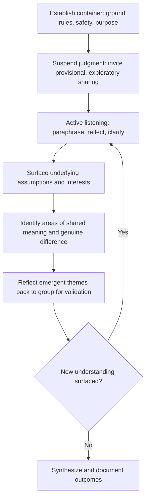

## Active Listening and Dialogic Facilitation

### Definition and Conceptual Foundation

Active listening is a structured communication practice in which a listener fully concentrates on, accurately interprets, and demonstrably responds to a speaker's verbal and non-verbal message before formulating a reply. Dialogic facilitation extends this individual skill into a group-level process orientation — one that treats dialogue as a mutual, exploratory exchange aimed at surfacing shared understanding and divergent perspectives, in contrast to debate or advocacy-oriented discourse aimed at winning an argument or persuading toward a predetermined outcome.

In SIA practice, these are foundational micro-skills underlying nearly all higher-level engagement methods (interviews, focus groups, public meetings, negotiation): the quality of an SIA's qualitative findings is directly bounded by the quality of listening and dialogic practice used to elicit them.

### Theoretical Foundations

**Active listening** draws primarily from Carl Rogers' person-centered communication theory (1950s–60s), which identified empathic understanding, unconditional positive regard, and genuineness as core conditions for productive human communication, later operationalized into specific listening behaviors (paraphrasing, reflecting feeling, summarizing) widely adopted in counseling, mediation, and facilitation training.

**Dialogic facilitation** draws on dialogue theory associated with physicist-philosopher David Bohm and organizational theorists such as William Isaacs, which distinguishes *dialogue* (collective inquiry into shared meaning, suspending fixed positions) from *discussion* (literally, from the same root as "percussion" — a batting-back-and-forth of fixed positions aimed at a winner). Also draws on Track II diplomacy and deliberative democracy theory (e.g., Habermas' communicative action), which emphasize structured conditions for genuine mutual understanding across power differentials.

### Relevance to SIA

- Directly determines the validity of qualitative data captured in interviews, focus groups, and consultation meetings — poor listening produces distorted or superficial findings.
- Builds the trust foundation necessary for communities to disclose sensitive information (land disputes, intra-community tension, distrust of the proponent) that would not surface under transactional or extractive questioning styles.
- Reduces the risk of confirmation bias, where practitioners unconsciously seek and record information that confirms pre-existing assumptions about community impacts.
- Supports de-escalation in high-tension consultation contexts, reducing grievance escalation risk.
- Underpins effective grievance handling, negotiation, and conflict resolution processes throughout the project lifecycle.

### Core Active Listening Techniques

**Attending behavior**

Non-verbal and postural signals of engagement — eye contact appropriate to cultural context, open body posture, minimal distraction (phones away), and appropriate proximity — which communicate attentiveness before any verbal exchange occurs.

**Paraphrasing**

Restating the speaker's content in the listener's own words to confirm understanding ("So what I'm hearing is that the main concern is about dust affecting your crops during the dry season — is that right?"), which both verifies accuracy and demonstrates genuine attention.

**Reflecting feeling**

Naming the emotional content underlying a statement, distinct from its factual content ("It sounds like this has been really frustrating for your family"), which validates the speaker's experience and often opens deeper disclosure than factual questioning alone.

**Summarizing**

Periodically consolidating multiple points into a coherent overview, particularly useful at transition points in longer conversations or meetings to confirm shared understanding before moving to a new topic.

**Clarifying questions**

Open-ended, non-leading follow-up questions that invite elaboration rather than closed yes/no responses ("Can you say more about how that affects your daily routine?" rather than "Does that bother you?").

**Minimal encouragers**

Brief verbal and non-verbal cues ("mm-hmm," nodding, brief eye contact) that signal continued attention without interrupting the speaker's flow.

**Strategic silence**

Deliberately withholding immediate response after a speaker finishes, allowing space for further elaboration — many practitioners under-use this technique, filling silence prematurely with their own commentary or the next question.

### Distinguishing Dialogue from Discussion/Debate

| Dimension | Dialogue | Discussion/Debate |
| --- | --- | --- |
| Goal | Shared understanding, collective inquiry | Persuasion, decision, or determining a winner |
| Stance toward own position | Held provisionally, open to revision | Defended and advocated |
| Listening orientation | Listening to understand | Listening to rebut |
| Pace | Reflective, tolerates silence | Often rapid, competitive turn-taking |
| Outcome orientation | Emergent, not predetermined | Convergent toward a specific conclusion |

SIA consultation processes benefit from deliberately signaling and structuring for dialogue in early-stage, exploratory engagement (baseline understanding, concern identification) while reserving more debate/decision-oriented formats for later-stage, decision-focused processes (e.g., final mitigation option selection) once shared understanding has been established.

### Dialogic Facilitation Process Model

### Step-by-Step Facilitation Protocol

**1. Establishing the container**

Sets explicit ground rules for the dialogic space (confidentiality, no interruption, suspending judgment of others' views) and clarifies that the purpose is mutual understanding rather than debate or immediate decision-making, which resets participant expectations away from advocacy-mode default behavior.

**2. Suspending judgment**

Facilitators model and invite participants to hold their own views provisionally — offering perspectives as "one way I see it" rather than assertions of fact — which reduces defensive entrenchment and increases willingness to genuinely consider other viewpoints.

**3. Deploying active listening in real time**

The facilitator (and, ideally, participants themselves, once coached) continuously applies paraphrasing, reflecting, and clarifying techniques throughout the exchange rather than only at designated Q&A points.

**4. Surfacing underlying interests and assumptions**

Moves beyond stated positions ("we oppose the pipeline route") to underlying interests ("we depend on that land for grazing during the dry season and have no alternative currently identified") — a technique drawn from interest-based negotiation theory that often reveals that apparently opposed positions share compatible underlying interests.

**5. Identifying shared meaning and genuine difference**

Explicitly distinguishes points of emerging consensus from points of persistent, legitimate disagreement, avoiding both false-consensus framing (glossing over real disagreement to produce an artificially tidy summary) and adversarial framing (treating all difference as conflict requiring resolution).

**6. Reflecting back for validation**

Periodically offers the group a synthesized reflection of what has been heard and invites correction, ensuring the facilitator's interpretation does not silently substitute for the community's actual meaning.

**7. Documenting outcomes**

Records both convergent themes and documented areas of unresolved difference, resisting pressure (often from project timelines) to report false consensus where genuine disagreement persists.

### Common Barriers to Active Listening

- **Premature problem-solving** — jumping to solutions or reassurance before fully understanding the concern, which can feel dismissive and shuts down further disclosure.
- **Autobiographical listening** — filtering the speaker's experience through the listener's own experience ("I understand, something similar happened to me...") rather than staying focused on the speaker's specific meaning.
- **Selective/confirmatory listening** — unconsciously attending more closely to information that confirms existing assumptions or project narratives, and underweighting disconfirming input.
- **Cross-cultural and linguistic barriers** — non-verbal cues (eye contact norms, silence tolerance, directness of speech) vary significantly across cultures; a listening style calibrated to one cultural context may be misread as disengagement or disrespect in another.
- **Power-distance suppression** — in high power-distance contexts, participants may give socially desirable rather than candid responses regardless of listening quality, requiring complementary techniques (anonymous input, third-party facilitation, single-identity breakout groups) rather than listening skill alone.
- **Facilitator fatigue** — active listening is cognitively demanding; quality degrades over long sessions without deliberate pacing and breaks.

### Skill Development and Training Approaches

- **Triad practice exercises** — rotating speaker/listener/observer roles in small groups, with the observer providing structured feedback on paraphrasing accuracy and non-verbal attending behavior.
- **Recorded session review** — reviewing audio/video of practice or real (consented) sessions against a listening-behavior checklist to identify habitual gaps (e.g., consistently interrupting, under-using silence).
- **Perspective-taking exercises** — structured role-reversal exercises where facilitators practice articulating a stakeholder position they personally disagree with, building the suspension-of-judgment capacity central to dialogic facilitation.
- **Supervision and peer debrief** — regular structured debrief among facilitation teams after consultation sessions to surface listening blind spots and cultural miscalibration before they compound across a multi-session engagement program.

### Illustrative Example

During a baseline SIA interview, a household head initially states flatly, "We don't have any problems with the project." A facilitator trained only in transactional questioning might record this as a neutral finding and move to the next question. A facilitator applying active listening notices a shift in posture and a pause before the statement, and responds with reflective, non-leading follow-up: "It sounds like that's something you've thought about — can you tell me more about how things have been since the survey teams first came through?" This opens a longer disclosure about anxiety regarding undisclosed resettlement timelines that the household had been reluctant to raise directly with an unfamiliar interviewer, materially changing the SIA's documented risk profile for that community segment. [Inference] The specific disclosure dynamics in this type of example are illustrative rather than a guaranteed outcome; the likelihood and content of such disclosures vary substantially by individual, relationship of trust, and cultural context.

### Related Topics

- Meeting design and agenda facilitation
- Key informant and semi-structured interview techniques
- Cross-cultural communication and translation protocols
- Conflict resolution and interest-based negotiation
- Grievance redress mechanism (GRM) design
- Focus group discussion methodology
- Trauma-informed engagement practices
- Facilitator training and supervision frameworks