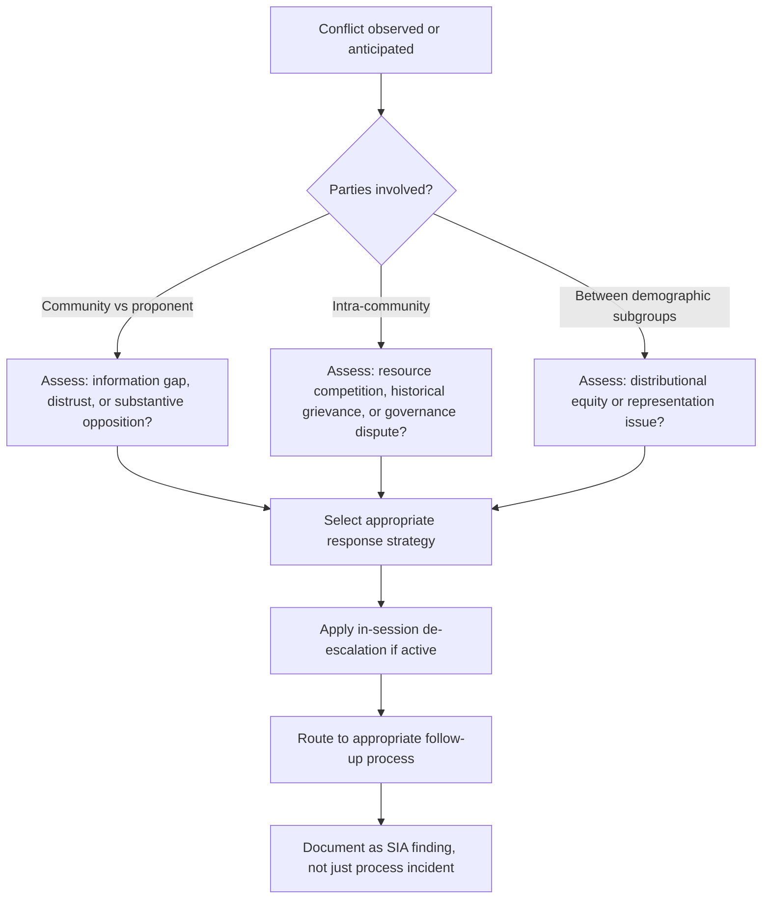
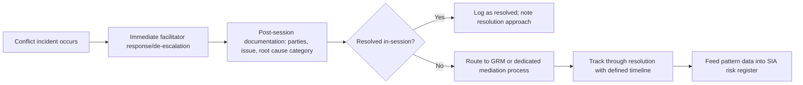

## Managing Conflict and Disagreement in Engagement

### Definition and Conceptual Foundation

Managing conflict and disagreement in engagement refers to the set of facilitation skills, structural processes, and diagnostic frameworks used to anticipate, contain, and constructively work through interpersonal or intergroup conflict that arises during community engagement activities. This spans a spectrum from low-intensity disagreement (differing opinions expressed respectfully) through heated dispute (emotionally charged exchanges) to entrenched conflict (structural, often historical, opposition between stakeholder groups or between a community and a project proponent).

Within SIA, conflict management is not merely a defensive facilitation skill but a diagnostic one: the pattern, intensity, and parties involved in conflict that surfaces during engagement are themselves significant social impact data, often revealing pre-existing social tensions, resource competition, or distributional inequities that a project may exacerbate.

### Theoretical Foundations

Draws primarily from **conflict resolution theory** and **interest-based (principled) negotiation**, notably the Harvard Negotiation Project's distinction between stated *positions* and underlying *interests* (Fisher and Ury), and from the **Thomas-Kilmann Conflict Mode Instrument**, which characterizes conflict-handling styles along two axes — assertiveness and cooperativeness — yielding five modes: competing, collaborating, compromising, avoiding, and accommodating. Also draws on **Track I/Track II diplomacy** concepts of multi-track engagement and on **social conflict theory** (e.g., Galtung's conflict triangle of attitudes, behavior, and contradiction) for diagnosing root causes rather than only managing surface symptoms.

### Relevance to SIA

- Conflict avoidance during consultation can produce SIA findings that understate genuine community opposition or intra-community division, creating downstream project risk when suppressed conflict resurfaces during implementation.
- Conflict that emerges during engagement often reveals distributional and equity issues (who benefits, who bears costs) central to SIA's core analytic purpose.
- Unmanaged conflict during public meetings can derail data collection entirely and, in severe cases, create safety risks for participants and facilitation staff.
- Effective conflict management directly supports social license to operate by demonstrating the proponent's capacity to engage seriously with opposition rather than suppress or ignore it.
- Intra-community conflict (e.g., between customary and formal authorities, or between demographic subgroups) requires different handling than community-proponent conflict, and conflating the two risks mismanaging both.

### Conflict Diagnostic Framework

### Conflict-Handling Modes (Thomas-Kilmann Framework)

| Mode | Assertiveness | Cooperativeness | Appropriate Use in SIA Context |
| --- | --- | --- | --- |
| Competing | High | Low | Rarely appropriate for facilitators; occasionally necessary to enforce safety ground rules |
| Collaborating | High | High | Preferred mode for substantive disputes with time and trust available |
| Compromising | Moderate | Moderate | Useful for time-constrained, moderate-stakes disagreements |
| Avoiding | Low | Low | Appropriate short-term tactic to de-escalate in-session; not a resolution strategy |
| Accommodating | Low | High | Appropriate when the issue matters more to the other party and the relationship is a priority |

Facilitators should recognize their own default conflict-handling style and deliberately select the mode appropriate to the situation rather than defaulting reflexively, since [Inference] facilitators under stress often revert to avoiding or accommodating modes regardless of situational appropriateness, based on general conflict-management training literature.

### In-Session De-escalation Techniques

**Acknowledge before responding**

Explicitly naming and validating the emotion or concern before addressing content ("I can see this is something you feel strongly about") reduces the felt need to escalate further to be heard, and should precede any substantive response.

**Separate person from position**

Redirecting personal attacks or accusations toward the underlying substantive issue ("Let's focus on the specific concern about water access rather than assigning blame") maintains focus on resolvable content rather than interpersonal conflict.

**Reframe from positions to interests**

Restating opposed positions in terms of underlying interests can reveal compatibility not visible at the position level ("It sounds like both concerns are really about ensuring reliable water access during construction — let's explore that together").

**Time and space management**

Scheduled breaks, moving a specific heated exchange to a smaller side conversation, or explicitly time-boxing a contentious agenda item prevents a single dispute from consuming or derailing an entire session.

**Procedural transparency**

Clearly explaining the process being used and why (e.g., "we're going to hear from each side for two minutes uninterrupted, then open discussion") reduces perceived unfairness that can itself fuel escalation.

**Co-facilitation and role division**

Splitting facilitator roles (one focused on process/timekeeping, another on content capture, another available to step out with an escalated individual) allows conflict to be managed without stopping the overall session.

**Physical and psychological safety protocols**

Pre-established exit routes, support persons for vulnerable participants, and a clear protocol for suspending or ending a session if safety is threatened should be established before any session with anticipated high conflict potential.

### Structural/Process-Level Conflict Management

Beyond in-session facilitation technique, structural design choices reduce conflict likelihood and severity:

**Segmented engagement**

Conducting separate sessions for groups in acute conflict (e.g., customary versus formal land claimants) before attempting joint dialogue, allowing each party's concerns to be heard and partially processed before direct confrontation.

**Shuttle facilitation**

Facilitators or mediators move between parties who are unwilling or unable to meet directly, relaying positions and interests and gradually building conditions for eventual direct dialogue — standard practice in high-tension land or resettlement disputes.

**Neutral third-party facilitation**

Engaging facilitators without a stake in the outcome (independent of the proponent) increases perceived legitimacy, particularly where community distrust of the proponent itself is a source of conflict.

**Formal grievance redress mechanisms (GRM)**

Provides a structured, documented, predictable channel for conflict that cannot be resolved in real time during an engagement session, preventing accumulation of unaddressed grievances that surface disruptively in later sessions.

**Joint fact-finding**

Where conflict stems from disputed factual claims (e.g., differing accounts of baseline water quality), a jointly designed and monitored data-collection process involving representatives from disputing parties can resolve factual disagreement before it hardens into positional conflict.

### Root Cause Diagnostic Categories

Drawing on conflict theory, disagreement in engagement settings commonly traces to one or more of the following root causes, each requiring different response strategies:

- **Information/data gaps** — parties operate from differing factual understanding; addressed through joint fact-finding or transparent information-sharing.
- **Distributional/equity concerns** — disagreement over who bears costs or receives benefits; addressed through negotiation, benefit-sharing mechanism design, or equity-focused mitigation adjustment.
- **Historical/relational grievance** — conflict rooted in prior unresolved harms (broken promises from earlier projects, historical land dispossession); requires acknowledgment and, often, longer trust-rebuilding timelines than a single engagement cycle allows.
- **Values/identity conflict** — disagreement rooted in differing values (e.g., conservation versus livelihood priorities) rather than resolvable factual or distributional issues; often better managed through structured dialogue aimed at mutual understanding than through negotiation toward a single resolution.
- **Procedural/representation disputes** — conflict over who has legitimate standing to speak for a community or group; requires governance and representation clarification, often via stakeholder mapping revision, rather than substantive-issue mediation.

### Documentation and Escalation Protocol

Conflict incidents should be logged not merely as facilitation notes but integrated into the SIA's risk register and grievance tracking system, since recurring conflict patterns across multiple sessions constitute a significant social risk indicator independent of any single incident's resolution.

### Facilitator Competencies and Training

- **Self-awareness of default conflict style** — facilitators should understand their own habitual response pattern (via instruments such as the Thomas-Kilmann Conflict Mode Instrument) to counteract situationally inappropriate defaults.
- **Emotional regulation under pressure** — the capacity to remain composed and non-defensive when personally targeted by hostility, distinct from suppressing genuine empathic response.
- **Cultural competence in conflict expression norms** — recognition that acceptable expression of disagreement (directness, volume, use of silence) varies substantially across cultural contexts, and that behavior appropriate in one setting may be misread as unusually hostile or unusually passive in another.
- **Co-facilitation protocols** — clear pre-agreed role division and non-verbal signaling systems between co-facilitators for managing escalation without visible disagreement between facilitators themselves.
- **Debrief and self-care practice** — structured post-session debrief for facilitation teams, both to extract SIA-relevant findings from the conflict pattern and to support facilitator wellbeing after high-tension sessions.

### Illustrative Example

During a resettlement compensation consultation, a dispute erupts between two family groups claiming customary rights to the same parcel of land slated for compensation. Raised voices and personal accusations begin to dominate the session and other agenda items are at risk of being lost. The lead facilitator applies acknowledge-before-respond ("This is clearly a serious and painful issue for both families"), then uses procedural transparency to propose a structural fix: the immediate session will move to its next planned agenda item, while a separate shuttle facilitation process — using a neutral local elder acceptable to both families plus the SIA land-tenure specialist — will be scheduled within the week specifically to work through the land claim dispute using joint fact-finding on customary boundary evidence. This prevents the dispute from derailing the full session's remaining agenda while ensuring the underlying conflict is routed into an appropriately resourced process rather than either being suppressed or allowed to consume disproportionate engagement time. The incident is logged in the SIA risk register as evidence of an unresolved customary land tenure ambiguity requiring resolution before resettlement can proceed.

### Related Topics

- Grievance redress mechanism (GRM) design
- Interest-based negotiation techniques
- Active listening and dialogic facilitation
- Meeting design and agenda facilitation
- Resettlement Action Plan (RAP) development
- Stakeholder mapping and analysis
- Trauma-informed engagement practices
- Land tenure and customary rights assessment