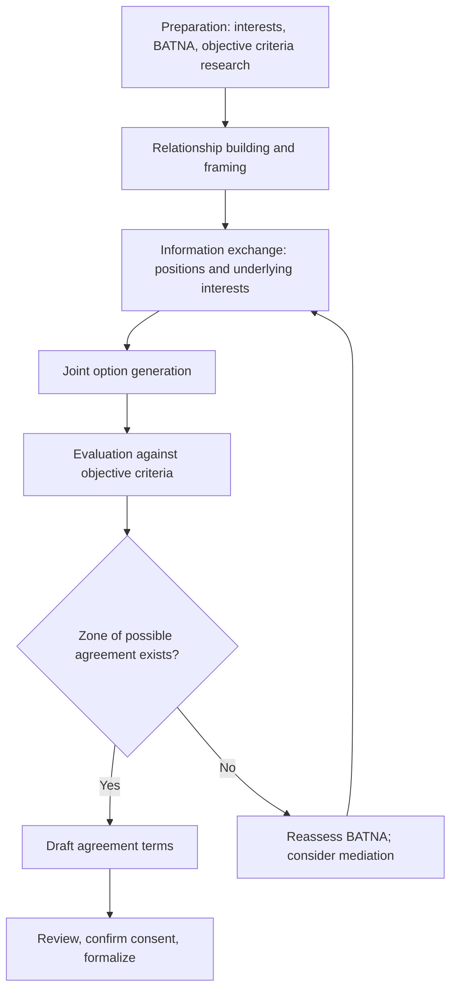
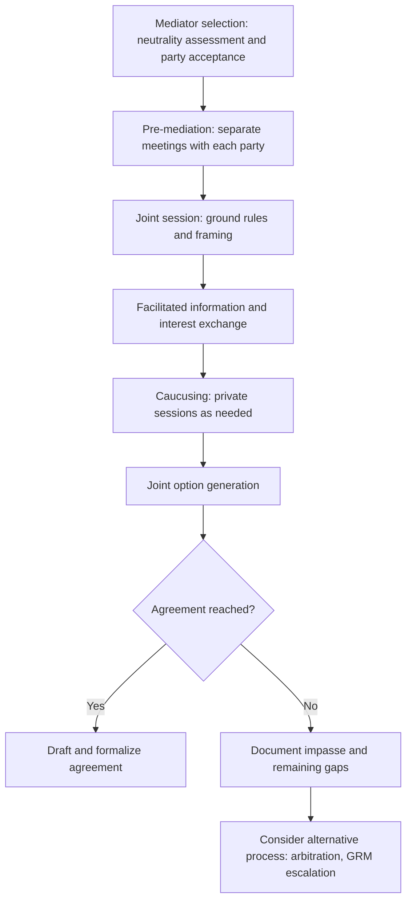
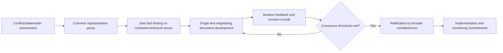

## Negotiation and Mediation for Consensus Building

### Definition and Conceptual Foundation

Negotiation is a structured process in which two or more parties with partially divergent interests communicate directly to reach a mutually acceptable agreement. Mediation extends this process by introducing a neutral third party who facilitates communication and problem-solving between disputing parties without imposing a binding decision. Consensus building refers to a broader family of collaborative processes designed to help multiple stakeholders — often more than two, with heterogeneous and sometimes fragmented interests — reach a decision that all parties can accept, even where full agreement on underlying preferences is not achieved.

In SIA practice, these three processes form an escalating toolkit: negotiation is used for bilateral or small-group agreement-seeking (e.g., compensation terms), mediation is invoked when direct negotiation has stalled or trust has broken down, and consensus building is applied to multi-stakeholder decisions (e.g., benefit-sharing frameworks, mitigation hierarchy prioritization) involving numerous parties with cross-cutting interests.

### Theoretical Foundations

**Interest-based (principled) negotiation** — developed by the Harvard Negotiation Project (Fisher, Ury, and Patton), distinguishes four core elements: separating people from the problem, focusing on interests rather than positions, generating options for mutual gain before deciding, and using objective criteria to evaluate outcomes. This framework underlies most contemporary professional negotiation training and is widely applied in land, compensation, and benefit-sharing negotiations.

**BATNA (Best Alternative to a Negotiated Agreement)** — a core Harvard-framework concept: a party's leverage in negotiation is determined not by their stated position but by the quality of their alternative if no agreement is reached; understanding both parties' BATNA is central to realistic negotiation strategy and to assessing whether a negotiated outcome is genuinely better than the alternative (e.g., expropriation, project cancellation, prolonged dispute).

**Consensus Building Institute / Susskind approach** — developed principally by Lawrence Susskind and colleagues, formalizes multi-party consensus processes (often termed "collaborative problem-solving" or "mutual gains approaches") commonly used in environmental and land-use disputes, emphasizing joint fact-finding, representative stakeholder convening, and single-text negotiating documents.

**Transformative and facilitative mediation models** — distinguish mediation styles by objective: facilitative mediation focuses on helping parties reach their own agreement through structured process; transformative mediation focuses on improving the relationship and communication capacity between parties, with agreement as a secondary outcome; evaluative mediation (less commonly appropriate in SIA contexts) involves the mediator offering assessments of likely outcomes.

### Relevance to SIA

- Compensation and resettlement negotiations directly determine livelihood restoration outcomes and are frequently the highest-stakes engagement activity in a project's social risk profile.
- Poorly conducted negotiations (asymmetric information, absent BATNA disclosure, coercive time pressure) can produce nominally "agreed" outcomes that later generate grievances, legal challenge, or reputational damage when parties conclude they were disadvantaged.
- Mediation capacity is essential wherever community-proponent trust has deteriorated to the point that direct engagement is unproductive or unsafe.
- Multi-stakeholder consensus processes are increasingly required for benefit-sharing agreement design, mitigation hierarchy prioritization, and resettlement action plan (RAP) negotiation involving multiple community subgroups with differentiated interests.
- Lender and standard-setter requirements (e.g., IFC Performance Standard 5 on land acquisition) increasingly specify negotiation process standards (good-faith negotiation, independent valuation access, grievance mechanism availability) as compliance conditions.

### Negotiation Process Model

### Step-by-Step Negotiation Protocol

**1. Preparation**

Each party (or the facilitation team supporting a community negotiating position) should identify their own underlying interests (not just stated positions), estimate their BATNA, research objective criteria for evaluating fairness (e.g., independent land valuation standards, comparable compensation precedents), and anticipate the other party's likely interests and BATNA — preparation quality is consistently identified in negotiation literature as the single strongest predictor of negotiation outcome quality.

**2. Relationship building and framing**

Establishes working trust and a shared framing of the negotiation as a joint problem-solving exercise rather than an adversarial contest, particularly important where a history of prior broken commitments has damaged baseline trust.

**3. Information exchange**

Parties articulate not only their positions but the underlying interests driving them; skilled negotiators probe beyond an opening position ("we want $X per hectare") to understand its interest basis (e.g., need to replace lost income, cultural attachment to specific land, risk aversion about resettlement site quality).

**4. Joint option generation**

Before evaluating or committing to any specific proposal, parties brainstorm multiple possible packages that could satisfy interests on both sides — separating the generative (option creation) phase from the evaluative (option selection) phase prevents premature anchoring on a single, often suboptimal, proposal.

**5. Evaluation against objective criteria**

Options are assessed against externally referenced standards (market valuation, replacement cost methodology, comparable agreements) rather than purely relative bargaining power, which both improves outcome fairness and increases the durability/legitimacy of the eventual agreement.

**6. Agreement drafting and consent confirmation**

Terms are documented in accessible language, reviewed with adequate time for the community party to consult independent advice (legal, valuation) where warranted, and formal consent is confirmed through a process appropriate to the community's decision-making structures — critical for FPIC compliance in Indigenous Peoples contexts.

**7. Formalization and implementation linkage**

Agreements are linked to monitorable implementation commitments and, ideally, to the project's grievance mechanism for any disputes arising during execution of agreed terms.

### Mediation Process Model

**Mediator selection**

The mediator's perceived neutrality and acceptability to *all* parties is the foundational requirement for legitimate mediation; a mediator selected or paid solely by the project proponent, even if behaviorally neutral, often lacks sufficient perceived legitimacy for community parties, making independent or jointly-selected mediators preferable in higher-conflict contexts.

**Pre-mediation (intake)**

Separate initial meetings with each party allow the mediator to understand each side's interests, concerns, and readiness for joint dialogue, and to assess whether joint session is appropriate yet or whether shuttle diplomacy should precede it.

**Caucusing**

Private, confidential sessions with each party during the mediation allow candid exploration of flexibility, concerns, or emotional content that a party may be unwilling to voice in joint session; mediators must maintain clear, consistently applied confidentiality rules about what is and is not carried between caucuses.

**Impasse management**

Not all mediations reach agreement; a competent mediation process still produces value by clarifying the actual points of disagreement, documenting each party's position with mutual acknowledgment (even absent agreement), and identifying whether an alternative process (formal grievance mechanism, third-party arbitration, or continued unmediated negotiation later) is appropriate next.

### Multi-Party Consensus Building Process

For decisions involving numerous stakeholders with heterogeneous interests (e.g., community development fund allocation criteria, mitigation hierarchy prioritization across affected villages):

**Conflict/stakeholder assessment**

A neutral assessment (often via confidential interviews with prospective participants) determines whether conditions exist for a productive consensus process — sufficient parties willing to participate in good faith, no party with unilateral power to simply impose an outcome, and a genuine zone of possible agreement.

**Representative convening**

Selecting participants who genuinely represent the range of affected interests (not merely the most vocal or powerful) is critical; poor representation undermines both the process's legitimacy and the durability of its outcome. This connects directly to prior stakeholder mapping and analysis work.

**Joint fact-finding**

Where factual disputes underlie disagreement (e.g., differing estimates of livelihood impact), a jointly designed technical study — with methodology and often technical experts agreed upon by all parties — can narrow disagreement to genuinely value-based or distributional issues rather than leaving unresolved factual disputes to fuel ongoing conflict.

**Single-text negotiating document**

A commonly used technique where a facilitator (rather than any single party) drafts and iteratively revises a single proposed agreement text based on all parties' feedback, avoiding the dynamic where multiple competing draft texts harden into opposing positions.

**Ratification**

Because consensus-building participants are representatives, final agreements typically require a ratification step where represented constituencies confirm their delegate's agreement reflects their actual interests — skipping this step risks agreements that collapse upon return to the broader community.

### Interest-Based vs. Positional Bargaining Comparison

| Dimension | Positional Bargaining | Interest-Based Negotiation |
| --- | --- | --- |
| Focus | Stated demands | Underlying needs and motivations |
| Typical dynamic | Sequential concessions from fixed anchors | Joint exploration of mutual-gain options |
| Outcome type | Often a single-issue compromise (splitting the difference) | Often multi-issue packages creating value for both sides |
| Relationship impact | Can be adversarial, damaging future relationship | Tends to preserve or build working relationship |
| Best suited to | One-off, low-relationship-value transactions | Ongoing relationships (typical of project-affected community contexts) |

Given that SIA-related negotiations (compensation, resettlement, benefit-sharing) typically occur within a long-term, ongoing relationship between a project and an affected community, interest-based approaches are generally more appropriate than purely positional bargaining, though [Inference] some degree of positional bargaining dynamic is common in practice even within nominally interest-based processes, particularly regarding compensation quantum, based on general negotiation practice literature rather than a universal rule.

### Power Asymmetry Considerations

Community-proponent negotiations characteristically involve significant power and information asymmetry (technical/legal expertise, financial resources, time pressure exposure). Mitigations include:

- **Independent technical and legal advice** — ensuring the community party has access to independent valuation, legal, or technical expertise rather than relying solely on proponent-provided information.
- **Adequate time provision** — resisting project-timeline pressure to rush agreement, since compressed timelines systematically disadvantage the less-resourced party.
- **Capacity building** — training community representatives in negotiation concepts (interests, BATNA, objective criteria) prior to substantive negotiation, leveling procedural if not resource-based asymmetry.
- **Transparent disclosure standards** — providing full information relevant to the community's decision (e.g., complete valuation methodology, not just final figures) supports genuinely informed rather than merely nominal consent.
- **FPIC-aligned consent verification** — for Indigenous Peoples and in contexts requiring Free, Prior and Informed Consent, verifying that agreement reflects the community's own governance and decision-making processes rather than negotiation with unrepresentative individuals.

### Illustrative Example

A road-widening project requires land acquisition from forty households along a rural corridor. Initial engagement reveals sharply divergent positions: the proponent's opening compensation offer, based on official land registry rates, is rejected by most households, who state the offer is "too low" without further elaboration — a classic positional standoff. A negotiation specialist is brought in to work with a representative household committee. Through structured interest-based dialogue, it emerges that the core underlying interest for most households is not solely the per-hectare price but the absence of any provision for temporary income loss during the transition period, since many rely on roadside commerce disrupted by construction timing. The negotiating team develops a joint fact-finding exercise (an independent livelihood-transition assessment) and generates a multi-element package — combining an adjusted per-hectare rate benchmarked to comparable regional transactions with a time-limited transition income support component — that resolves the underlying interest without requiring the proponent to simply increase the land-price figure repeatedly in a zero-sum bargaining dynamic. The agreement is ratified through village assembly confirmation before formalization.

### Related Topics

- Managing conflict and disagreement in engagement
- Resettlement Action Plan (RAP) development
- Free, Prior and Informed Consent (FPIC) processes
- Grievance redress mechanism (GRM) design
- Land tenure and customary rights assessment
- Participatory budgeting and benefit-sharing frameworks
- Stakeholder mapping and analysis
- Livelihood restoration planning