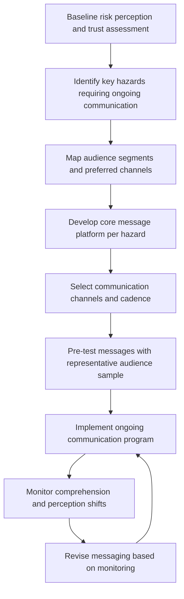
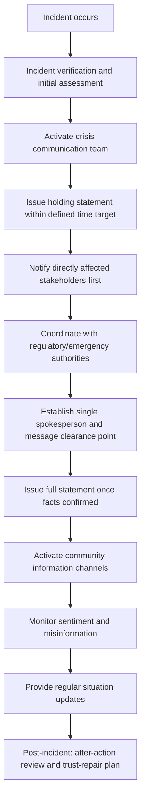

## Risk and Crisis Communication Planning

### Definition and Conceptual Foundation

Risk communication is the ongoing, planned exchange of information between a project proponent and stakeholders about the nature, likelihood, and management of potential hazards or impacts, aimed at supporting informed understanding and appropriate protective behavior. Crisis communication is a distinct but related discipline concerned with the rapid, structured communication response during or immediately after an acute incident (accident, spill, protest escalation, fatality, security incident) where reputational, safety, and trust stakes are acute and time-compressed.

In SIA practice, the two are planned together because they share infrastructure (spokesperson protocols, stakeholder contact databases, message-clearance workflows) but differ fundamentally in tempo and objective: risk communication is proactive and educational, aimed at building accurate risk perception over time; crisis communication is reactive and stabilizing, aimed at maintaining trust and providing actionable information under acute time pressure.

### Theoretical Foundations

**Risk perception theory** (notably Paul Slovic's psychometric paradigm) establishes that lay risk perception is shaped by qualitative factors beyond statistical probability — dread, controllability, familiarity, voluntariness of exposure, and catastrophic potential — meaning a statistically small risk can generate high public concern if it scores high on these qualitative dimensions (e.g., involuntary exposure to an unfamiliar industrial hazard), a critical consideration for SIA teams tempted to rely solely on technical risk figures in communication.

**Mental Noise Model and Crisis and Emergency Risk Communication (CERC)** — developed substantially through U.S. CDC crisis communication research, identifies that under high stress, audiences process information less rationally: message retention drops sharply, negative information is disproportionately retained over positive, and audiences seek the simplest available explanation. CERC principles (be first, be right, be credible, express empathy, promote action, show respect) are widely adopted across crisis communication practice, including in SIA and project-affected-community contexts.

**Trust determination theory** — holds that in high-concern, low-trust situations, perceived caring and empathy influence audience trust more heavily than perceived competence (in contrast to low-concern situations, where competence dominates), which has direct implications for crisis-response messaging sequencing (lead with empathy, not technical justification).

### Relevance to SIA

- Baseline SIA work should identify community risk perception patterns and pre-existing trust levels toward the proponent, informing both routine risk communication design and crisis-response planning assumptions.
- Poorly managed crisis communication following an incident can convert a contained technical event into a major social/reputational crisis, elevating grievance volume, eroding social license, and undermining the credibility of the entire engagement program.
- Lender and standard frameworks (IFC Performance Standards, Equator Principles) generally expect documented emergency preparedness and community notification procedures as part of the overall stakeholder engagement plan.
- Risk communication quality directly affects whether communities adopt recommended protective behaviors (e.g., evacuation, avoidance zones) during actual emergencies — a life-safety, not merely reputational, consideration.

### Risk Communication Planning Process

### Step-by-Step Risk Communication Protocol

**1. Baseline risk perception assessment**

Uses SIA baseline data collection (surveys, interviews) to understand existing community risk perceptions, trust levels toward the proponent and toward government/regulatory bodies, and prior experience with similar hazards — critical because objectively identical risk information can be received very differently depending on this baseline.

**2. Hazard identification and prioritization**

Draws on the project's environmental and technical risk assessments to identify which hazards require sustained public risk communication (e.g., construction traffic, blasting, water quality changes, health and safety zones) versus which are primarily occupational/internal concerns.

**3. Audience segmentation**

Differentiates communication approach by proximity to hazard, vulnerability (children, elderly, disabled, chronic illness), language, literacy, and channel access, since a single generic risk message rarely serves all segments effectively.

**4. Message platform development**

Develops core, pre-cleared messaging for each identified hazard covering: what the hazard is in plain language, who is at risk and under what conditions, what the project is doing to manage it, and what protective actions (if any) community members should take — avoiding both alarmist and falsely reassuring framing.

**5. Channel and cadence selection**

Matches channel mix (community meetings, SMS alerts, radio, printed notices, signage) to audience access patterns identified in stakeholder mapping, with cadence appropriate to hazard dynamism (static informational signage for stable risks; real-time SMS alert systems for dynamic risks like blasting schedules).

**6. Message pre-testing**

Tests draft messages with a representative sample of the target audience before full deployment to identify comprehension gaps, unintended alarm, or cultural miscalibration — a step frequently skipped under time pressure but disproportionately valuable for reducing downstream miscommunication risk.

**7. Ongoing monitoring and revision**

Tracks comprehension, perception shifts, and emergent concerns (via social media monitoring, GRM data, or periodic pulse surveys) and iteratively revises messaging, since risk perception is not static and can shift sharply following unrelated regional incidents (e.g., a similar-industry accident elsewhere).

### Crisis Communication Response Protocol

### Crisis Communication Core Principles (CERC-Derived)

**Be first**

Issuing an initial holding statement rapidly (even before all facts are confirmed) establishes the proponent as the authoritative information source before rumor or misinformation fills the vacuum; a holding statement acknowledges the incident and commits to follow-up without speculating on unconfirmed details.

**Be right**

Accuracy takes priority over speed once the holding statement is issued; retracting or correcting early misstatements carries a significant trust cost, so subsequent statements should only include confirmed information, explicitly flagging what remains unknown.

**Be credible**

Honesty about uncertainty and limitations, consistent messaging across spokespeople and channels, and avoiding overpromising all sustain credibility; a single detected inconsistency or exaggeration can disproportionately damage trust in all subsequent communication.

**Express empathy**

Leading with genuine acknowledgment of harm, concern, or disruption before technical explanation addresses the audience's emotional state first, consistent with trust determination theory's finding that perceived caring dominates trust formation in high-concern situations.

**Promote action**

Providing clear, specific, actionable guidance (what to do, who to contact, where to go) gives affected stakeholders a sense of agency and reduces anxiety-driven information-seeking from uncontrolled channels.

**Show respect**

Treating affected communities as capable partners deserving full, honest information — rather than audiences to be managed or placated — both reflects sound ethical practice and, empirically, supports better crisis outcomes.

### Crisis Communication Team Structure and Roles

| Role | Responsibility |
| --- | --- |
| Crisis communication lead | Overall coordination, final message approval authority |
| Single spokesperson | Sole public-facing voice to ensure message consistency |
| Community liaison(s) | Direct communication with affected community representatives, often pre-existing engagement staff with established trust |
| Technical/subject matter expert | Provides accurate technical input for message content, does not typically serve as public spokesperson |
| Legal/compliance reviewer | Reviews statements for regulatory and liability considerations without unduly delaying communication timelines |
| Monitoring analyst | Tracks social media, GRM inflow, and media coverage for emerging misinformation or sentiment shifts |

Pre-identifying and training this team before any incident occurs — rather than assembling it reactively — is a standard crisis-preparedness requirement, since role ambiguity during an actual incident measurably delays response time.

### Message Clearance and Speed Trade-off

A persistent operational tension exists between message accuracy/legal caution and response speed. Standard practice addresses this through:

- **Pre-approved holding statement templates** — generic, legally pre-cleared statements that can be rapidly customized and issued within a defined time target (commonly within one to two hours of incident confirmation in mature crisis-communication programs), avoiding the delay of drafting from scratch under pressure.
- **Delegated approval authority** — a pre-agreed, limited approval chain (rather than requiring full executive sign-off) for initial statements, with fuller review applied to subsequent, more detailed communications.
- **Tiered information release** — releasing confirmed, safety-critical information immediately while flagging additional details as "under investigation," rather than delaying all communication until complete information is available.

### Direct Notification Priority Sequencing

Directly affected stakeholders (those in physical proximity to an incident, or whose safety may be at risk) should be notified before broader public or media communication, both as an ethical priority and to prevent the situation where affected community members learn of an incident affecting them through media or social media rather than directly from the project — a well-documented trust-damaging pattern in crisis communication case literature.

### Misinformation Management

- **Proactive monitoring** — systematic tracking of social media, WhatsApp groups, and community channels for emerging rumors or inaccurate claims during a crisis window.
- **Rapid, respectful correction** — addressing misinformation directly and specifically ("we've seen reports suggesting X; here is what we currently know") rather than either ignoring it or dismissively denying it without explanation.
- **Trusted messenger deployment** — engaging locally trusted figures (community leaders, respected local staff) to help correct misinformation, since message source credibility often matters as much as message content in crisis contexts.

### Post-Incident Trust Repair

Crisis communication does not conclude when the acute incident is resolved. Standard follow-up practice includes:

- **After-action review** — structured internal review of what communication worked, what failed, and why, feeding into both crisis plan revision and organizational learning.
- **Transparent incident reporting** — public disclosure of investigation findings and corrective actions taken, demonstrating accountability beyond the immediate crisis window.
- **Sustained relationship investment** — recognizing that trust damaged during a crisis typically requires sustained, consistent engagement over an extended period to rebuild, not a single follow-up communication. [Inference] Specific trust-recovery timelines are highly context-dependent and not reliably predictable from general crisis communication literature alone.

### Illustrative Example

During construction, a containment failure releases a limited quantity of drilling fluid near a river used by downstream communities for washing and fishing. Within ninety minutes of internal confirmation, the pre-trained crisis communication team issues a holding statement via SMS alert and community liaison visits to the two nearest villages, acknowledging the incident, confirming affected area boundaries, and advising against water contact pending testing — deliberately leading with the actionable safety guidance and an empathetic acknowledgment before any technical explanation of cause. Community liaisons, already known and trusted from routine engagement work, deliver the notification in person to households without SMS access, following the pre-agreed direct-notification-first protocol. A single spokesperson handles all subsequent media inquiries to maintain message consistency, while the technical team works separately on root-cause analysis. Water quality results are shared within the promised 48-hour window even though results show no contamination beyond the immediate spill zone, avoiding the trust cost of a missed commitment. A public after-action report is issued two weeks later summarizing the incident, root cause, and corrective containment measures implemented.

### Related Topics

- Grievance redress mechanism (GRM) design
- Meeting design and agenda facilitation
- Stakeholder mapping and analysis
- Emergency preparedness and response planning
- Social license to operate (SLO) measurement
- Digital and social media engagement platforms
- Trust-building and relationship management in engagement
- Health, safety, and security impact assessment