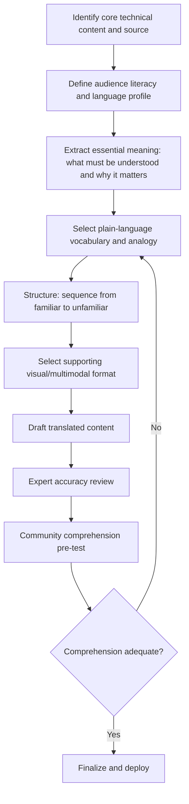

## Translating Technical Content for Lay Audiences

### Definition and Conceptual Foundation

Translating technical content for lay audiences is the deliberate practice of converting specialized, discipline-specific information — engineering specifications, environmental modeling results, legal/regulatory language, statistical findings, epidemiological risk data — into forms that non-specialist community members can accurately understand and act upon. This is distinct from linguistic translation (converting between languages), though the two frequently occur together in SIA contexts; the core challenge here is conceptual and register translation: converting expert mental models and specialized vocabulary into accessible mental models without introducing material inaccuracy or oversimplification that distorts meaning.

In SIA practice, this discipline sits at the intersection of science communication, health literacy, and plain-language writing traditions, and is foundational to nearly every other engagement activity — meaningful consultation, informed consent, and genuine community decision-making are all contingent on the audience actually understanding the technical content being presented to them.

### Theoretical Foundations

**Plain Language movement** — originating in U.S. and international consumer-protection and legal-reform contexts (e.g., the U.S. Plain Writing Act, plainlanguage.gov guidelines), establishes structural and stylistic principles (short sentences, active voice, common vocabulary, logical organization) for clear written communication, now widely adopted across government and international development communication standards.

**Health literacy research** — a substantial evidence base (notably from U.S. CDC and NIH-funded research) demonstrates that even well-educated audiences comprehend and retain technical health/risk information significantly better when presented in plain language with visual support, and that low health-literacy populations face measurably worse outcomes when information is presented in technical register — directly transferable to environmental and social risk communication in SIA contexts.

**Cognitive load theory** — from educational psychology, holds that working memory has limited capacity, meaning technical communication that overloads audiences with excessive simultaneous detail (dense text, unexplained jargon, multiple concepts introduced without sequencing) reduces comprehension regardless of the underlying content's accuracy, informing the sequencing and chunking principles used in effective lay translation.

**Multimodal learning theory** — supports combining verbal and visual/diagrammatic representation of the same content (rather than either alone), since complementary channels improve comprehension and retention across audiences with varying literacy and learning-preference profiles.

### Relevance to SIA

- Informed consent (including FPIC processes) is only meaningful if the underlying technical information (project scope, hazard profile, mitigation measures) has genuinely been understood, not merely disclosed.
- Miscommunication or perceived jargon-driven obfuscation is a well-documented driver of community distrust, sometimes interpreted as an attempt to conceal unfavorable information even where no such intent exists.
- SIA baseline and monitoring surveys require translating technical survey concepts (e.g., "cumulative impact," "ecosystem services") into locally meaningful terms without losing analytical precision, directly affecting data quality.
- Disclosure documents (EIA/SIA summaries, resettlement plans, compensation methodologies) are frequently legally or contractually required to be accessible to affected communities, not merely technically complete.
- Poor technical translation disproportionately disadvantages already-vulnerable groups (lower literacy, non-dominant language speakers, limited prior exposure to technical/bureaucratic communication), compounding existing engagement equity gaps.

### Technical Translation Process

### Step-by-Step Translation Protocol

**1. Content and source identification**

Clarifies exactly which technical finding, specification, or dataset needs translation and confirms its accuracy at the source before any simplification begins, since errors introduced upstream of translation propagate and are harder to detect once embedded in accessible language.

**2. Audience literacy and language profiling**

Draws on stakeholder mapping and baseline data to characterize the target audience's education level, primary language(s), prior exposure to relevant technical concepts, and preferred information formats (oral, visual, written) — a single translated document rarely serves a highly heterogeneous audience equally well.

**3. Essential meaning extraction**

Distills the technical content down to what the audience actually needs to understand and, critically, why it matters to their specific situation, resisting the instinct to include all technical detail out of an abundance of caution, since excessive completeness often reduces rather than improves comprehension.

**4. Vocabulary and analogy selection**

Replaces specialized terminology with common vocabulary or clearly explained terms on first use, and selects analogies grounded in the audience's own experience (e.g., explaining decibel scale using familiar local sound comparisons rather than abstract logarithmic explanation) — analogies must be checked for accuracy, since an imprecise analogy can mislead as much as jargon.

**5. Structural sequencing**

Organizes content from familiar to unfamiliar and from general to specific, using clear headings, short paragraphs, and logical progression rather than mirroring the structure of the original technical document (which is typically organized for expert reference, not lay comprehension).

**6. Multimodal format selection**

Determines the appropriate mix of plain text, diagrams, physical models, photographs, video, or interactive tools based on the content type and audience profile — spatial/technical concepts (pollution dispersion, resettlement site layout) generally benefit disproportionately from visual representation compared to purely verbal explanation.

**7. Expert accuracy review**

A subject-matter expert reviews the translated content specifically to confirm that simplification has not introduced material inaccuracy or lost decision-relevant nuance, since translation practitioners without deep technical expertise can inadvertently oversimplify in ways that change meaning.

**8. Community comprehension pre-testing**

Tests the translated content with a small representative sample of the target audience (e.g., via teach-back method — asking them to explain the content back in their own words) before full deployment, since practitioner assumptions about what counts as "plain language" frequently do not match actual audience comprehension.

### Core Plain-Language Writing Techniques

- **Active voice and short sentences** — "The project will monitor water quality monthly" rather than "Water quality monitoring will be conducted on a monthly basis by the project," reducing parsing difficulty.
- **Familiar vocabulary with defined technical terms** — using common words by default, and when a technical term is unavoidable (e.g., "resettlement," "biodiversity offset"), defining it clearly and consistently on first use.
- **Concrete rather than abstract framing** — "enough water to fill six swimming pools per day" rather than "150,000 liters per day," where the concrete comparison genuinely aids comprehension for the specific audience.
- **Chunking and headers** — breaking content into short, clearly labeled sections rather than dense continuous prose, supporting both initial comprehension and later reference use.
- **Avoiding double negatives and nominalizations** — "we will not build on this land" rather than "non-construction will be maintained," and "we decided" rather than "a decision was made," both of which reduce cognitive processing burden.
- **Consistent terminology** — using the same term for the same concept throughout (rather than varying vocabulary for stylistic reasons, as is common in expert writing), since terminology-switching creates ambiguity about whether a new concept is being introduced.

### Visual and Multimodal Translation Techniques

**Diagrams and infographics**

Process flows, before/after comparisons, and simple schematic diagrams translate procedural or spatial technical content more effectively than text alone for many audiences, particularly where literacy varies.

**Physical and scale models**

Three-dimensional physical models (e.g., of a proposed structure, pylon, or resettlement site layout) support spatial comprehension especially effectively for technical infrastructure content, and are literacy-independent.

**Photographs and comparison imagery**

Real photographs of comparable existing infrastructure or completed mitigation measures (e.g., a similar completed resettlement site from another project) ground abstract future descriptions in tangible reference points, though must be selected carefully to avoid implying guarantees the project cannot make.

**Video and animation**

Effective for explaining processes over time (construction sequencing, environmental mitigation processes) and can be produced in local languages with voiceover for varying literacy audiences, though production cost and time are higher than static formats.

**Data visualization simplification**

Technical charts (dose-response curves, statistical distributions, modeling outputs) generally require substantial simplification — using simple bar comparisons, threshold-based color coding (e.g., green/yellow/red risk zones), or narrative description rather than reproducing the original technical chart format, which is typically designed for expert audiences.

### Common Failure Patterns

| Failure Pattern | Cause | Mitigation |
| --- | --- | --- |
| Jargon creep | Drafting by technical staff without plain-language review | Mandatory plain-language editorial pass by non-specialist reviewer |
| Oversimplification distorting meaning | Simplification without expert accuracy review | Structured expert review step before deployment |
| One-size-fits-all materials | No audience segmentation | Differentiated materials/formats by literacy and language profile |
| False precision or false certainty | Direct translation of technical hedged language into confident lay language | Explicit, honest communication of uncertainty in accessible terms |
| Assumed comprehension without testing | Skipping pre-testing under time pressure | Mandatory comprehension pre-test (e.g., teach-back method) before full deployment |
| Analogy inaccuracy | Reaching for a relatable but imprecise comparison | Expert validation of analogy accuracy, not just relatability |

### Communicating Uncertainty in Plain Language

A recurring, high-stakes translation challenge is accurately conveying scientific or technical uncertainty (confidence intervals, modeling assumptions, probabilistic risk) without either false precision (implying certainty the data does not support) or false alarm (implying more danger than the data supports). Effective approaches include:

- Using qualitative uncertainty bands ("likely," "possible but less certain," "we don't yet know") paired with plain explanation of what would change the assessment, rather than presenting raw statistical ranges without context.
- Explicitly stating what is and is not yet known, rather than omitting uncertain elements to present an artificially complete picture.
- Avoiding false-precision translation errors, such as converting a modeled probabilistic range into a single definitive-sounding figure for simplicity.

[Inference] Audiences with limited prior exposure to probabilistic or statistical concepts may interpret qualitative uncertainty language differently than technically trained audiences intend; comprehension pre-testing is particularly important for uncertainty-related content specifically, based on general risk-communication literature rather than a guaranteed outcome in every context.

### Illustrative Example

An SIA team needs to communicate groundwater modeling results — showing a 15% probability that contaminant migration could reach a specific community well within twenty years under certain rainfall scenarios — to a village with limited formal education and no prior exposure to hydrogeological concepts. Rather than presenting the modeling report or a probability percentage, the team develops a physical sand-table model demonstrating how water moves underground, uses a simple three-category visual scale (clearly explained as "unlikely but possible, being watched closely" rather than stating "15% probability"), and commits to a concrete, understandable monitoring action ("we will test this well every three months and tell you the results at the village meeting"). An expert hydrogeologist reviews the simplified explanation to confirm it does not misrepresent the actual finding, and the team pre-tests the explanation with a small group using the teach-back method, discovering that the initial sand-table demonstration led some participants to believe contamination was already present — prompting a revision to more clearly separate the general demonstration of groundwater movement from the specific, not-yet-occurred risk being described for this well.

### Related Topics

- Risk and crisis communication planning
- Active listening and dialogic facilitation
- Meeting design and agenda facilitation
- Free, Prior and Informed Consent (FPIC) processes
- Health literacy and community health communication
- Cross-cultural communication and translation protocols
- Informed consent documentation standards
- Accessibility and inclusive engagement design