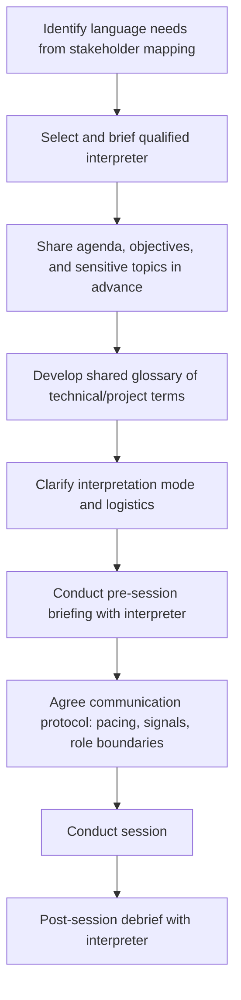
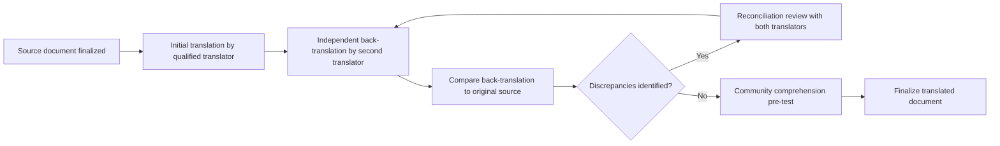

## Working with Interpreters and Translators

### Definition and Conceptual Foundation

Working with interpreters and translators refers to the professional practices, protocols, and preparation processes required to ensure accurate, culturally appropriate cross-language communication during community engagement activities. **Interpretation** is the real-time oral rendering of spoken communication between languages; **translation** is the rendering of written text between languages, generally conducted with more time for accuracy review. Both disciplines require distinct skill sets from bilingual fluency alone — professional-quality cross-language mediation requires training in register matching, cultural mediation, ethical neutrality, and technical vocabulary management.

In SIA practice, working effectively with interpreters and translators is a foundational competency wherever engagement occurs across a language barrier, which is the norm rather than the exception in most international development, extractive-sector, and infrastructure SIA contexts. Interpretation quality directly bounds the validity of any qualitative or quantitative data collected across a language barrier — an SIA is only as accurate as its weakest translation link.

### Modes of Interpretation

**Consecutive interpretation**

The speaker pauses periodically (typically after a sentence or short passage) while the interpreter renders that segment into the target language; the standard mode for interviews, small meetings, and negotiations, requiring no specialized equipment but roughly doubling the time required for verbal exchange.

**Simultaneous interpretation**

The interpreter renders speech into the target language in near-real-time as the speaker continues, typically requiring specialized equipment (headsets, booth or whisper/chuchotage technique) and significantly higher interpreter cognitive load; more common in large formal meetings, conferences, or disclosure events with time constraints, and generally requires interpreters working in pairs due to the intense concentration demands over sustained periods.

**Whispered interpretation (chuchotage)**

A form of simultaneous interpretation delivered quietly directly to one or a small number of listeners without equipment, useful for small subsets of a larger meeting who need interpretation while the broader session proceeds in the primary language.

**Sight translation**

The interpreter reads a written document in the source language and orally renders it into the target language in real time — commonly needed when a document (consent form, compensation agreement) must be explained to a participant who cannot read the source language, and requires particular care given the legal/consequential weight such documents often carry.

**Relay interpretation**

Used when no interpreter is available for a direct source-target language pair; interpretation passes through an intermediate language (e.g., local language to a regional lingua franca to the facilitator's language), introducing compounding accuracy risk that should be avoided where a direct-pair interpreter can be sourced instead.

### Interpreter and Translator Selection Criteria

| Criterion | Rationale |
| --- | --- |
| Language pair fluency (both directions) | Bidirectional fluency, not just comprehension, is required for accurate rendering |
| Subject-matter familiarity | Technical SIA vocabulary (resettlement, biodiversity, compensation methodology) requires domain preparation, not general fluency alone |
| Neutrality and independence | Interpreters with a stake in the outcome (e.g., a proponent employee with financial interest, or a community member advocating a personal position) risk conscious or unconscious message distortion |
| Cultural fluency in both directions | Understanding of register, politeness norms, and culturally embedded meaning beyond literal word translation |
| Professional ethics training | Adherence to accuracy, confidentiality, and non-intervention norms distinct from general bilingual ability |
| Gender and social position appropriateness | In some contexts, interpreter gender or social status affects participant willingness to disclose sensitive information |

Family members, children, or individuals with a direct stake in the engagement outcome should generally be avoided as interpreters despite convenience, since role conflicts (protecting a family member from distressing content, personal advocacy, altered power dynamics) can distort communication in ways that are difficult to detect during the session itself.

### Pre-Session Preparation Protocol

**1. Language needs identification**

Determined during stakeholder mapping and audience analysis, accounting for the possibility of multiple languages or dialects within a single community, and for literacy differences that affect whether written or oral communication (and thus interpretation mode) is appropriate.

**2. Interpreter selection and briefing**

Selects interpreters against the criteria above and provides them with the session's purpose, agenda, and any anticipated sensitive content in advance, allowing preparation time rather than expecting cold, unprepared performance.

**3. Shared glossary development**

Develops and reviews with the interpreter, in advance, a glossary of key technical and project-specific terms (e.g., "resettlement," "compensation cut-off date," "grievance mechanism") with agreed target-language equivalents, since ad hoc on-the-spot translation of technical terms produces inconsistency across sessions and interpreters.

**4. Interpretation mode and logistics clarification**

Confirms consecutive versus simultaneous mode, equipment needs, seating/positioning arrangements, and — for multi-day or high-intensity assignments — interpreter rotation or pairing to manage fatigue, which measurably affects accuracy over sustained sessions.

**5. Pre-session briefing**

A structured briefing immediately before the session covers the specific participants (where known), any last-minute agenda changes, particularly sensitive topics requiring careful handling, and reconfirms the interpreter's role boundaries.

**6. Communication protocol agreement**

Establishes practical working signals between facilitator and interpreter (e.g., a subtle signal for "please slow down" or "please ask for clarification"), and agrees explicitly on pacing — speakers should be coached to pause at natural break points and avoid long unbroken monologues that overload consecutive interpretation.

### Interpreter Role Boundaries and Neutrality

Professional interpreting ethics (drawing from standards such as those of the International Association of Conference Interpreters and community/medical interpreting ethical codes) establish that the interpreter's role is to render the full meaning of what is said, in the register in which it is said, without adding, omitting, summarizing, or editorializing — a principle sometimes summarized as **interpreting everything, not just the gist**.

**Common role-boundary violations and their risks:**

- **Summarizing rather than rendering fully** — condensing a lengthy or emotional statement into a brief summary loses nuance, tone, and detail that may be analytically significant for SIA purposes.
- **Interpreter editorializing or adding personal opinion** — inserting the interpreter's own view or softening/hardening a statement based on personal judgment distorts the actual communication.
- **Side conversations without rendering** — the interpreter and a participant conversing directly without relaying content to the facilitator excludes the facilitator from information exchanged in their own session.
- **Advocacy or coaching** — an interpreter subtly guiding a participant's response (common when interpreters have a personal stake or strong sympathy toward a particular outcome) compromises data integrity.
- **Omitting content deemed embarrassing or culturally sensitive** — well-intentioned but distorting; the interpreter substituting their own judgment about what should be conveyed rather than rendering the speaker's actual statement.

Facilitators should establish, in the pre-session briefing, an explicit expectation of full-content, first-person rendering ("I will ask a question, and I need you to translate exactly what they say back to me, even if it's a long answer") and should be alert during the session to interpretation segments that seem disproportionately short relative to the length of the original statement, which is a common indicator of unauthorized summarizing.

### First-Person vs. Third-Person Interpretation Convention

Standard professional practice uses **first-person interpretation** — the interpreter renders the speaker's words as "I" rather than "she says that..." — which preserves the direct communicative relationship between facilitator and participant and avoids the subtle distancing effect of third-person relay. Facilitators unfamiliar with this convention sometimes inadvertently address the interpreter directly ("ask her if...") rather than the participant, which should be corrected through explicit pre-briefing and gentle in-session redirection.

### Managing Interpretation in Sensitive Contexts

**Gender-based violence, trauma, or highly sensitive disclosure**

Requires interpreters specifically trained or experienced in trauma-sensitive interpretation, gender-matched to the participant where culturally appropriate, and briefed on trauma-informed pacing (allowing pauses, avoiding pressuring rapid response rendering).

**Legal or consequential content (consent forms, compensation agreements)**

Sight translation of legally consequential documents carries elevated accuracy risk given the stakes; best practice pairs oral sight translation with a pre-translated written summary in plain language, and, where resources allow, independent verification that the participant's understanding matches the document's actual content (e.g., via teach-back).

**Children or vulnerable participants**

Requires interpreters with specific training or experience working with children, calibrated pacing, and awareness of child-safeguarding protocols alongside standard interpretation practice.

### Written Translation Quality Assurance Process

**Back-translation** — translating the already-translated document back into the source language by a different, independent translator, then comparing the back-translation to the original — is a standard quality assurance technique for high-stakes translated materials (informed consent forms, survey instruments, compensation agreements), since discrepancies revealed through back-translation often surface meaning drift invisible when reviewing only the forward translation.

**Comprehension pre-testing** of translated written materials (via structured feedback sessions with representative community readers) complements back-translation by testing not only linguistic accuracy but actual comprehensibility for the intended audience, since a technically accurate translation can still be inaccessible if register or vocabulary remain too complex.

### Common Operational Pitfalls

| Pitfall | Consequence | Mitigation |
| --- | --- | --- |
| Using untrained bilingual staff as ad hoc interpreters | Inconsistent accuracy, role confusion, potential conflicts of interest | Engage trained, vetted interpreters; reserve ad hoc bilingual staff for low-stakes logistics only |
| No pre-session glossary | Inconsistent technical term rendering across sessions | Develop and maintain a standing project glossary, updated iteratively |
| Long unbroken speaker monologues | Interpreter overload, omission, or summarization under cognitive strain | Coach speakers and facilitators to pause at natural intervals |
| Single interpreter for extended simultaneous sessions | Fatigue-driven accuracy degradation over time | Rotate or pair interpreters for sessions exceeding roughly 30–45 minutes of simultaneous work |
| No interpreter debrief | Loss of interpreter's own observations on communication dynamics or ambiguity | Structured post-session debrief capturing interpreter-flagged uncertainties |
| Treating interpretation as a purely logistical/technical add-on | Under-resourcing and under-preparing interpretation relative to its data-validity impact | Budget and schedule interpretation preparation with the same rigor as core facilitation planning |

### Illustrative Example

A resettlement negotiation session requires interpretation between the project's working language and a local language spoken by the affected community, with a subset of elderly participants speaking only a further regional dialect. The engagement team engages a professionally vetted interpreter (unaffiliated with the project or any negotiating household) rather than relying on a bilingual junior project staff member as originally planned, specifically to avoid perceived or actual conflict of interest during compensation discussions. A pre-session glossary is developed covering key terms ("replacement value," "cut-off date," "grievance mechanism") with the interpreter's input on the most accurate and culturally resonant local-language equivalents — surfacing, in the process, that the initially proposed direct translation of "replacement value" carried an unintended connotation in the local language closer to "identical replica," prompting a revised phrasing. For the dialect-speaking elderly subgroup, a relay interpretation arrangement is used as a last resort after confirming no direct-pair interpreter is available, with an explicit note in the session documentation flagging the relay arrangement as a data-quality caveat for that specific subgroup's recorded input.

### Related Topics

- Translating technical content for lay audiences
- Meeting design and agenda facilitation
- Active listening and dialogic facilitation
- Free, Prior and Informed Consent (FPIC) processes
- Cross-cultural communication protocols
- Key informant and semi-structured interview techniques
- Informed consent documentation standards
- Trauma-informed engagement practices