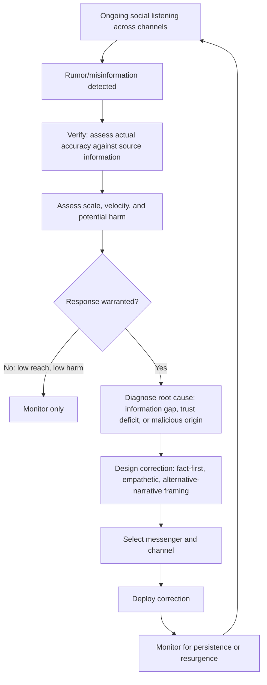

## Countering Misinformation and Rumor

### Definition and Conceptual Foundation

Countering misinformation and rumor refers to the systematic practices used to detect, analyze, and respond to inaccurate or unverified information circulating within project-affected communities that can distort risk perception, undermine trust, or drive maladaptive behavior. **Misinformation** denotes inaccurate information shared without deliberate intent to deceive (often via informal social transmission); **disinformation** denotes deliberately false information spread with intent to mislead; **rumor** denotes unverified claims circulating through informal social networks, which may prove true, false, or partially accurate and is defined by its unverified status at the point of transmission rather than by its ultimate accuracy.

In SIA practice, this discipline sits adjacent to but distinct from risk and crisis communication: while risk communication proactively shapes understanding of known hazards, misinformation management is reactive and diagnostic, requiring active social listening to detect emerging false narratives before they harden into entrenched belief, plus a structured response methodology that avoids common correction pitfalls that can inadvertently amplify the very misinformation being addressed.

### Theoretical Foundations

**Rumor theory** — classical work (notably Allport and Postman's foundational studies, later extended by contemporary rumor researchers such as Nicholas DiFonzo) identifies that rumor transmission is driven by uncertainty and anxiety in the absence of trusted, timely official information; rumor intensity is often modeled as a function of the topic's importance to the audience multiplied by the ambiguity of available information — meaning rumor is not primarily a problem of audience gullibility but a predictable social response to an information vacuum.

**Continued influence effect** — a well-established finding in cognitive psychology that corrected misinformation continues to influence belief and reasoning even after an individual has acknowledged and accepted the correction, because the original (false) information remains cognitively available as an explanatory narrative unless actively replaced with an alternative coherent explanation — a central consideration in designing effective corrections.

**Backfire effect research** — earlier research suggested that direct correction could sometimes strengthen false beliefs among those already invested in them, particularly on identity-relevant topics; more recent, larger-scale replication research has found backfire effects to be considerably less common and reliable than initially believed, though [Inference] the effect's prevalence appears highly context- and topic-dependent, so corrections should still be designed conservatively (fact-first framing, non-adversarial tone) rather than assuming backfire risk is negligible, based on the mixed state of current research literature.

**Inoculation theory** — proposes that pre-exposing audiences to weakened forms of a misleading argument, along with refutation, builds resistance ("psychological inoculation") to later encountering the fuller misleading version — increasingly applied in misinformation-prevention communication as a complement to reactive correction.

### Relevance to SIA

- Misinformation about project impacts (health effects, compensation terms, resettlement timelines) can drive real behavioral and psychological harm independent of the underlying factual reality, making its management a genuine social impact concern, not merely a reputational one.
- Unaddressed rumor is a well-documented driver of grievance escalation, protest mobilization, and breakdown of engagement processes, particularly in low-trust or historically grieved communities.
- SIA baseline and monitoring work should treat rumor patterns themselves as diagnostic data — persistent rumors often trace to genuine underlying concerns, information gaps, or trust deficits that the SIA process should address substantively, not merely correct informationally.
- Misinformation disproportionately affects populations with limited access to official/verified information channels, compounding existing engagement equity gaps identified through stakeholder mapping.

### Misinformation Management Process

### Step-by-Step Protocol

**1. Ongoing social listening**

Systematic, continuous monitoring across the channels where community discourse occurs — informal conversation networks (via community liaisons and field staff), social media groups, WhatsApp broadcast lists, local radio call-in programs, and the project's own grievance/feedback intake channels — since misinformation often circulates well before it reaches formal engagement settings.

**2. Verification against source information**

Before responding, confirms what is actually true by checking against verified project data, technical findings, or documented facts; premature correction of a claim that later proves partially accurate significantly damages the proponent's credibility, making rigorous verification a prerequisite rather than an optional step.

**3. Scale, velocity, and harm assessment**

Not all misinformation warrants active correction — assessing how widely and quickly a claim is spreading and its potential to cause harm (behavioral, psychological, or trust-related) determines whether active response is proportionate, since over-responding to minor, low-reach rumors can inadvertently amplify their visibility (a phenomenon related to the broader "Streisand effect" of unintentionally drawing attention through denial).

**4. Root cause diagnosis**

Distinguishes between misinformation arising from genuine information gaps or ambiguity (addressed through improved proactive communication), misinformation reflecting underlying legitimate concern or distrust (addressed through substantive trust-building and issue resolution, not just factual correction), and deliberate disinformation from an identifiable adversarial source (which may require a different, more assertive response strategy).

**5. Correction design**

Structures the correction using evidence-based principles (detailed below) rather than simple flat denial, since correction design substantially affects whether the correction actually shifts belief or, in worst cases, inadvertently reinforces the false claim through repetition.

**6. Messenger and channel selection**

Selects who delivers the correction and through which channel based on source credibility for the specific audience — corrections from locally trusted figures (respected community liaisons, local leaders) often carry more persuasive weight than corrections from the project entity directly, particularly in lower-trust relationships.

**7. Deployment and monitoring**

Delivers the correction and continues monitoring for persistence, resurgence, or mutation of the claim, since a single correction does not guarantee permanent resolution, particularly for claims tied to deeper underlying anxiety or distrust.

### Effective Correction Design Principles

**Fact-first, myth-second structure**

Leading with the correct information, then briefly naming the misconception, rather than repeating the false claim prominently or first, reduces the risk of the false claim being what audiences most readily recall (related to the continued influence effect — repetition of false content, even in a correction, can reinforce its cognitive availability).

**Provide an alternative causal explanation**

Simply stating "X is false" leaves a gap in the audience's understanding of what actually happened or is true; the continued influence effect research indicates that corrections are more effective when they supply a coherent alternative explanation that fills the explanatory role the false claim was serving, rather than only negating it.

**Avoid unnecessary repetition of the false claim**

Where possible, correction messaging should minimize verbatim repetition of the misinformation itself, since repeated exposure — even in a debunking context — can increase the claim's perceived familiarity and, counterintuitively, its perceived truthfulness (the "illusory truth effect").

**Empathetic, non-adversarial tone**

Framing corrections as helpful clarification rather than as an accusatory rebuttal of the audience's judgment reduces defensive resistance and is more consistent with trust-building communication principles generally.

**Simplicity and plain language**

Corrections should follow the same plain-language principles as other technical translation work — simple, concrete, and free of jargon — since complex corrections are both harder to process and less memorable than the simpler false claim they are competing against.

**Source transparency**

Clearly citing the basis for the correction (e.g., "independent water testing conducted on [date] found...") supports credibility, particularly important where the underlying misinformation involves distrust of the proponent's own claims.

### Correction Message Template Structure

| Element | Purpose | Example Framing |
| --- | --- | --- |
| Acknowledge the concern | Validates that the underlying worry is legitimate even if the specific claim is inaccurate | "We understand people are concerned about water safety near the site." |
| State the correct fact first | Leads with accurate information rather than the false claim | "Independent testing this month confirmed the water meets national safety standards." |
| Briefly name the misconception | Addresses the specific claim without extensive repetition | "This addresses recent concerns about contamination from the recent spill." |
| Provide supporting evidence/source | Builds credibility through transparency | "Full results are posted at the community office and available on request." |
| Offer a channel for further questions | Demonstrates ongoing availability rather than a one-off dismissal | "Questions can be raised at Thursday's community meeting or through the hotline." |

### Prevention-Oriented Techniques (Inoculation Approach)

- **Pre-bunking anticipated misinformation** — proactively addressing likely misconceptions before they circulate widely, particularly around predictable flashpoints (project milestones, compensation announcements, incident anniversaries).
- **Building routine information channel trust** — maintaining consistent, reliable, proactive communication (per risk communication practice) reduces the information vacuum that rumor theory identifies as the primary driver of rumor emergence.
- **Community-based rumor liaison networks** — training trusted local community members to identify and flag emerging rumors early, and in some cases to deliver initial peer-to-peer correction before formal project response is needed.
- **Transparency about uncertainty** — proactively acknowledging what remains unknown or under investigation (rather than only communicating settled facts) reduces the information gap that speculative rumor tends to fill.

### Distinguishing Rumor Management from Suppression

A critical ethical and practical distinction: countering misinformation is not equivalent to suppressing legitimate criticism, dissent, or genuinely uncertain/contested claims. Over-application of "misinformation correction" framing to what is actually legitimate community concern, contested scientific uncertainty, or valid critique of the project risks being perceived — often correctly — as an attempt to silence dissent, which itself becomes a significant trust and reputational risk.

**Distinguishing markers:**

| Genuine Misinformation | Legitimate Concern/Dissent |
| --- | --- |
| Verifiably factually inaccurate claim | Value-based disagreement or contested interpretation of available evidence |
| Can be corrected with clear, sourced evidence | Reflects a legitimate difference in risk tolerance or priorities |
| Root cause is information gap or misunderstanding | Root cause is substantive opposition or unresolved grievance |
| Appropriate response: factual correction | Appropriate response: dialogue, negotiation, or grievance process engagement |

SIA practitioners should apply this distinction rigorously and resist any organizational pressure to label inconvenient but legitimate community concerns as "misinformation" requiring correction rather than substantive engagement.

### Digital Misinformation Monitoring Considerations

Where misinformation circulates on social media or messaging platforms (per the digital engagement platform toolkit), monitoring typically involves manual review of public groups/pages by engagement staff supplemented, at scale, by keyword-based social listening tools; closed/private groups (e.g., private WhatsApp groups) present monitoring limitations that require reliance on community liaison relationships rather than direct technical monitoring, given both technical access limitations and privacy/ethical considerations around surveilling private community communication.

[Unverified] Specific social listening tool capabilities and their applicability to closed messaging platforms change frequently with platform policy updates; current tool selection should be verified against up-to-date vendor documentation and platform terms of service before deployment.

### Illustrative Example

Following a scheduled blasting event at a mining project, a rumor circulates via WhatsApp claiming that blasting has cracked the foundations of homes in a nearby village, with photos of pre-existing, unrelated structural cracks being shared as supposed evidence. Community liaison staff detect the rumor within a day through routine social listening. Rather than immediately and publicly denying the claim (which risks amplifying it further to households who had not yet seen it), the team first verifies the claim against actual blast-monitoring seismograph data and conducts a rapid site visit to the specific homes shown in the circulated photos, confirming the cracks pre-date the blasting period based on weathering and prior household reports. The correction is then delivered primarily through trusted community liaisons in person and at the next scheduled community meeting — leading with the seismograph data confirming blast vibrations remained within safe regulatory limits, briefly noting the specific photos in circulation were of pre-existing damage, and offering a free structural inspection to any household with genuine concerns about their home's condition. This last element — providing the free inspection offer — directly addresses the underlying anxiety (home safety) rather than only correcting the specific factual claim, consistent with root-cause diagnosis principles.

### Related Topics

- Risk and crisis communication planning
- Digital and social media engagement platforms
- Translating technical content for lay audiences
- Grievance redress mechanism (GRM) design
- Trust-building and relationship management in engagement
- Stakeholder mapping and analysis
- Social license to operate (SLO) measurement
- Managing conflict and disagreement in engagement