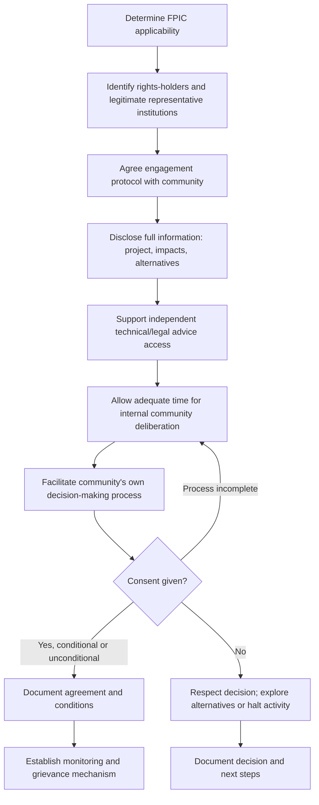

## Facilitating Free, Prior and Informed Consent Processes

### Definition and Conceptual Foundation

Free, Prior and Informed Consent (FPIC) is a specific collective right held by Indigenous Peoples, enabling them to give or withhold consent to proposed projects, policies, or activities that may affect their lands, territories, resources, or rights, and to negotiate the conditions under which a project may proceed. FPIC is distinct from, and represents a higher standard than, general stakeholder consultation: it centers on the right to *consent* (with the corollary right to withhold it) rather than merely the right to be consulted, and applies specifically to Indigenous Peoples under the frameworks that establish it, though some voluntary standards extend consent-based approaches to other groups with customary or collective land rights.

Each term in the FPIC acronym carries specific, defined meaning: **Free** — consent given voluntarily, without coercion, intimidation, or manipulation, and without externally imposed timelines; **Prior** — consent sought sufficiently in advance of authorization or commencement of activities, allowing adequate time for internal community deliberation; **Informed** — consent based on access to complete, objective, accurate, and accessible information about the project, including risks and alternatives; **Consent** — a collective decision made through the community's own customary or chosen decision-making processes and institutions, which may result in agreement, conditional agreement, or withholding of consent.

### Legal and Policy Foundations

**UN Declaration on the Rights of Indigenous Peoples (UNDRIP, 2007)** — establishes FPIC as a right in several articles, most notably Article 32, which requires states to consult and cooperate with Indigenous Peoples to obtain FPIC prior to approval of projects affecting their lands or resources; UNDRIP is a declaration rather than a binding treaty but carries substantial normative and increasingly customary international law weight.

**ILO Convention 169 (1989)** — the principal binding international treaty addressing Indigenous and Tribal Peoples' rights, establishing consultation obligations that, while using somewhat different language than FPIC, are widely interpreted as requiring good-faith consultation aimed at obtaining consent or agreement.

**IFC Performance Standard 7 (Indigenous Peoples)** — the most widely applied private-sector-facing FPIC standard, requiring FPIC specifically in three circumstances: impacts on lands and natural resources subject to traditional ownership or customary use; relocation of Indigenous Peoples from ancestral lands; and impacts on critical cultural heritage. Many international financial institutions and Equator Principles-adhering banks apply this or substantially similar standards as a condition of project finance.

**Convention on Biological Diversity and Nagoya Protocol** — establish FPIC-related requirements specifically regarding access to genetic resources and associated traditional knowledge.

[Unverified] The precise scope, triggering conditions, and current interpretive guidance for FPIC under each of these frameworks should be verified against current primary source documentation and any applicable jurisdiction-specific legal requirements before designing a specific FPIC process, given both the legal complexity of the area and the possibility of guidance updates since training data was compiled.

### Relevance to SIA

- FPIC processes are among the highest-stakes engagement activities in SIA practice, with direct legal, financial, and reputational consequences for non-compliance where applicable standards trigger the requirement.
- The FPIC process itself — not merely its outcome — generates critical baseline social data regarding community governance structures, decision-making processes, internal representation dynamics, and substantive concerns.
- SIA practitioners typically play a central role in designing and documenting the FPIC process to support both genuine community self-determination and defensible compliance evidence.
- Inadequate FPIC processes (rushed timelines, unrepresentative engagement, information asymmetry) are a leading cause of project delay, cancellation, and legal challenge in extractive, infrastructure, and land-intensive sectors.

### FPIC Process Model

### Step-by-Step Facilitation Protocol

**1. FPIC applicability determination**

An early, legally and technically informed assessment of whether the affected population qualifies as Indigenous Peoples under the applicable framework, and whether the specific circumstances (land/resource impact, relocation, critical cultural heritage impact) trigger an FPIC requirement rather than a lower consultation standard — this determination should be made conservatively and with appropriate expert input, given the significant consequences of misclassification in either direction.

**2. Rights-holder and representative institution identification**

Identifies who holds the collective right (which may not align with formal government-recognized boundaries or leadership structures) and, critically, works through the community's own legitimate customary or chosen governance and decision-making institutions rather than imposing an external representative structure — this step requires careful attention given that colonial or state-imposed leadership structures sometimes do not reflect a community's actual customary decision-making authority, and that gender and generational representation within customary structures varies significantly and may itself require deliberate attention.

**3. Engagement protocol agreement**

Rather than the proponent unilaterally designing the FPIC process, genuine practice involves agreeing the process itself — timeline, format, information needs, decision-making method to be recognized — with the community's own representative institutions, since a process imposed without this co-design step risks the "free" and legitimacy dimensions of FPIC from the outset.

**4. Full information disclosure**

Provides complete, accurate, and accessible information covering the project's nature and scope, anticipated impacts (positive and negative), proposed mitigation measures, genuine alternatives considered (including a no-project alternative), and the legal and practical implications of consent, using plain-language translation and interpretation practices appropriate to the community's languages and literacy profile.

**5. Independent advice access**

Supports the community's access to independent technical, legal, or other expert advice not provided or controlled by the project proponent, addressing the fundamental power and information asymmetry inherent in proponent-community engagement and strengthening the "informed" dimension of consent.

**6. Adequate deliberation time**

Allows sufficient time for the community's internal deliberation processes — which may include customary consultation practices, multiple internal meetings, or consultation with dispersed community members — resisting project-timeline pressure to compress this period, since inadequate time is one of the most common grounds on which FPIC processes are later challenged as inadequate.

**7. Facilitating the community's own decision process**

The proponent's and SIA team's role is to support, not direct or substitute for, the community's own decision-making process; this may include providing neutral facilitation for internal community dialogue but should explicitly avoid the proponent facilitating in ways that could be perceived as steering toward a predetermined outcome.

**8. Outcome documentation**

Documents the consent decision (given, conditionally given, or withheld) along with the process followed, evidence of the criteria above having been met, and — where consent is given — any conditions attached, in a form that is both accessible to the community and defensible as compliance evidence.

**9. Monitoring and grievance mechanism establishment**

Where consent is given, establishes ongoing mechanisms for monitoring adherence to agreed conditions and for raising grievances if implementation deviates from what was agreed, recognizing that FPIC is not a single point-in-time event but the foundation of an ongoing relationship.

### Common Process Design Pitfalls

| Pitfall | Consequence | Mitigation |
| --- | --- | --- |
| Treating FPIC as a single meeting/signature event | Fails "prior" and "free" standards; vulnerable to legal challenge | Design as an extended, multi-stage process matched to the community's own deliberation pace |
| Engaging only formally recognized leadership | May exclude legitimate customary authority or marginalized subgroups within the community | Conduct governance mapping to identify actual decision-making institutions, including customary and informal structures |
| Proponent-controlled information as sole source | Undermines "informed" standard; power asymmetry | Support independent technical/legal advice access |
| Compressed timeline driven by project schedule | Undermines "prior" and "free" standards | Build FPIC timeline into overall project schedule as a critical path item, not an afterthought |
| Treating "consent" as binary yes/no from a single spokesperson | May not reflect genuine collective decision, especially in internally divided communities | Use decision-making processes recognized as legitimate by the community itself, which may include documented dissent |
| No provision for withheld consent | Signals the process was not genuinely open to a "no" outcome | Pre-plan organizational response pathways for withheld or conditional consent before initiating the process |

### Handling Internal Community Division

Communities are rarely monolithic; internal disagreement about a proposed project is common and does not, by itself, invalidate an FPIC process. Sound practice involves:

- Transparent documentation of the range of views expressed, rather than presenting an artificially unified "community position."
- Reliance on the community's own legitimate decision-making processes and thresholds (which may include majority, consensus, or other customary decision rules) for determining how internal disagreement translates into a collective decision, rather than the proponent selecting whichever subgroup's view is more favorable to project approval.
- Particular attention to whether marginalized subgroups within the community (women, youth, specific clans or lineages) have had genuine voice in the process, since internally dominant groups can otherwise present their position as the unified community view.
- Recognition that persistent, substantial internal division despite a good-faith process may itself be a significant finding regarding project risk and viability, appropriately escalated rather than resolved through further pressure toward apparent consensus.

### Gender Considerations in FPIC Processes

[Inference] Customary governance and decision-making institutions in many contexts have historically underrepresented women in formal leadership roles, though the extent and nature of this varies substantially by specific cultural context and should not be assumed uniformly. Sound FPIC practice typically includes deliberate attention to women's participation — through gender-disaggregated consultation sessions, gender-matched facilitation where appropriate, and explicit assessment of whether women's perspectives and interests (which may differ materially from men's, particularly regarding land use, resource access, and resettlement impacts) have been genuinely incorporated into the collective decision process, rather than assuming male leadership representation adequately captures community-wide consent.

### Documentation and Evidentiary Standards

FPIC process documentation supporting compliance and legal defensibility typically includes:

- Governance and rights-holder identification methodology and findings.
- Full record of information disclosed, including translated materials and dates of disclosure.
- Timeline showing adequate time was provided at each stage.
- Evidence of independent advice access having been offered/facilitated.
- Records of community-led deliberation processes (respecting appropriate confidentiality of internal community discussions).
- The community's own decision-making process and how it was applied.
- The consent outcome, including any conditions, and evidence of the decision reflecting the community's own governance process rather than proponent influence.

[Inference] Specific evidentiary standards required to withstand legal or lender-compliance challenge vary by applicable framework and jurisdiction; documentation protocols should be developed with input from legal/compliance specialists familiar with the specific applicable standard rather than relying solely on generic best-practice templates.

### Illustrative Example

A proposed forestry concession overlaps with land under the customary stewardship of an Indigenous community, triggering FPIC requirements under the applicable lender's Indigenous Peoples standard. The SIA team begins with a governance mapping exercise, working with community members to identify that the community's actual customary land-decision authority rests with a council of clan elders that operates somewhat independently of the state-recognized village government — a distinction critical to correctly identifying legitimate representative institutions. The team co-designs the FPIC process timeline with the elder council, which requests a period spanning three planting-and-harvest cycles to allow for adequate internal consultation across dispersed clan members, considerably longer than the project's initial schedule anticipated. Independent legal advice is arranged through a regional Indigenous rights organization, funded by but organizationally independent from the project proponent. A parallel women's consultation process, facilitated separately given the elder council's predominantly male composition, surfaces distinct concerns regarding non-timber forest product access that had not been raised in the main council sessions, and these are incorporated into the information package under consideration. At the end of the extended deliberation period, the elder council communicates conditional consent, contingent on specific benefit-sharing terms and a moratorium on activity in a specifically identified sacred grove area — documented in detail, including the process by which the decision was reached, to support both the community's own record and the project's compliance documentation.

### Related Topics

- Land tenure and customary rights assessment
- Negotiation and mediation for consensus building
- Working with interpreters and translators
- Governance mapping and legitimate representation assessment
- Cultural heritage impact assessment
- Grievance redress mechanism (GRM) design
- Gender-disaggregated engagement methods
- Resettlement Action Plan (RAP) development