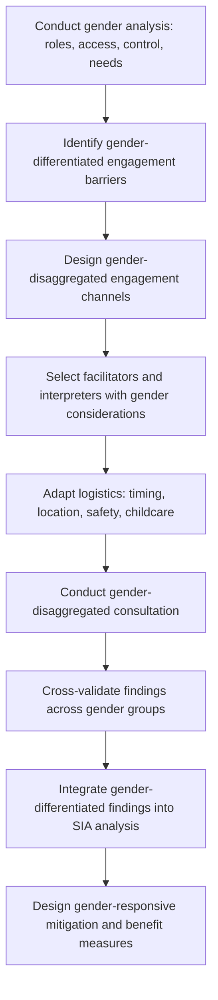

## Gender-Responsive Engagement Approaches

### Definition and Conceptual Foundation

Gender-responsive engagement is an approach to community consultation and participation that deliberately identifies, addresses, and adapts to gender-differentiated needs, constraints, roles, and power dynamics rather than assuming a gender-neutral default engagement process will reach and represent all genders equitably. It moves beyond simple numerical inclusion of women in meetings toward substantively addressing the structural, cultural, and logistical barriers that produce unequal voice and unequal impact distribution across genders.

The approach rests on a foundational distinction in gender analysis between **gender-blind** engagement (which assumes uniform impact and equal access regardless of gender, often defaulting to male-dominated participation patterns), **gender-sensitive** engagement (which recognizes gender differences exist but does not actively restructure process to address them), and **gender-responsive** or **gender-transformative** engagement (which actively designs process and, where relevant, project outcomes to address identified gender gaps and, at the transformative end, to shift underlying inequitable gender dynamics rather than merely working around them).

### Theoretical and Policy Foundations

**Gender and Development (GAD) framework** — supersedes earlier Women in Development (WID) approaches by focusing on the *relational* and structural nature of gender inequality (power relations between genders) rather than treating women's disadvantage as a standalone technical gap to be filled, informing contemporary best-practice emphasis on addressing underlying dynamics rather than only adding women's participation numerically.

**IFC Performance Standards and gender guidance** — IFC and other development finance institutions increasingly require gender-disaggregated impact assessment and gender-responsive stakeholder engagement plans, reflecting growing recognition that development and infrastructure projects frequently have differentiated — and sometimes divergent — impacts by gender that gender-blind SIA processes systematically fail to capture.

**Intersectionality theory** — originating in critical legal and feminist scholarship (notably Kimberlé Crenshaw), emphasizes that gender does not operate as an isolated category but interacts with other social dimensions (age, ethnicity, disability, class, marital status) to produce compounded or distinct experiences of vulnerability and exclusion, informing the need for engagement approaches that avoid treating "women" as a homogeneous category.

### Relevance to SIA

- Development, infrastructure, and extractive-sector projects frequently produce gender-differentiated impacts — on land use, water access, unpaid care burden, income sources, and safety — that gender-blind consultation processes systematically fail to detect, producing incomplete or inaccurate SIA findings.
- Women's participation rates in mixed-gender consultation settings are frequently and measurably lower than men's due to a combination of social norms, time constraints (disproportionate unpaid care and domestic labor burden), safety concerns, and meeting scheduling/location choices calibrated to male availability patterns.
- Compensation, resettlement, and benefit-sharing processes that engage only formally recognized (frequently male) household heads or landholders risk excluding women's distinct interests and, in some contexts, undermining women's existing resource access and economic standing even where aggregate household compensation appears adequate.
- Gender-based violence and safety risks associated with project activities (workforce influx, resettlement disruption) require gender-responsive engagement specifically to surface risks that women may be reluctant to disclose in gender-blind or male-dominated settings.

### Gender-Responsive Engagement Design Process

### Step-by-Step Protocol

**1. Gender analysis**

A structured baseline analysis (often using established frameworks such as the Harvard Analytical Framework, Moser Framework, or similar) mapping gender-differentiated roles (productive, reproductive, community), access to and control over resources, and differentiated needs and priorities, conducted before designing the engagement process itself, since engagement design should respond to actual identified gender dynamics rather than generic assumptions.

**2. Barrier identification**

Systematically identifies the specific factors likely to constrain women's (or, context-dependently, men's) participation — time poverty from unpaid care burden, mobility restrictions, literacy gaps, safety concerns around travel or mixed-gender settings, cultural norms regarding public speech in mixed company, or lack of independent access to communication channels (e.g., shared household phones controlled by male members).

**3. Channel design**

Designs multiple, differentiated engagement channels rather than a single format assumed to serve all genders equally — potentially including separate single-gender sessions, household-level engagement that deliberately includes non-head-of-household members, and channels calibrated to gender-differentiated technology or mobility access.

**4. Facilitator and interpreter selection**

Considers gender matching between facilitators/interpreters and participants where cultural context indicates this materially affects disclosure willingness and comfort, particularly for sensitive topics (health, safety, gender-based violence risk, intra-household dynamics).

**5. Logistics adaptation**

Adjusts meeting timing (avoiding times that conflict with typically gender-differentiated labor schedules, such as early morning water collection or childcare peak periods), location (physically safe and accessible, potentially closer to women's typical daily movement patterns rather than centralized male-dominated public spaces), and practical supports (childcare provision, transport assistance) known to differentially affect gender participation rates.

**6. Gender-disaggregated consultation execution**

Conducts separate consultation sessions by gender where indicated by the barrier analysis, using facilitation techniques (from active listening and dialogic facilitation practice) calibrated to the specific group.

**7. Cross-validation**

Compares findings across gender-disaggregated sessions explicitly, surfacing both areas of alignment and areas of genuine divergence in priorities, concerns, or impact perception — divergence is itself a significant and often underreported SIA finding.

**8. Analytical integration**

Ensures gender-disaggregated findings are integrated into the core SIA analysis (impact identification, significance assessment, mitigation design) rather than siloed into a separate "gender chapter" disconnected from the main assessment, a common structural weakness in less rigorous SIA practice.

**9. Gender-responsive mitigation design**

Translates differentiated findings into mitigation, compensation, or benefit-sharing measures that address identified gender gaps directly (e.g., ensuring compensation registration includes women independently rather than solely through male household heads; designing livelihood restoration programs around women's actual, not assumed, economic activities).

### Common Participation Barriers and Corresponding Design Responses

| Barrier | Description | Design Response |
| --- | --- | --- |
| Time poverty | Disproportionate unpaid care/domestic labor limits availability | Schedule around identified peak labor periods; consider shorter, more frequent sessions |
| Mobility constraints | Cultural norms or safety concerns restrict independent travel | Bring engagement to accessible local locations rather than centralized venues |
| Public speech norms | Cultural norms discourage women speaking in mixed or public settings | Single-gender breakout sessions; anonymous input channels |
| Literacy gaps | Gender gaps in literacy affect access to written materials | Oral and visual engagement formats; plain-language translation practices |
| Technology/channel access | Shared or male-controlled household phones/devices limit independent digital access | In-person channels as primary; avoid sole reliance on digital platforms for gender-inclusive reach |
| Childcare responsibilities | Meeting attendance conflicts with childcare duties | Provide childcare support or child-friendly session design |
| Safety concerns | Risk of harassment or violence associated with travel or mixed settings | Safe, familiar venues; gender-matched facilitation; scheduling that avoids travel after dark |

### Intersectional Considerations

Gender-responsive engagement should avoid treating "women" or "men" as internally homogeneous categories. Intersecting factors that commonly produce differentiated experience within a gender category include:

- **Age** — younger and older women often face distinct constraints and hold distinct priorities (e.g., young mothers' childcare burden versus older women's roles in customary decision-making).
- **Marital and household status** — widowed, divorced, or female-headed households frequently face distinct resource access and vulnerability profiles compared to women in male-headed households.
- **Ethnicity and migrant status** — gender norms and engagement barriers vary across ethnic or migrant subgroups within a single project area.
- **Disability** — compounds both gender-based and disability-based participation barriers, requiring combined accessibility and gender-responsive design.
- **Economic status** — wealth and livelihood differences shape both time availability and the material stakes of specific project impacts.

[Inference] The specific intersectional dynamics most salient to a given engagement process are highly context-dependent and should be identified through context-specific gender analysis rather than assumed from general frameworks alone.

### Gender-Based Violence (GBV) Risk Considerations in Engagement Design

Certain project types (particularly those involving significant temporary workforce influx) carry elevated GBV risk that gender-responsive engagement should be specifically designed to surface safely:

- Avoid engagement formats that could expose disclosing individuals to retaliation or stigma (e.g., open-floor disclosure in mixed public settings).
- Ensure facilitators are trained in trauma-informed and GBV-sensitive engagement practice, including clear protocols for referral to appropriate support services if disclosure occurs.
- Establish clear confidentiality protocols and communicate them explicitly before sensitive topics are raised.
- Coordinate engagement design with any project-specific GBV risk assessment and response mechanisms already established, avoiding duplicative or conflicting intake processes.

[Inference] Given the sensitivity and potential harm involved, GBV-specific engagement components should generally be designed and, where appropriate, delivered in coordination with specialists trained specifically in GBV-sensitive methodology rather than by generalist SIA engagement staff alone.

### Gender-Disaggregated Data Collection Standards

- Household surveys and consultation records should capture respondent gender systematically, along with, where relevant and ethically appropriate, position within household (head, spouse, other adult member) to enable disaggregated analysis.
- Compensation and resettlement documentation should record individual entitlement holders rather than only household-level aggregation, supporting analysis of whether women's independent access to compensation or resources is being adequately addressed.
- Monitoring and evaluation indicators should include gender-disaggregated participation rates and outcome measures as standard practice, not as an optional supplementary analysis.

### Illustrative Example

An irrigation infrastructure project's baseline consultation initially convenes a single community meeting per village, attended predominantly by men (reflecting typical public meeting attendance patterns in the project area). A subsequent gender analysis reveals that women hold primary responsibility for household water management and are the predominant users of communal water access points slated for modification, yet their perspectives were almost entirely absent from the initial consultation record. The engagement team redesigns the process: separate women's sessions are convened at times avoiding early-morning water collection and midday meal-preparation periods, held at a location within the village women already frequent rather than the central meeting hall typically used for male-dominated gatherings, facilitated by a female staff member. These sessions surface that the proposed water access point relocation would substantially increase women's daily walking distance and time burden — an impact entirely absent from the male-dominated initial consultation, since men's household water responsibilities differed materially from women's. This finding leads to a design modification maintaining a secondary access point at the original location, directly informed by gender-disaggregated engagement that a gender-blind process would not have surfaced.

### Related Topics

- Facilitating Free, Prior and Informed Consent processes
- Participatory and community mapping
- Vulnerability assessment and differentiated impact analysis
- Gender-based violence risk assessment and mitigation
- Resettlement Action Plan (RAP) development
- Household survey and structured data collection methods
- Livelihood restoration planning
- Trauma-informed engagement practices