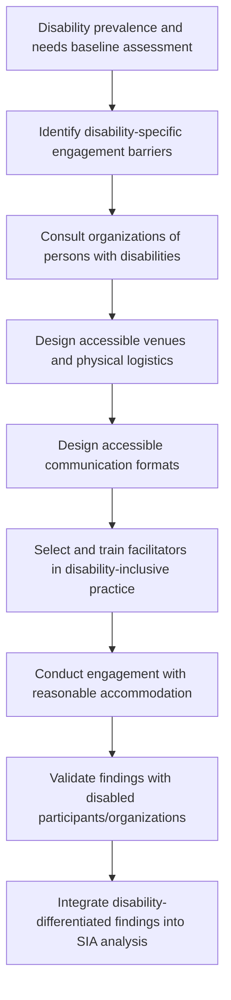

## Engaging Persons with Disabilities

### Definition and Conceptual Foundation

Engaging persons with disabilities refers to the deliberate adaptation of community engagement processes, materials, and physical/communication access to ensure that people with physical, sensory, intellectual, psychosocial, or multiple disabilities can participate meaningfully in SIA-related consultation, feedback, and decision-making processes, on an equal basis with others. This requires moving beyond passive non-discrimination (not actively excluding disabled participants) toward active, structural accommodation that addresses the specific barriers — physical, communicational, attitudinal, and institutional — that otherwise systematically exclude people with disabilities from standard engagement formats.

The foundational conceptual shift underlying contemporary disability-inclusive practice is the move from a **medical model of disability** (which locates disability as an individual deficit to be treated or accommodated as an exception) to a **social model of disability** (which locates disability substantially in the interaction between individual impairment and a physical/social environment designed without disabled people in mind) — under the social model, an inaccessible meeting venue or unadapted communication format, not the individual's impairment alone, is understood as producing the exclusion.

### Legal and Policy Foundations

**UN Convention on the Rights of Persons with Disabilities (CRPD, 2006)** — the principal binding international instrument, establishing rights to accessibility, participation in public and political life, and freedom from discrimination, and requiring states parties (and, through associated safeguard frameworks, financed projects) to ensure accessible participation in decisions affecting persons with disabilities.

**IFC Performance Standards and disability inclusion guidance** — increasingly reference disability-inclusive stakeholder engagement as part of broader differentiated/vulnerable-groups engagement requirements under Performance Standard 1, reflecting growing recognition that disability status is a significant and historically under-addressed dimension of vulnerability in SIA practice.

**Washington Group Short Set of Questions on Disability** — a widely used, internationally standardized survey instrument (developed under the UN Statistics Division-affiliated Washington Group on Disability Statistics) for identifying disability prevalence and type through functional difficulty questions (seeing, hearing, walking, cognition, self-care, communication) rather than diagnostic labels, increasingly adopted as the standard for disability data collection in development and SIA baseline surveys due to its cross-cultural comparability and functional (rather than medical-diagnostic) framing.

[Unverified] Current versions and specific recommended question sets of the Washington Group instrument should be verified against the Washington Group's current published materials, as survey instruments are periodically refined.

### Relevance to SIA

- Persons with disabilities are frequently entirely absent from baseline data and consultation records in standard SIA practice, not because they are rare but because standard engagement methods systematically fail to reach or accommodate them, producing a significant, often invisible, gap in impact assessment completeness.
- Project impacts (resettlement, infrastructure changes, livelihood disruption, workforce influx) frequently have differentiated and sometimes disproportionate effects on persons with disabilities, who may face compounded barriers to adaptation, alternative livelihood access, or physical relocation.
- Meaningful disability-inclusive engagement is both a distinct standards compliance requirement (under CRPD-aligned frameworks) and a data-quality imperative for SIA completeness and accuracy.
- Disability status frequently intersects with other vulnerability dimensions (age, gender, poverty, displacement) in ways that compound exclusion risk, requiring intersectional analytical attention consistent with broader vulnerable-groups engagement practice.

### Disability-Inclusive Engagement Design Process

### Step-by-Step Protocol

**1. Baseline assessment**

Uses functional-difficulty-based instruments (such as the Washington Group Short Set) within household surveys to establish disability prevalence and type within the affected population, avoiding reliance on medical diagnosis-based or self-identification-only approaches, which tend to significantly undercount disability prevalence due to stigma, lack of formal diagnosis access, or varying cultural understandings of disability.

**2. Barrier identification**

Systematically maps the specific access barriers relevant to identified disability types in the local context — physical/mobility barriers (venue accessibility, transport), sensory barriers (information format for blind, low-vision, deaf, or hard-of-hearing participants), cognitive/intellectual barriers (communication complexity, pacing), and psychosocial barriers (sensory environment, session structure, potential stigma or social exclusion within community settings).

**3. Consultation with organizations of persons with disabilities (OPDs)**

Where present in the project area, local or national OPDs are consulted directly regarding appropriate accommodation practices and, ideally, engaged as partners in engagement design and, in some cases, delivery — reflecting the disability rights movement's foundational principle of "nothing about us without us."

**4. Accessible venue and logistics design**

Selects physically accessible venues (step-free access, accessible restrooms, appropriate seating), considers transport barriers (which may require providing accessible transport or conducting some engagement at accessible community or home locations rather than centralized venues), and plans session timing and duration with awareness that some disabilities involve fatigue or health management considerations affecting optimal engagement timing and length.

**5. Accessible communication format design**

Provides information in multiple accessible formats as needed — large print or Braille materials for blind or low-vision participants, sign language interpretation for deaf participants (recognizing that sign language and spoken/written language literacy are distinct skills, so written materials alone do not substitute for interpretation), plain-language and visual materials for participants with intellectual disabilities, and captioning or written summaries for any audio/video content.

**6. Facilitator training**

Trains facilitators in basic disability-inclusive facilitation practice — appropriate language and etiquette, patience with communication pacing differences, avoiding assumptions about capacity based on visible impairment, and practical skills such as working effectively with a sign language interpreter (a distinct skill from working with spoken-language interpreters, requiring appropriate positioning, pacing, and turn-taking awareness).

**7. Reasonable accommodation during engagement**

Applies the CRPD concept of "reasonable accommodation" — individualized adjustments made in response to a specific participant's needs (e.g., additional time, alternative communication method, a support person's presence) rather than only generic, pre-planned accessibility measures, recognizing that disability experience is highly individual even within a shared disability category.

**8. Validation and analytical integration**

Validates findings with disabled participants or their representative organizations before finalizing, and ensures disability-differentiated findings are integrated into core SIA impact and mitigation analysis rather than treated as a separate, disconnected section.

### Common Barrier Categories and Accommodation Responses

| Barrier Category | Examples | Accommodation Response |
| --- | --- | --- |
| Physical/mobility | Inaccessible venue steps, distant transport, inaccessible restrooms | Step-free accessible venues; accessible transport provision; venue proximity to participant residences |
| Visual | Standard-print materials inaccessible to blind/low-vision participants | Large print, Braille, audio-format materials; verbal description of visual content (maps, diagrams) |
| Hearing | Standard verbal facilitation inaccessible to deaf/hard-of-hearing participants | Qualified sign language interpretation; written materials; visual alerting systems; captioning |
| Speech/communication | Standard verbal response format inaccessible for some speech-related disabilities | Alternative response methods (writing, assistive communication devices, extra time) |
| Cognitive/intellectual | Standard technical language and pacing inaccessible | Plain-language materials, visual supports, slower pacing, support person involvement where appropriate |
| Psychosocial | Sensory overload, large crowds, or unstructured formats may be inaccessible | Smaller, structured sessions; predictable format; quiet space availability |

### Facilitator Etiquette and Practice Principles

- **Person-first or identity-first language, per local/individual preference** — awareness that language conventions vary by disability community and by region, and that individual preference should be respected where known rather than applying a single rigid convention universally.
- **Direct address** — addressing the disabled person directly rather than exclusively through a companion, support person, or interpreter, preserving their agency and voice in the engagement process.
- **Avoiding assumptions about capacity** — not assuming a person's cognitive or communicative capacity based on visible physical impairment, or vice versa.
- **Asking rather than assuming accommodation needs** — directly asking individual participants what would support their participation rather than applying a uniform, potentially mismatched accommodation package.
- **Patience with communication pacing** — allowing additional time for responses where communication differences (speech-related disabilities, some cognitive disabilities, augmentative communication device use) require it, consistent with active listening principles applied with specific attentiveness to pacing variation.

### Working with Sign Language Interpreters

Distinct considerations apply beyond general spoken-language interpretation practice: positioning (interpreter visible to the deaf participant, well-lit, positioned to allow simultaneous view of both interpreter and any visual materials or speakers); pacing (deaf participants may need brief additional time to shift visual attention between an interpreter and other visual content); and confirming which sign language variant is appropriate, since sign languages are distinct languages that vary by country and region (e.g., American Sign Language and British Sign Language are mutually largely unintelligible despite both serving English-speaking deaf communities) — local sign language expertise should be sourced rather than assuming any interpreter with general sign language training is appropriate for the local deaf community.

### Data Collection and Confidentiality Considerations

- Disability status data collection should follow informed consent practices with particular attention to potential stigma-related sensitivities, and should generally avoid public or group-setting disclosure requirements in favor of private, individually administered data collection where disability status itself (rather than only functional accommodation needs) is being recorded.
- Functional-difficulty-based questions (as in the Washington Group approach) are generally preferable to direct disability self-identification questions for prevalence estimation, both for data quality (reduced stigma-driven underreporting) and because functional framing more directly informs the practical accommodation needs relevant to engagement design.
- Disaggregated analysis (disability status combined with gender, age, and other vulnerability dimensions) supports more precise identification of compounded vulnerability, consistent with intersectional analysis principles applied elsewhere in vulnerable-groups engagement.

### Illustrative Example

A road corridor SIA's initial household survey, using a general "does anyone in your household have a disability" question, records notably low disability prevalence relative to regional population estimates — a common undercounting pattern. The team revises the instrument to use the Washington Group Short Set functional-difficulty questions in the next survey round, which substantially increases identified prevalence by capturing functional difficulties that respondents had not framed as "disability" under the initial framing (particularly age-related mobility and vision difficulties not identified as disability by the household). Follow-up qualitative engagement is then designed specifically to reach this population: rather than requiring attendance at the standard village meeting hall (which several identified households report being physically unable to access due to uneven terrain and lack of seating), the team conducts smaller, accessible sessions at more proximate accessible locations, arranges sign language interpretation for two deaf household members identified during the survey (sourcing a locally appropriate sign language interpreter through the regional deaf association rather than assuming a generalist interpreter would suffice), and uses large-print and verbally described versions of the project's route maps. This process surfaces that a proposed pedestrian crossing redesign would remove an existing accessible curb-cut relied upon by several mobility-disabled residents — an impact entirely absent from the initial, less accessible consultation round.

### Related Topics

- Vulnerability assessment and differentiated impact analysis
- Household survey and structured data collection methods
- Working with interpreters and translators
- Gender-responsive engagement approaches
- Accessibility and inclusive engagement design
- Meeting design and agenda facilitation
- Resettlement Action Plan (RAP) development
- Trauma-informed engagement practices