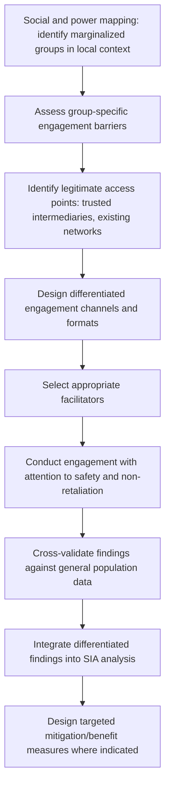

## Engaging Youth, Elderly, and Marginalized Populations

### Definition and Conceptual Foundation

Engaging youth, elderly, and marginalized populations refers to the deliberate design of consultation and participation processes to reach and meaningfully include age-based and socially marginalized groups whose voices are systematically underrepresented in default, "general public" engagement formats. This item addresses three related but analytically distinct population categories: **youth** (typically defined contextually, though international development practice commonly references ages 15–24 or 15–35 depending on the framework), **elderly** (older persons, whose specific engagement barriers often differ substantially from youth despite both being age-based categories), and **marginalized populations** (a broader category encompassing groups excluded on grounds of ethnicity, caste, migration/refugee status, sexual orientation and gender identity, extreme poverty, or other social stratification specific to the local context).

The unifying conceptual thread is that standard, undifferentiated engagement formats — public meetings dominated by adult male heads of household, formats requiring literacy or formal educational background, processes conducted through channels controlled by dominant social groups — systematically favor already-empowered demographic segments, producing SIA findings that misrepresent the full range of community experience and needs unless deliberately counterbalanced.

### Relevance to SIA

- Age- and identity-based exclusion from consultation compounds with other vulnerability dimensions (economic status, disability, gender) to produce cumulative disadvantage that generic "community consultation" reporting can mask entirely.
- Youth and elderly populations frequently experience materially different project impacts and hold different priorities than the general adult population — youth often prioritize employment and future opportunity impacts differently than older generations prioritize land and continuity of customary practice, for instance — meaning their exclusion is an analytical gap, not just a procedural equity concern.
- Marginalized populations (by ethnicity, caste, migration status, or other locally salient stratification) frequently face compounded barriers including active social exclusion from community decision-making structures that mainstream engagement, if uncritically channeled through existing local power structures, risks reproducing or even reinforcing.
- Lender and standard frameworks (IFC Performance Standard 1's differentiated/vulnerable groups requirements) increasingly expect explicit identification and tailored engagement for populations facing heightened vulnerability or exclusion risk, beyond generic stakeholder consultation.

### Engagement Design Process for Age- and Identity-Based Populations

### Engaging Youth

**Characteristic barriers**

Youth are frequently excluded from formal community decision-making structures that privilege age-based seniority and customary authority, even where projects have significant, sometimes disproportionate, implications for their future livelihood and opportunity prospects; standard public meetings dominated by older generation speakers can discourage youth participation through both formal exclusion (not being recognized as legitimate speakers) and informal social dynamics (deference norms discouraging youth from speaking in mixed-age settings).

**Design responses**

- Youth-specific consultation sessions, separate from general community meetings, allow youth to speak more freely without deference pressure from elders present.
- Engagement channels calibrated to youth communication patterns (digital and social media platforms, where access allows) can complement, though should not wholly substitute for, in-person engagement, given that digital access itself varies by socioeconomic status within youth populations.
- Content and framing that addresses youth-specific concerns directly (employment pathways, skills development, long-term environmental and economic trajectory) rather than only general project impact framing, since generic engagement content calibrated to older, often land-owning participants may not surface the distinct concerns most salient to youth.
- Attention to the specific sub-group of out-of-school or unemployed youth, who are both a population of particular vulnerability and frequently the least reached by school-based or employment-based outreach channels.

### Engaging Elderly Populations

**Characteristic barriers**

Distinct from youth exclusion, elderly participation barriers more frequently involve physical mobility limitations, sensory decline (vision, hearing), potential cognitive changes affecting information processing pace, and, in some contexts, lower formal literacy relative to younger generations reflecting differential historical access to education — while elderly community members often hold significant customary authority and historical/institutional knowledge valuable to SIA baseline understanding.

**Design responses**

- Physically accessible venues and proximate locations reduce mobility-related exclusion, overlapping substantially with disability-inclusive engagement practice given the correlation between advanced age and mobility/sensory impairment.
- Slower-paced facilitation, larger print materials, and oral/verbal information formats accommodate literacy and sensory considerations without requiring individual disclosure of specific impairment.
- Deliberate elicitation of historical and customary knowledge — elderly community members are frequently the most valuable source of baseline historical land use, resource change, and customary practice information relevant to SIA, warranting dedicated key-informant engagement beyond general consultation formats.
- Attention to elderly individuals living outside primary household or family support structures, who may face compounded isolation and reduced access to information relayed informally through family networks.

### Engaging Marginalized Populations (Ethnicity, Caste, Migration Status, and Other Locally Salient Exclusion)

**Characteristic barriers**

Marginalized populations defined by locally salient social stratification (which varies enormously by context — caste-based exclusion in South Asian contexts, ethnic minority status in many settings, migrant or undocumented status, religious minority status, or other locally specific dynamics) frequently face active exclusion from mainstream community decision-making structures, meaning engagement channeled solely through existing community leadership or "general public" formats can systematically miss or misrepresent these populations' perspectives, and in some cases can inadvertently reinforce existing exclusion by treating dominant-group representatives as speaking for the full community.

**Design responses**

- Explicit social and power mapping conducted early in SIA baseline work to identify which groups face local marginalization and through what specific mechanisms, since the nature and basis of marginalization is highly context-specific and cannot be assumed from generic frameworks.
- Direct, separate engagement with marginalized group representatives or, where a formal group governance structure does not exist or is itself contested, individually structured outreach rather than reliance on general community leadership to relay marginalized perspectives.
- Attention to safety and non-retaliation — marginalized individuals may face social or economic retaliation risk for speaking critically or independently in settings where dominant community members are present, requiring confidential or separated engagement formats and clear protection of anonymity where sensitive content is shared.
- Caution regarding "elite capture" of marginalized-group representation, where engagement with a self-appointed or externally convenient "representative" of a marginalized group may not reflect that group's actual internal diversity of views, mirroring representation-legitimacy considerations relevant to FPIC and governance mapping practice generally.
- Use of trusted intermediaries — local civil society organizations, community health workers, or other trusted figures already embedded within marginalized communities — as engagement partners or referral points, since cold outreach from an unfamiliar project team often fails to overcome pre-existing distrust rooted in historical exclusion experience.

### Comparative Barrier and Response Summary

| Population | Characteristic Barriers | Key Design Responses |
| --- | --- | --- |
| Youth | Deference norms, exclusion from formal decision structures, generic content mismatch | Separate youth sessions; digital channel supplementation; youth-relevant content framing |
| Elderly | Mobility/sensory limitations, literacy gaps, potential isolation | Accessible venues; slower pacing; deliberate elicitation of historical knowledge |
| Ethnic/caste/religious minorities | Active social exclusion, elite capture risk, distrust from historical marginalization | Direct separate engagement; trusted intermediaries; safety/anonymity protections |
| Migrants/undocumented populations | Legal status fear, absence from formal registries, language barriers | Confidential intake channels; partnership with migrant-serving organizations; no legal status disclosure requirements tied to participation |
| LGBTQ+ individuals (where locally relevant and safe to address) | Safety risk from disclosure, social stigma | Highly confidential, voluntary engagement channels; specialist partner organization involvement where available and safe |

[Inference] The applicability and safety of directly addressing certain marginalized categories (e.g., LGBTQ+ populations) varies enormously by local legal and social context, and in some jurisdictions direct outreach could itself create safety risk for individuals; engagement approach for any specific marginalized category should be informed by careful, context-specific risk assessment rather than a standardized global approach.

### Intersectionality in Practice

Age-based and identity-based marginalization frequently compound: an elderly woman from an ethnic minority group, for instance, may face barriers at the intersection of age, gender, and ethnicity that are not captured by addressing any single dimension in isolation. Sound practice involves:

- Disaggregating consultation and survey data across multiple dimensions simultaneously (age, gender, ethnicity, disability, economic status) rather than analyzing each dimension in isolation, to identify populations facing compounded exclusion risk.
- Avoiding the assumption that addressing one dimension of marginalization (e.g., convening a "women's session") adequately captures the perspectives of women who are also, for instance, from an excluded ethnic minority, elderly, or living with disability — nested or intersecting sessions, or individually tailored outreach, may be needed for populations facing multiple compounding exclusion factors.

### Safety and Ethical Considerations

- **Non-retaliation assurance** — particularly critical for marginalized populations who may face real social or economic consequences for participation or for expressing views divergent from dominant community positions; confidentiality commitments must be genuinely operationalized (e.g., aggregated, non-attributable reporting) rather than merely stated.
- **Avoiding tokenism** — engaging a small, symbolic number of marginalized individuals without genuine influence on outcomes or decision processes can be more damaging to trust than acknowledging engagement limitations honestly, since performative inclusion is often recognized as such by the affected population.
- **Do-no-harm screening** — assessing, before engagement, whether the act of consultation itself (visibility of participation, content of what is asked) could expose already-vulnerable individuals to increased risk, and designing accordingly.

### Illustrative Example

A hydropower project's SIA baseline consultation, conducted through standard village-level public meetings, records apparent broad community support with minimal concerns raised. A subsequent social mapping exercise, conducted specifically to identify locally marginalized populations, reveals that a minority ethnic community living in a peripheral settlement area had not attended the general meetings at all, in part due to historical exclusion from formal village governance structures and a well-founded expectation that their concerns would not be substantively addressed in a setting dominated by the majority ethnic community's leadership. A separate, confidentially convened engagement session — facilitated with support from a regional minority-rights civil society organization acting as a trusted intermediary, and held at a location within the minority settlement rather than the central village meeting hall — surfaces substantial, previously undocumented concerns regarding the project's proposed access road route through land the minority community uses for customary grazing, concerns entirely absent from the original consultation record. Parallel youth-specific sessions in the same villages surface that younger residents' primary concern is unrelated to land access and centers instead on whether project-related employment opportunities will be genuinely accessible to local youth or predominantly filled by external labor — a distinct concern from that raised by older participants in the general meetings, illustrating the analytical value of differentiated engagement even within a single community.

### Related Topics

- Vulnerability assessment and differentiated impact analysis
- Gender-responsive engagement approaches
- Engaging persons with disabilities
- Stakeholder mapping and analysis
- Grievance redress mechanism (GRM) design
- Trauma-informed engagement practices
- Social and power mapping methodology
- Facilitating Free, Prior and Informed Consent processes