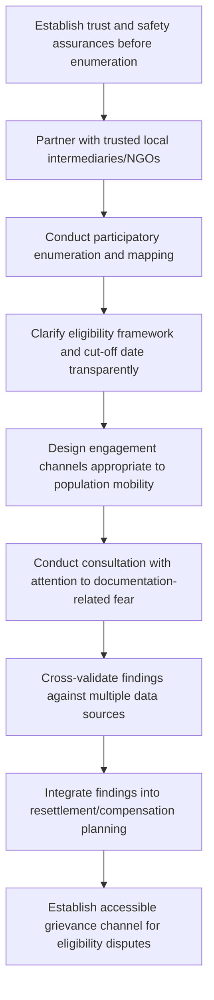

## Engaging Displaced and Informally Settled Communities

### Definition and Conceptual Foundation

Engaging displaced and informally settled communities refers to the specialized consultation and participation approaches required when working with populations who lack secure, formally recognized tenure over the land or housing they occupy — including internally displaced persons (IDPs), refugees, informal urban settlement residents, and populations facing project-induced physical or economic displacement. These populations present distinct engagement challenges beyond general vulnerable-groups practice because their relationship to place is itself legally and administratively precarious, which compounds standard participation barriers with additional risks around documentation, legal recognition, and, in some cases, active fear of eviction or enumeration.

A critical conceptual distinction underlies this practice area: **informal settlement** (occupation of land or housing without formal legal title or planning authorization, but not necessarily involving prior displacement) is analytically distinct from **displacement** (the condition of having been forced or induced to leave a previous home or livelihood location, whether due to conflict, disaster, or project-induced resettlement), though the two frequently overlap in practice — displaced populations often end up in informal settlements precisely because formal housing and tenure systems are inaccessible to them.

### Relevant Frameworks and Standards

**IFC Performance Standard 5 (Land Acquisition and Involuntary Resettlement)** — establishes that lack of formal legal title does not exempt a project from resettlement and compensation obligations; PS5 explicitly requires that persons without formal legal rights to land they occupy or use are nonetheless entitled to resettlement assistance and, where applicable, compensation for lost structures and livelihoods, in recognition that formal legal status and legitimate occupancy or use rights are distinct questions.

**UN Guiding Principles on Internal Displacement** — establish that IDPs retain the same rights as other citizens, including rights to participate in decisions affecting them, and identifies specific protection considerations relevant to consultation with displaced populations, including attention to family separation, documentation loss, and heightened vulnerability during displacement.

**World Bank Involuntary Resettlement framework (and equivalent frameworks across development finance institutions)** — similarly establishes that eligibility for resettlement assistance should not depend solely on formal legal title, addressing the frequent situation where informally settled populations facing project-induced displacement would otherwise be excluded from compensation and engagement processes designed around formal land registries.

[Unverified] Specific current provisions and cut-off date methodologies across these frameworks should be verified against current primary source documentation, as safeguard policy language and interpretive guidance are periodically revised.

### Relevance to SIA

- Informally settled and displaced populations are frequently the most vulnerable population segment within a project's area of influence, yet are systematically the most likely to be excluded from formal consultation processes that rely on land registries, official addresses, or government-recognized household lists for stakeholder identification.
- Displacement-related project impacts (both direct project-induced displacement and impacts on pre-existing displaced populations residing in the project area) carry heightened compliance, human rights, and reputational risk, making thorough and inclusive engagement particularly consequential.
- Fear of eviction, documentation exposure, or legal consequence can suppress genuine participation and disclosure unless engagement processes are specifically designed to address these concerns directly and credibly.
- Baseline enumeration and engagement with informally settled populations is often the foundation for establishing a legitimate resettlement cut-off date and eligibility framework, making engagement quality directly consequential for downstream resettlement planning fairness.

### Engagement Design Process

### Step-by-Step Protocol

**1. Trust and safety establishment**

Before any enumeration or data collection begins, engagement teams should clearly and credibly communicate the purpose of the process, how information will be used, and — critically — provide explicit, honest assurance regarding what the process will *not* trigger (e.g., clarifying whether participation could expose individuals to eviction risk from other authorities), since fear of adverse consequence is a primary and often well-founded barrier to genuine engagement with informally settled populations.

**2. Trusted intermediary partnership**

Given frequently low baseline trust toward external or government-affiliated actors (often rooted in prior negative experience with authorities), partnering with local civil society organizations, community-based organizations, or informal community leaders already trusted within the settlement substantially improves both access and disclosure quality compared to direct, unmediated outside engagement.

**3. Participatory enumeration and mapping**

Conducts household and structure enumeration collaboratively with the community itself (drawing on participatory mapping methodology) rather than through purely external survey approaches, both to improve accuracy in settlements that may lack formal addresses or standard spatial organization, and to build community ownership and reduce perceived surveillance framing of the process.

**4. Transparent eligibility framework communication**

Clearly and proactively communicates the criteria and cut-off date that will determine resettlement or compensation eligibility, since ambiguity or perceived unfairness in eligibility determination is a leading driver of grievance and conflict in resettlement processes involving informal occupants, and since transparent, early communication of a cut-off date (a fixed point after which new occupants are not eligible for assistance) is standard resettlement practice specifically to prevent opportunistic in-migration ahead of compensation.

**5. Mobility-appropriate channel design**

Accounts for potentially higher population mobility and instability in some informal settlement or displacement contexts (compared to settled formal communities) by using engagement approaches resilient to population turnover — repeated engagement touchpoints, flexible scheduling, and record-keeping systems that can track individuals across potential relocation within the process timeline.

**6. Documentation-sensitive consultation**

Designs consultation processes that do not require formal identification documentation as a precondition for participation where such documentation is a known barrier (common among displaced, migrant, or long-term informal residents who may lack formal ID for various reasons), using alternative identity verification approaches (community vouching, photographic record, biometric approaches where appropriate and consented) calibrated to the specific context.

**7. Multi-source validation**

Cross-validates enumeration and consultation findings against multiple sources (participatory community mapping, aerial/satellite imagery review, any available administrative records) given the inherent data-quality challenges of enumerating populations without formal registration systems.

**8. Resettlement/compensation planning integration**

Ensures findings directly inform resettlement action planning (RAP) and compensation eligibility frameworks, maintaining the PS5-aligned principle that lack of formal title does not itself exclude eligibility for assistance.

**9. Accessible grievance and dispute channel**

Establishes a grievance mechanism specifically accessible to this population (accounting for literacy, documentation, and trust barriers) to address eligibility disputes, boundary disagreements, or enumeration errors, which are common in complex informal settlement contexts.

### Distinctive Challenges by Population Type

**Internally displaced persons (IDPs)**

Often carry compounded trauma from the displacement event itself (conflict, disaster), may have experienced family separation or loss, and may hold uncertain legal status even regarding their prior land or property rights, requiring trauma-informed engagement practice layered onto standard consultation design, and often benefiting from coordination with humanitarian actors already engaged with the population where present.

**Refugees**

Engagement must account for distinct legal status considerations (refugee status itself, host-country legal frameworks governing refugee land use and participation rights), potential language barriers beyond the host community's dominant language, and coordination requirements with UNHCR or relevant refugee-response coordination structures where a formal refugee response framework is already operating in the area.

**Informal urban settlement residents**

Often face the most direct and immediate fear of eviction given active or anticipated formalization, redevelopment, or land-use conflict pressures independent of the specific project in question; engagement should be carefully sequenced and framed to avoid inadvertently accelerating eviction risk from other, non-project actors (e.g., avoiding sharing settlement mapping data with authorities who might use it for unrelated eviction enforcement).

**Long-term informal occupants facing project-induced displacement**

Central population for PS5-aligned resettlement engagement; requires particular attention to establishing legitimate occupancy or use evidence (which may include community testimony, utility payment records, or long-term residency evidence) as an alternative to formal title for compensation eligibility determination.

### Cut-off Date Communication and Management

The resettlement cut-off date — the point after which new arrivals or structures are not eligible for compensation — is a standard and necessary resettlement planning tool, but poor communication of it is a significant source of conflict specifically relevant to informally settled populations:

- Should be communicated as early and as widely as possible once established, using multiple accessible channels (not relying solely on formal notices that may not reach or be comprehensible to the target population).
- Should be paired with clear, accessible explanation of the reasoning (preventing opportunistic in-migration that would dilute assistance available to genuine long-term residents) to support legitimacy and reduce perceived arbitrariness.
- Enumeration conducted concurrent with or immediately following cut-off date announcement should be conducted rigorously and transparently, given the high stakes of inclusion or exclusion from the eligible population list.
- A functioning grievance mechanism for disputing enumeration errors or exclusion is essential, given the inherent difficulty of achieving perfect enumeration accuracy in informal settlement contexts.

### Data Protection and Do-No-Harm Considerations

- Enumeration and mapping data collected from informally settled or displaced populations carries elevated sensitivity, given potential use (by other actors) for eviction, immigration enforcement, or other adverse purposes unrelated to the project's own resettlement assistance intent; data governance protocols should explicitly address who can access this data and under what conditions, consistent with broader participatory mapping data governance principles.
- Engagement teams should conduct explicit do-no-harm risk assessment before initiating enumeration or consultation, considering whether the visibility created by the process itself could increase risk to the population, independent of the project's own intentions.
- Confidentiality and data security practices should be clearly communicated to participants in accessible terms, since generic privacy policy language is unlikely to be meaningful or reassuring to a population with well-founded reasons for concern about data misuse.

### Illustrative Example

A riverside road-widening project's alignment passes through a long-established informal settlement that has grown incrementally over roughly fifteen years without formal tenure recognition, alongside a smaller, more recently arrived group of internally displaced households who relocated to the area following flooding elsewhere in the region two years prior. Initial project records, based on municipal land registry data, show no formal occupants in the corridor, effectively rendering the entire population invisible to standard consultation processes. The SIA team partners with a local NGO already providing services in the settlement to conduct participatory community mapping and enumeration, explicitly and repeatedly clarifying that participation in the mapping exercise is separate from, and will not trigger, any immigration or eviction action by other authorities — an assurance made credible by the NGO's pre-existing trusted relationship with the community. The cut-off date is announced concurrently with the enumeration launch, communicated through community meetings, printed notices posted at settlement gathering points, and radio announcements in the two dominant languages present in the settlement, with explicit plain-language explanation of why the date matters. Differentiated attention is given to the more recently displaced households, whose more recent arrival raises complex questions regarding legitimate occupancy evidence, handled through a documented community-testimony verification process developed jointly with the community and NGO partner rather than through a rigid, exclusively document-based eligibility test that would have excluded this genuinely vulnerable subgroup.

### Related Topics

- Resettlement Action Plan (RAP) development
- Land tenure and customary rights assessment
- Grievance redress mechanism (GRM) design
- Participatory and community mapping
- Trauma-informed engagement practices
- Vulnerability assessment and differentiated impact analysis
- Livelihood restoration planning
- Data protection and privacy governance in community engagement