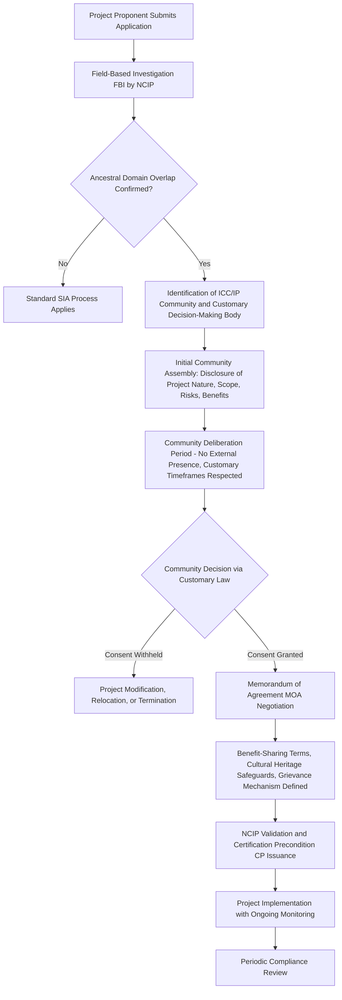

## Indigenous Knowledge and Cultural Heritage Protocols


### Definition and Scope

Indigenous Knowledge (IK), also termed Traditional Knowledge (TK) or Indigenous Traditional Ecological Knowledge (ITEK), refers to the cumulative body of knowledge, practices, and beliefs held by Indigenous Peoples (IPs) and Indigenous Cultural Communities (ICCs), evolved through adaptive processes and passed down through generations via cultural transmission. Cultural heritage encompasses both tangible elements (sacred sites, burial grounds, artifacts, ancestral domains) and intangible elements (oral traditions, rituals, language, indigenous knowledge systems and practices, or IKSPs).

In the context of Social Impact Assessment (SIA), protocols for engaging IK and cultural heritage refer to the structured, legally-grounded, and ethically-guided procedures that project proponents, researchers, and government agencies must follow when a proposed project may affect Indigenous Peoples' territories, resources, knowledge, or cultural practices.

### Key Points

- IK and cultural heritage protocols exist to prevent extraction, misappropriation, and erosion of Indigenous cultural systems by external actors, including well-intentioned researchers and development projects.
- The central legal and ethical mechanism governing engagement is Free, Prior, and Informed Consent (FPIC), not mere consultation.
- Ancestral domain recognition is distinct from land title; it acknowledges pre-colonial rights of occupation and utilization.
- Cultural heritage protocols intersect with intellectual property (IP) frameworks, but conventional IP law is often poorly suited to protect communally-held, intergenerational knowledge.
- SIA practitioners must distinguish between engagement (the process) and impact assessment (the analytical output); protocols govern both.

### Legal and Policy Framework

**International Instruments**

- **ILO Convention No. 169 (1989)** — Concerning Indigenous and Tribal Peoples in Independent Countries; establishes the right to be consulted through appropriate procedures whenever legislative or administrative measures may affect them directly.
- **United Nations Declaration on the Rights of Indigenous Peoples (UNDRIP, 2007)** — Articles 11, 19, 31, and 32 specifically address cultural heritage protection, FPIC, and IK ownership.
- **Convention on Biological Diversity (CBD), Nagoya Protocol (2010)** — Governs Access and Benefit-Sharing (ABS) for genetic resources and associated traditional knowledge.
- **World Bank Environmental and Social Standard 7 (ESS7)** and **IFC Performance Standard 7** — Operational safeguards requiring FPIC for projects affecting Indigenous Peoples, and specific provisions for cultural heritage (ESS8 / PS8) covering both tangible and intangible heritage.

**National-Level Example (Philippines)**

- **Republic Act No. 8371, Indigenous Peoples' Rights Act (IPRA) of 1997** — The foundational domestic statute. Key provisions:
  - Section 3(g): Defines FPIC as the consensus of all members of the ICCs/IPs, determined in accordance with their customary laws and practices, free from external manipulation, undue influence, coercion, and obtained after full disclosure.
  - Section 32: Right to Indigenous Knowledge Systems and Practices (IKSPs) and to develop their own sciences and technologies.
  - Section 34: Right to protection of cultural, intellectual, religious, and spiritual property.
  - Section 59: Certification Precondition — no concession, license, or agreement can be issued without prior Certification Precondition (CP) issued by the National Commission on Indigenous Peoples (NCIP), which itself requires a completed FPIC process.
- **NCIP Administrative Order No. 3, Series of 2012** — The Revised Guidelines on FPIC and Related Processes, detailing the step-by-step field-based investigation, community assembly, and documentation requirements.

[Inference] Practitioners working outside the Philippines should locate the functional equivalent of the NCIP and IPRA in their jurisdiction, since the general architecture (statutory recognition, a dedicated commission, and a certification/consent precondition) recurs across many countries but the specific agency and procedural names will differ.

### Core Principles Distinguishing IK Protocols from Standard SIA Consultation

| Dimension | Standard SIA Consultation | IK/Cultural Heritage Protocol |
| --- | --- | --- |
| Consent standard | Information disclosure, feedback solicitation | Free, Prior, and Informed **Consent** (veto-capable) |
| Decision-making unit | Individual respondents, household surveys | Collective, often through customary governance structures (Council of Elders, tribal chieftains) |
| Timing | Can occur at any project phase | Must occur **prior** to project design finalization and **prior** to any ground-disturbing activity |
| Knowledge ownership | Data belongs to the research/project entity | Knowledge remains communally owned; disclosure does not transfer rights |
| Validation authority | Technical/regulatory approval | Customary law and traditional governance structures hold co-equal or primary authority |
| Documentation | Externally authored reports | Community-validated, often requiring free translation and playback of proceedings in the local language |

### The FPIC Process Architecture

FPIC is not a single event but a phased procedure. A generalized architecture, synthesized from IPRA/NCIP AO No. 3-2012 and comparable frameworks:



**Critical procedural safeguards embedded in the diagram above:**

- **Field-Based Investigation (FBI):** A mandatory NCIP-led verification of whether the affected area falls within a recognized or claimed ancestral domain, and identification of the legitimate representative structure — this step prevents proponents from negotiating with self-appointed or unrepresentative individuals.
- **Deliberation without external presence:** Genuine FPIC requires that the community be allowed to deliberate without the proponent, government facilitator, or NCIP staff present, to prevent undue influence — this is a frequently violated safeguard in practice.
- **Consent is revocable and conditional:** Consent obtained under IPRA and UNDRIP frameworks is not a one-time transaction; communities retain standing to withdraw or renegotiate consent if project conditions materially change.

### Distinguishing FPIC from "Consultation"

A frequent error in SIA practice is treating a courtesy call, a single town-hall meeting, or a signed attendance sheet as equivalent to FPIC. [Unverified] The specific rate of this substitution occurring in practice has not been rigorously quantified in published literature, but it is widely cited as a common failure mode in critiques of extractive-industry and infrastructure SIAs.

Markers that a process is **consultation, not FPIC**:

- Meetings scheduled without accounting for agricultural/ritual calendars of the community.
- Information disclosed only in the proponent's language, without professional translation into the community's language.
- Decision sought from whichever individuals are physically present, rather than through the recognized customary governance structure.
- Absence of a documented "no" option — i.e., the process is structured such that only affirmative outcomes are anticipated.
- No independent, community-selected facilitator or NCIP representative present to validate the process.

### Cultural Heritage Impact Assessment (CHIA)

Where physical/tangible heritage (burial grounds, sacred groves, petroglyphs, ritual sites) may be affected, a **Cultural Heritage Impact Assessment** is typically conducted as a specialized annex or standalone study within the broader SIA/ESIA.

**Standard CHIA components:**

1. **Baseline Cultural Mapping** — Participatory mapping (see Related Topics) conducted **with** community members as co-researchers, not merely as informants, to identify sites of tangible and intangible significance.
2. **Significance Assessment** — Grading sites by spiritual, historical, and ongoing-use significance, using categories defined by the community itself rather than externally imposed heritage-value taxonomies.
3. **Impact Pathway Analysis** — Direct impacts (physical destruction, restricted access) versus indirect impacts (noise/vibration affecting ritual efficacy, in-migration diluting cultural transmission, hydrological changes affecting sites requiring specific water conditions for ceremonies).
4. **Avoidance-First Mitigation Hierarchy** — Consistent with IFC PS8 and ESS8: Avoidance is strongly preferred over relocation of sites; relocation of tangible heritage (e.g., burial grounds) requires its own separate, heightened consent process distinct from the general project FPIC.
5. **Chance Find Procedures** — Protocols for unanticipated discovery of artifacts, remains, or sites during construction, typically requiring immediate work stoppage in the affected area, notification of designated cultural authorities, and community-led determination of next steps.

### Protecting Intangible Knowledge: The IP Mismatch Problem

Standard intellectual property regimes are structurally mismatched with IK protection needs:

| IP Regime Feature | Conflict with IK Characteristics |
| --- | --- |
| Individual/corporate authorship | IK is intergenerational and collectively held; no single "inventor" |
| Fixed term of protection (e.g., patents: ~20 years) | IK is often held to be perpetual and non-expiring |
| Requirement of novelty/non-obviousness | IK may be ancient and already "known" within the community, disqualifying it from patent protection while remaining vulnerable to external patenting (biopiracy) |
| Public disclosure requirement | Many IKSPs are sacred/restricted and disclosure itself is a violation, regardless of subsequent legal protection |

**Sui generis and alternative protective mechanisms:**

- **Traditional Knowledge Digital Libraries (TKDLs)** — Defensive documentation strategy (pioneered by India) that creates prior art records to block external patenting, without requiring public disclosure of ritual/restricted content.
- **Biocultural Community Protocols (BCPs)** — Community-authored documents, recognized under the Nagoya Protocol, that set out the community's own rules for how outsiders (including researchers) must engage with their knowledge and resources, prior to any access request.
- **Customary Law Recognition Clauses** — Contractual provisions in MOAs stating that use of disclosed knowledge remains subject to customary law even where formal IP law does not recognize a communal rights-holder.

### Practical SIA Fieldwork Protocols

**Pre-Engagement**

- Commission a Field-Based Investigation (or jurisdictional equivalent) before any community contact to confirm ancestral domain status and identify legitimate representative structures.
- Identify whether the community has a pre-existing Biocultural Community Protocol or similar self-authored engagement document; if one exists, it takes precedence over the proponent's standard engagement template.
- Engage a culturally-vetted, ideally community-nominated, interpreter/translator — not merely a language-fluent hire.

**During Engagement**

- Disclose project information using accessible, non-technical language and, where relevant, visual or oral formats suited to the community's own communication norms.
- Allow deliberation time commensurate with customary decision-making processes; this may span weeks and cannot be compressed to fit a project's construction schedule.
- Document proceedings with community consent regarding the recording method itself (some ceremonies or discussions may be off-limits to recording).

**Post-Engagement**

- Any MOA or agreement must be validated by playback/re-reading to the assembled community in their own language before signature, to confirm the written document matches what was verbally agreed.
- Establish a culturally-appropriate grievance redress mechanism as a standing feature of the MOA, not a one-time signing event.

### Example: Simplified CHIA Field Checklist Data Structure

The following illustrates how a CHIA site inventory might be structured for downstream SIA reporting (e.g., as a data schema for a GIS-linked heritage register):

```json
{
  "site_id": "CHIA-2024-014",
  "site_type": "sacred_grove",
  "tangible_or_intangible": "both",
  "significance_category": "community_defined:ritual_ongoing_use",
  "consent_for_mapping_obtained": true,
  "consent_for_public_disclosure": false,
  "proximity_to_project_footprint_m": 340,
  "recommended_mitigation": "avoidance_buffer_zone",
  "buffer_zone_m": 500,
  "customary_authority_consulted": "Council of Elders - [Community Name Withheld Pending Consent]",
  "chance_find_protocol_attached": true
}
```

[Inference] The `consent_for_public_disclosure: false` field reflects a common and appropriate practice: a site's existence and general mitigation requirement can be logged for project planning purposes even where the community withholds consent for public or detailed disclosure of the site's specific ritual function, since over-disclosure is itself a form of cultural harm.

### Common Failure Modes in Practice

- **Elite capture** — Engaging only with formally recognized political leaders (e.g., barangay captains) who may not hold customary authority over IK/cultural matters, bypassing the actual traditional governance structure.
- **Consent fatigue exploitation** — Repeated re-engagement on substantially the same project until the community's capacity for sustained deliberation is exhausted, producing consent that is technically obtained but substantively coerced.
- **Homogenization assumption** — Treating "the community" as culturally uniform, when clan, lineage, or sub-group distinctions may mean different subgroups hold different rights over specific sites or knowledge.
- **Extraction without attribution or benefit-sharing** — Researchers or proponents documenting IKSPs for baseline studies, then using that documentation in ways (technical reports, published papers, patented derivative products) that provide no benefit back to the originating community.

### Related Topics

- Free, Prior, and Informed Consent (FPIC) — detailed procedural mechanics and NCIP administrative requirements
- Ancestral domain delineation and Certificate of Ancestral Domain Title (CADT) processes
- Participatory mapping and counter-mapping methodologies
- Benefit-sharing agreement design and royalty/equity structuring in MOAs
- Grievance redress mechanisms (GRM) for Indigenous communities
- Resettlement Action Plans (RAP) intersecting with ancestral domain relocation
- Nagoya Protocol Access and Benefit-Sharing (ABS) compliance procedures
- Gender considerations within Indigenous consultation (women's customary roles in decision-making)
- Chance find procedures and physical cultural resources management during construction