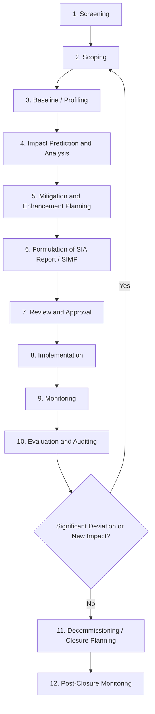

## Social Impact Assessment Stages from Screening to Monitoring

### Overview

Social Impact Assessment (SIA) is not a single analytical event but a staged, cyclical process that runs across the full project lifecycle — from initial concept through post-implementation. The stages below follow the widely-referenced architecture set out in the International Association for Impact Assessment (IAIA)'s *International Principles for Social Impact Assessment* and the more detailed *SIA Guidance Document* (Vanclay et al.), cross-referenced against operational equivalents in IFC Performance Standards and World Bank ESS frameworks.

### Key Points

- SIA stages are iterative, not strictly linear; findings from later stages routinely trigger revisiting earlier ones.
- Screening and scoping determine the resource-intensity of everything downstream; under-scoping is the most common source of later SIA failure.
- Monitoring is not an end-stage afterthought — it must be designed during scoping, with baseline indicators fixed before construction begins.
- Community engagement (including FPIC where Indigenous Peoples are affected) is not a discrete stage but a thread running through all stages.
- The "assessment" (analytical) and "management" (mitigation/enhancement) functions of SIA are distinct outputs that must both flow from the same process.

### Full-Lifecycle Stage Architecture

### Stage 1: Screening

**Purpose:** Determine whether a proposed project requires an SIA at all, and if so, at what level of rigor.

**Core activities:**

- Application of jurisdictional trigger criteria (e.g., project category, scale thresholds, proximity to sensitive receptors such as Indigenous ancestral domains, protected areas, or dense settlements).
- Preliminary desk-based review of secondary data: census data, existing land-use maps, known presence of vulnerable groups.
- Categorization of the project into a risk tier (commonly Category A/B/C in World Bank/IFC terminology, or equivalent domestic environmental compliance categories).

**Typical output:** A screening report or checklist recommending (a) no further SIA required, (b) a limited/rapid SIA, or (c) a full SIA.

[Inference] Screening criteria and category thresholds vary significantly by jurisdiction and funding source (national EIA law versus multilateral lender safeguard policy), so practitioners must confirm the specific applicable framework rather than assume a universal threshold.

### Stage 2: Scoping

**Purpose:** Define the boundaries, focus, and methodology of the full assessment.

**Core activities:**

- **Impact identification workshops** with regulators, proponents, and — critically — early-stage community consultation to surface locally-salient issues that desk review would miss.
- Definition of the **Zone of Influence (ZOI)** — the geographic area within which direct, indirect, and induced/cumulative impacts may plausibly occur (frequently larger than the physical project footprint).
- Identification of **Valued Social Components (VSCs)** — the specific social issues (e.g., livelihoods, cultural heritage, gender relations, in-migration pressure) that will be assessed in depth, versus those scoped out with justification.
- Development of the **Terms of Reference (ToR)** for the full SIA study.
- Preliminary identification of vulnerable and Indigenous groups requiring specialized engagement protocols.

**Typical output:** Scoping Report / ToR, agreed with the regulator and, where applicable, the lending institution.

### Stage 3: Baseline / Social Profiling

**Purpose:** Establish the pre-project social condition against which all future impacts and monitoring will be measured.

**Core activities:**

- **Demographic profiling** — population size, composition, migration patterns.
- **Livelihood and economic baseline** — income sources, land/resource dependency, informal economy mapping.
- **Social organization mapping** — formal and customary governance structures, decision-making authority, existing conflict or cohesion dynamics.
- **Cultural and heritage baseline** — see the dedicated Indigenous knowledge/cultural heritage protocol stream for detailed methodology.
- **Health and social infrastructure baseline** — capacity of local schools, clinics, water systems relative to projected in-migration.
- **Gender-disaggregated data collection** — ensuring baseline captures differentiated impacts and access to resources/decision-making by gender.

**Common methods:** household surveys, key informant interviews (KIIs), focus group discussions (FGDs), participatory rural appraisal (PRA)/participatory mapping, secondary statistical data.

**Typical output:** Baseline Social Profile, which also serves as the source of monitoring indicator values at time zero.

### Stage 4: Impact Prediction and Analysis

**Purpose:** Forecast the nature, magnitude, duration, and distribution of social changes attributable to the project.

**Core activities:**

- Analysis across the standard SIA impact categories: way of life, culture, community, political systems, environment (as it affects people), health and wellbeing, personal and property rights, fears and aspirations.
- Distinction between **direct** (land acquisition, physical/economic displacement), **indirect** (induced in-migration, price inflation), and **cumulative** (interaction with other projects/developments in the same ZOI) impacts.
- **Differential impact analysis** — recognizing that the same project change affects sub-groups differently (women, elderly, disabled persons, Indigenous Peoples, informal settlers without tenure).
- Impact significance rating, typically combining magnitude, duration, reversibility, and likelihood.

**Typical output:** Impact Prediction Matrix / Significance Rating Table, feeding directly into mitigation design.

### Stage 5: Mitigation and Enhancement Planning

**Purpose:** Design measures to avoid, minimize, or compensate for negative impacts, and to amplify positive ones.

**Core activities:**

- Application of the **mitigation hierarchy**: avoid → minimize → mitigate/restore → offset/compensate, in that order of preference.
- Development of specialized management plans where triggered, e.g., a **Resettlement Action Plan (RAP)** for physical/economic displacement, a **Livelihood Restoration Plan (LRP)**, or an **Indigenous Peoples Plan (IPP)**.
- Design of **benefit-sharing mechanisms** (local employment quotas, community development funds, revenue-sharing).
- Definition of a **Grievance Redress Mechanism (GRM)** appropriate to local literacy, language, and trust conditions.

**Typical output:** Social Impact Management Plan (SIMP), consolidating all mitigation/enhancement commitments into implementable, budgeted, and time-bound actions.

### Stage 6: Formulation of the SIA Report

**Purpose:** Consolidate stages 1–5 into a formal document for regulatory and lender review.

**Standard report structure:**

1. Executive Summary
2. Project Description and Legal/Policy Framework
3. Scoping Outcomes and Methodology
4. Baseline Social Profile
5. Stakeholder Engagement Record (including FPIC documentation where applicable)
6. Impact Analysis and Significance Findings
7. Social Impact Management Plan (SIMP)
8. Monitoring and Evaluation Framework
9. Institutional Arrangements and Budget
10. Annexes (survey instruments, consultation minutes, GIS maps)

### Stage 7: Review and Approval

**Purpose:** Independent verification that the SIA meets regulatory, lender, and (where applicable) international safeguard standards before project approval.

**Core activities:**

- Regulatory technical review (e.g., by the relevant environmental/social impact assessment authority).
- Lender/financier due diligence review against applicable performance standards (IFC PS, World Bank ESS, Equator Principles).
- Public disclosure period, often statutorily mandated, allowing affected stakeholders to comment or object.
- Issuance of approval, often conditional on specific commitments being incorporated into a legally binding instrument (e.g., an Environmental Compliance Certificate with social conditions, or loan covenants).

### Stage 8: Implementation

**Purpose:** Execute the SIMP commitments concurrently with physical project construction/operation.

**Core activities:**

- Mobilization of a dedicated **Social/Community Relations team**, distinct from but coordinated with the environmental/EHS team.
- Execution of RAP/LRP/IPP actions on a schedule sequenced *ahead of* physical works in the affected area (displacement and livelihood restoration should generally precede, not follow, land clearing).
- Activation of the GRM and establishment of a grievance log/tracking system.
- Ongoing stakeholder engagement per the Stakeholder Engagement Plan (SEP).

### Stage 9: Monitoring

**Purpose:** Track whether predicted impacts materialize as forecast, whether mitigation measures are functioning, and whether new/unanticipated impacts emerge.

**Core activities:**

- Measurement against baseline indicators fixed in Stage 3, using a consistent methodology to ensure comparability over time.
- **Compliance monitoring** — are SIMP commitments being implemented as specified?
- **Outcome monitoring** — are livelihoods actually being restored, is the GRM actually resolving grievances, are vulnerable groups' conditions improving or deteriorating?
- **Cumulative and emergent impact monitoring** — capturing effects not predicted at Stage 4 (e.g., unanticipated in-migration surges, secondary economic effects).
- Grievance log analysis as a leading indicator of emerging social risk.
- Periodic community-validated monitoring reports, ideally involving community members as co-monitors, not solely external auditors.

**Typical monitoring indicator structure (example):**

| Indicator | Baseline Value | Target | Frequency | Data Source |
| --- | --- | --- | --- | --- |
| Household income (median, PHP/month) | 8,500 | ≥ baseline + 10% by Year 3 | Annual | Household resurvey |
| Grievances resolved within 30 days (%) | N/A | ≥ 90% | Quarterly | GRM log |
| Women's participation in community consultations (%) | 22% | ≥ 40% | Per consultation event | Attendance records |
| Access to potable water (% households) | 61% | 100% | Annual | Infrastructure audit |

### Stage 10: Evaluation and Auditing

**Purpose:** Periodic, more rigorous assessment of whether the SIA process and SIMP are achieving intended outcomes, distinct from routine monitoring.

**Core activities:**

- Independent third-party social audits, often required at defined intervals by lenders.
- Comparison of actual outcomes against SIA predictions to identify prediction accuracy gaps and institutional learning points.
- Formal review trigger: significant deviation between predicted and actual impacts, new project phases, or major context changes (e.g., new in-migration waves) should trigger a return to Stage 2 (Scoping) for an updated or supplemental SIA — reflected in the feedback loop in the lifecycle diagram above.

### Stage 11–12: Decommissioning and Post-Closure Monitoring

**Purpose:** Manage social impacts arising from project closure itself (job losses, loss of community development funding, infrastructure legacy) and verify long-term stability of restored livelihoods after active project support ends.

**Core activities:**

- Closure-specific social impact prediction (distinct from operational-phase impacts).
- Transition planning for community programs/infrastructure handover to local government or community institutions.
- Extended monitoring period post-closure to confirm livelihood restoration outcomes are durable rather than dependent on ongoing project subsidy. [Inference] The appropriate duration of post-closure monitoring is context- and standard-specific (commonly multi-year), and is not fixed by a single universal rule across all frameworks.

### Common Failure Modes Across Stages

- **Scoping too narrowly**, omitting a VSC that later proves highly significant (frequently: cultural heritage or gender-differentiated impacts).
- **Baseline data collected without disaggregation**, making it impossible to later verify differential impacts on vulnerable subgroups.
- **SIMP written but under-resourced/under-budgeted**, so implementation stalls despite formal approval.
- **Monitoring reduced to compliance checklists**, losing the outcome- and community-validated dimensions that make monitoring data credible.
- **Treating approval (Stage 7) as the project's social "finish line,"** rather than the midpoint of a lifecycle-spanning process.

### Related Topics

- Stakeholder identification and engagement planning methodologies
- Resettlement Action Plan (RAP) design and Livelihood Restoration Plan (LRP) structuring
- Grievance Redress Mechanism (GRM) design principles
- Cumulative impact assessment methodology
- Free, Prior, and Informed Consent (FPIC) as an engagement thread across SIA stages
- Social monitoring indicator design and data disaggregation standards
- Differential and vulnerability-focused impact analysis
- Institutional arrangements and budgeting for SIMP implementation