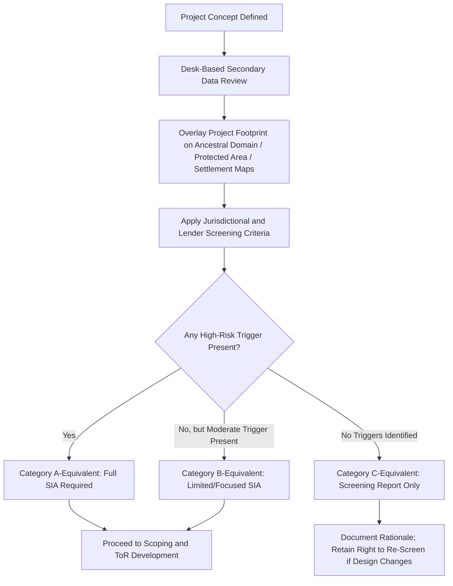
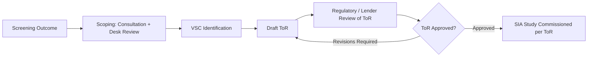

## Screening Criteria and Terms of Reference


### Overview

Screening and Terms of Reference (ToR) formulation are the two gatekeeping instruments that determine the shape, cost, and legal defensibility of an entire Social Impact Assessment before substantive fieldwork begins. Screening answers *whether and how rigorously* an SIA is required; the ToR answers *exactly what that SIA must study and how*. Errors made at this stage — an under-inclusive screening decision or a vague ToR — propagate through every subsequent stage and are difficult or costly to correct later.

### Key Points

- Screening is a threshold/categorization decision; ToR is a scope-and-method specification. They are sequential but frequently iterate against each other.
- Screening criteria are drawn from multiple, sometimes overlapping, legal sources: domestic EIA/SIA law, sector-specific regulation, and lender/financier safeguard policy — the most stringent applicable standard typically governs.
- A ToR is a contractually and regulatorily binding document; deviation from an approved ToR during the actual SIA can trigger rejection at the review stage.
- Both instruments must explicitly address vulnerable groups and Indigenous Peoples' ancestral domain overlap at the earliest possible point, not deferred to later stages.

### Screening: Purpose and Function

Screening determines three things:

1. **Whether an SIA is required at all** (some minor, low-risk projects may be exempted).
2. **The level of rigor required** (rapid/limited SIA versus full/comprehensive SIA).
3. **Which specialized instruments are triggered** (e.g., a Resettlement Action Plan, an Indigenous Peoples Plan, a Cultural Heritage Impact Assessment) in addition to the general SIA.

### Screening Criteria Categories

**1. Project-Based Criteria**

- **Project type/sector** — certain sectors carry presumptive high social risk (extractives, large dams/hydropower, major linear infrastructure such as transmission lines or highways, large-scale agribusiness/land conversion).
- **Project scale** — thresholds commonly expressed in capacity (MW), area (hectares), population displaced, or capital investment value.
- **Physical footprint characteristics** — length of linear infrastructure, number of parcels requiring land acquisition.

**2. Location-Based Criteria**

- **Overlap with ancestral domains** — presence of Certificate of Ancestral Domain Title (CADT) areas or NCIP-recognized/claimed Indigenous territories (Philippine context) or equivalent Indigenous/tribal land recognition elsewhere.
- **Proximity to protected areas, critical habitats, or legally recognized cultural heritage sites.**
- **Population density and settlement pattern** in the Zone of Influence, including informal settlements without secure tenure.
- **Presence of internationally or nationally recognized vulnerable groups** — persons with disabilities, elderly-headed households, female-headed households, ethnic/religious minorities, informal/undocumented residents.

**3. Impact-Based Criteria**

- **Physical displacement potential** (relocation of dwellings) versus **economic displacement potential** (loss of livelihood/land-based income without relocation) — these trigger different specialized instruments (RAP/LRP) and are assessed separately even at screening stage.
- **Induced impact potential** — likelihood of significant labor in-migration, boomtown effects, or secondary economic disruption.
- **Reversibility** — whether anticipated impacts are temporary/reversible or permanent/irreversible.

**4. Institutional/Financing-Based Criteria**

- **Lender categorization requirements** — e.g., IFC Performance Standards and World Bank ESS use a Category A/B/C(FI) risk-tiering system tied explicitly to screening outcomes; Category A projects (significant, diverse, irreversible impacts) mandate full SIA/ESIA with expanded disclosure and consultation requirements, while Category B (limited, reversible, site-specific) may permit a more limited assessment.
- **Equator Principles** adoption by the financing institution, which incorporates IFC PS by reference for private-sector lending.

### Screening Decision Matrix (Illustrative Structure)

| Criterion | Low Risk (Category C-equivalent) | Moderate Risk (Category B-equivalent) | High Risk (Category A-equivalent) |
| --- | --- | --- | --- |
| Ancestral domain overlap | None | Adjacent/buffer zone only | Direct overlap confirmed |
| Physical displacement | None | <10 households | ≥10 households or any Indigenous household |
| Economic displacement | Negligible | Localized, reversible | Widespread, livelihood-dependent population |
| Cultural heritage presence | None identified | Unconfirmed, requires field verification | Confirmed tangible/intangible heritage sites |
| SIA requirement | Screening report sufficient; no further study | Limited/focused SIA on identified VSCs | Full SIA + specialized instruments (RAP/IPP/CHIA) |

[Inference] The specific thresholds shown (e.g., "<10 households") are illustrative rather than universal; actual numeric thresholds are set by the specific applicable regulation or lender policy and vary considerably across jurisdictions and financing sources.

### Screening Process Flow



**Critical safeguard:** Screening is not a one-time determination. Any material change in project design, location, or scale after initial screening should trigger re-screening — a frequent compliance failure occurs when a project is re-routed or expanded post-approval without revisiting the original screening decision.

### Terms of Reference (ToR): Purpose and Function

The ToR is the technical specification document that defines exactly what the subsequent SIA study must cover, how, and to what standard. It functions simultaneously as:

- A **regulatory submission** (often requiring approval by the environmental/social authority before fieldwork begins).
- A **procurement instrument** (the basis on which SIA consultants are engaged and their deliverables measured).
- A **disclosure and accountability tool** (affected communities and civil society can reference the approved ToR to hold the proponent accountable to committed scope).

### Standard ToR Structure and Content

**1. Background and Project Description**

- Project rationale, location, technical description, phasing, and construction/operation timeline.
- Legal and policy context triggering the SIA requirement (citing the specific screening outcome and applicable regulation/standard).

**2. Objectives of the SIA**

- Explicit statement of what the assessment must achieve — typically: establish baseline, predict impacts, design mitigation, and establish a monitoring framework.

**3. Scope of Work**

- **Geographic scope** — precise definition of the Zone of Influence (ZOI), distinguishing directly affected, indirectly affected, and cumulatively affected areas.
- **Temporal scope** — project phases to be covered (pre-construction, construction, operation, decommissioning).
- **Valued Social Components (VSCs) to be assessed** — explicit list (e.g., livelihoods, cultural heritage, gender relations, health, Indigenous Peoples' rights, in-migration), with justification for any VSC explicitly excluded.
- **Specialized instruments to be prepared** — e.g., whether a standalone RAP, IPP, or CHIA is required in addition to the core SIA, as determined at screening.

**4. Methodology Requirements**

- Required baseline data collection methods (household survey sample size/methodology, KII/FGD protocols, participatory mapping requirements).
- Requirements for FPIC process where Indigenous Peoples are affected, referencing the applicable statutory procedure (e.g., NCIP AO 3-2012 in the Philippine context).
- Data disaggregation requirements (by sex, age, ethnicity, disability status, tenure status).
- Requirements for stakeholder engagement, including minimum consultation rounds and disclosure requirements.

**5. Deliverables and Reporting Requirements**

- Specification of required outputs (Scoping Report, Baseline Report, Draft/Final SIA Report, SIMP, Monitoring Framework) and required format/language(s), including translation requirements for affected communities.

**6. Institutional Arrangements**

- Composition/qualifications required of the SIA study team (e.g., requirement for social scientists with demonstrated experience engaging Indigenous communities).
- Roles of proponent, regulator, and any independent panel or third-party reviewer.

**7. Schedule and Budget**

- Study timeline, aligned realistically with the community deliberation timeframes required for genuine FPIC (not compressed to fit construction schedules).

**8. Disclosure and Grievance Provisions**

- Requirements for public disclosure of the draft ToR itself and mechanisms for stakeholder comment on the ToR before it is finalized.

### Scoping-to-ToR Linkage

The ToR is not drafted in isolation; it is the formal output of the scoping exercise (see the SIA lifecycle stages), meaning early consultation findings during scoping should directly shape which VSCs the ToR mandates for study. A ToR drafted purely from desk review, without a scoping-stage consultation input, risks omitting locally salient issues that only emerge from community engagement.



### Example: Condensed ToR Excerpt (Illustrative)

```markdown
## Terms of Reference: Social Impact Assessment
### [Project Name] — [Location]

**1. Screening Basis**
This SIA is required per [Domestic Regulation X] and [Lender Standard, e.g., IFC PS1/PS5/PS7/PS8],
following a Category A-equivalent screening determination due to confirmed overlap with
[Ancestral Domain Name] per NCIP Field-Based Investigation dated [date].

**2. Valued Social Components (VSCs)**
- Livelihoods and land-based economic activity
- Indigenous Peoples' rights and FPIC compliance (IPRA Sec. 59)
- Cultural heritage (tangible and intangible)
- Gender-differentiated impacts
- In-migration and induced demand on local services
[Excluded: Marine resource dependency — justification: no coastal/marine ZOI overlap confirmed
at screening]

**3. Required Specialized Instruments**
- Indigenous Peoples Plan (IPP)
- Cultural Heritage Impact Assessment (CHIA)
- Resettlement Action Plan (RAP) — contingent on final alignment; to be confirmed post-baseline

**4. Methodology**
- Household survey: minimum [X]% sample of ZOI households, disaggregated by sex, ethnicity, tenure
- FPIC process per NCIP AO No. 3, s. 2012
- Minimum two rounds of public consultation, first round disclosed no later than [X] days
  prior to meeting date, in [local language] and [national language]
```

### Common Failure Modes

- **Screening based solely on project footprint**, ignoring indirect/cumulative Zone of Influence, causing later discovery of unaddressed impacts outside the originally screened area.
- **ToR drafted before scoping consultation is complete**, locking in a VSC list that omits locally significant concerns.
- **Vague ToR language** (e.g., "assess social impacts as appropriate") that provides no enforceable benchmark against which the delivered SIA can be evaluated for completeness.
- **Screening treated as final and immutable**, despite subsequent project design changes that alter risk category.
- **Mismatched rigor** — applying a Category C-equivalent screening outcome to a project that, on closer field verification, has undisclosed ancestral domain overlap.

### Related Topics

- SIA stages from screening to monitoring (full lifecycle context)
- Zone of Influence (ZOI) delineation methodology
- Valued Social Component (VSC) identification techniques
- Category A/B/C risk-tiering under IFC Performance Standards and World Bank ESS
- Free, Prior, and Informed Consent (FPIC) procedural requirements
- Cumulative impact assessment scoping
- Public disclosure and consultation requirements in impact assessment law