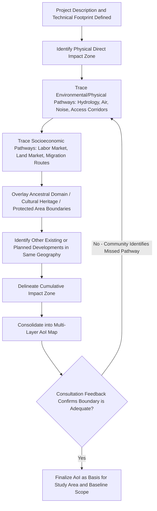

## Defining the Study Area and Area of Influence


### Overview

The Area of Influence (AoI) — also termed Zone of Influence (ZOI) — is the spatial and, implicitly, temporal boundary within which a project's social impacts may plausibly occur. Defining it correctly is arguably the single highest-leverage technical decision in SIA scoping: an AoI drawn too narrowly (typically limited to the physical project footprint) systematically excludes indirect, induced, and cumulative impacts from assessment entirely, while one drawn without clear rationale becomes unmanageable and undermines the credibility of the study. The "study area" is the practical delineation used for baseline data collection and generally should be coextensive with, or deliberately broader than, the AoI.

### Key Points

- The AoI is not equivalent to the project footprint (construction site, right-of-way); it is a functionally defined boundary based on impact pathways, not merely physical proximity.
- IFC Performance Standard 1 (PS1) provides the most widely referenced formal definition and typology of "area of influence," distinguishing several categories that must each be considered separately.
- AoI delineation is not a single static boundary — different impact types (economic, hydrological, migratory, cultural) may have different, overlapping AoIs, sometimes represented as multiple layered boundaries rather than one line on a map.
- Under-scoping the AoI at this stage is the most common root cause of "unanticipated" cumulative and induced impacts discovered later in monitoring.

### The IFC PS1 Area of Influence Typology

The IFC Performance Standard 1 framework, widely adopted or referenced by lenders and national frameworks alike, defines the Area of Influence as encompassing:

**1. Areas encompassing primary project facilities and activities**

- The direct physical footprint: construction sites, permanent structures, access roads, laydown areas, associated transmission/pipeline corridors.

**2. Areas potentially impacted by unplanned but predictable developments caused by the project**

- Often called **induced impacts** — e.g., informal settlement growth along a new access road, spontaneous commercial development near a project gate, secondary in-migration settlements.

**3. Areas potentially affected by cumulative impacts**

- Impacts from the project **in combination with** other existing, planned, or reasonably foreseeable developments in the same geography (e.g., multiple mining concessions drawing on the same watershed and labor market).

**4. Areas potentially affected by impacts from unplanned but predictable developments that may be induced by associated facilities**

- Impacts arising from facilities not built or operated by the primary project proponent but that exist specifically to serve the project (e.g., a private port or power line built by a third party solely to service the project).

[Inference] This four-part typology is drawn directly from IFC PS1 guidance language; practitioners operating under a different national framework should verify whether their governing regulation adopts this exact typology or a jurisdiction-specific variant, since terminology (e.g., "study area," "impact zone") is not perfectly standardized across frameworks.

### Distinguishing Direct, Indirect, Induced, and Cumulative Impact Zones

| Zone Type | Definition | Illustrative Example |
| --- | --- | --- |
| Direct impact zone | Physical footprint and immediately adjacent land requiring acquisition or access restriction | Villages within the transmission line right-of-way |
| Indirect impact zone | Areas affected by project operations without physical footprint overlap | Downstream communities affected by altered river flow from a hydropower intake |
| Induced impact zone | Areas experiencing secondary development caused by project presence | Informal settlements emerging along a newly paved access road |
| Cumulative impact zone | Areas where this project's impacts combine with impacts of other developments | A regional labor market and housing stock strained by multiple simultaneous projects |

### AoI Delineation Process



**Critical procedural point:** AoI delineation should not be finalized purely through desk-based GIS analysis. Early community consultation frequently reveals impact pathways invisible to external technical analysis alone (e.g., seasonal grazing routes crossing the project footprint, a customary trading route disrupted by a new road alignment) — this is why the flow above includes a consultation-verification loop before finalization.

### Defining Boundaries by Impact Pathway (Not Distance Rings)

A frequent methodological error is defining the study area as a simple radius (e.g., "all communities within 5 km") without reference to actual impact pathways. A more defensible approach traces the **mechanism of impact** and lets that mechanism define the boundary, which is often irregular and non-concentric:

- **Hydrological pathway** — watershed/catchment boundary, not a radius; a downstream community 20 km away may be within the AoI while an upstream community 500 m away is not.
- **Land acquisition pathway** — parcel-level boundary tied to the specific land required, plus any economically dependent parcels (e.g., tenant farmers on adjacent land who lose access via the acquired parcel).
- **Labor in-migration pathway** — bounded by realistic commuting/settlement distance from the project gate and existing transport infrastructure, informed by comparable projects' documented in-migration patterns.
- **Cultural/ritual pathway** — bounded by the functional range of the practice itself (e.g., a sacred site's AoI may include a much larger surrounding area if noise or vibration is understood by the community to affect ritual efficacy, even without physical encroachment).

### Multi-Layer AoI Representation

Because different impact types have genuinely different spatial extents, best practice represents the AoI as a set of overlapping layers rather than a single boundary line:



```
Layer 1 — Physical Footprint (narrowest)
Layer 2 — Direct Land Acquisition / Access Restriction Zone
Layer 3 — Indirect Environmental Pathway Zone (hydrology, noise, air)
Layer 4 — Induced Development Zone (along access corridors)
Layer 5 — Cumulative Impact Zone (regional, shared with other developments)
Layer 6 — Ancestral Domain / Cultural Heritage Overlay (may extend beyond all other layers)
```

[Inference] Layer 6 is listed as potentially the most extensive because cultural/spiritual significance boundaries are determined by the community's own framework of meaning and do not necessarily correlate with physical or environmental impact pathways — this reflects general practice guidance rather than a fixed rule, since actual extent is case-specific.

### Study Area vs. Area of Influence

| Aspect | Area of Influence (AoI) | Study Area |
| --- | --- | --- |
| Function | Analytical/legal boundary defining where impacts are assessed | Practical boundary for data collection (surveys, baseline studies) |
| Determination basis | Impact pathway analysis | Often AoI plus a buffer/margin for comparative "control" data |
| Flexibility | Can be refined iteratively through the SIA process | Fixed once baseline fieldwork begins (for methodological consistency) |
| Typical relationship | — | Should be ⊇ AoI; narrower study area than AoI is a scoping deficiency |

A well-designed study area often deliberately extends slightly beyond the AoI to capture **comparison/control area data** — enabling later monitoring to distinguish project-attributable change from broader regional trends (e.g., regional inflation, national migration patterns) that would have occurred regardless of the project.

### Practical Documentation Requirements

A defensible AoI/study area definition, as documented in the Scoping Report or ToR, should include:

- A **GIS-based map** showing all relevant layers (footprint, land acquisition, environmental pathway zones, ancestral domain overlays, other developments).
- **Explicit justification** for each boundary — tied to a stated impact mechanism, not an arbitrary distance.
- **Explicit identification of other developments** considered in the cumulative impact zone, including their status (existing, under construction, planned/permitted, reasonably foreseeable).
- A statement of **temporal scope** alongside the spatial scope — since the AoI itself may expand during operations phase relative to construction phase (e.g., in-migration effects may only manifest once operational employment begins).

### Common Failure Modes

- **Footprint-only delineation** — treating the AoI as synonymous with the land acquisition boundary, systematically excluding indirect, induced, and cumulative impacts from the entire subsequent assessment.
- **Static, single-boundary maps** — collapsing genuinely distinct impact pathways (hydrological, migratory, cultural) into one uniform radius, obscuring where the real risk concentrations lie.
- **Omitting cumulative context** — assessing the project in isolation when multiple developments share the same watershed, labor market, or ancestral domain, understating aggregate community-level impact.
- **No consultation-based verification** — finalizing the AoI purely from remote GIS/desk analysis without checking it against community-reported impact pathways (grazing routes, trade routes, ritual travel patterns) that are invisible to external technical review.
- **Study area narrower than AoI** — collecting baseline data only within the (already too-narrow) footprint, making it structurally impossible to later measure indirect or induced impacts during monitoring, since no baseline exists for the areas where those impacts eventually manifest.

### Related Topics

- Social impact assessment stages from screening to monitoring (lifecycle placement of AoI definition)
- Screening criteria and terms of reference (upstream inputs to AoI scoping)
- Cumulative impact assessment methodology
- Valued Social Component (VSC) identification
- Baseline social profiling and control/comparison area design
- GIS-based participatory mapping techniques
- Indigenous knowledge and cultural heritage protocols (ancestral domain overlay considerations)