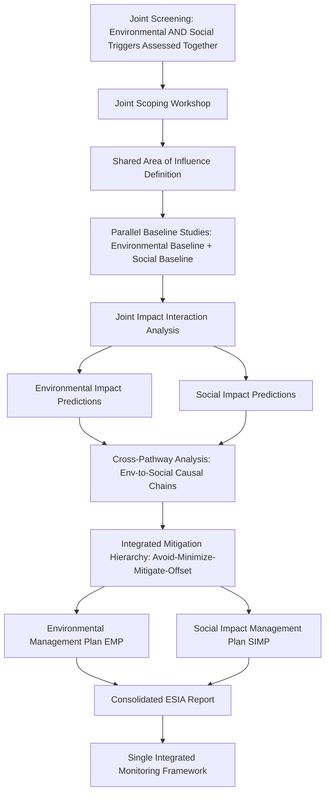

## Integrating Social Impact Assessment within Broader ESIA Processes

### Overview

Environmental and Social Impact Assessment (ESIA) is the composite instrument most lenders, regulators, and multilateral frameworks now require, combining biophysical/environmental assessment with social assessment into a single, coordinated study rather than two parallel, disconnected documents. Integration is not merely administrative bundling — environmental and social impacts are frequently causally linked (e.g., land acquisition is simultaneously an environmental land-use change and a social displacement event), and a poorly integrated ESIA systematically under-analyzes these interaction effects. This item addresses how the SIA workstream is structurally, procedurally, and analytically integrated into the broader ESIA.

### Key Points

- ESIA is not "EIA plus an SIA appendix" — proper integration requires shared scoping, shared area-of-influence definition, and explicit analysis of environment-society interaction pathways, not sequential, siloed studies.
- Many environmental impacts have direct social pathways (e.g., water quality change → health impact; deforestation → loss of forest-dependent livelihood), and these interaction pathways are often where the most significant, and most frequently missed, impacts occur.
- Institutional practice varies: some jurisdictions/lenders mandate a single integrated ESIA report; others permit or require a standalone SIA alongside an EIA, with cross-referencing obligations.
- The social specialist's role must be embedded from the earliest scoping stage, not brought in late to "add a social chapter" to an already-drafted environmental study.

### Why Integration Matters: The Causal Linkage Problem

Treating environmental and social assessment as separate, non-interacting tracks produces systematic blind spots because many impact chains cross the environment-society boundary:

| Environmental Change | Social Pathway | Social Impact |
| --- | --- | --- |
| Altered river flow/water quality (hydropower, mining) | Loss of fishing/irrigation water | Livelihood loss, food insecurity |
| Deforestation/land clearing | Loss of forest products, medicinal plants, hunting grounds | Livelihood loss, cultural practice disruption |
| Air/dust emissions | Respiratory health effects | Health impact, potential displacement pressure |
| Noise/vibration | Disruption to livestock, wildlife hunting patterns | Livelihood impact; also potential ritual/spiritual impact near sacred sites |
| Land-take/vegetation clearance | Loss of grazing commons | Conflict over remaining resources, elite capture risk |
| In-migration of workforce (itself induced by the project) | Housing/land price inflation, service strain | Displacement of existing low-income residents ("secondary displacement") |

An ESIA that assesses "water quality" purely as a biophysical parameter and "livelihoods" purely through household survey data, without an explicit analytical link between the two, will systematically undercount impacts that only manifest through this causal chain.

### Institutional Models for Integration

**Model A: Single Integrated ESIA Team and Report**

- One consolidated study team, jointly scoped, with environmental and social specialists co-located throughout baseline, prediction, and mitigation stages.
- Single ESIA report with integrated chapters analyzing environment-society interactions explicitly (rather than a purely biophysical chapter followed by a purely social chapter).
- This is the model most strongly favored by IFC Performance Standards and World Bank ESS framework guidance. [Inference] "Most strongly favored" reflects the general orientation of these frameworks toward integrated assessment rather than a single explicit universal mandate applicable to every project category under every version of these standards; practitioners should verify the specific applicable ESS/PS text for the project's exact categorization.

**Model B: Parallel EIA and SIA with Mandatory Cross-Referencing**

- Separate environmental and social study teams and reports, common in jurisdictions where EIA law predates SIA requirements and the two remain governed by different statutory instruments.
- Cross-referencing protocol required: the SIA must formally reference and respond to EIA findings (e.g., predicted water quality changes) and vice versa, and a designated **integration/synthesis chapter or matrix** consolidates cross-cutting impacts.
- Higher risk of the causal-linkage blind spot described above if cross-referencing is treated as a formality rather than substantive joint analysis.

**Model C: SIA as a Specialized Annex within a Broader ESIA**

- Single ESIA document, but the social assessment is structured as a standalone, more detailed annex (common where specialized instruments like an Indigenous Peoples Plan or Resettlement Action Plan are required, since these have their own distinct legal triggers and content requirements).

### Structural Integration Points Across the SIA/EIA Lifecycle

**Key integration checkpoints highlighted in the flow above:**

- **Joint screening** — a project may screen as low-risk environmentally but high-risk socially (e.g., minimal habitat disturbance but significant ancestral domain overlap), or vice versa; screening these separately risks one track under-triggering rigor that the other track would have flagged.
- **Shared Area of Influence** — environmental and social AoIs are frequently non-identical (a watershed boundary versus a labor-market catchment), but both must be mapped and reconciled jointly rather than each specialist working from a boundary the other never sees.
- **Cross-pathway analysis** — the analytical step most often skipped in poorly integrated ESIAs; this requires the environmental and social specialists to jointly review predicted biophysical changes and explicitly trace which, if any, have a social consequence pathway.
- **Single monitoring framework** — environmental and social indicators should be tracked through one coordinated system so that, for example, a water-quality monitoring trigger automatically flags a review of downstream livelihood/health indicators.

### Analytical Techniques for Cross-Pathway Integration

**1. Impact Interaction Matrix**

A structured matrix crossing each predicted environmental change against each Valued Social Component (VSC), used to systematically surface interaction pathways that might otherwise be missed by specialists working in isolation.

| Environmental Change → | Water quality | Air quality | Land cover | Noise |
| --- | --- | --- | --- | --- |
| Livelihoods (VSC) | High interaction | Moderate | High | Low |
| Health and wellbeing (VSC) | High | High | Low | Moderate |
| Cultural heritage (VSC) | Moderate | Low | High | High (near sacred sites) |
| Gender relations (VSC) | Moderate (water-fetching burden) | Low | Moderate | Low |

**2. Joint Field Missions**

Environmental and social baseline data collection conducted concurrently in the same communities/sites, rather than sequential separate visits, reduces community consultation fatigue and enables real-time cross-disciplinary observation (e.g., a social researcher noting a community-identified water source that the environmental team had not sampled).

**3. Integrated Significance Rating**

Rather than each discipline independently rating impact significance, an integrated ESIA applies a joint significance methodology that accounts for compounding effects — an environmental impact rated "moderate" in isolation may warrant a higher combined significance rating once its social consequence pathway (e.g., livelihood loss for an already-vulnerable population) is factored in.

### Governance and Team Structure Requirements

- **Social specialist involvement from Stage 1 (screening)**, not introduced only once the EIA scope is fixed — late entry structurally forecloses the specialist's ability to influence AoI definition and baseline design.
- **Joint sign-off requirement** on the Terms of Reference, scoping report, and significance ratings, rather than the social chapter being reviewed only by a social specialist and the environmental chapters only by environmental specialists.
- **Single Grievance Redress Mechanism (GRM)** covering both environmental and social grievances (e.g., a complaint about dust nuisance is simultaneously an environmental and a health/wellbeing/social matter and should not require the complainant to identify which "track" their grievance belongs to).
- **Coordinated disclosure** — a single public consultation process disclosing both environmental and social findings together, rather than communities being consulted twice on artificially separated documents describing the same project.

### Common Failure Modes

- **Sequential drafting** — environmental study completed first, social study commissioned afterward and required to "fit" an already-fixed AoI and schedule, foreclosing genuine integration.
- **Siloed specialist teams with no joint field time**, producing baseline datasets that cannot be cross-referenced because they were collected using non-comparable methods, timeframes, or geographic units.
- **Interaction pathways omitted from the impact prediction matrix** — environmental and social impact tables produced independently with no explicit cross-pathway row/column, silently dropping the compounding effects most likely to be significant.
- **Duplicate, inconsistent consultation processes** — communities consulted separately on "the environmental study" and "the social study" referencing the same project, causing confusion, consultation fatigue, and inconsistent information disclosure.
- **Fragmented monitoring** — separate environmental and social monitoring systems that never trigger cross-review, so a measurable environmental change (e.g., declining water quality) does not automatically prompt reassessment of the dependent social indicators (health, livelihoods).

### Related Topics

- Social impact assessment stages from screening to monitoring
- Defining the study area and area of influence (shared AoI methodology)
- Screening criteria and terms of reference (joint screening design)
- Cumulative impact assessment methodology
- Valued Social Component (VSC) identification and impact interaction matrices
- Grievance Redress Mechanism (GRM) design for combined environmental-social complaints
- IFC Performance Standards and World Bank Environmental and Social Standards (ESS) framework structure