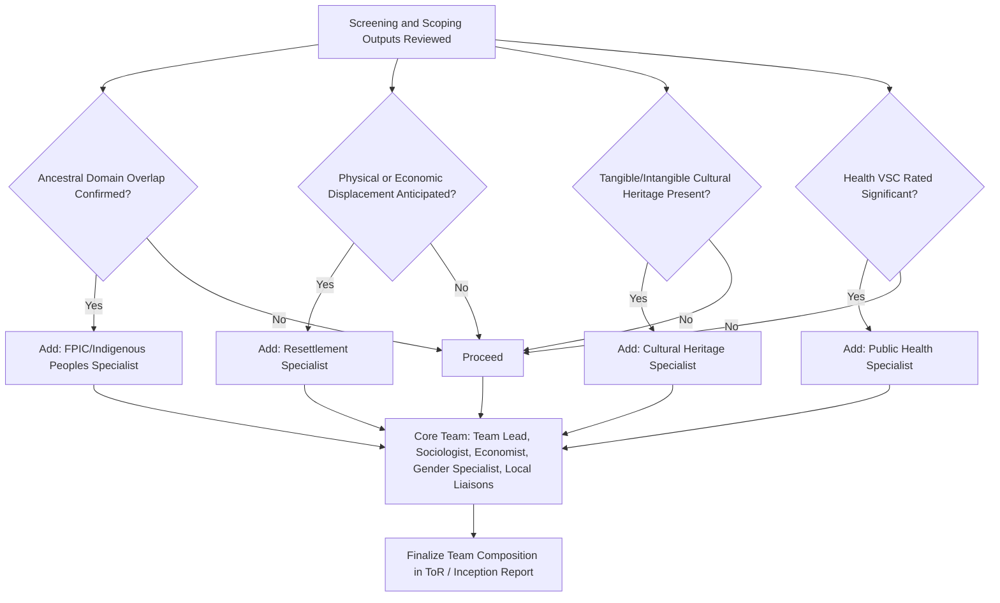

## Assembling a Qualified Social Impact Assessment Team

### Overview

The composition, qualifications, and internal governance of an SIA study team is itself a scoping-stage decision with direct legal and analytical consequences: lenders and regulators increasingly require documented evidence of team competency as a precondition for ToR approval, and a poorly composed team is one of the most common root causes of SIA quality failures identified in post-project audits. Team assembly is not merely a staffing/logistics task — it is a technical design decision that should be specified in the ToR itself and defended during regulatory/lender review.

### Key Points

- SIA is inherently multidisciplinary; no single professional background (sociology, anthropology, economics, or law) is sufficient on its own to competently cover the full VSC range.
- Team composition requirements are increasingly formalized in lender safeguard policy (e.g., IFC PS requirements for "competent professionals"), not left to proponent discretion.
- Local and cultural competency — including language fluency and, where Indigenous Peoples are affected, demonstrated experience with FPIC processes — is treated as a qualification requirement, not an optional enhancement.
- Independence and conflict-of-interest management are as important as technical competency; a team perceived by communities as unduly aligned with the proponent undermines the credibility of the entire consultation record.
- Team gender composition is itself a technical requirement in most current frameworks, not an incidental HR consideration, because it directly affects the team's ability to engage women respondents on gender-sensitive topics.

### Core Disciplinary Roles

**1. Team Lead / Social Impact Specialist**

- Overall responsibility for study design, methodology, quality assurance, and final report integration.
- Typically requires demonstrated prior experience leading SIAs of comparable scale/sector, often a specific credential or years-of-experience threshold in lender terms of reference.

**2. Sociologist / Social Anthropologist**

- Baseline social organization mapping, cultural analysis, community governance structure identification.
- Particularly critical where Indigenous Peoples or distinct ethnic/cultural groups are present in the AoI — anthropological training specifically equips this role to identify customary governance structures accurately (avoiding the "elite capture" failure mode where formal political leaders are mistaken for customary authority).

**3. Economist / Livelihoods Specialist**

- Household income/livelihood baseline design, economic displacement impact quantification, cost-benefit and compensation valuation methodology (particularly critical where a Resettlement Action Plan or Livelihood Restoration Plan is triggered).

**4. Resettlement Specialist** (where RAP is triggered)

- Distinct, specialized competency separate from general social impact expertise; resettlement planning has its own body of practice (entitlement matrices, replacement-cost valuation, livelihood restoration monitoring) that a generalist social scientist may not hold.

**5. Gender Specialist**

- Design and oversight of gender-disaggregated data collection, gender-sensitive consultation methodology (e.g., women-only focus groups where cultural norms require this), and gender-differentiated impact analysis.

**6. Indigenous Peoples / FPIC Specialist**

- Required wherever ancestral domain overlap is confirmed at screening; must hold demonstrated experience with the specific applicable statutory FPIC procedure (e.g., NCIP AO 3-2012 in the Philippine context), not merely general Indigenous-issues familiarity.

**7. Cultural Heritage Specialist**

- Required where tangible/intangible cultural heritage sites are identified; often an archaeologist, heritage conservation specialist, or cultural anthropologist depending on whether tangible physical heritage or intangible practices (or both) predominate.

**8. Health Specialist** (where health VSC is significant)

- Public health background for assessing health-impact pathways, particularly relevant where induced in-migration, water/sanitation changes, or occupational health issues are anticipated.

**9. Local/Community Liaison Officers**

- Community-based personnel, often recruited from or embedded within the affected communities themselves, providing continuous local presence, trust-building, and cultural/linguistic bridging that a periodically-visiting external team cannot replicate.

**10. GIS/Data Specialist**

- Participatory mapping support, Area of Influence spatial analysis, integration of social baseline data with environmental/technical project data.

### Team Composition Decision Framework

### Qualification and Competency Requirements

| Role | Minimum Competency Indicators (Illustrative) |
| --- | --- |
| Team Lead | Demonstrated leadership of ≥2–3 comparable-scale SIA/ESIA studies; familiarity with applicable lender safeguard standards |
| Sociologist/Anthropologist | Formal training in social science methods; documented field experience with the specific ethnic/cultural groups present, where feasible |
| FPIC/IP Specialist | Direct prior experience conducting the specific statutory FPIC procedure applicable in the jurisdiction; ideally fluency or working familiarity with the affected community's language |
| Resettlement Specialist | Demonstrated experience preparing RAPs/LRPs compliant with the applicable standard (IFC PS5, World Bank ESS5, or domestic equivalent) |
| Local Liaison Officers | Local language fluency; community trust/standing (often assessed through community input on hiring, not solely CV review) |

[Inference] The specific numeric/credential thresholds shown above (e.g., "≥2–3 comparable-scale studies") are illustrative benchmarks reflecting common lender ToR language patterns rather than a single universal, codified requirement; actual thresholds are set by the specific governing lender policy or domestic regulation and should be verified against that source.

### Independence and Conflict of Interest Safeguards

- **Disclosure of prior/concurrent relationships** between team members and the project proponent, particularly relevant where the same consulting firm has an ongoing commercial relationship with the proponent beyond the SIA contract.
- **Community-facing transparency about team affiliation** — communities should be clearly informed whether the team is engaged by the proponent, an independent third party, or the regulator, since this affects how community members may calibrate trust and candor in disclosures.
- **Independent review/validation mechanism** — particularly for Category A-equivalent (high-risk) projects, lenders frequently require an independent panel or third-party reviewer distinct from the primary study team to validate findings, especially FPIC process integrity.
- **Local liaison officer selection process** — ideally involving community input or endorsement in the selection of local liaison staff, since externally-imposed liaison staff perceived as proponent loyalists can undermine the community's trust in the entire engagement process.

### Gender Composition of the Team Itself

A frequently under-specified requirement: the **gender balance of the study team**, not merely the gender-disaggregation of the data it collects, is a substantive methodological factor. In many cultural contexts, women respondents will not disclose gender-sensitive information (health, intra-household decision-making, experiences of violence or harassment) to a male interviewer, regardless of the interviewer's technical competence. Consequently:

- ToRs increasingly specify a minimum proportion of female team members, particularly among those conducting direct household-level or women-focused consultation.
- Where women-only focus group discussions are planned as part of methodology, they should be facilitated by female team members.

### Language and Cultural Competency Requirements

- **Professional interpretation/translation capacity** embedded within the team itself, rather than relying on ad hoc, project-affiliated interpreters (whose neutrality communities may reasonably question).
- Where multiple distinct linguistic or ethnic groups are present within the AoI, the team composition should reflect that diversity rather than assuming a single liaison/interpreter can adequately serve all groups.

### Institutional/Contracting Considerations

- **ToR-embedded team specification** — as addressed in the ToR content itself, the required team composition and minimum qualifications should be specified as a condition of the SIA contract, not left to the discretion of whichever consulting firm is engaged.
- **Continuity requirements** — given that SIA is a multi-year, cyclical process (screening through post-closure monitoring), ToRs increasingly require documented continuity plans for at least the Team Lead and local liaison roles across project phases, since community trust built during baseline studies is difficult to rebuild if the entire team is replaced before monitoring begins.

### Common Failure Modes

- **Single-discipline teams** — engaging only an economist or only a sociologist, producing a study that is methodologically strong in one dimension (e.g., livelihood quantification) but structurally blind to others (e.g., cultural heritage, gender dynamics).
- **Absent specialist triggers ignored** — proceeding without a dedicated FPIC/Indigenous Peoples specialist or Resettlement Specialist despite screening having confirmed the relevant trigger, often due to cost-cutting at the team-assembly stage.
- **All-male or externally-imposed teams** in contexts requiring gender-sensitive or culturally-embedded engagement, resulting in systematic under-collection of data from women or from Indigenous community members who do not trust an unfamiliar external team.
- **No independence safeguards documented**, leaving the study vulnerable to credibility challenges during regulatory review or community grievance processes.
- **Discontinuity between baseline and monitoring teams**, eroding the community relationships and contextual knowledge built during earlier stages and undermining data comparability over time.

### Related Topics

- Screening criteria and terms of reference (team composition as a ToR requirement)
- Indigenous knowledge and cultural heritage protocols (FPIC specialist competency requirements)
- Integrating social impact assessment within broader ESIA processes (joint environmental-social team structure)
- Gender-sensitive consultation methodology design
- Resettlement Action Plan (RAP) specialist requirements
- Grievance Redress Mechanism (GRM) staffing and independence considerations
- Stakeholder engagement planning and local liaison officer selection