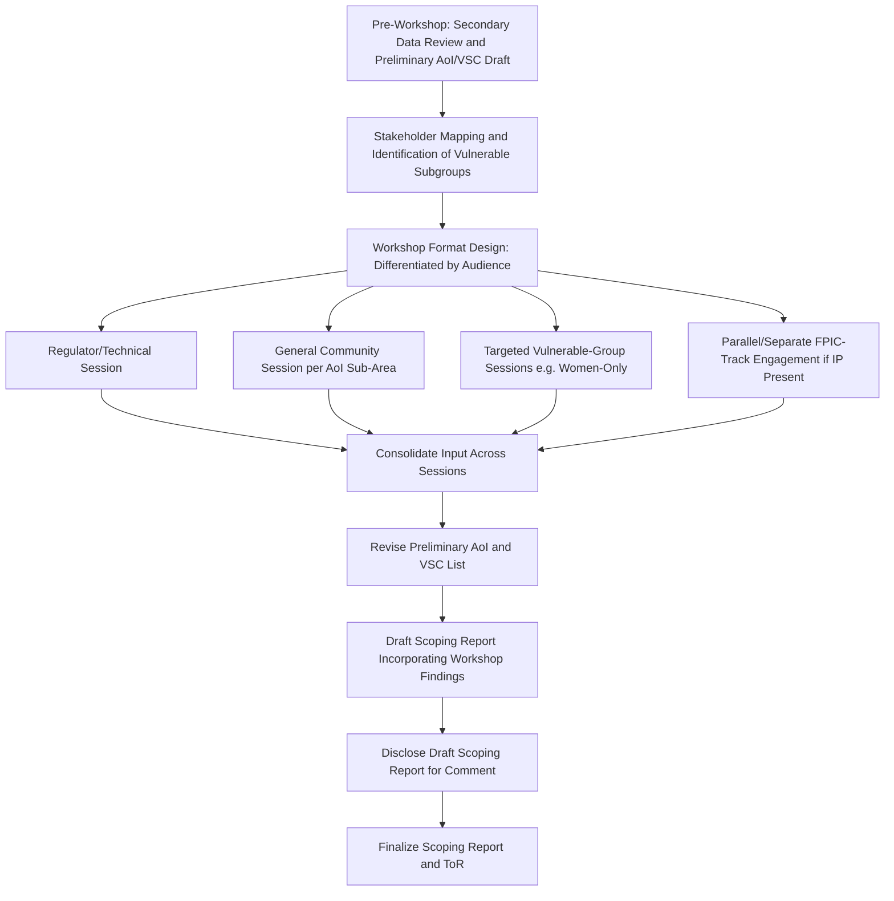

## Scoping Workshops with Stakeholders and Regulators


### Overview

The scoping workshop is the primary participatory mechanism through which desk-based scoping analysis is tested, corrected, and expanded by the people who will actually experience project impacts and by the regulatory authorities responsible for approving the study. It functions as both a technical input-gathering exercise and a formal disclosure/procedural milestone, and in most frameworks its record becomes part of the regulatory submission itself. A poorly designed scoping workshop — one that merely informs rather than genuinely solicits and incorporates input — undermines the legitimacy of everything the ToR subsequently specifies.

### Key Points

- Scoping workshops serve two distinct audiences with different objectives: affected communities/stakeholders (substantive input on VSCs and concerns) and regulators/lenders (procedural verification that adequate early consultation occurred).
- The workshop record is often a required annex to the ToR or Scoping Report and may be scrutinized during regulatory review or later grievance processes as evidence of process adequacy.
- Workshop design must account for who is structurally excluded by a single, centrally-located, single-language event — a generic workshop format frequently fails to reach women, Indigenous groups, informal settlers, and other vulnerable subgroups.
- Where Indigenous Peoples are affected, general public scoping workshops do not substitute for the distinct, legally mandated FPIC process; they are complementary but procedurally separate.

### Objectives of the Scoping Workshop

1. **Validate or revise the preliminary Area of Influence** using local knowledge of impact pathways not visible in desk review.
2. **Surface locally salient Valued Social Components (VSCs)** that external technical analysis alone would miss.
3. **Identify stakeholder groups and vulnerable subgroups** requiring differentiated engagement approaches later in the SIA.
4. **Disclose the project concept and anticipated study process** transparently, establishing the baseline information from which informed community input can occur.
5. **Fulfill procedural/regulatory disclosure requirements** — many frameworks require documented evidence of early, meaningful stakeholder engagement at the scoping stage as a precondition for ToR approval.
6. **Build the stakeholder engagement foundation** for the remainder of the SIA lifecycle, establishing initial trust, communication channels, and grievance-mechanism awareness.

### Participant Categories

| Category | Role in Workshop | Design Implication |
| --- | --- | --- |
| Regulatory authorities | Verify procedural adequacy; provide guidance on statutory requirements | Often a separate, more technical session distinct from community sessions |
| Project proponent representatives | Disclose project information; receive input | Should not dominate facilitation — risk of undue influence perception |
| Affected community members (general) | Provide local knowledge, raise concerns, identify VSCs | Requires accessible, non-technical format; multiple sessions across the AoI |
| Indigenous Peoples/ICC representatives | Provide input on ancestral domain concerns | Distinct FPIC-track engagement runs in parallel, per statutory procedure — not substituted by general scoping workshops |
| Vulnerable subgroups (women, elderly, PWDs, informal settlers) | Provide differentiated input often missed in general sessions | May require separate, targeted sessions (e.g., women-only groups) |
| Civil society organizations / NGOs | Provide independent perspective, monitoring capacity | Useful for triangulating community input and identifying blind spots |
| Local government units | Provide administrative context, existing development plans (relevant to cumulative impact scoping) | Often a distinct technical coordination session |

### Workshop Process Architecture



**Key design choice reflected above:** disaggregating "the scoping workshop" into multiple differentiated sessions rather than a single generic event. This is not merely a best-practice enhancement — a single centrally-located session, held during working hours, in the project proponent's preferred language, will systematically under-represent women (constrained by domestic/childcare responsibilities), informal or geographically dispersed settlers, and non-dominant-language speakers.

### Logistical Design Considerations

**Timing and Scheduling**

- Scheduled around agricultural calendars, religious observances, and market days relevant to the specific community — a workshop scheduled during peak planting season will systematically exclude farming households.
- Sufficient advance notice (commonly a minimum number of days specified in domestic disclosure regulations) to allow genuine preparation, not merely procedural compliance.

**Venue and Accessibility**

- Physically accessible location, considering transport availability and cost burden on attendees (particularly relevant for geographically dispersed or low-income participants).
- Venue neutrality — avoiding locations perceived as proponent-controlled or politically aligned with one local faction, which can suppress candid participation.

**Language and Format**

- Materials and facilitation in the local language(s), not merely the national/official language.
- Non-text formats (oral presentation, visual aids, maps) supplementing written materials, given variable literacy levels.
- Sufficient time allocated for questions and open discussion, not a one-way information session with token Q&A.

**Documentation**

- Attendance records (with attention to gender/subgroup disaggregation, to later demonstrate representativeness).
- Detailed minutes capturing substantive input, not merely attendance — the workshop record must show that specific concerns raised were subsequently reflected (or explicitly addressed if not adopted) in the Scoping Report.
- Where feasible and consented to, audio/video recording, with attention to any restrictions communities place on recording sensitive discussions.

### Facilitation Considerations

- **Independent or co-facilitation** — using a facilitator not solely employed by the proponent reduces the risk of participants perceiving the session as one-directional persuasion rather than genuine input-gathering.
- **Structured versus open facilitation techniques** — combining structured exercises (e.g., participatory mapping of impact concerns, ranking exercises for VSC prioritization) with open floor discussion, since purely open-floor formats can be dominated by the most vocal or socially powerful participants.
- **Explicit "no" pathway** — as with FPIC processes generally, scoping consultation design should not implicitly assume only affirmative or constructive input; participants should have a clear, documented channel to raise fundamental objections to the project itself, not only refinements to its social assessment scope.

### Distinguishing General Scoping Workshops from FPIC Processes

A critical procedural distinction, particularly relevant where the AoI overlaps ancestral domain: general public scoping workshops are **not a substitute** for the specific, legally mandated FPIC procedure applicable to Indigenous Peoples. The two run on parallel but distinct tracks:

| Dimension | General Scoping Workshop | FPIC Process |
| --- | --- | --- |
| Legal basis | General EIA/SIA disclosure and consultation requirements | Specific statutory instrument (e.g., IPRA/NCIP AO 3-2012) |
| Decision authority | Input-gathering; does not confer or withhold project approval | Consent is a precondition for project proceeding in affected ancestral domain |
| Participants | Open to general public/all stakeholder categories | Specifically the ICC/IP community through recognized customary governance structure |
| Facilitation body | Project proponent or contracted SIA team | Often requires NCIP or equivalent government body presence/validation |

Conflating the two — treating attendance at a general scoping workshop by some Indigenous individuals as satisfying FPIC requirements — is a documented and serious compliance failure mode.

### Example: Simplified Workshop Input Log Structure

```json
{
  "workshop_session_id": "SCOPE-2024-WS-03",
  "session_type": "general_community",
  "location": "[Barangay/Village Name]",
  "date": "2024-XX-XX",
  "attendance": {
    "total": 84,
    "female": 39,
    "male": 45,
    "identified_vulnerable_subgroup_representation": ["elderly", "informal_settlers"]
  },
  "input_items": [
    {
      "issue_raised": "Concern about dust from proposed access road affecting nearby rice drying areas",
      "vsc_category": "livelihoods",
      "disposition": "added_to_vsc_list",
      "action": "Included as impact pathway in draft ToR; air quality-livelihood interaction flagged for joint EIA-SIA analysis"
    },
    {
      "issue_raised": "Request for separate consultation on ancestral burial ground reportedly within footprint",
      "vsc_category": "cultural_heritage",
      "disposition": "escalated",
      "action": "Referred to Field-Based Investigation and CHIA scoping; parallel FPIC-track engagement initiated"
    }
  ]
}
```

### Common Failure Modes

- **Single, generic session treated as sufficient** — no differentiated sessions for vulnerable subgroups, resulting in a scoping record that structurally overrepresents the input of the most mobile, literate, and socially empowered participants.
- **Workshop as one-way disclosure rather than genuine input mechanism** — presentations with minimal time for discussion, no structured mechanism to capture and track disposition of concerns raised.
- **Conflating general consultation with FPIC** — treating Indigenous attendance at a general workshop as satisfying the distinct statutory consent requirement.
- **Poor documentation of concern disposition** — minutes recording that concerns were "raised" without any traceable record of whether/how they were incorporated into the Scoping Report or ToR, undermining accountability and inviting later grievances.
- **Scheduling/logistics that structurally exclude key groups** — sessions held during working hours or planting season, in venues inaccessible to informal settlers or geographically dispersed households, in the national rather than local language.

### Related Topics

- Screening criteria and terms of reference (workshop findings feeding ToR content)
- Defining the study area and area of influence (community input in AoI validation)
- Indigenous knowledge and cultural heritage protocols (distinct FPIC-track requirements)
- Assembling a qualified social impact assessment team (facilitation and independence considerations)
- Stakeholder identification and mapping methodology
- Public disclosure requirements in impact assessment law
- Grievance Redress Mechanism (GRM) design and early establishment