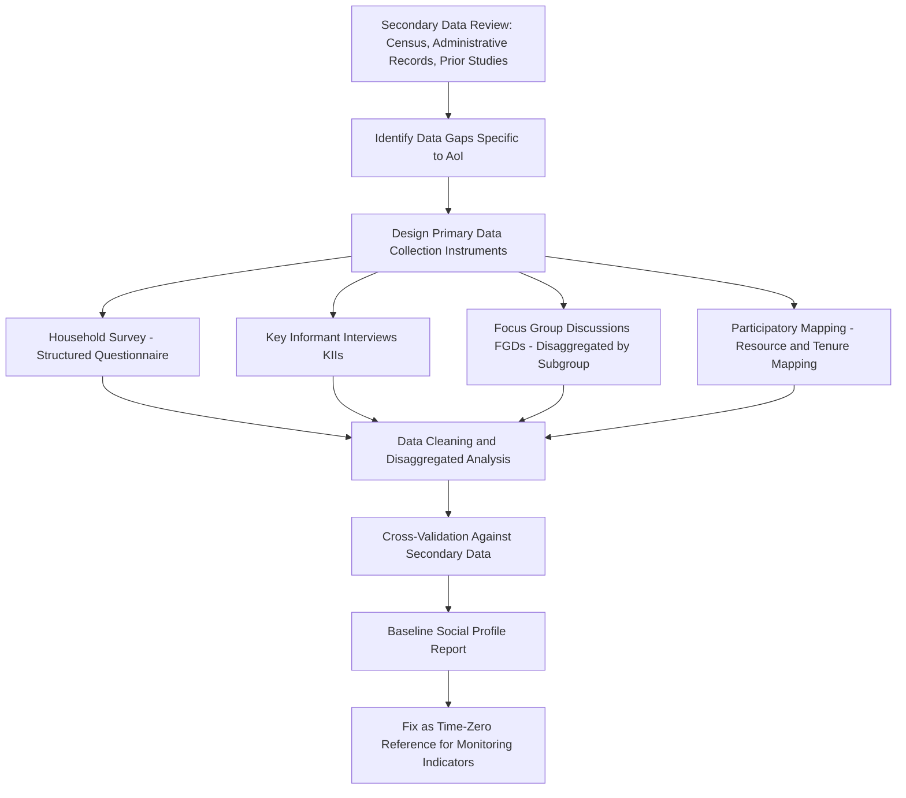

## Demographic and Socioeconomic Profiling

### Overview

Demographic and socioeconomic profiling constitutes the foundational baseline layer of the Social Impact Assessment: it establishes the pre-project condition of the population within the Area of Influence against which all subsequent impact predictions and monitoring measurements are compared. Without a rigorous, disaggregated baseline profile, later claims about project-attributable change (positive or negative) cannot be substantiated, since there is no defensible "before" state to compare against the "after."

### Key Points

- Baseline profiling must precede, not run concurrently with, the finalization of impact predictions — predictions are only as credible as the baseline they are measured against.
- Aggregate/community-level statistics conceal differential conditions; disaggregation by sex, age, ethnicity, tenure status, and disability is a methodological requirement, not an optional refinement.
- Demographic and socioeconomic data serve dual functions: describing the current condition (baseline) and identifying which subgroups are more exposed to or less resilient against anticipated impacts (vulnerability screening).
- Secondary data (census, administrative records) is necessary but insufficient on its own; primary data collection is required to capture project-AoI-specific conditions and locally salient variables that secondary sources do not capture.

### Core Demographic Variables

**Population Structure**

- Total population and household count within the AoI, disaggregated by sub-area (village/barangay/settlement).
- Age-sex population pyramid — identifies dependency ratios and age-specific vulnerability (e.g., high proportion of elderly or children affects resilience to livelihood disruption).
- Household composition — average household size, headship patterns (male-headed, female-headed, child-headed, elderly-headed households), which correlates strongly with differential vulnerability.

**Migration and Settlement Patterns**

- In-migration/out-migration rates and historical trends — establishes the baseline against which project-induced in-migration can later be distinguished from pre-existing trends.
- Settlement tenure — length of residence, formal versus informal land tenure status, which directly determines eligibility and entitlement calculations if resettlement is later triggered.
- Seasonal/circular migration patterns (e.g., seasonal labor migration), which affect both baseline population counts and true income/livelihood profiles if surveyed only at a single point in time.

**Ethnic and Cultural Composition**

- Ethnic/linguistic group composition and geographic distribution within the AoI.
- Identification of any Indigenous Peoples/Indigenous Cultural Communities present, cross-referenced against ancestral domain claims (linking to the dedicated Indigenous knowledge and cultural heritage protocol stream).
- Religious composition, where relevant to identifying differentiated cultural practices or potential intergroup dynamics.

### Core Socioeconomic Variables

**Livelihood and Employment**

- Primary and secondary income sources by household, disaggregated by sector (agriculture, fishing, wage labor, informal trade, remittances).
- Land-based livelihood dependency — proportion of households dependent on land/natural resource access likely to be affected by the project footprint or AoI.
- Employment status, underemployment, and seasonal income variability.

**Income and Poverty Indicators**

- Household income distribution (median and distributional spread, not solely averages, since averages obscure inequality and the position of the most vulnerable households).
- Poverty incidence relative to relevant national/regional poverty thresholds.
- Asset ownership (land, livestock, housing quality, productive equipment) as a wealth/resilience proxy complementing income data.

**Access to Services and Infrastructure**

- Access to potable water, sanitation, electricity, and their reliability/quality (not merely binary presence/absence).
- Access to health facilities (distance, capacity, service quality) and education facilities (enrollment, distance, quality) — establishes baseline capacity against which project-induced in-migration strain can later be measured.
- Transport access and connectivity, relevant both to livelihood activity and to potential induced development along new project-related access routes.

**Land Tenure and Resource Access**

- Land ownership/tenure type (titled, ancestral domain, informal/customary, tenancy arrangements).
- Common property resource access (communal grazing land, forest resources, fishing grounds) — often invisible in individual household land-title records but critical to livelihood and cultural practice.

**Health and Wellbeing Indicators**

- Baseline morbidity patterns and prevalent health conditions relevant to anticipated project impact pathways (e.g., respiratory conditions relevant to anticipated dust/air quality impacts).
- Nutritional status indicators where livelihood/food security impacts are anticipated.

### Mandatory Disaggregation Dimensions

A profiling exercise producing only aggregate/community-level figures fails to serve its core analytical purpose. Standard disaggregation dimensions:

| Dimension | Rationale |
| --- | --- |
| Sex | Differential access to resources, decision-making, and labor market participation; required for gender-differentiated impact analysis |
| Age cohort | Identifies dependency burden, differential exposure (e.g., children's health vulnerability, elderly livelihood resilience) |
| Ethnicity/Indigenous status | Required to identify differentiated cultural, tenure, and legal-protection implications |
| Tenure status | Determines resettlement/compensation eligibility and entitlement category if triggered later |
| Disability status | Identifies population requiring differentiated accessibility and engagement accommodation |
| Household headship type | Female-headed, elderly-headed, and child-headed households often show differentiated resilience and require targeted engagement |
| Income/wealth quintile | Distinguishes differential impact exposure and resilience across the economic spectrum, avoiding "average household" assumptions that obscure the poorest quintile's condition |

### Data Collection Methodology

**Household Survey**

- Sampling methodology must be statistically defensible relative to the AoI population size (commonly stratified random sampling to ensure representation across sub-areas, tenure categories, and vulnerable subgroups, rather than convenience sampling).
- Structured questionnaire covering demographic, income, asset, service-access, and tenure variables, pre-tested for local comprehension and cultural appropriateness before full deployment.

**Key Informant Interviews (KIIs)**

- Local government officials, community leaders, service providers (school/clinic staff), providing contextual and institutional-capacity data that household surveys cannot capture.

**Focus Group Discussions (FGDs)**

- Disaggregated by subgroup (women-only, youth, elderly, occupational groups) to surface differentiated perspectives that mixed-group discussions tend to suppress, particularly on sensitive topics.

**Participatory Mapping**

- Community-led mapping of resource use, tenure boundaries, and commons access, which frequently reveals resource dependencies and boundary understandings absent from formal land records — particularly critical for common property and ancestral domain contexts.

### Establishing the Monitoring Baseline Link

Every profiling variable intended for later monitoring must be captured with:

- **A precise, repeatable measurement definition** (e.g., "household income" defined consistently — cash income only, or cash plus imputed subsistence value — across baseline and all future monitoring rounds).
- **A specific point-in-time or reference-period value**, since income and livelihood data are often seasonally variable and a single-season snapshot risks misrepresenting the annual baseline.
- **A designated data custodian and storage format**, ensuring the exact baseline dataset (not merely a summary report) remains accessible for comparison during monitoring years later.

[Inference] Establishing consistent measurement definitions at baseline is presented here as a best-practice safeguard against a commonly documented SIA weakness — baseline-to-monitoring data incomparability — rather than a claim that any single universal measurement protocol is mandated across all frameworks; the specific definitions used should be documented explicitly in the baseline report itself.

### Control/Comparison Area Consideration

Where feasible, profiling should extend to a comparison area outside the Area of Influence but with broadly similar pre-project characteristics, enabling later monitoring to distinguish project-attributable change from broader regional trends (national inflation, general migration patterns, climate-driven agricultural shifts) that would have occurred regardless of the project.

### Common Failure Modes

- **Aggregate-only reporting** — presenting community-level averages without disaggregation, concealing the condition of the most vulnerable subgroups and making later differential-impact analysis impossible.
- **Single-season data collection** — surveying income/livelihood data at one point in time without accounting for seasonal variability, producing a distorted baseline for agriculturally or seasonally dependent populations.
- **Reliance on secondary data alone** — using outdated or geographically mismatched census data without primary verification specific to the actual AoI, missing local conditions and recent changes.
- **Inconsistent variable definitions across time** — baseline and later monitoring rounds using different definitions of the same indicator (e.g., changing what counts as "household income"), rendering comparison invalid.
- **No comparison/control area** — making it impossible to attribute observed changes specifically to the project rather than to broader contextual trends occurring regardless of project presence.
- **Omitting common property/customary tenure data** — capturing only formally titled land, missing communal or ancestral domain resource dependencies critical to accurate livelihood and cultural impact baselines.

### Related Topics

- Social impact assessment stages from screening to monitoring (baseline stage placement)
- Defining the study area and area of influence (geographic scope of profiling)
- Livelihood and land-use baseline assessment (deeper livelihood-specific methodology)
- Vulnerability and differential impact analysis
- Gender-disaggregated data collection methodology
- Indigenous knowledge and cultural heritage protocols (ancestral domain and customary tenure data)
- Monitoring indicator design and baseline-to-monitoring comparability