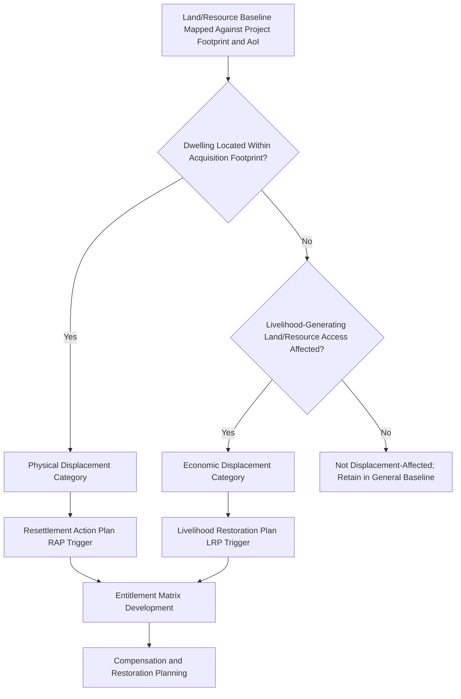

## Livelihoods and Land-Use Baseline Assessment


### Overview

Livelihoods and land-use baseline assessment provides the detailed, resource-pathway-level analysis of how affected populations generate income and sustain wellbeing through land and natural resource access — a level of granularity beyond the general socioeconomic profile because livelihood systems are frequently the primary channel through which project impacts (land acquisition, access restriction, environmental change) translate into human welfare consequences. This assessment is the direct analytical foundation for compensation/entitlement design, Livelihood Restoration Plans (LRPs), and Resettlement Action Plans (RAPs) where physical or economic displacement is triggered.

### Key Points

- Livelihood assessment must capture the full livelihood portfolio of each household, not a single "primary occupation" label — most affected households rely on multiple, often seasonally staggered, income sources.
- Land-use baseline must document both formal/titled tenure and informal/customary/common-property use, since compensation frameworks that recognize only formal title systematically exclude the most vulnerable tenure-insecure households.
- Distinguishing physical displacement (loss of dwelling/relocation) from economic displacement (loss of livelihood access without relocation) at the baseline stage is essential, since they trigger different legal instruments and entitlement calculations.
- Livelihood baseline data must be collected with attention to seasonality; a single-visit snapshot survey systematically misrepresents households whose income varies significantly across an annual cycle.

### Livelihood Portfolio Analysis

Rather than assigning each household a single occupational category, a defensible livelihood baseline captures the **full portfolio of income-generating activities** per household, recognizing that most rural and peri-urban households in particular combine multiple sources:

- **Primary livelihood activity** (e.g., subsistence/commercial farming, fishing, wage labor, small enterprise).
- **Secondary and supplementary activities** (e.g., seasonal labor migration, livestock rearing, forest product gathering, informal trade).
- **Non-labor income sources** (remittances, government transfer programs, pensions).
- **Subsistence versus cash components** — many households derive substantial welfare from non-cash subsistence production (own-consumption crops, foraged/hunted food) that a pure cash-income survey would undervalue or omit entirely.

### Land-Use Categories Requiring Baseline Documentation

| Land-Use Category | Documentation Requirement | Common Baseline Omission Risk |
| --- | --- | --- |
| Formally titled agricultural land | Title records, crop type, yield, market versus subsistence use | Generally well-documented via secondary sources |
| Informal/untitled occupied land | Duration of occupation, improvements made, livelihood dependency | Frequently excluded from formal compensation frameworks without primary documentation |
| Ancestral domain / customary tenure land | Customary use rights, community-recognized boundaries, ritual/cultural significance | Requires community-validated mapping, not government cadastral records alone |
| Common property resources (grazing land, forest, fishing grounds) | Communal access rules, dependent household count, seasonal use patterns | Frequently invisible in individual-household survey instruments focused on private land |
| Tenant/sharecropper-worked land | Tenancy arrangement terms, actual cultivator identity distinct from titleholder | Compensation frameworks addressing only titleholders miss the actual livelihood-dependent occupant |
| Rights-of-way / easement-affected land | Partial-use restriction impact even without full acquisition | Often undervalued as "temporary" despite lasting operational-phase restriction |

### Distinguishing Physical and Economic Displacement at Baseline



**Why this distinction matters at the baseline stage specifically:** compensation and restoration planning instruments (RAP versus LRP) have different legal triggers, entitlement structures, and timelines. Establishing which households fall into which category — and documenting some households fall into *both* — must occur during baseline assessment, not deferred to the mitigation planning stage, because the baseline survey instrument itself must be designed to capture the specific data (dwelling location, land dependency, tenancy status) each pathway requires.

### Core Livelihood Baseline Variables

**Agricultural Livelihoods**

- Land area cultivated (owned, rented, sharecropped, informally occupied), by crop type.
- Yield data across at least one full agricultural cycle, ideally multiple years to account for climatic variability.
- Input costs, labor arrangements (family labor versus hired), and market access/pricing.
- Irrigation source and dependency (relevant where hydrological impact pathways are anticipated).

**Fishing and Aquatic Resource-Based Livelihoods**

- Fishing grounds used, gear type, catch volume and seasonal variation.
- Dependency on specific water bodies likely to be affected by project-related hydrological or water-quality change.

**Forest and Common Property Resource-Based Livelihoods**

- Non-timber forest product (NTFP) gathering, hunting, and grazing dependency.
- Number of households dependent on a given commons area — critical because common property impacts affect a diffuse population not captured by parcel-based land records.

**Wage Labor and Enterprise**

- Local employment sources, wage rates, seasonality of labor demand.
- Small enterprise/informal trade activity, particularly relevant to assessing both baseline conditions and potential positive project impacts (local employment/procurement opportunities).

**Seasonal and Migratory Labor**

- Documentation of household members engaged in seasonal or circular labor migration, since these individuals may be absent during a single-visit survey but remain economically dependent on land/resource access in the AoI.

### Data Collection Methodology

**Household Livelihood Survey**

- Structured instrument capturing the full income-portfolio approach described above, ideally administered across multiple seasons or using recall methodology calibrated to capture annual cycle variation.
- Disaggregation by tenure status (owner, tenant, informal occupant) is essential, since impact and entitlement implications differ substantially by category.

**Resource Mapping (Participatory)**

- Community-led mapping of land use, tenure boundaries, and common property resource areas, conducted with community members as co-mappers rather than passive informants — frequently surfaces customary boundaries and commons dependencies invisible in formal cadastral records.
- Cross-validation against satellite imagery/GIS land-cover analysis to reconcile community-reported use patterns with observable land cover, while treating discrepancies as prompts for further inquiry rather than automatic dismissal of community input.

**Key Informant Interviews with Agricultural/Fisheries Officers**

- Contextualizing household-level data against known local productivity norms, market conditions, and historical yield trends.

**Market and Price Survey**

- Establishing baseline replacement-cost values for land, crops, and structures — directly required input for later compensation valuation under a "replacement cost" standard commonly mandated by resettlement frameworks (IFC PS5, World Bank ESS5, or domestic equivalents).

### Seasonality and Temporal Considerations

[Inference] The specific number of survey rounds needed to adequately capture seasonal variation is context-dependent (driven by the local agricultural/livelihood calendar) rather than fixed by a single universal standard; however, established practice strongly discourages single-visit livelihood baseline surveys wherever livelihoods are meaningfully seasonal, since a single snapshot risks systematically over- or under-stating annual income depending on which point in the cycle the survey happens to catch.

- Where feasible, baseline data collection is repeated across at least a wet-season and dry-season round, or supplemented with 12-month recall methodology validated against secondary agricultural data.
- Land-use and resource-dependency mapping should explicitly note seasonal variation in use patterns (e.g., dry-season grazing areas distinct from wet-season cultivation areas on the same parcel).

### Example: Livelihood Portfolio Data Structure

```json
{
  "household_id": "HH-0142",
  "tenure_status": "informal_occupant_20yrs",
  "displacement_category": ["economic"],
  "livelihood_portfolio": [
    {
      "activity": "rice_farming",
      "land_area_ha": 1.2,
      "tenure": "informal",
      "seasonal_pattern": "wet_season_primary",
      "estimated_annual_income_share_pct": 55
    },
    {
      "activity": "seasonal_construction_labor",
      "location": "off_AoI_migratory",
      "seasonal_pattern": "dry_season",
      "estimated_annual_income_share_pct": 30
    },
    {
      "activity": "backyard_livestock",
      "subsistence_or_cash": "mixed",
      "estimated_annual_income_share_pct": 15
    }
  ],
  "common_property_dependency": ["communal_grazing_area_north"],
  "project_footprint_overlap": "partial_land_acquisition_0.4ha"
}
```

### Common Failure Modes

- **Single-occupation labeling** — recording only a primary occupation per household head, missing the diversified portfolio that determines actual resilience and true income-loss exposure.
- **Formal-title-only land documentation** — baseline surveys that capture only titled landholding, systematically excluding informal occupants, tenants, and customary/ancestral domain users from later compensation eligibility calculations.
- **Common property invisibility** — household-centric survey instruments that fail to capture communal/common-property resource dependency, undercounting affected populations for grazing land, forest, or fishing-ground impacts.
- **Single-season data collection** — producing a baseline that misrepresents genuinely seasonal livelihoods, leading to disputed or inaccurate compensation/restoration calculations later.
- **No cross-validation with GIS/land-cover data** — relying solely on self-reported land use without spatial verification, or conversely dismissing community-reported customary use patterns solely because they are absent from formal records.
- **Deferred physical/economic displacement categorization** — not distinguishing these categories until the mitigation planning stage, resulting in baseline survey instruments that failed to collect the specific data each category's entitlement framework requires.

### Related Topics

- Demographic and socioeconomic profiling (broader baseline context)
- Social impact assessment stages from screening to monitoring (baseline stage placement)
- Resettlement Action Plan (RAP) and Livelihood Restoration Plan (LRP) design
- Indigenous knowledge and cultural heritage protocols (ancestral domain and customary tenure mapping)
- Participatory mapping and counter-mapping methodologies
- Compensation valuation and replacement-cost standards
- Vulnerability and differential impact analysis