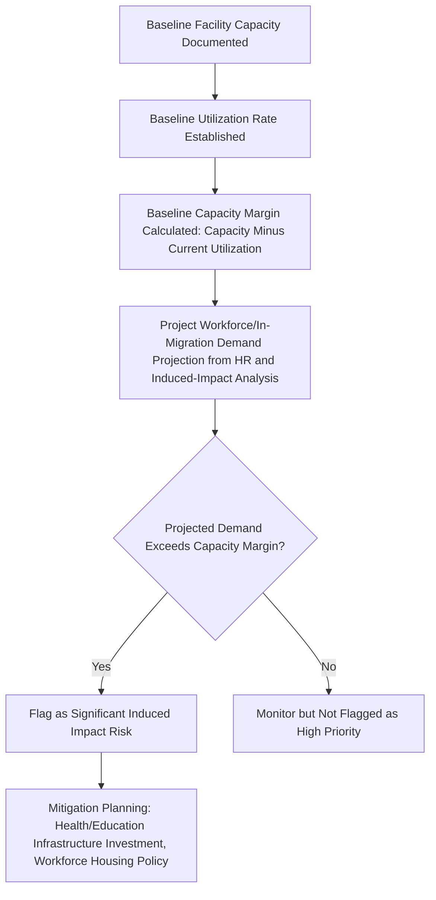

## Social Infrastructure and Services Inventory


### Overview

The social infrastructure and services inventory documents the baseline capacity, quality, and accessibility of the physical and institutional systems that support community wellbeing within the Area of Influence — health facilities, education, water and sanitation, housing, public safety, and social/cultural institutions. This inventory serves a distinct analytical function from the demographic/economic baseline: it establishes the pre-project **carrying capacity** of local systems, which is the critical benchmark against which induced-impact pressures (particularly in-migration-driven demand surges) are measured during impact prediction and monitoring.

### Key Points

- The inventory must capture both physical infrastructure (buildings, water systems) and institutional/service capacity (staffing levels, service quality, utilization rates) — a facility's existence does not indicate its adequacy.
- This baseline is the primary evidentiary basis for predicting and later monitoring induced/secondary impacts from workforce in-migration, a commonly underestimated impact category in SIA practice.
- Access and quality data must be disaggregated geographically across the AoI and by population subgroup, since infrastructure access is rarely uniform even within a single administrative unit.
- The inventory should distinguish facilities serving the directly affected population from those serving the wider service catchment, since a project may strain a facility used by a much larger population than the AoI alone.

### Core Inventory Categories

**1. Health Infrastructure and Services**

- Facility type, level, and location (barangay health station, rural health unit, district/regional hospital), including catchment population served (which may extend well beyond the AoI).
- Staffing levels (physicians, nurses, midwives) relative to population served, and any documented staffing shortfalls.
- Service capacity indicators (bed capacity, available equipment, referral pathways to higher-level facilities).
- Baseline utilization rates and reported service gaps (e.g., chronic medicine stockouts, long wait times), which establish the pre-project stress level of the system.
- Prevalent health concerns and disease patterns relevant to anticipated project impact pathways (e.g., respiratory conditions relevant to anticipated dust/air quality change, communicable disease risk relevant to anticipated in-migration).

**2. Education Infrastructure and Services**

- School type, level (elementary, secondary, tertiary/vocational), location, and enrollment capacity versus actual enrollment.
- Teacher-to-student ratios and any documented capacity constraints.
- Physical condition and multi-shift scheduling status (an indicator of existing capacity strain).
- School dropout patterns and identified barriers to access (distance, cost, gender-differentiated barriers).

**3. Water Supply and Sanitation**

- Water source type (piped municipal system, communal well, surface water) and reliability (seasonal availability, documented service interruptions).
- Water quality testing data where available, establishing baseline against which any project-induced water-quality change can later be measured.
- Sanitation facility type and coverage (household versus communal, improved versus unimproved), and solid waste management capacity.

**4. Electricity and Energy Access**

- Grid connection status and reliability, alternative energy source use (generators, solar, biomass), relevant both as a baseline wellbeing indicator and as a potential positive-impact channel if the project includes electrification components.

**5. Transport and Connectivity Infrastructure**

- Road condition and seasonal passability, public transport availability and frequency, relevant both to baseline access and to anticipated construction-phase disruption or induced-development effects along new/improved access routes.

**6. Housing and Settlement Conditions**

- Housing type, construction quality, and tenure security, establishing baseline conditions relevant to both displacement/resettlement planning and anticipated in-migration housing-market pressure.
- Existing housing market conditions (rental rates, vacancy) as a baseline against which project-induced price inflation can later be measured.

**7. Public Safety and Security Services**

- Police/security presence and response capacity, baseline crime rate and type, relevant to anticipated induced impacts from workforce in-migration (a well-documented risk category in extractive and large-infrastructure projects).

**8. Social, Cultural, and Religious Institutions**

- Community centers, places of worship, cultural/ritual sites (cross-referenced with the dedicated cultural heritage inventory), and their role in community cohesion and social support systems.
- Existing community organizations, cooperatives, and civil society presence, relevant to identifying institutional partners for later stakeholder engagement and grievance mechanisms.

### Inventory-to-Impact-Pathway Linkage

The core analytical purpose of this inventory is establishing **carrying capacity thresholds** — the point at which anticipated population or demand increases would exceed existing service capacity. This linkage should be made explicit rather than left implicit:



**Why this linkage is frequently the difference between an adequate and inadequate SIA:** many SIA baselines document facility existence ("one rural health unit serving the barangay") without documenting utilization or capacity margin, making it impossible to later assess whether an influx of several hundred construction workers would push the facility beyond functional capacity. The margin calculation, not the mere inventory, is the actionable output.

### Geographic and Subgroup Disaggregation

| Disaggregation Dimension | Rationale |
| --- | --- |
| By AoI sub-area/settlement | Infrastructure access is rarely uniform; a single "average distance to health facility" figure conceals sub-areas with genuinely poor access |
| By facility catchment vs. AoI boundary | A facility's true user population may extend beyond the AoI, meaning project-induced strain has impacts beyond the immediate study area |
| By population subgroup | Access barriers (cost, distance, cultural appropriateness, language) may differentially affect Indigenous communities, women, persons with disabilities, or the very poor |
| By season | Road passability and water source reliability commonly vary seasonally, affecting effective (not merely nominal) access |

### Data Collection Methodology

**Facility-Level Surveys and Key Informant Interviews**

- Direct engagement with facility administrators/staff (school principals, health facility heads) to obtain capacity, staffing, and utilization data not available from household-level surveys alone.

**Household Survey Modules**

- Household-reported access experience (distance/time to nearest facility, frequency of use, out-of-pocket costs, perceived service quality/barriers) — capturing the user-experience dimension that facility-level administrative data alone does not reveal.

**Secondary/Administrative Data Review**

- Local government unit development plans, health/education sector administrative statistics, prior infrastructure assessments, which provide institutional context and historical trend data unavailable from a single field visit.

**Direct Observation/Facility Condition Assessment**

- Physical condition surveys of facilities (structural adequacy, equipment functionality) to verify or supplement administrative self-reporting.

### Example: Facility Inventory Data Structure

```json
{
  "facility_id": "HEALTH-BGY-07",
  "facility_type": "rural_health_unit",
  "location": "[Barangay Name]",
  "catchment_population": 4200,
  "aoi_population_share_of_catchment_pct": 62,
  "staffing": {
    "physicians": 0,
    "nurses": 1,
    "midwives": 2,
    "documented_staffing_gap": "no_resident_physician; monthly visiting schedule only"
  },
  "capacity_indicators": {
    "bed_capacity": 0,
    "referral_facility": "Provincial Hospital, 28km",
    "average_daily_patient_load": 35
  },
  "baseline_capacity_margin_assessment": "near_full_utilization_during_peak_hours",
  "induced_impact_risk_flag": "high - limited margin for workforce in-migration demand"
}
```

### Common Failure Modes

- **Existence-only documentation** — recording that a school or clinic exists without capturing utilization, staffing adequacy, or capacity margin, producing a baseline unable to support induced-impact prediction.
- **AoI-boundary tunnel vision** — ignoring that a facility's actual catchment population extends beyond the AoI, understating the true population at risk of induced-impact service strain.
- **Uniform/aggregated access reporting** — a single AoI-wide "average distance to health facility" figure that conceals sub-areas or subgroups with genuinely poor access.
- **Omitting seasonal variation** — documenting road/water access only at the time of the field visit, missing seasonal passability or water-source reliability variation materially affecting year-round access.
- **No explicit capacity-margin linkage to workforce/in-migration projections** — infrastructure baseline and workforce demand projections produced by different specialists without integration, missing the core risk signal the inventory is meant to surface.

### Related Topics

- Demographic and socioeconomic profiling (population baseline feeding capacity-margin calculations)
- Social impact assessment stages from screening to monitoring (baseline stage placement)
- Integrating social impact assessment within broader ESIA processes (infrastructure-environment interaction pathways, e.g., water quality)
- Induced and cumulative impact assessment methodology
- Workforce management planning and in-migration mitigation measures
- Livelihoods and land-use baseline assessment
- Monitoring indicator design for service-capacity tracking