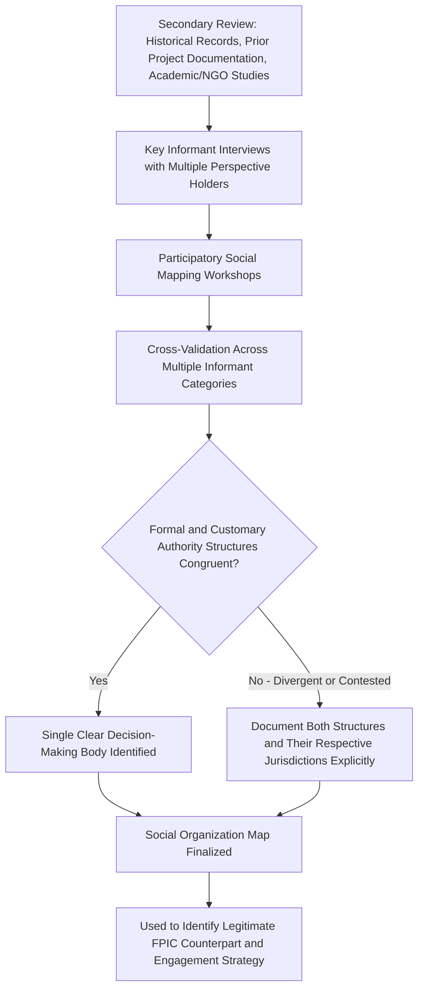

## Community History and Social Organization Mapping


### Overview

Community history and social organization mapping documents the formal and informal governance structures, historical trajectory, social networks, and power dynamics of communities within the Area of Influence. Unlike quantitative demographic or infrastructure baselines, this component is fundamentally qualitative and relational — its purpose is to reveal *who actually holds legitimate decision-making authority*, *how the community has been shaped by prior external interventions*, and *what social cohesion or fracture lines exist* that will mediate how the project's impacts and benefits are experienced and distributed. This mapping is the analytical basis for correctly identifying legitimate consultation counterparts throughout the SIA — a step whose failure underlies many of the "elite capture" and illegitimate-FPIC problems documented elsewhere in SIA practice.

### Key Points

- Formal political structures (elected local government units) and customary/traditional governance structures (councils of elders, clan leadership, religious authorities) frequently coexist and do not always hold equivalent or overlapping jurisdiction — mapping must identify both and their actual relationship.
- Community history — including prior experience with external development projects, displacement, or conflict — directly shapes present-day trust levels, expectations, and negotiating behavior toward the new project; ignoring this history produces engagement strategies calibrated to a naive baseline that does not exist.
- Social organization mapping must identify internal social differentiation (clan, caste, ethnic subgroup, migrant-versus-longtime-resident status) since a project's impacts and benefits are rarely experienced uniformly across an ostensibly single "community."
- This mapping directly determines who can legitimately give or withhold consent in FPIC processes and who should be prioritized in benefit-sharing and grievance mechanism design.

### Core Components

**1. Historical Trajectory**

- **Settlement history** — when and how the community was established, including any history of displacement, resettlement, or forced relocation (whether project-related or otherwise), which shapes present sensitivity to land/tenure issues.
- **Prior experience with development projects** — documented history of other infrastructure, extractive, or agribusiness projects in the area, including whether commitments made in those projects were honored, which directly predicts community trust posture toward the current project.
- **History of conflict or cohesion events** — prior land disputes, intergroup conflict, or, conversely, significant cooperative achievements, which indicate existing fault lines or strengths relevant to how the project's impacts will be socially processed.
- **Migration and settlement waves** — distinguishing longtime/original residents from more recent migrants, since these groups frequently hold different tenure security, cultural standing, and stakes in project outcomes.

**2. Formal Governance Structures**

- Elected local government unit structure and jurisdiction (e.g., barangay government in the Philippine context, or equivalent municipal/village government structures elsewhere).
- Relationship between formal government structures and the specific AoI communities — a single formal administrative unit may encompass multiple distinct communities with different customary structures.
- Existing formal community organizations — cooperatives, farmer associations, women's groups, youth councils, and their actual (not merely nominal) activity level and influence.

**3. Customary and Traditional Governance Structures**

- Council of elders, clan/lineage leadership, traditional chieftain systems, or equivalent customary authority structures, and their actual decision-making jurisdiction (which may be narrower or broader than formal political boundaries).
- Identification of the **legitimate customary decision-making body** specifically for matters requiring FPIC — this is a distinct and more precise identification than "community leaders" generally, since customary authority for land/resource decisions may rest with a specific council or lineage structure not necessarily coextensive with general community leadership.
- Religious/spiritual authority structures where these hold independent standing distinct from both formal and customary governance (e.g., religious leaders with authority over specific cultural/ritual sites).

**4. Social Differentiation and Internal Community Structure**

- Clan, lineage, or sub-ethnic group composition and their relative social/political standing within the broader community.
- Class/wealth stratification and its correlation with land tenure, political influence, and historical access to prior development benefits.
- Gender-based social organization — women's formal and informal decision-making roles, which frequently differ substantially from their formal representation in community leadership structures.
- Migrant/longtime-resident distinctions and any associated differential status or resource access.

**5. Social Networks and Institutions**

- Kinship networks and their role in resource-sharing, labor exchange, and mutual support systems, which may be disrupted by displacement even where formal economic compensation is provided.
- Existing civil society organizations, NGOs, and faith-based organizations active in the community, relevant both as potential engagement partners and as independent sources of community perspective.
- Informal conflict-resolution mechanisms and their relationship to (or independence from) formal legal/administrative dispute resolution channels — relevant to grievance mechanism design.

### Mapping Methodology



**Critical validation step highlighted above:** cross-validating governance structure identification across multiple, independent informant categories (not relying solely on whichever leader first makes contact with the project team) is essential, because self-identified or externally-imposed "representatives" who lack genuine customary standing are a well-documented source of subsequently contested FPIC and consultation processes.

### Key Data Collection Techniques

**Key Informant Interviews (Multi-Perspective)**

- Deliberately interviewing across formal government officials, customary leaders, religious leaders, women's group representatives, youth representatives, and long-term residents separately — cross-referencing their respective accounts of "who actually decides" rather than accepting a single informant's self-description of community structure.

**Participatory Social/Institutional Mapping**

- Community-led exercises (e.g., Venn diagramming of institutional influence, historical timeline construction) that surface community members' own understanding of governance and historical trajectory, rather than an externally imposed framework.

**Genealogical and Kinship Mapping** (where relevant, particularly in Indigenous or clan-based contexts)

- Documenting lineage/clan structures where these directly determine land rights or decision-making authority — requires cultural sensitivity and, often, is only appropriately conducted by team members with anthropological training and community trust.

**Historical Document Review**

- Municipal/provincial records, prior EIA/SIA studies for other projects in the area, academic ethnographic studies, and NGO documentation, providing longitudinal context that a single field visit cannot generate independently.

**Community Timeline Exercises**

- Facilitated group exercises where community members collectively construct a historical timeline of significant events (settlement, conflicts, prior projects, natural disasters), surfacing shared historical memory and its present-day relevance to the community's posture toward the current project.

### Example: Governance Structure Documentation

```json
{
  "community_id": "BGY-SocMap-04",
  "formal_governance": {
    "structure": "Barangay Council",
    "jurisdiction": "administrative/general local governance",
    "elected_officials": ["Barangay Captain", "7 Barangay Kagawad"]
  },
  "customary_governance": {
    "structure": "Council of Elders / [specific IP group name]",
    "jurisdiction": "land and resource decisions within recognized ancestral domain claim",
    "relationship_to_formal_structure": "distinct and non-overlapping jurisdiction; FPIC matters route through customary structure, not barangay council alone"
  },
  "internal_differentiation": {
    "clan_groups_identified": 4,
    "migrant_vs_longtime_resident_ratio_estimate": "approx 30% settled within last 15 years",
    "documented_historical_land_dispute": "boundary dispute with adjacent barangay, unresolved since 1990s"
  },
  "prior_project_history": {
    "previous_developments": ["road-widening project, 2015"],
    "community_reported_experience": "compensation delays reported; informs current trust posture"
  },
  "legitimate_fpic_counterpart_identified": "Council of Elders, validated via NCIP Field-Based Investigation"
}
```

### Linkage to Downstream SIA Functions

This mapping is not merely descriptive background — it directly determines:

- **FPIC legitimacy** — identifying the correct customary decision-making body prevents the elite-capture failure mode where FPIC is sought from, and granted by, individuals lacking genuine customary authority.
- **Stakeholder engagement design** — informs which sub-groups require differentiated engagement approaches (e.g., separate sessions for a historically marginalized clan or migrant subgroup within the broader community).
- **Benefit-sharing and grievance mechanism design** — should be structured around and channeled through legitimate, community-recognized institutions rather than externally-imposed structures the community does not trust or recognize.
- **Conflict risk assessment** — pre-existing internal fault lines (clan tension, land disputes, migrant/longtime-resident friction) identified here inform risk assessment for how project benefits (employment, compensation) might exacerbate existing social tensions if distributed without attention to this context.

### Common Failure Modes

- **Single-informant governance identification** — accepting the account of the first or most accessible community contact as definitive, without cross-validating against other informant categories, risking engagement with an unrepresentative or self-appointed "leader."
- **Formal-structure-only engagement** — engaging solely through elected barangay/municipal officials while bypassing customary governance structures that hold actual authority over land and cultural matters, particularly relevant to invalid FPIC processes.
- **Treating "the community" as internally homogeneous** — failing to document clan, migrant-status, or class differentiation, resulting in engagement and benefit-sharing designs that inadvertently favor already-dominant subgroups.
- **Ignoring documented prior-project history** — approaching community engagement as though no relevant institutional memory exists, when unresolved grievances from prior development projects directly shape current trust and negotiating posture.
- **Static, one-time mapping** — treating social organization as fixed at baseline, when governance structures, leadership, and internal social dynamics can shift over the multi-year project lifecycle, requiring periodic revalidation rather than reliance on a single baseline snapshot.

### Related Topics

- Demographic and socioeconomic profiling (population-level context complementing governance mapping)
- Indigenous knowledge and cultural heritage protocols (customary governance identification for FPIC)
- Scoping workshops with stakeholders and regulators (identifying legitimate participants)
- Stakeholder identification and engagement planning
- Grievance Redress Mechanism (GRM) design aligned with recognized institutions
- Vulnerability and differential impact analysis
- Conflict-sensitivity analysis in project-affected communities