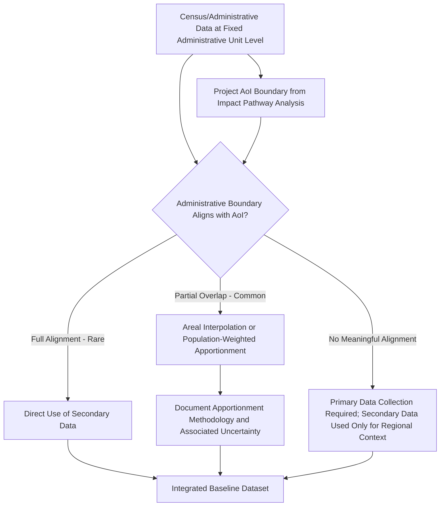
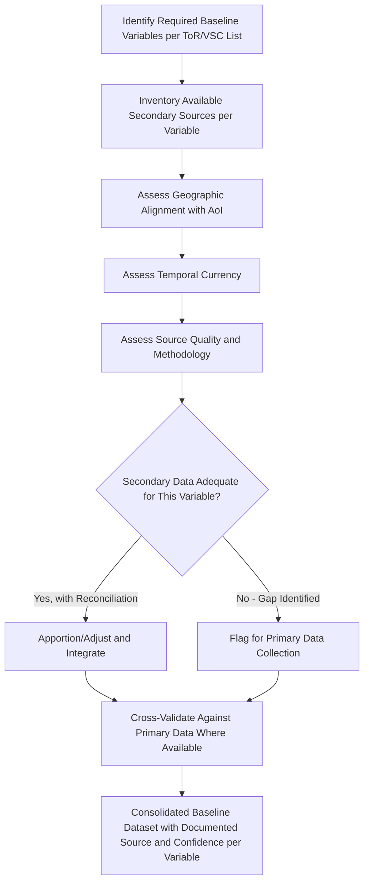

## Secondary Data and Census Integration


### Overview

Secondary data and census integration is the methodological discipline of systematically incorporating pre-existing statistical and administrative data — national census records, government agency datasets, prior studies, and institutional records — into the SIA baseline, rather than relying exclusively on primary field data collection. Properly integrated, secondary data provides longitudinal context, statistical validation, and cost-efficient coverage of the Area of Influence that primary data collection alone cannot economically achieve; poorly integrated, it introduces geographic mismatch, temporal staleness, and false precision into the baseline that undermines the credibility of subsequent impact predictions.

### Key Points

- Secondary data serves a triangulation and context function, not a substitute function — it complements but does not replace AoI-specific primary data collection, particularly for locally salient variables census instruments do not capture.
- Geographic mismatch between administrative census units and the actual Area of Influence boundary is the single most common integration error, requiring explicit reconciliation methodology rather than naive boundary assumption.
- Temporal currency must be explicitly assessed and disclosed — census data is often several years old at the time of SIA fieldwork, and using it without acknowledging or adjusting for intervening change risks a materially inaccurate baseline.
- Secondary data quality, source authority, and methodology must be documented and critically assessed, not simply cited at face value.

### Categories of Secondary Data Sources

**1. National Population and Housing Census**

- Provides the most authoritative population count, age-sex structure, household composition, and housing condition data, typically at a fine administrative resolution (barangay/village level or finer in many national census systems).
- Limitation: conducted at fixed, infrequent intervals (often decennial or quinquennial), meaning currency at time of SIA fieldwork depends heavily on how recently the most recent census round occurred relative to the project timeline.

**2. Household/Living Standards Surveys**

- National or regional household income and expenditure surveys, labor force surveys, and demographic/health surveys — provide more frequently updated socioeconomic indicators than the full census, though typically at coarser geographic resolution (provincial/regional rather than village-level).

**3. Sectoral Administrative Data**

- Health facility records (utilization, staffing, disease surveillance data) from health ministries/departments.
- Education enrollment and facility data from education ministries/departments.
- Agricultural production and land-use statistics from agriculture ministries/departments.
- Land registry and cadastral records from land administration agencies.

**4. Prior Impact Assessments and Studies**

- Previous EIA/SIA studies conducted for other projects in the same or overlapping geography, providing valuable historical baseline comparison points and documented community history.
- Academic and NGO-commissioned studies (ethnographic, public health, livelihood studies) specific to the area or population group.

**5. Local Government Development Records**

- Municipal/provincial development plans, poverty mapping data, local revenue and budget records indicating institutional capacity, and disaster/hazard risk assessments relevant to vulnerability analysis.

**6. Geospatial and Remote Sensing Data**

- Satellite imagery-derived land-cover classification, historical land-use change analysis, and administrative boundary GIS layers — critical inputs for reconciling census/administrative boundaries against the project's actual Area of Influence.

### The Geographic Mismatch Problem

Census and administrative data are organized by fixed administrative boundaries (barangay, municipality, province, or equivalent), while the Area of Influence is defined by impact pathways that frequently do not align with those boundaries — an AoI may encompass only part of one administrative unit, span portions of several units, or follow a hydrological/environmental boundary entirely independent of administrative geography.



**Reconciliation approaches:**

- **Direct use** — where the AoI happens to align closely with an existing administrative boundary (uncommon but the simplest case).
- **Areal/population-weighted interpolation** — apportioning administrative-unit-level statistics to the AoI-relevant sub-area based on population share or land-area share, an approximation technique that introduces quantifiable uncertainty that should be explicitly disclosed rather than presented as precise.
- **Primary data substitution** — where mismatch is severe, treating secondary data as regional/contextual background only, and relying on primary field data collection (household survey, community mapping) for the actual AoI-specific baseline figures used in impact prediction and monitoring.

[Inference] The specific choice among these reconciliation approaches is a case-by-case methodological judgment depending on the degree of mismatch and the criticality of the variable in question, rather than a fixed decision rule applicable uniformly across all datasets and projects.

### Temporal Currency Assessment

| Consideration | Reconciliation Approach |
| --- | --- |
| Census conducted several years before SIA fieldwork | Cross-check against more recent administrative records (health/education enrollment) for indication of significant intervening change (population growth, migration shifts) |
| Known intervening events (natural disaster, other development projects, significant migration events) | Explicitly document these in the baseline report as context for interpreting the secondary data's continued relevance |
| Rapidly changing variables (income, employment) versus slow-changing variables (ethnic composition, land tenure patterns) | Apply greater currency scrutiny to rapidly changing variables; slower-changing structural variables may remain valid longer without primary re-verification |

### Data Quality and Source Authority Assessment

A defensible secondary data integration process documents, for each major source used:

- **Methodology transparency** — sampling method, survey instrument, and known limitations of the original data collection (e.g., a national household survey's sample may not be statistically powered for reliable estimates at the specific barangay/village level relevant to the AoI).
- **Institutional authority and known biases** — government administrative data may undercount informal settlements or informal economic activity; NGO-commissioned studies may have been conducted with a specific advocacy framing relevant to interpreting their findings.
- **Consistency checking across sources** — cross-referencing population figures, for example, from census data against local government registration records and health facility catchment records, flagging and investigating significant discrepancies rather than silently selecting whichever source is most convenient.

### Integration Workflow



**Critical final step:** cross-validating integrated secondary data against whatever primary data is collected (even a smaller-scale primary survey) provides a check on both sources — significant divergence between census-derived and household-survey-derived figures for the same variable should be investigated and explained in the baseline report, not silently resolved by picking one source without disclosure.

### Example: Documented Secondary Data Source Register

```json
{
  "variable": "household_income_median",
  "primary_secondary_source": "National Household Income and Expenditure Survey, [Year]",
  "geographic_resolution_of_source": "provincial",
  "aoi_alignment": "partial - AoI comprises 3 of 14 municipalities in the reporting province",
  "reconciliation_method": "population-weighted apportionment to AoI municipalities, cross-checked against local government poverty mapping data",
  "temporal_gap_years": 4,
  "known_limitation": "provincial-level sample not statistically powered for AoI-specific precision",
  "cross_validation_status": "cross-checked against household survey conducted for this SIA; provincial figure approximately 12% higher than AoI-specific primary survey finding, attributed to urban-bias in provincial sample composition",
  "confidence_rating": "moderate - primary data prioritized for AoI-specific reporting"
}
```

### Common Failure Modes

- **Naive boundary assumption** — applying administrative-unit-level statistics directly to the AoI without any reconciliation for geographic mismatch, producing a baseline that misrepresents the actual affected population's characteristics.
- **Uncritical currency assumption** — citing census figures as current baseline data without disclosing the temporal gap or checking for known intervening changes.
- **Single-source reliance** — using one secondary source without cross-validation, missing significant discrepancies that would otherwise prompt further investigation or primary data collection.
- **False precision** — presenting apportioned/interpolated secondary data with the same apparent precision as directly measured primary data, without disclosing the associated estimation uncertainty.
- **Secondary data as full substitute for primary collection** — treating desk-based secondary data review as sufficient baseline documentation for a full/comprehensive SIA, omitting the AoI-specific primary data collection required to capture locally salient variables secondary sources do not cover (informal tenure, common property dependency, cultural/ritual practices).

### Related Topics

- Demographic and socioeconomic profiling (primary application of integrated secondary/census data)
- Defining the study area and area of influence (source of the geographic mismatch challenge)
- Livelihoods and land-use baseline assessment
- Social infrastructure and services inventory (administrative sectoral data sources)
- GIS-based participatory mapping and boundary reconciliation techniques
- Monitoring indicator design and baseline data comparability