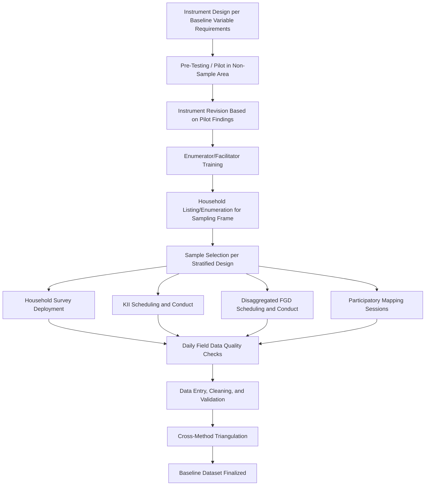

## Primary Data Collection for Social Baselines


### Overview

Primary data collection is the direct, field-based gathering of AoI-specific social data — through surveys, interviews, group discussions, and participatory methods — that fills the gaps secondary/census data cannot address and provides the granular, locally-specific evidence base required for defensible impact prediction and monitoring. Where secondary data integration establishes broader context and longitudinal trends, primary data collection establishes the actual, current, AoI-specific condition of the population the project will affect. This item addresses the design, instrument development, sampling, fieldwork execution, and quality assurance dimensions of primary baseline data collection as a distinct methodological function within the SIA baseline stage.

### Key Points

- Primary data collection methodology must be determined by the specific baseline variables required (per the ToR and VSC list), not applied as a generic, one-size-fits-all survey package.
- Mixed-methods design — combining quantitative (survey) and qualitative (interview, FGD, participatory) methods — is standard practice because quantitative instruments alone cannot capture context, meaning, or the perspectives of populations underrepresented in structured survey sampling.
- Sampling design must be statistically defensible for quantitative claims while remaining purposive/theoretical for qualitative components; conflating the two logics undermines both.
- Ethical research standards — informed consent, confidentiality, and do-no-harm principles — apply throughout, with heightened sensitivity where vulnerable populations or culturally sensitive topics are involved.

### Core Primary Data Collection Methods

**1. Household Survey**

- The primary quantitative instrument for demographic, economic, livelihood, and service-access baseline data (see demographic/socioeconomic profiling and livelihoods baseline items for content detail).
- Requires a structured, pre-tested questionnaire, trained enumerators, and a defensible sampling frame and methodology.

**2. Key Informant Interviews (KIIs)**

- Semi-structured interviews with individuals holding specialized knowledge — local officials, health/education facility staff, customary leaders, business owners — providing institutional and contextual data that household-level instruments cannot capture.
- Interview guides should be tailored to each informant category rather than using a single generic guide, since the relevant knowledge domain differs substantially (e.g., a health facility administrator versus a customary council elder).

**3. Focus Group Discussions (FGDs)**

- Facilitated group discussions with 6–10 participants, disaggregated by relevant subgroup (women, youth, elderly, occupational group, ethnic subgroup) to surface differentiated perspectives that mixed groups tend to suppress, particularly on sensitive topics.
- Requires skilled facilitation to manage group dynamics (dominant voices, social desirability bias) and a discussion guide with open-ended prompts rather than a rigid questionnaire format.

**4. Participatory Mapping and Rural Appraisal (PRA) Techniques**

- Community-led exercises — resource mapping, transect walks, historical timelines, wealth ranking, seasonal calendars — that position community members as co-researchers rather than passive respondents, frequently surfacing information (customary tenure boundaries, seasonal livelihood variation, commons dependency) invisible to structured survey instruments.

**5. Direct Observation**

- Structured observation of physical conditions (housing quality, facility conditions, land-use patterns) supplementing and cross-validating self-reported data.

**6. Case Studies / In-Depth Interviews**

- Detailed individual-level narrative interviews, particularly valuable for capturing lived experience relevant to vulnerability analysis (e.g., a female-headed household's specific livelihood and access constraints) that aggregate statistics cannot convey.

### Method Selection by Data Requirement

| Data Requirement | Primary Method(s) Best Suited |
| --- | --- |
| Statistically representative income/demographic figures | Household survey (structured, probability-sampled) |
| Customary governance structure identification | KIIs across multiple informant categories, cross-validated |
| Gender-differentiated perspectives on impact concerns | Disaggregated FGDs (women-only, men-only) |
| Common property/customary tenure boundaries | Participatory mapping |
| Institutional capacity (health/education facility) | KIIs with facility staff plus direct observation |
| Community historical narrative | Community timeline exercises, KIIs with long-term residents |
| Individual lived experience of vulnerability | Case studies / in-depth interviews |

### Sampling Design for Quantitative Instruments

- **Sampling frame** — must be derived from the most current and geographically accurate population listing available for the AoI (household listing/enumeration, ideally conducted or verified as part of the SIA fieldwork itself rather than relying solely on outdated administrative lists).
- **Stratification** — commonly stratified by AoI sub-area, tenure status, and/or vulnerability category to ensure adequate representation of subgroups that a simple random sample might undersample, particularly small but significant populations (e.g., a minority ethnic enclave within a larger AoI).
- **Sample size determination** — should be statistically justified relative to the desired confidence level and margin of error for key indicators, not set by an arbitrary round number or budget-driven convenience figure alone.
- **Response and non-response handling** — documented protocol for replacement sampling and non-response tracking, since differential non-response (e.g., systematically missing households where the head is engaged in seasonal migration) can bias baseline findings if unaddressed.

### Sampling Logic for Qualitative Components

Unlike the quantitative household survey, qualitative components (KIIs, FGDs) use **purposive** rather than probability sampling — participants are selected specifically because they hold relevant knowledge or represent a specific perspective category, not because they are statistically representative of the general population. Confusing these two logics — for example, treating FGD participant counts as though they support population-level statistical claims — is a common and significant methodological error.

### Fieldwork Process Architecture



**Key quality-assurance checkpoints embedded above:**

- **Pre-testing/piloting** — deploying draft instruments in a non-sample comparable area to identify translation issues, ambiguous questions, or cultural inappropriateness before full-scale deployment, since errors discovered only after full fieldwork are far costlier to correct.
- **Daily field data quality checks** — supervisors reviewing completed instruments during fieldwork (not solely after fieldwork concludes) to catch enumerator error, unusual response patterns, or non-response clusters while correction is still feasible.
- **Cross-method triangulation** — deliberately comparing findings across household survey, KII, and FGD sources for the same variable, since agreement across independently-collected data sources substantially strengthens the credibility of baseline findings, and disagreement flags areas requiring further investigation.

### Enumerator and Facilitator Considerations

- **Local language fluency** is a hard requirement, not a preference, for enumerators and facilitators conducting household-level and community-level data collection.
- **Gender matching** — as addressed in team assembly, female enumerators/facilitators for women-focused FGDs and for household survey modules covering gender-sensitive topics.
- **Training on ethical protocols** — informed consent procedures, confidentiality assurance, and appropriate response to disclosure of sensitive information (e.g., referral protocols if a respondent discloses a protection concern), delivered as mandatory training content, not assumed enumerator competency.
- **Local hire consideration** — balancing the value of local knowledge/trust (community-based enumerators) against the risk of social pressure or bias affecting response candor when enumerators are known to respondents; some SIA designs deliberately mix local and external enumerators to balance these considerations.

### Ethical Considerations in Primary Data Collection

- **Informed consent** — clear, locally-appropriate disclosure to each respondent of the purpose of data collection, how it will be used, voluntary participation, and the right to decline or withdraw, delivered orally where literacy is variable rather than relying solely on a written consent form.
- **Confidentiality and data protection** — protocols for anonymizing or securing individually identifiable data, particularly important given that baseline data may later be referenced in compensation/entitlement disputes or grievance processes.
- **Do-no-harm principle** — avoiding data collection approaches that could expose vulnerable respondents (e.g., regarding land tenure insecurity or undocumented status) to risk from disclosure, and having a clear protocol for what happens if data collection surfaces a protection concern (e.g., disclosure of abuse) requiring referral beyond the scope of the SIA itself.
- **Managing expectations** — being explicit with respondents that participation in baseline data collection does not itself guarantee project approval, compensation, or specific benefits, to avoid data collection being perceived as (or functioning as) a de facto registration process for entitlements not yet determined.

### Example: Fieldwork Quality Control Checklist Structure

```json
{
  "instrument": "household_survey",
  "pilot_conducted": true,
  "pilot_findings_incorporated": ["revised income-recall question wording", "added local unit conversions for land area"],
  "sampling_frame_source": "SIA team household listing, cross-checked against barangay records",
  "sample_size": 412,
  "stratification": ["AoI sub-area (4 strata)", "tenure status (titled/informal/tenant)"],
  "non_response_rate_pct": 6.2,
  "non_response_handling": "documented replacement protocol; non-response pattern reviewed for systematic bias",
  "enumerator_composition": {"local_hire": 6, "external": 3, "female": 5, "male": 4},
  "daily_quality_check_protocol": "supervisor spot-check of 15% of completed instruments daily",
  "triangulation_notes": "household-reported land tenure cross-validated against participatory mapping outputs; discrepancies flagged for follow-up KII"
}
```

### Common Failure Modes

- **Generic, non-tailored instruments** — deploying a standard household survey template without adaptation to the specific baseline variables required by the ToR/VSC list for this particular project and context.
- **No piloting** — full-scale deployment of an untested instrument, discovering translation or comprehension problems only after fieldwork is complete and correction is costly or impossible.
- **Conflating qualitative and quantitative sampling logic** — treating purposively-selected FGD or KII participant statements as statistically representative population claims.
- **Single-method reliance without triangulation** — accepting household survey findings on a sensitive or complex topic (e.g., customary tenure) without cross-validating against participatory mapping or KII sources, missing discrepancies that would otherwise prompt useful follow-up.
- **Weak or absent informed consent procedures** — proceeding with data collection without genuine, comprehensible consent, particularly risky where vulnerable or low-literacy populations are involved.
- **Ungendered or culturally mismatched enumerator assignment** — deploying male enumerators for women-focused data collection in contexts where this structurally suppresses candid response, undermining the validity of the resulting baseline data.

### Related Topics

- Demographic and socioeconomic profiling (primary content domain for household survey design)
- Secondary data and census integration (complementary source, triangulation partner)
- Livelihoods and land-use baseline assessment
- Community history and social organization mapping (KII and participatory mapping application)
- Assembling a qualified social impact assessment team (enumerator/facilitator competency requirements)
- Scoping workshops with stakeholders and regulators
- Vulnerability and differential impact analysis