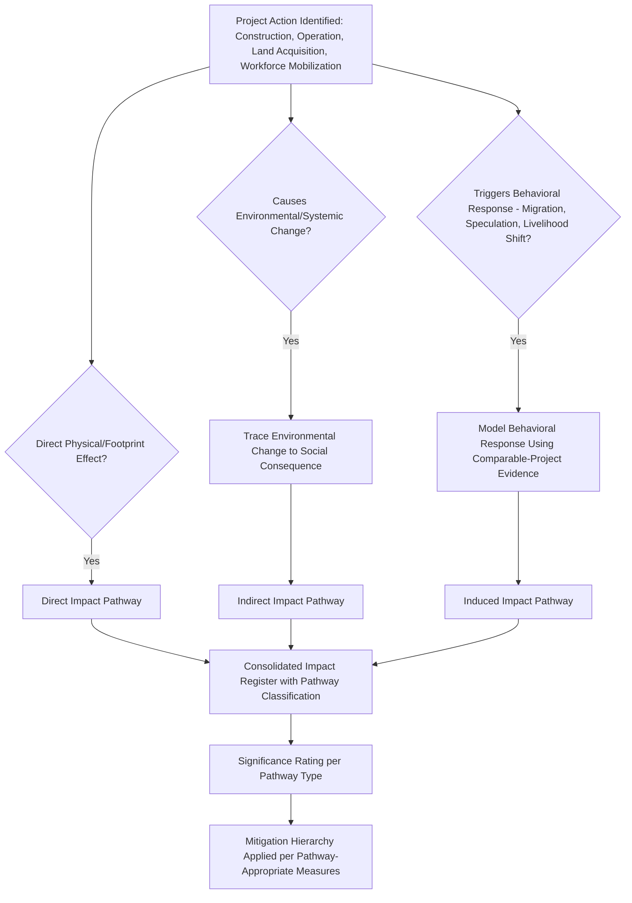

## Direct, Indirect, and Induced Impact Pathways

### Overview

Impact pathway analysis is the analytical core of the impact prediction stage: it traces the causal chain connecting a specific project action (a physical intervention, an operational activity, or an organizational decision) to a resulting change in social conditions. Classifying pathways as direct, indirect, or induced is not a mere labeling exercise — the classification determines which analytical methods apply, how confidently the impact can be predicted, and which mitigation instrument is appropriate. Conflating these categories, or analyzing only direct impacts while treating indirect and induced impacts as an afterthought, is among the most consequential methodological failures in SIA practice, since indirect and induced impacts are frequently larger in aggregate magnitude than the direct impacts that trigger regulatory attention in the first place.

### Key Points

- Direct impacts arise from the project's own physical footprint and construction/operational activities; indirect impacts arise from environmental or systemic changes the project causes; induced impacts arise from secondary human behavioral responses (particularly migration and settlement) to the project's presence.
- The three pathway types differ in causal directness, predictability, and controllability — direct impacts are most controllable through project design, induced impacts least so, which has direct implications for mitigation strategy selection.
- A single project action frequently generates impacts across all three categories simultaneously through different causal chains, requiring a pathway-mapping approach rather than a single-impact-per-action analysis.
- Induced impacts are the most commonly underestimated category in SIA practice, precisely because they depend on human behavioral response rather than direct physical mechanism, making them harder to predict with the same confidence as direct impacts.

### Defining the Three Pathway Types

**Direct Impacts**

- Impacts resulting immediately and unambiguously from the project's physical footprint, construction activities, or core operational processes, with a short and clear causal chain between project action and social consequence.
- Examples: physical displacement from land acquisition; loss of livelihood-generating land within the acquired footprint; noise/dust exposure to households immediately adjacent to construction activity; employment directly created by the project's own workforce needs.

**Indirect Impacts**

- Impacts resulting from environmental, economic, or systemic changes that the project causes, which then propagate to affect social conditions through an intermediate causal step — the impact pathway crosses from a biophysical or systemic change into a social consequence.
- Examples: downstream livelihood loss from altered river hydrology; health impacts from air quality changes; loss of access to a resource due to project-caused environmental degradation beyond the immediate footprint; changes in local market prices due to altered supply chains.

**Induced Impacts**

- Impacts arising from secondary, unplanned but predictable human behavioral responses to the project's presence — most commonly in-migration and associated settlement, economic, and service-demand effects, but also including behavioral responses such as speculative land transactions or changes in local livelihood strategies anticipating project-related opportunity.
- Examples: informal settlement growth along new access roads; housing price inflation from workforce in-migration; strain on local health/education services from population influx; increased demand for sex work or associated public health/protection risks documented in extractive-industry contexts; local livelihood shifts away from agriculture toward anticipated project-related wage labor.

### Comparative Framework

| Dimension | Direct | Indirect | Induced |
| --- | --- | --- | --- |
| Causal chain length | Short (project action → impact) | Medium (project action → environmental/systemic change → impact) | Long and behaviorally mediated (project presence → human response → secondary impact) |
| Predictability | Highest — generally well-established from project design specifications | Moderate — requires environmental/systemic modeling | Lowest — depends on human behavioral response, comparable-project evidence, and regional context |
| Primary control mechanism | Project design modification (avoidance, footprint reduction) | Environmental management measures (linked to EIA mitigation) | Workforce management planning, regional development coordination, land-use planning — generally requiring measures beyond the project's direct engineering control |
| Typical analytical method | Direct enumeration against project footprint/schedule | Environmental impact modeling (hydrological, air dispersion) combined with exposure-pathway analysis | Comparable-project case study analysis, demographic/economic projection modeling |
| Responsible party for mitigation | Primarily project proponent | Often joint environmental-social team responsibility | Frequently requires proponent-government coordination (e.g., regional infrastructure/service planning), since induced impacts often exceed the proponent's unilateral control |

### Pathway Mapping Architecture

**Why explicit pathway classification matters at this stage:** a project action such as "construction of a new access road" is not a single impact — it simultaneously generates a direct impact (land acquisition for the road footprint), an indirect impact (altered drainage patterns affecting downstream agricultural land), and an induced impact (informal settlement growth along the improved access corridor, which itself generates further second-order induced impacts on local service demand). Treating this as one undifferentiated "road impact" collapses three distinct pathways requiring three distinct analytical and mitigation approaches into an analysis that will adequately address none of them.

### Worked Example: Single Project Action, Multiple Pathways

**Project Action: Construction of a workforce accommodation camp near an existing settlement**

| Pathway Type | Specific Impact | Causal Mechanism |
| --- | --- | --- |
| Direct | Loss of agricultural land where camp is sited | Physical footprint occupation |
| Direct | Local employment in camp construction/operation | Direct project labor demand |
| Indirect | Increased demand on local water source shared with camp | Water withdrawal affecting downstream/shared-source availability |
| Indirect | Wastewater discharge affecting downstream water quality | Environmental pathway from camp operations to social/health consequence |
| Induced | Informal vendor settlement establishing near camp gate | Secondary economic opportunity-seeking behavior |
| Induced | Local housing rental price increase | Workforce demand for nearby accommodation options |
| Induced | Increased local school enrollment pressure from worker families | Secondary in-migration of dependents |

### Analytical Methods by Pathway Type

**Direct Impact Analysis**

- Straightforward enumeration against finalized project design specifications (footprint maps, construction schedules, workforce plans) cross-referenced against the baseline social profile (who occupies the footprint, what livelihood dependency exists there).

**Indirect Impact Analysis**

- Requires integration with environmental impact modeling outputs (as addressed in the ESIA integration item) — e.g., hydrological modeling results defining the spatial extent of altered water flow, then overlaying that extent against the social baseline to identify affected populations and livelihood dependencies.

**Induced Impact Analysis**

- Relies substantially on **comparable-project evidence** — documented experience from similar projects (same sector, similar scale, similar regional context) regarding observed in-migration rates, settlement patterns, and service-demand effects, since induced impacts cannot be derived from engineering specifications alone.
- Demographic and economic projection modeling — estimating likely in-migration population based on projected direct/indirect employment generation, regional wage differentials, and historical migration response to comparable developments in the region.
- [Inference] The reliability of induced-impact predictions is inherently more uncertain than direct-impact predictions given their dependence on human behavioral response rather than fixed physical mechanism; SIA practice generally treats induced-impact estimates as directional/scenario-based projections requiring ongoing monitoring calibration, rather than as precise point forecasts with the same confidence level as direct-impact enumeration.

### Mitigation Implications by Pathway Type

- **Direct impacts** — primarily addressed through the mitigation hierarchy applied to project design itself: avoidance (re-routing/re-siting to avoid footprint impact), minimization (reducing footprint extent), and, where unavoidable, compensation/resettlement instruments.
- **Indirect impacts** — addressed through environmental management measures (as coordinated with the EIA/environmental management plan) combined with social monitoring of the affected exposure pathway, since indirect impacts are mediated through environmental mechanisms that environmental management measures directly target.
- **Induced impacts** — require measures beyond the project's direct engineering scope: workforce accommodation and management policies (e.g., closed camps versus open settlement models, each with different induced-impact profiles), coordination with local government on service capacity investment, and regional land-use planning coordination — reflecting that induced impacts are often only partially within the proponent's unilateral control.

### Common Failure Modes

- **Direct-impact tunnel vision** — thoroughly analyzing land acquisition and displacement (direct) while giving cursory or no treatment to indirect environmental-pathway and induced in-migration impacts, despite these frequently proving larger in aggregate social significance.
- **Collapsing distinct pathways into one impact statement** — describing "impacts of the access road" as a single item rather than disaggregating direct, indirect, and induced pathways, each requiring different analysis and mitigation.
- **Applying direct-impact confidence levels to induced-impact predictions** — presenting in-migration or settlement projections with unwarranted precision, when the underlying behavioral uncertainty warrants scenario-based or ranged predictions with explicit uncertainty acknowledgment.
- **Omitting comparable-project evidence** — predicting induced impacts from first principles or project-specific assumptions alone without reference to documented experience from similar projects, missing a key evidence source for calibrating realistic projections.
- **Assuming full proponent control over induced impacts** — designing mitigation measures as though the proponent can unilaterally prevent in-migration or settlement growth, when induced impacts often require government/regional coordination beyond the proponent's direct authority.

### Related Topics

- Integrating social impact assessment within broader ESIA processes (indirect pathway linkage to environmental modeling)
- Defining the study area and area of influence (AoI typology directly derived from these pathway categories)
- Cumulative impact assessment methodology
- Social infrastructure and services inventory (baseline for induced-impact capacity-margin analysis)
- Workforce management planning and in-migration mitigation measures
- Impact significance rating methodology
- Mitigation hierarchy application (avoidance, minimization, mitigation, offset)