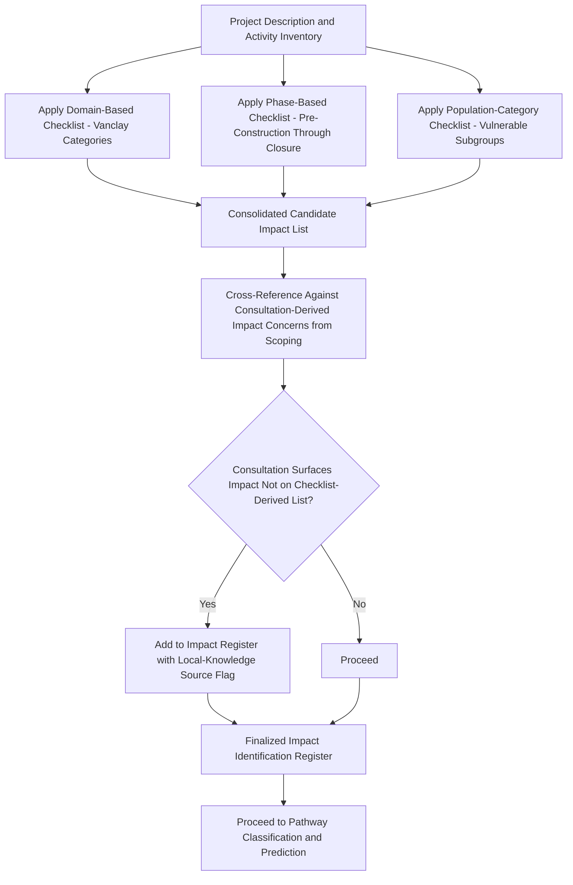

## Impact Identification Frameworks and Checklists

### Overview

Impact identification frameworks and checklists are structured analytical tools used to systematically surface the full range of potential social impacts a project may generate, before detailed prediction and significance analysis begins. Their core function is to guard against the primary risk of unstructured impact identification: that analysts, however experienced, will reliably notice impacts salient to their own disciplinary training or the most visible project activities while overlooking less obvious but potentially significant impact categories. This item surveys the major frameworks and checklist typologies used in SIA practice and their appropriate application within the broader impact identification and prediction stage.

### Key Points

- Checklists and frameworks are identification aids, not substitutes for context-specific analysis — a checklist surfaces candidate impacts requiring case-specific investigation, it does not itself determine significance or applicability.
- The most widely referenced disciplinary framework is Vanclay's social impact categories, which structures identification around domains of social life rather than project activities.
- Checklist-based identification should be triangulated against consultation-derived impact identification (from scoping workshops and baseline engagement), since checklists reflect accumulated professional experience across many prior projects but cannot capture context-specific concerns unique to the particular community.
- Different frameworks organize identification along different axes (impact domain, project phase, affected population category, or impact pathway type), and mature SIA practice typically applies more than one framework in combination rather than relying on a single checklist.

### Vanclay's Social Impact Categories (Domain-Based Framework)

The most widely cited disciplinary framework in SIA practice, developed to ensure impact identification spans the full range of ways a project can affect people, not solely economic or environmental-adjacent concerns. The framework identifies impact domains including:

- **Way of life** — how people live, work, play, and interact day to day.
- **Culture** — shared beliefs, customs, values, and language.
- **Community** — cohesion, stability, character, services, and facilities.
- **Political systems** — extent to which people can participate in decisions affecting their lives, the level of democratization, and resources provided for this purpose.
- **Environment** — quality of air and water people use, availability and quality of food, level of hazard/risk, dust, and noise to which people are exposed, and the adequacy of sanitation and physical safety.
- **Health and wellbeing** — physical, mental, and social wellbeing.
- **Personal and property rights** — particularly whether people are economically affected, or experience personal disadvantage that may include a violation of civil liberties.
- **Fears and aspirations** — perceptions about safety, fears about the future, and aspirations for the future.

**Application value:** because this framework organizes identification by domain of social life rather than by project activity, it systematically prompts consideration of categories (political participation, fears/aspirations, cultural practice) that activity-focused checklists frequently omit.

### Impact Identification by Project Phase

A complementary organizing framework structures identification chronologically, since different project phases generate substantially different impact profiles:

| Phase | Characteristic Impact Categories |
| --- | --- |
| Pre-construction / planning | Speculative land transactions, anticipatory anxiety/fear, early community division over project support/opposition |
| Construction | Physical/economic displacement, in-migration of workforce, construction traffic/noise/dust exposure, temporary local employment |
| Operation | Ongoing operational employment, sustained induced in-migration effects, long-term environmental/health exposure pathways, benefit-sharing/revenue effects |
| Decommissioning/closure | Employment loss, loss of community development program support, infrastructure legacy/handover impacts |

### Impact Identification by Affected Population Category

A distinct organizing axis prompts identification of impacts differentiated by population subgroup rather than by domain or phase, directly linked to vulnerability and differential impact analysis:

- Impacts specific to Indigenous Peoples/ethnic minorities (cultural, ancestral domain, FPIC-related).
- Impacts specific to women (differentiated livelihood, time-burden, decision-making access, protection risks).
- Impacts specific to children and youth (education access, child protection risks associated with in-migration).
- Impacts specific to elderly, disabled, or otherwise physically vulnerable populations (differentiated resilience, access barriers).
- Impacts specific to economically marginalized/tenure-insecure populations (differential exposure to displacement without formal compensation eligibility).

### Impact Identification Matrix Structure

A common practical tool combines the domain-based and pathway-based frameworks into a single matrix, cross-referencing project activities against impact domains to systematically surface interaction points:

| Project Activity ↓ / Impact Domain → | Way of Life | Culture | Community | Health/Wellbeing | Personal/Property Rights | Fears/Aspirations |
| --- | --- | --- | --- | --- | --- | --- |
| Land acquisition | Check | Check (if ancestral) | Check | — | Check | Check |
| Workforce mobilization | Check | — | Check | Check | — | Check |
| Construction activity (noise/dust) | Check | Check (if near sacred sites) | — | Check | — | Check |
| Operational water use | Check | Check (if ritual water use) | — | Check | Check | — |
| Project revenue/benefit-sharing | — | — | Check | — | Check | Check |

**Application note:** cells marked "Check" indicate a candidate impact pathway requiring further case-specific investigation, not a confirmed significant impact — the matrix is a systematic prompt for analysis, and its output feeds into the pathway classification and significance rating stages addressed elsewhere.

### Identification Process Architecture

**Why the consultation cross-reference step is essential:** checklists, however comprehensive, are built from the accumulated pattern of impacts observed across prior projects — they cannot, by construction, anticipate a genuinely novel or highly context-specific local concern (e.g., a specific ritual practice tied to a particular seasonal water condition unique to that community). The workflow above explicitly treats consultation-derived input as a check against, and supplement to, checklist-derived identification rather than treating either source as independently sufficient.

### Lender and Regulatory Framework Checklists

Beyond disciplinary frameworks, most lenders and regulatory bodies maintain their own structured impact identification checklists tied to their specific performance standards, commonly organized around trigger categories:

- **IFC Performance Standards / World Bank ESS structure** — organizes identification around distinct standards (labor and working conditions, resource efficiency/pollution, community health/safety, land acquisition/resettlement, biodiversity, Indigenous Peoples, cultural heritage), each functioning as a checklist prompt for whether that standard's specific trigger conditions are present.
- **Domestic EIA/SIA regulatory checklists** — jurisdiction-specific lists of impact categories required for regulatory compliance documentation, which may differ in structure and terminology from international lender frameworks but generally cover substantially overlapping ground.

[Inference] The degree of overlap between a specific domestic regulatory checklist and international lender frameworks varies by jurisdiction and is not uniform; where a project is subject to both, practitioners should map the two frameworks' categories against each other explicitly to identify and address any gaps rather than assuming full equivalence.

### Practical Application Guidance

- **Use multiple frameworks in combination**, since each organizing axis (domain, phase, population category) surfaces different candidate impacts that a single framework alone would miss.
- **Treat checklist output as a starting hypothesis list**, subject to case-specific verification through baseline data and consultation — not as a predetermined conclusion about which impacts are actually significant for this specific project and context.
- **Document checklist application explicitly** in the SIA report methodology section, including which frameworks were applied and how consultation input was cross-referenced against checklist-derived candidates, providing an auditable record of identification thoroughness.
- **Revisit the identification register periodically**, since new information from later baseline stages, ongoing consultation, or monitoring may surface impacts not identified at the initial screening/scoping stage.

### Common Failure Modes

- **Single-framework reliance** — using only an activity-based checklist (e.g., organized solely around construction activities) and missing impact categories that only a domain-based framework (fears/aspirations, political participation) would prompt consideration of.
- **Checklist as final answer rather than starting hypothesis** — treating checklist-flagged items as confirmed impacts without case-specific verification, or conversely dismissing a checklist-flagged category prematurely without genuine investigation.
- **No consultation cross-reference** — relying exclusively on generic checklists without verifying against community-raised concerns from scoping and baseline engagement, missing context-specific impacts unique to the particular community or location.
- **Static, one-time identification** — treating the impact identification register as fixed after the initial screening/scoping stage, without revisiting it as baseline studies and ongoing consultation surface new information.
- **Undifferentiated identification by population category** — applying a single generic impact list without the population-category lens, missing impacts that are only significant for specific vulnerable subgroups even though the aggregate/general population impact appears minor.

### Related Topics

- Direct, indirect, and induced impact pathways (classification applied to checklist-identified candidates)
- Scoping workshops with stakeholders and regulators (consultation-derived identification source)
- Vulnerability and differential impact analysis (population-category identification lens)
- Impact significance rating methodology
- Cumulative impact assessment methodology
- Integrating social impact assessment within broader ESIA processes (lender/regulatory framework checklist structures)