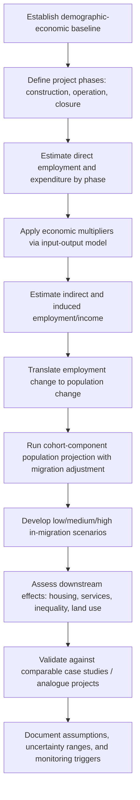

## Predicting Demographic and Economic Change

### Overview

Predicting demographic and economic change is a core technical task within Impact Identification and Prediction in Social Impact Assessment (SIA). It involves forecasting how a proposed project, policy, or development intervention will alter population size, composition, migration patterns, employment structures, income distribution, and local economic activity over time. These predictions establish the baseline against which social impacts (housing demand, service strain, cultural change, inequality) are assessed and monitored.

**Key Points**

- Demographic and economic forecasting is inherently probabilistic; SIA practice treats outputs as scenario-based projections, not deterministic predictions.
- Change is driven by both direct effects (project workforce, direct income) and indirect/induced effects (multiplier effects, in-migration, service sector growth).
- Time horizons typically span construction, operational, and post-closure/decommissioning phases, each with distinct demographic-economic signatures.

---

### Conceptual Framework

#### Demographic Change Components

Demographic change in an impact area is typically decomposed using the standard **demographic balancing equation**:

$$P_{t+1} = P_t + B - D + I - E$$

Where:

- $P_t$ = population at time $t$
- $B$ = births
- $D$ = deaths
- $I$ = in-migration
- $E$ = out-migration

In project-driven SIA, $I$ (in-migration) is usually the dominant and most volatile term, driven by:

- Direct employment (workers relocating)
- Indirect employment (supply chain, services)
- Induced employment (spending multiplier effects)
- Speculative in-migration (people arriving in anticipation of opportunity, not tied to confirmed jobs)

#### Economic Change Components

Economic change is typically modeled across:

- **Employment effects**: direct, indirect, induced jobs
- **Income effects**: wages, transfer payments, business revenue
- **Fiscal effects**: local tax base, public revenue and expenditure shifts
- **Structural effects**: shifts in economic base (e.g., from agriculture to extractive industry or services)
- **Price effects**: inflation in local housing, goods, and services due to demand shocks (sometimes called "boomtown effects")

---

### Standard Predictive Methods

#### 1. Economic Base / Multiplier Analysis

Estimates total employment or income change from a direct change using a multiplier:

$$\Delta E_{total} = \Delta E_{direct} \times M$$

Where $M$ is the employment multiplier (direct + indirect + induced ÷ direct). Multipliers are typically derived from **input-output (I-O) models** (e.g., IMPLAN, national I-O tables) calibrated to the regional economy.

**Example**

A mine project creates 500 direct jobs. Regional I-O analysis for the mining sector yields a multiplier of 1.8. Estimated total employment effect:

$$500 \times 1.8 = 900 \text{ jobs}$$

This 900 includes direct plus indirect/induced jobs in supply chains and local services.

#### 2. Cohort-Component Population Projection

The standard demographic forecasting method, projecting population by age and sex cohort forward using survival ratios, fertility rates, and net migration assumptions.

$$P_{x+5,t+5} = P_{x,t} \times S_x + M_{x,t}$$

Where $S_x$ is the age-specific survival ratio and $M_{x,t}$ is net migration for that cohort. Project-induced migration is added as an exogenous adjustment layered onto the baseline cohort-component projection.

#### 3. Employment-Population Ratio (Shift-Share) Method

Used to translate projected direct/indirect jobs into population change:

$$\Delta P = \frac{\Delta E_{total}}{PR} \times HH$$

Where $PR$ is the regional participation rate (labor force ÷ working-age population) and $HH$ is average household size, converting new workers into total new residents (workers plus dependents).

**Example**

- $\Delta E_{total} = 900$ jobs
- Assume 60% of jobs are filled by in-migrants (rest by local labor force absorption)
- In-migrant workers = 540
- Average household size = 2.8, with 70% of in-migrant workers bringing families
- Estimated population influx ≈ $540 \times [0.3 \times 1 + 0.7 \times 2.8] ≈ 540 \times 2.26 ≈ 1,220$ persons

#### 4. Scenario-Based Forecasting

Because in-migration response is uncertain, SIA practice generates multiple scenarios rather than a single point estimate:

- **Low scenario**: high local labor absorption, low speculative migration
- **Medium scenario**: moderate in-migration matching direct/indirect labor demand
- **High scenario**: significant speculative in-migration, including job-seekers who do not secure employment

This mirrors sensitivity analysis in economic modeling and is considered standard good practice (e.g., per IAIA and World Bank/IFC Performance Standard 1 guidance on induced access and in-migration risk).

---

### Process Flow

---

### Data Sources and Inputs

| Data Type | Typical Source |
| --- | --- |
| Baseline population/demographics | National census, civil registration |
| Fertility/mortality rates | National statistics offices, UN Population Division |
| Employment and wage data | Labor force surveys, sector employment statistics |
| Economic multipliers | Input-output tables (national/regional), IMPLAN, RIMS II |
| Migration history | Census migration modules, household surveys |
| Housing/service capacity | Local government planning records |
| Analogue project data | Post-project monitoring reports from comparable developments |

Analogue (comparable case) analysis is particularly important because greenfield or novel project types often lack local historical precedent; drawing on documented outcomes from similar projects elsewhere is standard practice for calibrating in-migration and multiplier assumptions. [Inference: analogue transferability depends heavily on similarity of labor market conditions, regional accessibility, and pre-existing settlement patterns, and is not guaranteed to hold across contexts.]

---

### Common Pitfalls

- **Ignoring speculative in-migration**: Populations often grow beyond confirmed job creation due to anticipatory migration; models based only on confirmed employment undercount total demographic pressure.
- **Static multiplier assumptions**: Multipliers derived from national or older regional I-O tables may not reflect current, localized economic structure.
- **Neglecting boom-bust cycles**: Construction-phase population surges frequently exceed operational-phase populations, leading to post-construction demographic contraction that itself creates social impacts (housing oversupply, business closures).
- **Undercounting induced effects**: Local service sector growth (retail, housing construction, hospitality) driven by increased incomes is often underestimated relative to direct/indirect industrial employment.
- **Failure to disaggregate by demographic group**: Aggregate population forecasts can mask differential impacts on specific groups (e.g., youth out-migration for opportunity, gender-differentiated employment access).

---

### Monitoring and Validation

Because these are forward-looking estimates, SIA practice requires:

- Establishing **monitoring indicators** (e.g., school enrollment, housing vacancy/occupancy rates, local price indices) tied to projected scenarios
- Setting **trigger thresholds** that prompt management response if actual change diverges significantly from predictions
- Periodic **recalibration** of projections against observed data during construction and early operations

[Unverified: the specific threshold values used for triggers are project- and jurisdiction-specific and cannot be generalized without local baseline data.]

---

### Illustrative Model Structure (svg_diagram)

<svg viewBox="0 0 760 380" xmlns="http://www.w3.org/2000/svg">
<rect x="0" y="0" width="760" height="380" fill="#ffffff"/>
<text x="380" y="24" font-size="15" font-weight="bold" text-anchor="middle" fill="#1a1a1a">Demographic-Economic Prediction Model Structure (svg_diagram)</text>
<rect x="20" y="50" width="180" height="60" rx="6" fill="#e8f0fe" stroke="#4a72b8"/>
<text x="110" y="75" font-size="12" text-anchor="middle" fill="#1a1a1a">Direct Employment</text>
<text x="110" y="93" font-size="12" text-anchor="middle" fill="#1a1a1a">& Expenditure</text>
<rect x="20" y="150" width="180" height="60" rx="6" fill="#e8f0fe" stroke="#4a72b8"/>
<text x="110" y="175" font-size="12" text-anchor="middle" fill="#1a1a1a">Regional Input-Output</text>
<text x="110" y="193" font-size="12" text-anchor="middle" fill="#1a1a1a">Multiplier</text>
<rect x="280" y="100" width="180" height="60" rx="6" fill="#fef3e8" stroke="#c98a3e"/>
<text x="370" y="125" font-size="12" text-anchor="middle" fill="#1a1a1a">Indirect + Induced</text>
<text x="370" y="143" font-size="12" text-anchor="middle" fill="#1a1a1a">Employment / Income</text>
<rect x="280" y="220" width="180" height="60" rx="6" fill="#fef3e8" stroke="#c98a3e"/>
<text x="370" y="245" font-size="12" text-anchor="middle" fill="#1a1a1a">Employment-Population</text>
<text x="370" y="263" font-size="12" text-anchor="middle" fill="#1a1a1a">Conversion (household size)</text>
<rect x="540" y="60" width="200" height="60" rx="6" fill="#e9f7ec" stroke="#3f8f5f"/>
<text x="640" y="85" font-size="12" text-anchor="middle" fill="#1a1a1a">Cohort-Component</text>
<text x="640" y="103" font-size="12" text-anchor="middle" fill="#1a1a1a">Population Projection</text>
<rect x="540" y="180" width="200" height="60" rx="6" fill="#e9f7ec" stroke="#3f8f5f"/>
<text x="640" y="205" font-size="12" text-anchor="middle" fill="#1a1a1a">Low / Medium / High</text>
<text x="640" y="223" font-size="12" text-anchor="middle" fill="#1a1a1a">Migration Scenarios</text>
<rect x="540" y="300" width="200" height="60" rx="6" fill="#fdeaea" stroke="#c14545"/>
<text x="640" y="325" font-size="12" text-anchor="middle" fill="#1a1a1a">Downstream Social</text>
<text x="640" y="343" font-size="12" text-anchor="middle" fill="#1a1a1a">Impact Assessment</text>
<line x1="200" y1="80" x2="280" y2="130" stroke="#555" stroke-width="1.5" marker-end="url(#arrow)"/>
<line x1="200" y1="180" x2="280" y2="130" stroke="#555" stroke-width="1.5" marker-end="url(#arrow)"/>
<line x1="200" y1="180" x2="280" y2="250" stroke="#555" stroke-width="1.5" marker-end="url(#arrow)"/>
<line x1="460" y1="130" x2="540" y2="95" stroke="#555" stroke-width="1.5" marker-end="url(#arrow)"/>
<line x1="460" y1="250" x2="540" y2="210" stroke="#555" stroke-width="1.5" marker-end="url(#arrow)"/>
<line x1="640" y1="120" x2="640" y2="180" stroke="#555" stroke-width="1.5" marker-end="url(#arrow)"/>
<line x1="640" y1="240" x2="640" y2="300" stroke="#555" stroke-width="1.5" marker-end="url(#arrow)"/>
<defs>
<marker id="arrow" markerWidth="8" markerHeight="8" refX="6" refY="3" orient="auto">
<path d="M0,0 L6,3 L0,6 Z" fill="#555"/>
</marker>
</defs>
</svg>

---

### Related Topics

- Cumulative effects assessment (interaction with other planned developments)
- Housing demand and affordability impact modeling
- Boomtown effects and post-construction demographic decline
- Gender-differentiated economic impact analysis
- Indigenous and vulnerable group displacement risk from in-migration
- Fiscal impact assessment for local government service capacity
- Induced access risk under IFC Performance Standard 1 / 5
- Regional input-output model construction and calibration