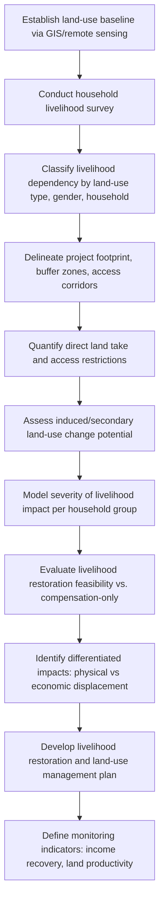

## Predicting Impacts on Livelihoods and Land Use

### Overview

Predicting impacts on livelihoods and land use involves forecasting how a project or intervention will alter the ways affected communities derive their income, subsistence, and material well-being (livelihoods), and how it will change the availability, access, and use of land and natural resources upon which those livelihoods often depend. This is a central analytical task in SIA because livelihood and land-use changes frequently cascade into food security, resettlement, cultural disruption, and inequality impacts.

**Key Points**

- Livelihoods and land use are treated as interlinked systems, not separate variables — land access changes are often the primary transmission mechanism for livelihood impacts.
- Prediction requires establishing a livelihood baseline disaggregated by household type, gender, and resource dependency, not just aggregate land-use statistics.
- International standards (e.g., IFC Performance Standard 5, World Bank ESS5) treat livelihood restoration — not just compensation — as the benchmark for adequate impact management.

---

### Conceptual Framework

#### Livelihoods Framework

The **Sustainable Livelihoods Framework (SLF)**, originally developed by DFID and widely used in SIA, models livelihoods as dependent on five capital assets:

| Capital Type | Examples |
| --- | --- |
| Natural | Land, water, forests, fisheries |
| Physical | Infrastructure, tools, equipment |
| Human | Labor, skills, health, education |
| Financial | Savings, credit, income, remittances |
| Social | Networks, institutions, kinship ties |

A project's land-use change typically depletes natural capital directly, then triggers cascading effects across the other four. Livelihood impact prediction traces these cascades rather than treating land loss as a single isolated effect.

#### Land Use Change Pathways

Land use impacts on livelihoods generally occur through:

- **Direct land acquisition/take**: physical loss of agricultural, grazing, or residential land
- **Economic displacement**: loss of access to land or resources without physical relocation (e.g., restricted access to a fishing ground, forest, or grazing route)
- **Physical displacement**: relocation of people from land they occupy
- **Induced land-use change**: secondary conversion of land driven by in-migration, speculation, or changed market access (e.g., forest clearing for new settlements near a project)

---

### Standard Predictive Methods

#### 1. Land-Use and Livelihood Baseline Mapping

Combines remote sensing/GIS land-cover classification with household-level livelihood surveys to establish:

- Current land-use categories (cropland, grazing, forest, residential, common property resources)
- Household-level dependency on each land-use category (e.g., % of household income or subsistence from cropland vs. wage labor)
- Seasonal and gendered patterns of land use (e.g., women's use of communal land for fuelwood/water collection often differs from men's agricultural land use)

**Example**

A baseline survey in a project-affected area finds:

- 65% of households depend on rain-fed cropland for >50% of subsistence
- 20% depend primarily on livestock grazing on common land
- 15% depend on non-farm wage labor

If the project acquires the highest-quality cropland, the impact model would predict disproportionate effects on the 65% cropland-dependent group, not a uniform per-household impact.

#### 2. Land Take and Displacement Quantification

$$A_{affected} = A_{project} + A_{buffer} + A_{induced}$$

Where:

- $A_{project}$ = direct footprint of project infrastructure
- $A_{buffer}$ = restricted-access buffer/safety zones
- $A_{induced}$ = secondary land conversion from in-migration or access road development

Livelihood impact severity is then estimated as a function of land dependency and the proportion of a household's productive land affected:

$$Severity_h = D_h \times \frac{A_{lost,h}}{A_{total,h}}$$

Where $D_h$ is the household's degree of livelihood dependency on that land type (0–1 scale) and the fraction represents proportion of productive land lost.

#### 3. Replacement Cost and Livelihood Restoration Modeling

Rather than only valuing lost land at market/replacement cost, SIA practice models whether **livelihood restoration** is achievable:

- Identify replacement land of equivalent productive capacity (not just equivalent area)
- Estimate transition period income loss (time to reach pre-project productivity on replacement land or in alternative livelihoods)
- Model livelihood diversification options (skills training, alternative employment) where land-based restoration is infeasible

**Example**

A household loses 2 hectares of irrigated cropland yielding $1,200/year net income. Replacement land offered is 2.5 hectares of unirrigated land with estimated yield capacity of $700/year absent additional investment. The predicted impact includes both the immediate loss and the **ongoing income gap** unless irrigation infrastructure or another compensating measure is included — a livelihood restoration deficit, not a one-time compensation event. [Inference: the projected income gap assumes no adaptive behavior change by the household; actual outcomes may differ based on household-specific adaptive capacity.]

#### 4. Cumulative and Induced Land-Use Change Modeling

Access roads, transmission corridors, and in-migration settlements frequently drive land-use change beyond the direct project footprint. This is typically modeled using:

- GIS-based accessibility/proximity analysis (land near new roads has elevated conversion probability)
- Historical analogue rates of induced deforestation/conversion from comparable projects
- Scenario modeling paralleling the demographic in-migration scenarios (low/medium/high induced conversion)

---

### Process Flow

---

### Differentiating Physical vs. Economic Displacement

| Dimension | Physical Displacement | Economic Displacement |
| --- | --- | --- |
| Definition | Loss of residence/shelter | Loss of land/asset access without relocation |
| Typical trigger | Land acquisition for footprint | Access restriction, resource competition |
| Standard response | Resettlement (in-kind or cash) | Livelihood restoration/compensation |
| Governing standard | IFC PS5, World Bank ESS5 | IFC PS5, World Bank ESS5 |
| Common oversight risk | Under-scoping affected population | Underestimating indirect resource users |

A common methodological error is scoping only titled landholders as "affected," which excludes non-titled users such as tenants, seasonal grazers, and common-property resource users who may bear substantial livelihood impact without formal land rights. [Unverified: the extent of undercounting varies significantly by jurisdiction and land tenure system and cannot be generalized numerically.]

---

### Common Pitfalls

- **Treating land loss as purely economic**: Ignoring cultural, spiritual, and social value of land (e.g., ancestral or sacred sites) understates true impact severity.
- **Static baseline assumptions**: Livelihood baselines can shift seasonally (e.g., dry-season vs. wet-season land use); single-point surveys risk missing critical dependency patterns.
- **Undercounting common property resource users**: Communal grazing, fishing, or forest-gathering rights are often informally held and excluded from formal land registries.
- **Ignoring gender-differentiated land use**: Men and women frequently use and control different land types/resources; aggregate household-level analysis can mask impacts on women's livelihood activities specifically.
- **Assuming compensation equals restoration**: Cash or in-kind compensation does not automatically restore pre-project livelihood productivity, especially where skills, market access, or soil quality differ.

---

### Monitoring and Validation

- **Livelihood recovery indicators**: household income/consumption tracked against pre-project baseline over multiple years post-transition
- **Land productivity monitoring**: yield/output on replacement land compared to lost land
- **Grievance mechanism data**: land and livelihood-related grievances tracked as an early warning indicator of prediction failure
- **Independent livelihood restoration audits**: periodic third-party assessment against restoration targets, standard practice under IFC PS5-aligned projects

---

### Illustrative Impact Pathway (svg_diagram)

<svg xmlns="http://www.w3.org/2000/svg" viewBox="0 0 760 340">
<rect x="0" y="0" width="760" height="340" fill="#ffffff" />
<text x="380" y="24" font-size="15" font-weight="bold" text-anchor="middle" fill="#1a1a1a">Land Use to Livelihood Impact Pathway (svg_diagram)</text>
<rect x="20" y="60" width="170" height="55" rx="6" fill="#e8f0fe" stroke="#4a72b8" />
<text x="105" y="82" font-size="12" text-anchor="middle" fill="#1a1a1a">Project Land</text>
<text x="105" y="99" font-size="12" text-anchor="middle" fill="#1a1a1a">Take / Access Restriction</text>
<rect x="240" y="30" width="170" height="55" rx="6" fill="#fef3e8" stroke="#c98a3e" />
<text x="325" y="52" font-size="12" text-anchor="middle" fill="#1a1a1a">Loss of Natural</text>
<text x="325" y="69" font-size="12" text-anchor="middle" fill="#1a1a1a">Capital (land/resources)</text>
<rect x="240" y="110" width="170" height="55" rx="6" fill="#fef3e8" stroke="#c98a3e" />
<text x="325" y="132" font-size="12" text-anchor="middle" fill="#1a1a1a">Physical vs Economic</text>
<text x="325" y="149" font-size="12" text-anchor="middle" fill="#1a1a1a">Displacement</text>
<rect x="460" y="10" width="170" height="55" rx="6" fill="#e9f7ec" stroke="#3f8f5f" />
<text x="545" y="32" font-size="12" text-anchor="middle" fill="#1a1a1a">Income / Subsistence</text>
<text x="545" y="49" font-size="12" text-anchor="middle" fill="#1a1a1a">Loss</text>
<rect x="460" y="90" width="170" height="55" rx="6" fill="#e9f7ec" stroke="#3f8f5f" />
<text x="545" y="112" font-size="12" text-anchor="middle" fill="#1a1a1a">Social/Cultural</text>
<text x="545" y="129" font-size="12" text-anchor="middle" fill="#1a1a1a">Capital Erosion</text>
<rect x="460" y="170" width="170" height="55" rx="6" fill="#e9f7ec" stroke="#3f8f5f" />
<text x="545" y="192" font-size="12" text-anchor="middle" fill="#1a1a1a">Induced Land-Use</text>
<text x="545" y="209" font-size="12" text-anchor="middle" fill="#1a1a1a">Change (in-migration)</text>
<rect x="260" y="250" width="300" height="60" rx="6" fill="#fdeaea" stroke="#c14545" />
<text x="410" y="275" font-size="12" text-anchor="middle" fill="#1a1a1a">Livelihood Restoration Plan</text>
<text x="410" y="293" font-size="12" text-anchor="middle" fill="#1a1a1a">(replacement land, diversification, monitoring)</text>
<line x1="190" y1="85" x2="240" y2="57" stroke="#555" stroke-width="1.5" marker-end="url(#arrow2)" />
<line x1="190" y1="90" x2="240" y2="137" stroke="#555" stroke-width="1.5" marker-end="url(#arrow2)" />
<line x1="410" y1="55" x2="460" y2="37" stroke="#555" stroke-width="1.5" marker-end="url(#arrow2)" />
<line x1="410" y1="60" x2="460" y2="115" stroke="#555" stroke-width="1.5" marker-end="url(#arrow2)" />
<line x1="410" y1="140" x2="460" y2="197" stroke="#555" stroke-width="1.5" marker-end="url(#arrow2)" />
<line x1="545" y1="65" x2="450" y2="250" stroke="#555" stroke-width="1.5" marker-end="url(#arrow2)" />
<line x1="545" y1="145" x2="450" y2="250" stroke="#555" stroke-width="1.5" marker-end="url(#arrow2)" />
<line x1="545" y1="225" x2="450" y2="250" stroke="#555" stroke-width="1.5" marker-end="url(#arrow2)" />
</svg>

---

### Related Topics

- Resettlement Action Plan (RAP) and Livelihood Restoration Plan (LRP) development
- IFC Performance Standard 5 / World Bank ESS5 compliance requirements
- Common property resource governance and customary land tenure
- Gender-differentiated livelihood impact assessment
- Cumulative land-use change and induced deforestation modeling
- Food security and subsistence impact analysis
- Compensation valuation methods (replacement cost vs. market value)
- Grievance redress mechanisms for land and livelihood disputes