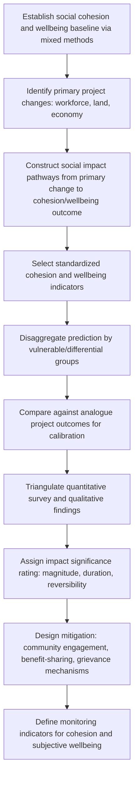

## Predicting Impacts on Social Cohesion and Wellbeing

### Overview

Predicting impacts on social cohesion and wellbeing involves forecasting how a project or intervention will affect the intangible but measurable social fabric of affected communities: trust, relationships, sense of place, community identity, and subjective quality of life. Unlike demographic or land-use change, these impacts are harder to quantify directly and are typically assessed through validated proxy indicators, qualitative-quantitative hybrid methods, and pathway-based causal reasoning rather than purely numerical models.

**Key Points**

- Social cohesion and wellbeing impacts are frequently secondary/derived effects — they emerge from primary impacts (demographic change, land loss, employment shifts) rather than occurring independently.
- Prediction relies heavily on validated social indicators and community-based qualitative data, triangulated with structured survey instruments, rather than a single quantitative formula.
- These impacts are highly context- and culture-dependent, making analogue transferability weaker than for demographic/economic projections.

---

### Conceptual Framework

#### Social Cohesion

Social cohesion is generally understood via three interlinked dimensions:

| Dimension | Description | Example Indicator |
| --- | --- | --- |
| Bonding social capital | Ties within a homogenous group (family, close community) | Frequency of mutual aid/reciprocity |
| Bridging social capital | Ties across different groups within a community | Inter-group cooperation, shared institutions |
| Linking social capital | Ties to external institutions/authorities | Trust in local government, access to formal grievance channels |

Project impacts can strengthen or erode any of these dimensions independently — e.g., in-migration may weaken bonding capital in a host community while creating new bridging capital between long-term residents and newcomers.

#### Wellbeing

SIA typically distinguishes:

- **Objective wellbeing**: measurable material conditions (income, health, housing, education access)
- **Subjective wellbeing (SWB)**: self-reported life satisfaction, sense of security, and psychological wellbeing

Both are tracked because objective improvements (e.g., increased local income) do not guarantee subjective wellbeing improvements, and can even coincide with declines if accompanied by social disruption, inequality, or loss of place attachment. [Inference: the direction and magnitude of this divergence is context-specific and not predictable from objective indicators alone.]

---

### Standard Predictive Methods

#### 1. Social Impact Pathway (Causal Chain) Analysis

The dominant method for predicting cohesion/wellbeing impacts is tracing causal pathways from a primary project action to a wellbeing outcome, rather than direct quantitative modeling.

**Example pathway**

1. Project brings large temporary workforce (primary change)
2. Workforce housed in "man camps" near host community (intermediate change)
3. Increased demand on local services and price inflation (intermediate change)
4. Perceived inequality between newcomers and long-term residents (social change)
5. Decline in inter-group trust and increased social tension (cohesion impact)
6. Reduced sense of safety and community satisfaction (wellbeing impact)

Each link in the chain is assessed for plausibility, likelihood, and reversibility, often using evidence from documented analogue cases as supporting justification.

#### 2. Indicator-Based Assessment

Standardized indicator sets are used to make cohesion/wellbeing prediction more systematic and comparable across baseline and projected states:

**Common cohesion indicators**

- Community participation rates in local organizations/events
- Perceived trust in neighbors and institutions (survey-based, e.g., Likert scale)
- Incidence of intergroup conflict or disputes
- Membership diversity in community groups

**Common wellbeing indicators**

- Self-rated life satisfaction (e.g., Cantril Ladder scale, 0–10)
- Perceived safety and security
- Sense of place attachment
- Health and psychosocial stress indicators

**Example**

A baseline survey using a 0–10 life satisfaction scale finds a community mean of 6.4. Following comparable projects, post-construction-phase analogue data shows a typical dip of 0.5–1.0 points due to construction disruption, with partial recovery during stable operations. This analogue-informed range — rather than a single predicted value — is used to bound the forecast: predicted range of 5.4–5.9 during construction, with expected partial recovery toward 6.0–6.5 in stable operations. [Inference: analogue-based ranges assume comparable disruption magnitude and community resilience; actual outcomes may diverge based on local mitigation measures and community-specific resilience factors.]

#### 3. Social Vulnerability and Differential Impact Screening

Cohesion and wellbeing impacts are rarely uniform across a community. Standard practice disaggregates prediction by vulnerability characteristics:

$$Impact_{group} = f(Exposure_{group}, Sensitivity_{group}, AdaptiveCapacity_{group})$$

Groups commonly screened include: women, youth, elderly, low-income households, ethnic/religious minorities, and Indigenous peoples — since exposure to the same primary change (e.g., in-migration) can produce very different cohesion/wellbeing outcomes depending on a group's social position and adaptive capacity.

#### 4. Mixed-Methods Triangulation

Because self-reported cohesion/wellbeing data is subject to bias (social desirability, recall bias, survey fatigue), predictions are typically triangulated across:

- **Quantitative surveys** (structured indicator instruments)
- **Qualitative methods** (focus groups, key informant interviews, most-significant-change narratives)
- **Observational/secondary data** (crime statistics, service utilization records, local media/conflict reporting)

Convergence across methods increases confidence in the prediction; divergence flags areas requiring further investigation before finalizing impact significance ratings.

---

### Process Flow

---

### Assigning Impact Significance

Since cohesion/wellbeing impacts cannot be reduced to a single numeric output, significance is typically assessed using a structured qualitative rating matrix combining:

| Factor | Rating Scale |
| --- | --- |
| Magnitude | Negligible / Minor / Moderate / Major |
| Duration | Short-term (construction) / Medium-term / Long-term (permanent) |
| Extent | Localized / Community-wide / Regional |
| Reversibility | Reversible / Partially reversible / Irreversible |
| Likelihood | Unlikely / Possible / Likely / Certain |

Combining these dimensions (often via a significance matrix) produces an overall impact significance rating (e.g., Low/Moderate/High), which is standard practice in impact assessment frameworks (e.g., IAIA guidance, IFC Performance Standards implementation).

---

### Common Pitfalls

- **Overreliance on aggregate indicators**: Community-level averages can mask significant cohesion decline within a specific subgroup even when overall scores appear stable.
- **Treating cohesion as static**: Baseline cohesion can already be in flux (e.g., pre-existing tensions, prior development history); attributing all subsequent change to the current project overstates causal certainty.
- **Underestimating indirect pathways**: Cohesion impacts often arise from second- or third-order effects (e.g., inflation → inequality → resentment) rather than direct project actions, making them easy to underweight in impact identification.
- **Survey bias in politically sensitive contexts**: Respondents may underreport dissatisfaction or conflict where there is fear of repercussion, requiring careful survey design and trusted, independent data collection.
- **Ignoring positive cohesion pathways**: Prediction frameworks focused only on risk can miss legitimate positive pathways (e.g., new shared infrastructure, community investment programs) that can strengthen bridging social capital.

---

### Monitoring and Validation

- **Repeated indicator surveys**: cohesion/wellbeing indicators re-measured at defined intervals (pre-construction, construction, operations) against baseline
- **Grievance and conflict tracking**: frequency/type of grievances as a leading indicator of cohesion strain
- **Community feedback loops**: structured mechanisms (e.g., community liaison committees) to surface emerging cohesion issues before they escalate
- **Independent qualitative review**: periodic third-party qualitative assessment to validate whether quantitative indicator trends reflect lived community experience

---

### Illustrative Causal Pathway (svg_diagram)

<svg viewBox="0 0 780 300" xmlns="http://www.w3.org/2000/svg">
<rect x="0" y="0" width="780" height="300" fill="#ffffff"/>
<text x="390" y="24" font-size="15" font-weight="bold" text-anchor="middle" fill="#1a1a1a">Social Cohesion Impact Causal Chain (svg_diagram)</text>
<rect x="10" y="120" width="130" height="60" rx="6" fill="#e8f0fe" stroke="#4a72b8"/>
<text x="75" y="145" font-size="11" text-anchor="middle" fill="#1a1a1a">Large Temporary</text>
<text x="75" y="162" font-size="11" text-anchor="middle" fill="#1a1a1a">Workforce Influx</text>
<rect x="170" y="120" width="130" height="60" rx="6" fill="#fef3e8" stroke="#c98a3e"/>
<text x="235" y="145" font-size="11" text-anchor="middle" fill="#1a1a1a">Service Demand &</text>
<text x="235" y="162" font-size="11" text-anchor="middle" fill="#1a1a1a">Price Inflation</text>
<rect x="330" y="120" width="130" height="60" rx="6" fill="#fef3e8" stroke="#c98a3e"/>
<text x="395" y="145" font-size="11" text-anchor="middle" fill="#1a1a1a">Perceived Inequality</text>
<text x="395" y="162" font-size="11" text-anchor="middle" fill="#1a1a1a">Newcomers/Residents</text>
<rect x="490" y="60" width="130" height="60" rx="6" fill="#fdeaea" stroke="#c14545"/>
<text x="555" y="85" font-size="11" text-anchor="middle" fill="#1a1a1a">Decline in</text>
<text x="555" y="102" font-size="11" text-anchor="middle" fill="#1a1a1a">Inter-group Trust</text>
<rect x="490" y="180" width="130" height="60" rx="6" fill="#fdeaea" stroke="#c14545"/>
<text x="555" y="205" font-size="11" text-anchor="middle" fill="#1a1a1a">Reduced Perceived</text>
<text x="555" y="222" font-size="11" text-anchor="middle" fill="#1a1a1a">Safety</text>
<rect x="650" y="120" width="120" height="60" rx="6" fill="#e9f7ec" stroke="#3f8f5f"/>
<text x="710" y="145" font-size="11" text-anchor="middle" fill="#1a1a1a">Lower Subjective</text>
<text x="710" y="162" font-size="11" text-anchor="middle" fill="#1a1a1a">Wellbeing</text>
<line x1="140" y1="150" x2="170" y2="150" stroke="#555" stroke-width="1.5" marker-end="url(#arrow3)"/>
<line x1="300" y1="150" x2="330" y2="150" stroke="#555" stroke-width="1.5" marker-end="url(#arrow3)"/>
<line x1="460" y1="140" x2="490" y2="105" stroke="#555" stroke-width="1.5" marker-end="url(#arrow3)"/>
<line x1="460" y1="160" x2="490" y2="205" stroke="#555" stroke-width="1.5" marker-end="url(#arrow3)"/>
<line x1="620" y1="95" x2="650" y2="140" stroke="#555" stroke-width="1.5" marker-end="url(#arrow3)"/>
<line x1="620" y1="205" x2="650" y2="160" stroke="#555" stroke-width="1.5" marker-end="url(#arrow3)"/>
<defs>
<marker id="arrow3" markerWidth="8" markerHeight="8" refX="6" refY="3" orient="auto">
<path d="M0,0 L6,3 L0,6 Z" fill="#555"/>
</marker>
</defs>
</svg>

---

### Related Topics

- Social capital theory and bonding/bridging/linking frameworks
- Subjective wellbeing measurement (Cantril Ladder, life satisfaction scales)
- Social impact significance rating matrices
- Vulnerable and differentiated group impact screening
- Grievance redress mechanism design
- Community liaison and ongoing engagement structures
- In-migration and host-community relations management
- Benefit-sharing mechanisms and community investment planning