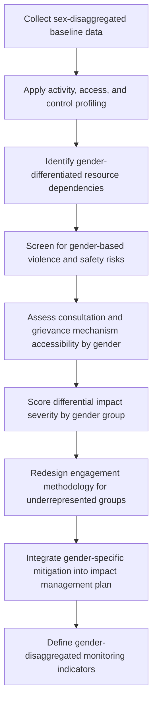

## Gender-Differentiated Impact Analysis

### Overview

Gender-differentiated impact analysis is the systematic process of identifying, predicting, and evaluating how a project's impacts affect women, men, and gender-diverse individuals differently, rather than assuming a uniform effect across a community or household. It is a cross-cutting analytical method applied within Impact Identification and Prediction because gender shapes access to resources, division of labor, decision-making power, and exposure to risk in ways that generic impact assessments often fail to capture.

**Key Points**

- Gender-differentiated analysis is not a separate impact category but a lens applied across all other impact areas (demographic, economic, livelihood, land use, cohesion, health, safety).
- Aggregated household-level data frequently masks intra-household inequality; gender analysis requires disaggregation below the household level.
- International standards (IFC Performance Standards, World Bank ESF, UN Guiding Principles on Business and Human Rights) increasingly require explicit gender-differentiated assessment, not optional add-on treatment.

---

### Conceptual Framework

#### Why Impacts Are Gender-Differentiated

Gendered impact divergence arises from structural factors common across many (not all) contexts:

- **Division of labor**: Women and men often perform different productive and reproductive tasks (e.g., women managing water/fuelwood collection, subsistence farming; men engaged in cash-crop or wage labor)
- **Asset and land tenure disparities**: Land titles, compensation payments, and formal contracts are frequently registered in men's names, even where women are primary land users
- **Decision-making access**: Women may be excluded from consultation processes, community meetings, or negotiation forums due to social norms, timing of engagement activities, or literacy barriers
- **Differential exposure to risk**: Physical and economic displacement, in-migration-driven social change, and workforce camps can create gender-specific risks (e.g., gender-based violence, increased unpaid care burden)

[Inference: the specific structural factors present, and their magnitude, vary substantially by cultural, legal, and socioeconomic context and should not be assumed present without local verification.]

#### Gender Analysis Frameworks

Commonly applied frameworks include:

| Framework | Focus |
| --- | --- |
| Harvard Analytical Framework | Activity profile, access/control profile, influencing factors |
| Moser Gender Planning Framework | Triple role (productive, reproductive, community), practical vs. strategic gender needs |
| Social Relations Approach | Institutional analysis of gender relations across household, market, state, community |
| Gender and Development (GAD) | Structural power relations and systemic change, beyond welfare-only interventions |

Most SIA practice draws on elements of the Harvard and Moser frameworks for their practical applicability to baseline data collection and impact prediction.

---

### Standard Analytical Methods

#### 1. Sex-Disaggregated Baseline Data Collection

The foundational requirement: all baseline demographic, economic, livelihood, and land-use data collected in a form that can be disaggregated by sex (and ideally further by age, disability, and household headship).

**Minimum disaggregation targets**

- Employment/income data by sex
- Land/asset ownership and control (not just usage) by sex
- Time-use data (productive, reproductive, community labor) by sex
- Decision-making role in household and community by sex
- Access to project consultation/grievance mechanisms by sex

#### 2. Activity, Access, and Control Profiling (Harvard Framework)

Maps three layers for each livelihood/resource activity:

| Layer | Question |
| --- | --- |
| Activity profile | Who does what task, and how much time does it take? |
| Access and control profile | Who has access to a resource, and who controls decisions over its use/disposal? |
| Influencing factors | What social, economic, cultural, or legal factors shape the above patterns? |

**Example**

Activity: Fuelwood collection

- Activity profile: primarily performed by women and girls, several hours/week
- Access/control: women have access to collect fuelwood from communal land, but do not control decisions about land use changes to that land
- Influencing factor: customary land governance vests land-use decision authority in male household/community heads

If the project restricts access to that communal land, the activity/access/control profile predicts that **women bear the direct time/labor burden increase** (having to travel further for fuelwood) while **compensation negotiations may occur primarily with male decision-makers**, unless the assessment and engagement process explicitly corrects for this.

#### 3. Differential Impact Severity Scoring

Extends the general impact severity approach with a gender-disaggregation term:

$$Severity_{g,h} = D_{g,h} \times \frac{ResourceLoss_h}{TotalResource_h} \times VulnerabilityWeight_g$$

Where $g$ denotes gender group, $D_{g,h}$ is that group's degree of dependency on the affected resource/activity within household $h$, and $VulnerabilityWeight_g$ reflects reduced adaptive capacity due to structural constraints (e.g., limited alternative income options, restricted mobility). This is typically applied qualitatively via structured scoring rather than as a strict numeric formula, given the difficulty of empirically validating precise weights. [Unverified: numeric vulnerability weights are context-specific judgments, not standardized coefficients, and should be treated as illustrative rather than a validated formula.]

#### 4. Gender-Based Violence (GBV) Risk Screening

A specific, high-priority component of gender-differentiated analysis, particularly for projects involving:

- Large temporary workforces (construction camps)
- Significant in-migration
- Physical or economic displacement
- Infrastructure changes affecting women's mobility/safety (e.g., new roads, altered travel patterns to water/fuel sources)

Standard practice (aligned with IFC/World Bank good practice notes on GBV) includes:

- Mapping GBV risk factors against project phases and locations
- Assessing existing referral pathways and service capacity (health, psychosocial, legal) in the project area
- Incorporating GBV risk mitigation into worker codes of conduct and grievance mechanisms

#### 5. Gender-Responsive Consultation Design

Because standard consultation formats (public meetings, daytime sessions, mixed-gender forums) can systematically underrepresent women's voices, gender-differentiated analysis includes assessing and redesigning engagement methodology itself:

- Separate women-only focus groups or interviews
- Locally appropriate timing/location (accounting for women's time-use burden)
- Female facilitators/enumerators where culturally appropriate
- Alternative channels for input where literacy or mobility is a barrier

---

### Process Flow

---

### Application Across Impact Categories

| Impact Category | Gender-Differentiated Consideration |
| --- | --- |
| Demographic/economic change | Differential access to new jobs by gender; unpaid care burden from in-migration-driven service strain |
| Livelihoods/land use | Compensation payee vs. actual resource user mismatch; gendered land-use activities |
| Social cohesion/wellbeing | Gendered access to social networks and decision-making forums |
| Health and safety | GBV risk from workforce influx; reproductive health service access |
| Resettlement | Land title registration patterns; women's role in relocation decision-making |

---

### Common Pitfalls

- **Treating "household" as gender-neutral unit**: Assuming household-level compensation or consultation adequately represents all household members' interests.
- **Compensation misalignment**: Paying land/asset compensation only to registered (often male) titleholders when women are primary users of the affected resource.
- **Consultation fatigue bias**: Relying on the same few "representative" attendees at public meetings, who are disproportionately likely to be male community leaders.
- **Assuming universal applicability of gender roles**: Applying gender role assumptions from one cultural context to another without local verification.
- **Under-resourcing GBV risk assessment**: Treating GBV screening as a checkbox rather than a substantive risk assessment with dedicated mitigation measures and monitoring.
- **Ignoring gender-diverse and non-binary populations**: Binary male/female disaggregation alone can miss impacts on gender-diverse individuals facing distinct risks.

---

### Monitoring and Validation

- **Sex-disaggregated indicator tracking**: all standard SIA monitoring indicators (income, land access, cohesion, wellbeing) tracked and reported disaggregated by gender, not only in aggregate
- **GBV incident and service-utilization monitoring**: tracked through confidential, survivor-centered reporting channels, separate from general grievance mechanisms
- **Consultation participation tracking**: attendance and voice/input metrics by gender across engagement events
- **Periodic gender audit**: independent review of whether mitigation measures are reaching intended gender groups as designed

---

### Illustrative Analytical Structure (svg_diagram)

<svg xmlns="http://www.w3.org/2000/svg" viewBox="0 0 760 320">
<rect x="0" y="0" width="760" height="320" fill="#ffffff" />
<text x="380" y="24" font-size="15" font-weight="bold" text-anchor="middle" fill="#1a1a1a">Gender-Differentiated Impact Analysis Structure (svg_diagram)</text>
<rect x="20" y="60" width="200" height="55" rx="6" fill="#e8f0fe" stroke="#4a72b8" />
<text x="120" y="82" font-size="12" text-anchor="middle" fill="#1a1a1a">Sex-Disaggregated</text>
<text x="120" y="99" font-size="12" text-anchor="middle" fill="#1a1a1a">Baseline Data</text>
<rect x="20" y="150" width="200" height="55" rx="6" fill="#e8f0fe" stroke="#4a72b8" />
<text x="120" y="172" font-size="12" text-anchor="middle" fill="#1a1a1a">Activity / Access /</text>
<text x="120" y="189" font-size="12" text-anchor="middle" fill="#1a1a1a">Control Profiling</text>
<rect x="280" y="20" width="200" height="55" rx="6" fill="#fef3e8" stroke="#c98a3e" />
<text x="380" y="42" font-size="12" text-anchor="middle" fill="#1a1a1a">Differential Severity</text>
<text x="380" y="59" font-size="12" text-anchor="middle" fill="#1a1a1a">Scoring</text>
<rect x="280" y="100" width="200" height="55" rx="6" fill="#fef3e8" stroke="#c98a3e" />
<text x="380" y="122" font-size="12" text-anchor="middle" fill="#1a1a1a">GBV Risk</text>
<text x="380" y="139" font-size="12" text-anchor="middle" fill="#1a1a1a">Screening</text>
<rect x="280" y="180" width="200" height="55" rx="6" fill="#fef3e8" stroke="#c98a3e" />
<text x="380" y="202" font-size="12" text-anchor="middle" fill="#1a1a1a">Consultation Design</text>
<text x="380" y="219" font-size="12" text-anchor="middle" fill="#1a1a1a">Redesign</text>
<rect x="540" y="100" width="200" height="55" rx="6" fill="#e9f7ec" stroke="#3f8f5f" />
<text x="640" y="122" font-size="12" text-anchor="middle" fill="#1a1a1a">Gender-Responsive</text>
<text x="640" y="139" font-size="12" text-anchor="middle" fill="#1a1a1a">Mitigation Plan</text>
<line x1="220" y1="90" x2="280" y2="48" stroke="#555" stroke-width="1.5" marker-end="url(#arrow4)" />
<line x1="220" y1="175" x2="280" y2="127" stroke="#555" stroke-width="1.5" marker-end="url(#arrow4)" />
<line x1="220" y1="180" x2="280" y2="207" stroke="#555" stroke-width="1.5" marker-end="url(#arrow4)" />
<line x1="480" y1="48" x2="540" y2="115" stroke="#555" stroke-width="1.5" marker-end="url(#arrow4)" />
<line x1="480" y1="127" x2="540" y2="127" stroke="#555" stroke-width="1.5" marker-end="url(#arrow4)" />
<line x1="480" y1="207" x2="540" y2="140" stroke="#555" stroke-width="1.5" marker-end="url(#arrow4)" />
</svg>

---

### Related Topics

- Sustainable Livelihoods Framework and asset-based analysis
- Gender-based violence risk assessment and referral pathway mapping
- Free, Prior, and Informed Consent (FPIC) with gendered participation
- Resettlement Action Plans and gender-equitable compensation design
- IFC Performance Standard 1 and 4 requirements on gender considerations
- Intersectionality in vulnerability screening (gender, age, disability, ethnicity)
- Time-use surveys and unpaid care work valuation
- Grievance mechanism accessibility and confidentiality design