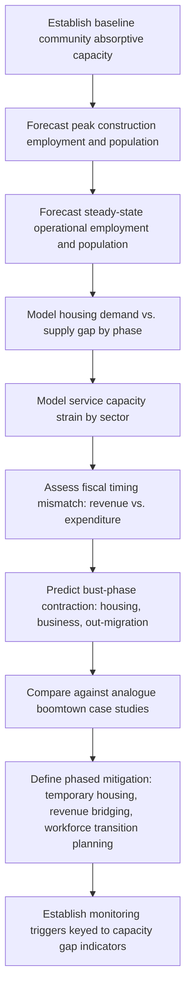

## Induced-Growth and Boomtown Effects

### Overview

Induced-growth and boomtown effects describe the secondary, often disproportionate, socioeconomic changes triggered when a large project rapidly injects employment, income, and population into a community with limited absorptive capacity. Unlike the steady-state demographic-economic projections covered elsewhere, boomtown analysis specifically addresses the volatility, timing mismatch, and overshoot dynamics that characterize rapid-growth episodes — followed frequently by an equally disruptive contraction ("bust") when the project phase ends.

**Key Points**

- Boomtown effects are most pronounced in small, previously stable communities experiencing large relative population/economic shocks — the same absolute change has far less impact on a large, diversified regional economy.
- The core analytical challenge is timing mismatch: population and demand growth typically outpaces the capacity of housing, services, and infrastructure to respond.
- Boom-bust cycles create a second, distinct impact profile (post-project contraction) that must be predicted alongside the growth phase itself.

---

### Conceptual Framework

#### The Boomtown Model

The classic boomtown model (developed from observation of rapid resource-extraction developments, particularly in North American energy and mining contexts during the 1970s–80s) describes a sequence:

1. **Announcement/anticipation phase**: speculative in-migration begins before construction, often exceeding confirmed job availability
2. **Construction/peak phase**: maximum population and economic activity, typically exceeding operational-phase levels
3. **Transition/operational phase**: population and economic activity contract to a lower, more stable operational level
4. **Closure/post-project phase**: further contraction, potentially below pre-project baseline if the local economy became dependent on the project

$$Population(t) \neq \text{monotonic function of employment}(t)$$

This non-monotonic relationship is the defining technical feature distinguishing boomtown analysis from standard linear demographic-economic projection: peak population often substantially exceeds steady-state operational population, and this differential is a primary source of predicted social impact.

#### Absorptive Capacity Threshold

Boomtown severity is strongly mediated by a community's absorptive capacity — its ability to expand housing, services, and infrastructure at the rate demand is growing. This is often expressed conceptually as a **capacity gap**:

$$Gap(t) = Demand(t) - Capacity(t)$$

Where $Demand(t)$ (housing units, school places, health service capacity, water/sewer capacity) grows rapidly during the boom phase while $Capacity(t)$ typically grows with a lag due to construction/procurement/funding timelines for public infrastructure. Large, sustained positive gaps are predictive of the classic boomtown symptoms: housing shortages, price inflation, service quality decline, and social strain.

---

### Standard Predictive Methods

#### 1. Peak-vs-Steady-State Population Differentiation

Unlike standard cohort-component projections that treat population change as a smooth trend, boomtown analysis explicitly forecasts **two distinct population figures**:

- **Peak construction population**: derived from peak direct/indirect construction workforce plus dependents and induced service employment
- **Steady-state operational population**: derived from the smaller, typically more skilled/permanent operational workforce

**Example**

A processing facility project has:

- Peak construction workforce: 2,200 direct jobs (18-month peak)
- Operational workforce: 350 direct jobs (20+ year duration)

Using an employment multiplier of 1.6 for construction and 2.1 for operations (higher due to more durable indirect/service linkages), and an in-migration ratio and household conversion factor as in standard demographic modeling:

- Peak population influx ≈ 2,200 × 1.6 × conversion factor (short-term, high transience, lower dependent ratio for temporary workers)
- Steady-state population influx ≈ 350 × 2.1 × conversion factor (longer-term, higher dependent ratio as workers relocate families)

The critical planning insight is that **peak population may be 3–6x steady-state population**, requiring infrastructure and service planning for a temporary peak that will not persist — creating its own post-peak contraction risk (oversupplied housing, underutilized new schools/clinics).

#### 2. Housing Market Stress Modeling

Housing is typically the first and most visible boomtown symptom. Standard modeling estimates:

$$HousingGap(t) = NewHouseholds(t) - NewHousingUnits(t) - VacancyBuffer$$

Where a persistent positive gap predicts rental/purchase price inflation, overcrowding, and potential displacement of lower-income long-term residents priced out of the local market (a form of indirect economic displacement distinct from project-caused physical displacement).

**Example**

Analogue data from comparable resource-boom communities frequently documents rental price increases in the range of 50–200% during peak construction phases where housing supply is inelastic. [Unverified: exact inflation magnitude is highly context-dependent on pre-existing vacancy rates, housing supply elasticity, and regulatory response, and should not be treated as a universal benchmark.]

#### 3. Service Capacity Strain Indicators

Standard indicators tracked and projected against capacity thresholds:

| Service | Common Strain Indicator |
| --- | --- |
| Housing | Vacancy rate, rent/price index |
| Health | Patient-to-provider ratio, emergency department wait times |
| Education | Student-to-teacher ratio, school capacity utilization |
| Water/sanitation | Per-capita supply capacity vs. demand |
| Law enforcement | Officer-to-population ratio, reported incident rate |
| Roads/traffic | Traffic volume vs. road capacity (level of service) |

Each is projected forward using the peak and steady-state population estimates, compared against locally defined or nationally benchmarked adequacy thresholds.

#### 4. Fiscal Timing Mismatch Analysis

A specific and well-documented boomtown sub-problem: local government revenue (property/sales tax, project fees) frequently lags population-driven expenditure needs, because:

- Property tax reassessment cycles lag new development
- Project-related revenue-sharing or royalty payments may not begin until production/operations phase, after peak construction population has already strained services
- Local governments often must debt-finance infrastructure expansion in advance of revenue realization

$$FiscalGap(t) = ServiceCost(t) - Revenue(t)$$

This is a standard and well-documented category of boomtown impact in public finance and regional economics literature, distinct from but related to the general fiscal impact assessment used in standard economic change prediction.

#### 5. Bust-Phase (Post-Peak Contraction) Prediction

Equally important and frequently under-addressed: modeling the transition from peak to steady-state (or to closure), including:

- Housing oversupply and price decline
- Business closures dependent on construction-phase spending
- Out-migration of construction workforce and dependents
- Potential fiscal stress if infrastructure debt was incurred based on peak-phase revenue projections
- Social/psychological impacts of rapid community contraction, distinct from but related to cohesion/wellbeing impacts

---

### Process Flow

---

### Common Pitfalls

- **Planning only for steady-state population**: Under-provisioning infrastructure and services for the temporary but often much larger peak population.
- **Over-provisioning based on peak population**: Conversely, building permanent infrastructure sized for peak demand risks costly oversupply and fiscal burden during the bust phase.
- **Ignoring speculative in-migration**: Job-seekers arriving without confirmed employment can significantly exceed confirmed workforce numbers, especially in high-profile or long-anticipated projects.
- **Underestimating fiscal lag**: Assuming tax/royalty revenue will be available concurrently with service demand, when actual revenue realization is often delayed relative to population growth.
- **Neglecting the bust phase entirely**: Treating project-induced growth as a one-directional forecasting problem and failing to plan for post-peak contraction impacts.
- **Applying analogue data uncritically**: Boomtown severity is highly sensitive to local starting conditions (existing housing supply elasticity, regional labor market size, government fiscal capacity); analogue transferability requires careful contextual adjustment.

---

### Monitoring and Validation

- **Real-time capacity gap tracking**: housing vacancy, service utilization, and infrastructure capacity indicators monitored against pre-defined thresholds during construction ramp-up
- **Population census/survey updates**: periodic local population counts (formal or rapid assessment) to validate peak population projections against actual in-migration
- **Fiscal monitoring**: local government revenue/expenditure tracking against projected fiscal gap models, informing timing of revenue-bridging mechanisms (e.g., advance royalty payments, infrastructure bonds)
- **Post-peak transition monitoring**: tracking out-migration, housing market correction, and business closure rates to validate bust-phase predictions and trigger transition support measures

---

### Illustrative Boom-Bust Trajectory (svg_diagram)

<svg xmlns="http://www.w3.org/2000/svg" viewBox="0 0 760 340">
<rect x="0" y="0" width="760" height="340" fill="#ffffff" />
<text x="380" y="24" font-size="15" font-weight="bold" text-anchor="middle" fill="#1a1a1a">Boomtown Population vs. Capacity Trajectory (svg_diagram)</text>
<line x1="60" y1="290" x2="720" y2="290" stroke="#333" stroke-width="1.5" />
<line x1="60" y1="290" x2="60" y2="50" stroke="#333" stroke-width="1.5" />
<text x="380" y="320" font-size="12" text-anchor="middle" fill="#1a1a1a">Project Timeline</text>
<text x="25" y="170" font-size="12" text-anchor="middle" fill="#1a1a1a" transform="rotate(-90 25 170)">Population</text>
<path d="M60,270 L150,270 L280,80 L380,140 L520,150 L620,220 L720,240" fill="none" stroke="#c14545" stroke-width="2.5" />
<path d="M60,270 L150,265 L280,230 L380,150 L520,145 L620,150 L720,150" fill="none" stroke="#3f8f5f" stroke-width="2.5" stroke-dasharray="6,3" />
<circle cx="280" cy="80" r="4" fill="#c14545" />
<text x="280" y="65" font-size="11" text-anchor="middle" fill="#c14545">Peak Population</text>
<circle cx="520" cy="150" r="4" fill="#3f8f5f" />
<text x="580" y="145" font-size="11" text-anchor="middle" fill="#3f8f5f">Capacity catches up</text>

<text x="150" y="255" font-size="10" text-anchor="middle" fill="#555">Anticipation</text>

<text x="280" y="298" font-size="10" text-anchor="middle" fill="#555">Construction Peak</text>

<text x="450" y="298" font-size="10" text-anchor="middle" fill="#555">Transition</text>

<text x="620" y="298" font-size="10" text-anchor="middle" fill="#555">Steady-State / Bust</text>

<rect x="560" y="55" width="14" height="14" fill="#c14545" />
<text x="580" y="66" font-size="11" fill="#1a1a1a">Population Demand</text>
<rect x="560" y="75" width="14" height="14" fill="#3f8f5f" />
<text x="580" y="86" font-size="11" fill="#1a1a1a">Service Capacity</text>
</svg>

---

### Related Topics

- Fiscal impact assessment and revenue-bridging mechanisms
- Housing market impact modeling and affordability analysis
- Predicting demographic and economic change (steady-state baseline methods)
- Workforce transition and closure planning
- Analogue/comparable case study analysis methodology
- Social cohesion and wellbeing impacts of rapid community change
- Temporary workforce accommodation ("man camp") planning and management
- Local government capacity building and infrastructure financing