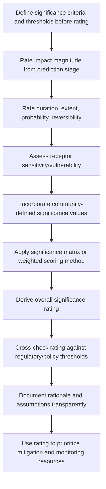

## Criteria for Determining Significance

<syllabot_broad_topic/>

### Overview

Determining impact significance is the analytical step that converts a predicted impact (from Impact Identification and Prediction) into a judgment about how much that impact matters — informing whether it requires mitigation, triggers regulatory obligations, or is deemed acceptable. Significance determination is one of the most consequential and most contested steps in SIA because it translates technical predictions into decision-relevant categories (e.g., Negligible, Minor, Moderate, Major, Critical) that directly shape project approval conditions, mitigation requirements, and resource allocation.

**Key Points**

- Significance is not an inherent property of an impact; it is a judgment derived from combining multiple weighted criteria, and is therefore method-dependent and partly subjective.
- Most frameworks combine impact-characteristic criteria (magnitude, duration, extent) with receptor-characteristic criteria (sensitivity, vulnerability, value) rather than assessing impacts in isolation from who/what is affected.
- Significance criteria and thresholds should be defined and disclosed *before* impacts are rated, to maintain methodological transparency and defensibility.

---

### Conceptual Framework

#### Significance as a Function

Significance is generally modeled as a function combining impact-side and receptor-side factors:

$$Significance = f(Magnitude, Duration, Extent, Probability, Reversibility, Sensitivity)$$

This reflects a core SIA principle: an identical physical/social change (e.g., loss of 5 hectares of land) can carry very different significance depending on who is affected (a large commercial landholder vs. a subsistence-dependent household) and the receiving environment's capacity to adapt.

#### Two Core Dimensions

Most significance frameworks decompose into two combinable dimensions:

| Dimension | Describes | Example Factors |
| --- | --- | --- |
| Impact characteristics | Properties of the change itself | Magnitude, duration, extent, frequency, reversibility, likelihood |
| Receptor characteristics | Properties of what/who is affected | Sensitivity, vulnerability, resilience, value/importance |

$$Significance = ImpactMagnitude \times ReceptorSensitivity$$

This multiplicative (or matrix-based) relationship is the basis of the significance matrix method described below — a low-magnitude impact on a highly sensitive/vulnerable receptor can carry equal or greater significance than a high-magnitude impact on a resilient receptor.

---

### Standard Criteria

#### 1. Magnitude

The scale or intensity of the predicted change, typically rated on an ordinal scale:

| Rating | Description |
| --- | --- |
| Negligible | Change is at or near the limit of detection; no discernible effect |
| Minor | Detectable change, but within normal range of variation or easily absorbed |
| Moderate | Noticeable change requiring adaptation or management response |
| Major | Substantial change significantly altering baseline conditions |

Magnitude ratings should be anchored, where possible, to quantitative thresholds from the prediction stage (e.g., percentage change in income, population increase relative to baseline) rather than assigned purely by expert judgment, to improve consistency and defensibility.

#### 2. Duration

The temporal extent over which the impact persists:

| Rating | Typical Definition |
| --- | --- |
| Short-term | Limited to construction phase or less than ~1–2 years |
| Medium-term | Persists through part of operational phase, ~2–10 years |
| Long-term | Persists through most/all of operational phase |
| Permanent | Persists beyond project life or is irreversible |

Duration thresholds are context- and sector-specific; a "short-term" duration definition for a 2-year construction project differs from one for a 30-year infrastructure concession. [Unverified: specific year thresholds shown are illustrative conventions, not a universal standard, and should be defined explicitly for each assessment.]

#### 3. Extent/Spatial Scale

The geographic reach of the impact:

| Rating | Description |
| --- | --- |
| Site-specific/localized | Confined to project footprint or immediate vicinity |
| Local | Affects surrounding community/settlement |
| Regional | Affects wider district/region |
| National/transboundary | Affects national or cross-border scale |

#### 4. Probability/Likelihood

The degree of certainty that the predicted impact will occur, given uncertainty in underlying prediction models:

| Rating | Description |
| --- | --- |
| Unlikely | Low probability of occurrence under normal conditions |
| Possible | Moderate probability; plausible under foreseeable circumstances |
| Likely | High probability; expected under normal project conditions |
| Certain/Near-certain | Effectively guaranteed to occur |

#### 5. Reversibility

Whether the impact can be reversed once it occurs, and over what timeframe:

| Rating | Description |
| --- | --- |
| Fully reversible | Returns to baseline once cause is removed, short recovery time |
| Partially reversible | Some recovery possible, but not to full baseline condition |
| Irreversible | No reasonable prospect of return to baseline condition |

Irreversibility is frequently treated as a significance-elevating factor independent of magnitude — even a moderate-magnitude but irreversible impact (e.g., loss of a culturally significant site) is often rated as highly significant specifically because of its irreversibility.

#### 6. Receptor Sensitivity/Vulnerability

The capacity of the affected group or system to absorb, adapt to, or recover from the impact without significant additional support:

| Rating | Description |
| --- | --- |
| Low sensitivity | High adaptive capacity, resources, or alternatives available |
| Medium sensitivity | Some adaptive capacity, but with cost or difficulty |
| High sensitivity | Limited adaptive capacity; reliant on affected resource/condition; may include legally or socially recognized vulnerable status |

Vulnerability screening (from the gender-differentiated and social vulnerability analyses conducted earlier in Impact Identification and Prediction) feeds directly into this criterion — the same magnitude of impact applied to a low-income, resource-dependent household is typically rated more significant than an identical magnitude applied to a diversified, higher-income household.

---

### Standard Method: Significance Matrix

The most widely used technique combines magnitude and sensitivity (or a similar pairing) in a matrix to derive an overall significance rating:

|  | Low Sensitivity | Medium Sensitivity | High Sensitivity |
| --- | --- | --- | --- |
| **Negligible Magnitude** | Negligible | Negligible | Minor |
| **Minor Magnitude** | Negligible | Minor | Moderate |
| **Moderate Magnitude** | Minor | Moderate | Major |
| **Major Magnitude** | Moderate | Major | Critical |

**Example**

A project restricts access to a communal grazing area (moderate magnitude of resource loss). The affected pastoralist households have no alternative grazing land and no viable income diversification currently available in the local market (high sensitivity). Applying the matrix: Moderate Magnitude × High Sensitivity → **Major** significance rating, triggering mandatory mitigation and likely disclosure/consultation obligations, rather than a lower rating that might apply to a lower-sensitivity receptor experiencing the same physical land restriction.

---

### Alternative/Supplementary Approaches

#### Weighted Scoring Method

Assigns numeric scores (e.g., 1–5) to each criterion, applies weights reflecting relative importance, and sums to a composite score:

$$S = \sum_{i} w_i \times x_i$$

Where $w_i$ is the weight for criterion $i$ (magnitude, duration, extent, reversibility, sensitivity) and $x_i$ is the score for that criterion. This approach allows more granular differentiation than matrix methods but requires transparent, justified weighting choices to remain defensible — arbitrary weighting is a frequently cited criticism of this method.

#### Threshold-Based Approach

Compares predicted impact values directly against pre-established regulatory, policy, or scientifically derived thresholds (e.g., a specific income loss percentage, a specific decibel level, a specific displacement population count) rather than relying on ordinal expert judgment scales. This approach offers higher objectivity where valid thresholds exist but is often unavailable for social variables lacking established regulatory limits (unlike many environmental parameters with legislated standards).

#### Community-Defined Significance

Increasingly incorporated as a complement to technical criteria: engaging affected communities directly in defining what impacts they consider significant, recognizing that technical criteria alone may not capture locally-held values (e.g., cultural, spiritual, or place-based significance that does not map neatly onto magnitude/duration/extent scales).

---

### Process Flow

---

### Common Pitfalls

- **Rating impacts without defining criteria first**: Post-hoc rationalization of significance ratings undermines defensibility and invites accusations of bias.
- **Ignoring receptor sensitivity**: Rating significance based on magnitude alone systematically underrates impacts on vulnerable groups experiencing objectively smaller but subjectively critical changes.
- **Inconsistent criteria application across impacts**: Using different implicit thresholds for similar impacts across different chapters/sections of an assessment undermines internal consistency.
- **Treating significance as purely technical**: Excluding community-defined values can produce technically "accurate" but socially disconnected significance ratings that fail to reflect what actually matters to affected people.
- **Conflating likelihood with magnitude**: A highly likely but low-magnitude impact should not automatically be rated equivalent to an unlikely but high-magnitude impact; these are distinct dimensions requiring separate treatment before combination.
- **Static significance ratings**: Failing to revisit significance ratings as new monitoring data becomes available during implementation, when actual conditions may diverge from original predictions.

---

### Illustrative Significance Determination Structure (svg_diagram)

<svg xmlns="http://www.w3.org/2000/svg" viewBox="0 0 760 300">
<rect x="0" y="0" width="760" height="300" fill="#ffffff" />
<text x="380" y="24" font-size="15" font-weight="bold" text-anchor="middle" fill="#1a1a1a">Significance Determination Structure (svg_diagram)</text>
<rect x="20" y="60" width="180" height="50" rx="6" fill="#e8f0fe" stroke="#4a72b8" />
<text x="110" y="90" font-size="12" text-anchor="middle" fill="#1a1a1a">Magnitude</text>
<rect x="20" y="130" width="180" height="50" rx="6" fill="#e8f0fe" stroke="#4a72b8" />
<text x="110" y="160" font-size="12" text-anchor="middle" fill="#1a1a1a">Duration / Extent / Probability</text>
<rect x="20" y="200" width="180" height="50" rx="6" fill="#e8f0fe" stroke="#4a72b8" />
<text x="110" y="230" font-size="12" text-anchor="middle" fill="#1a1a1a">Reversibility</text>
<rect x="280" y="130" width="180" height="50" rx="6" fill="#fef3e8" stroke="#c98a3e" />
<text x="370" y="152" font-size="12" text-anchor="middle" fill="#1a1a1a">Receptor Sensitivity</text>
<text x="370" y="169" font-size="12" text-anchor="middle" fill="#1a1a1a">/ Vulnerability</text>
<rect x="540" y="130" width="200" height="60" rx="6" fill="#e9f7ec" stroke="#3f8f5f" />
<text x="640" y="155" font-size="12" text-anchor="middle" fill="#1a1a1a">Significance Matrix /</text>
<text x="640" y="172" font-size="12" text-anchor="middle" fill="#1a1a1a">Weighted Scoring</text>
<rect x="540" y="220" width="200" height="55" rx="6" fill="#fdeaea" stroke="#c14545" />
<text x="640" y="243" font-size="12" text-anchor="middle" fill="#1a1a1a">Overall Significance</text>
<text x="640" y="260" font-size="12" text-anchor="middle" fill="#1a1a1a">Rating</text>
<line x1="200" y1="85" x2="280" y2="150" stroke="#555" stroke-width="1.5" marker-end="url(#arrow5)" />
<line x1="200" y1="155" x2="280" y2="155" stroke="#555" stroke-width="1.5" marker-end="url(#arrow5)" />
<line x1="200" y1="225" x2="280" y2="165" stroke="#555" stroke-width="1.5" marker-end="url(#arrow5)" />
<line x1="460" y1="155" x2="540" y2="160" stroke="#555" stroke-width="1.5" marker-end="url(#arrow5)" />
<line x1="640" y1="190" x2="640" y2="220" stroke="#555" stroke-width="1.5" marker-end="url(#arrow5)" />
</svg>

---

### Related Topics

- Significance matrix design and calibration methods
- Cumulative significance assessment (multiple interacting impacts)
- Community-defined values and participatory significance rating
- Regulatory thresholds and policy-based significance benchmarks
- Vulnerability and sensitivity screening methodology
- Mitigation hierarchy application based on significance rating
- Transparency and defensibility in impact assessment documentation
- Adaptive management and re-rating significance during monitoring