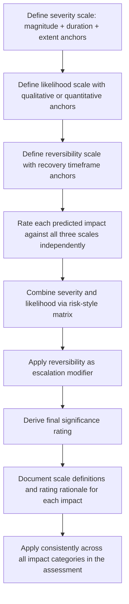

## Severity, Likelihood, and Reversibility Scales

### Overview

Severity, likelihood, and reversibility scales are the standardized ordinal measurement instruments used to rate individual criteria before they are combined into an overall significance determination. Where the previous topic addressed *which* criteria to use, this topic addresses *how to construct and calibrate the rating scales themselves* — the operational definitions, anchor points, and scoring conventions that allow different assessors to apply criteria consistently across an SIA.

**Key Points**

- Scale construction quality directly determines inter-rater reliability; poorly anchored scales (relying on vague adjectives without defined thresholds) produce inconsistent ratings across assessors and impact categories.
- Severity is typically a composite scale (combining magnitude, extent, and duration), while likelihood and reversibility are usually rated as separate, single-dimension scales, then combined with severity in a final significance matrix.
- Scales should be defined and documented in the assessment methodology section *before* application, and applied consistently across all impact chapters.

---

### Severity Scale

#### Composite Construction

Severity is most commonly constructed as a composite of magnitude, duration, and extent, since a single "severity" label is more decision-useful than three separate ratings, but only if the aggregation rule is transparent.

$$Severity = g(Magnitude, Duration, Extent)$$

Two common aggregation approaches:

**1. Matrix-based aggregation** — combining two of the three sub-criteria (typically magnitude × duration) in a lookup table, with extent applied as a secondary modifier.

**2. Descriptive/narrative anchoring** — defining each severity level directly with a combined narrative description rather than deriving it mathematically.

#### Standard 5-Point Severity Scale (Descriptive Anchoring)

| Level | Label | Narrative Anchor |
| --- | --- | --- |
| 1 | Negligible | Change is undetectable or within normal baseline variation; no meaningful effect on affected receptors |
| 2 | Minor | Detectable change of limited scale/duration; readily absorbed without external support |
| 3 | Moderate | Noticeable change affecting a defined group over a meaningful period; requires active management/mitigation |
| 4 | Major | Substantial change significantly altering baseline conditions for an affected group over an extended period |
| 5 | Critical/Severe | Fundamental, extensive, and/or irreversible alteration of baseline conditions affecting a large population or highly vulnerable group |

**Example**

Predicted impact: restriction of access to a fishing ground affecting 40 households who derive an estimated 30% of household protein/income from that resource, for the operational life of the project (15+ years), with no readily available alternative fishing ground within reasonable travel distance.

- Magnitude: Moderate-to-major (30% of livelihood component affected)
- Duration: Long-term (15+ years)
- Extent: Localized but concentrated on a defined, resource-dependent group

Combined severity rating: **Major** (Level 4) — the combination of sustained duration and lack of viable alternatives elevates this above a "Moderate" rating that might apply to the same magnitude with a shorter duration or available alternatives.

---

### Likelihood Scale

#### Standard 4- or 5-Point Likelihood Scale

Likelihood (also termed probability) is rated separately from severity because a prediction's certainty is conceptually distinct from its magnitude if it occurs.

| Level | Label | Definition | Approximate Qualitative Range |
| --- | --- | --- | --- |
| 1 | Rare/Unlikely | Impact would only occur under exceptional or unforeseen circumstances | Low probability |
| 2 | Possible | Impact could plausibly occur under foreseeable circumstances | Moderate-low probability |
| 3 | Likely | Impact is expected to occur under normal project conditions | Moderate-high probability |
| 4 | Almost Certain | Impact will occur except under exceptional circumstances | High probability |

Where sufficient data exists (e.g., from analogue projects or quantitative modeling), likelihood can be anchored to approximate quantitative probability bands (e.g., <10%, 10–40%, 40–70%, >70%) to improve consistency; where data is sparse, structured expert elicitation is used instead. [Unverified: specific percentage bands are illustrative conventions used in some SIA methodologies, not a universally standardized numeric scale, and should be defined explicitly per assessment.]

#### Sources of Likelihood Evidence

- Direct quantitative modeling outputs (e.g., confidence intervals from demographic/economic projections)
- Analogue/comparable project outcome data
- Structured expert judgment/elicitation where empirical data is unavailable
- Historical frequency of similar impacts in comparable project types

---

### Reversibility Scale

#### Standard 3- or 4-Point Reversibility Scale

Reversibility describes the capacity of the affected condition to return to baseline once the causal impact is removed or mitigated, and the timeframe over which this could occur.

| Level | Label | Definition |
| --- | --- | --- |
| 1 | Fully Reversible | Baseline conditions restored rapidly (within a defined short period, e.g., <1 year) once the impact-causing activity ceases |
| 2 | Partially Reversible | Some recovery occurs, but full baseline restoration is unlikely or would require significant time/intervention |
| 3 | Long-term Reversible | Recovery is theoretically possible but requires an extended timeframe (e.g., multi-generational recovery of social/cultural conditions) |
| 4 | Irreversible | No reasonable prospect of returning to baseline condition under any foreseeable circumstances |

**Example**

- Temporary construction noise disruption to community activities → Level 1 (Fully Reversible; ceases when construction ends)
- Loss of agricultural soil fertility from construction-phase land disturbance → Level 2–3 (Partially/Long-term Reversible; recoverable through soil remediation over years)
- Loss of a culturally significant or sacred site due to permanent land use conversion → Level 4 (Irreversible)

Reversibility functions as a significance-elevating modifier in most frameworks: an irreversible impact is frequently escalated in overall significance rating regardless of its severity/likelihood combination, reflecting the ethical weight placed on foreclosing future recovery options.

---

### Combining the Three Scales

#### Sequential Matrix Approach

Most SIA methodologies combine the three scales sequentially rather than in one single matrix, since combining three independent ordinal scales directly produces an unwieldy number of cells:

**Step 1**: Combine severity × likelihood into a preliminary significance rating (a standard 2D risk-matrix format, directly analogous to risk assessment matrices used in safety/environmental management).

**Step 2**: Apply reversibility as a modifier/escalator to the preliminary rating — e.g., any impact rated "Irreversible" is automatically escalated by one level (or flagged as requiring mandatory mitigation regardless of the preliminary rating).

**Example combined matrix (Step 1: Severity × Likelihood)**

|  | Rare | Possible | Likely | Almost Certain |
| --- | --- | --- | --- | --- |
| **Negligible** | Negligible | Negligible | Minor | Minor |
| **Minor** | Negligible | Minor | Minor | Moderate |
| **Moderate** | Minor | Moderate | Moderate | Major |
| **Major** | Moderate | Major | Major | Critical |
| **Critical** | Major | Critical | Critical | Critical |

**Step 2 escalation rule (example convention)**: If Reversibility = Irreversible, escalate the Step 1 rating by one level (e.g., Moderate → Major), with a ceiling at Critical. This is a **methodological design choice**, not a fixed external standard — practitioners define and document their own escalation rule as part of the assessment methodology. [Unverified: the specific escalation convention shown is illustrative of common practice, not a mandated universal rule.]

---

### Process Flow

---

### Calibration and Consistency Practices

- **Anchor definitions with concrete thresholds** wherever quantitative data supports it (e.g., "% of household income affected" rather than an unanchored adjective like "significant")
- **Use multiple assessors with inter-rater comparison** on a sample of impacts to check consistency before finalizing ratings across the full assessment
- **Maintain a rating register/log** documenting the specific evidence and reasoning behind each severity, likelihood, and reversibility score, supporting later audit or challenge
- **Pilot-test scales** on a subset of known impacts before applying across the full impact inventory, adjusting anchor definitions if early ratings reveal ambiguity or clustering at one end of the scale

---

### Common Pitfalls

- **Using unanchored adjectival scales**: Rating something "moderate" without a defined threshold invites inconsistent application across assessors and impact types.
- **Collapsing severity components prematurely**: Assigning an overall severity rating without documenting how magnitude, duration, and extent were individually assessed obscures the reasoning and reduces auditability.
- **Treating likelihood as an afterthought**: Some practitioners implicitly assume all identified impacts are "likely," skipping explicit likelihood rating and thereby overstating the significance of low-probability, high-magnitude impacts.
- **Symmetric treatment of reversibility**: Applying the same escalation weight to "long-term reversible" as to "fully irreversible" understates the special ethical and practical weight typically given to true irreversibility.
- **Scale mismatch across impact categories**: Using different underlying scale granularity (e.g., a 3-point scale for one impact category and a 5-point scale for another) within the same assessment undermines comparability of significance ratings.

---

### Related Topics

- Criteria for determining significance (magnitude, duration, extent, sensitivity)
- Risk assessment matrix design (cross-disciplinary parallel with EHS risk matrices)
- Structured expert elicitation methods for likelihood estimation
- Cumulative and interacting impact significance aggregation
- Documentation and audit trail practices in impact assessment
- Precautionary principle application to irreversible impacts
- Adaptive management and re-scoring during monitoring phases