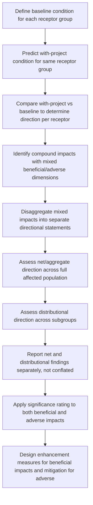

## Distinguishing Beneficial and Adverse Impacts

### Overview

Distinguishing beneficial and adverse impacts is the analytical step of correctly classifying the direction of a predicted change — determining whether an outcome represents an improvement or a deterioration relative to baseline conditions — before significance rating is applied. While this may appear straightforward, SIA practice treats this classification as methodologically non-trivial: the same underlying change frequently produces beneficial effects for one group and adverse effects for another, and apparent benefits can carry hidden adverse dimensions that only emerge through careful, receptor-specific and time-differentiated analysis.

**Key Points**

- Direction of impact (beneficial/adverse) must be assessed per receptor group, not assumed uniform across an entire affected community.
- Net positive aggregate outcomes (e.g., regional GDP growth) can coexist with significant adverse impacts on specific subgroups; aggregation can mask distributional harm.
- Beneficial impacts still require significance rating, monitoring, and, where relevant, enhancement planning — not just documentation as an offset against adverse impacts elsewhere.

---

### Conceptual Framework

#### Impact Direction as a Distinct Analytical Dimension

Impact direction (beneficial vs. adverse) is conceptually separate from magnitude, likelihood, and reversibility — a change can be highly certain, large in magnitude, and irreversible while being either beneficial or adverse. Some frameworks add direction explicitly as a fourth core rating dimension alongside severity, likelihood, and reversibility:

$$Rating = (Direction, Magnitude, Likelihood, Reversibility)$$

#### Why Classification Is Not Always Obvious

Several factors complicate straightforward beneficial/adverse classification:

1. **Distributional divergence**: The same change benefits one group while harming another (e.g., new employment benefiting skilled workers while price inflation harms fixed-income residents)
2. **Temporal divergence**: Short-term adverse effects (construction disruption) may accompany long-term beneficial effects (permanent infrastructure), or the reverse (short-term employment boost followed by long-term dependency and post-closure decline)
3. **Value-dependent framing**: What constitutes a "benefit" can be contested — e.g., a new road may be framed as economic opportunity by some stakeholders and as a threat to traditional livelihoods/land use by others
4. **Compound/mixed impacts**: A single change can carry both beneficial and adverse dimensions simultaneously for the same group (e.g., new employment provides income but increases time away from family/community responsibilities)

---

### Standard Classification Methods

#### 1. Receptor-Specific Direction Mapping

Rather than assigning a single direction label to an impact, standard practice maps direction against each identified receptor group (drawing on the differentiated/vulnerability screening conducted during Impact Identification and Prediction).

**Example: New access road construction**

| Receptor Group | Direction | Rationale |
| --- | --- | --- |
| Local business owners near road | Beneficial | Improved market access, reduced transport cost/time |
| Households with land bisected by road route | Adverse | Loss of contiguous land, severance of access between plots |
| Long-distance commuting workers | Beneficial | Reduced travel time to employment centers |
| Communities reliant on road-adjacent forest resources | Adverse | Increased third-party access enabling resource extraction/encroachment |

This table format — direction assessed per receptor rather than for the "impact" as a monolithic entity — is standard good practice for avoiding the false impression of a uniformly beneficial or adverse outcome.

#### 2. Baseline-Referenced Comparison

Direction is always determined relative to a clearly defined baseline (the "without-project" scenario), not relative to an assumed universal standard of good/bad. This avoids two common errors:

- **False negative**: Classifying a change as adverse simply because it represents change from the status quo, even where baseline conditions were themselves poor (e.g., new health clinic access is beneficial even though it represents significant transformation of existing informal health-seeking patterns)
- **False positive**: Classifying a change as beneficial based on an intended objective (e.g., "job creation") without verifying whether the predicted outcome, net of costs and distributional effects, actually improves conditions relative to baseline for the receptor in question

$$Direction = sign(Condition_{with-project} - Condition_{baseline})$$

#### 3. Net vs. Distributional Assessment

Distinguishes two levels of analysis that should be reported separately, not conflated:

- **Net/aggregate assessment**: overall direction and magnitude summed across the whole affected population or economy (e.g., net regional income effect)
- **Distributional assessment**: direction and magnitude broken out by subgroup, income level, gender, or other differentiating variable

**Example**

A project's economic modeling shows net regional income increasing by an estimated 8% (aggregate beneficial effect). Distributional analysis using the differentiated impact severity scoring from earlier stages shows that this aggregate gain accrues primarily to skilled in-migrant workers and landowners able to lease land for project use, while subsistence-dependent households experiencing land access restriction show a net income decline. Reporting only the aggregate 8% figure would misrepresent the impact profile; standard practice requires presenting both net and distributional findings together. [Inference: the specific distributional pattern in any given project depends on local land tenure, labor market structure, and compensation design, and should not be assumed to replicate this illustrative example.]

#### 4. Mixed-Impact Disaggregation

Where a single change carries both beneficial and adverse dimensions for the same receptor, standard practice disaggregates it into separate impact statements rather than forcing a single net label, preserving analytical clarity for mitigation design.

**Example**

"Project employment for local youth" is disaggregated into:

- Beneficial: increased household income, skills development, financial independence
- Adverse: increased school dropout risk if youth prioritize immediate wage labor over continued education; potential disruption to traditional family/community labor roles

Each sub-impact receives its own significance rating and, where adverse, its own mitigation consideration (e.g., flexible work-study arrangements), rather than allowing the beneficial framing to obscure the need to manage the adverse dimension.

---

### Process Flow

---

### Implications for Management Response

| Impact Direction | Standard Management Response |
| --- | --- |
| Adverse | Apply mitigation hierarchy: avoid, minimize, restore/rehabilitate, offset/compensate |
| Beneficial | Apply enhancement measures: identify actions that increase magnitude, reach, or distribution of the benefit |
| Mixed | Apply both: mitigate the adverse dimension while enhancing the beneficial dimension of the same underlying change |

A common methodological requirement (reflected in IFC Performance Standards and equivalent frameworks) is that beneficial impacts still warrant explicit management attention — through enhancement planning and monitoring — rather than being treated as requiring no further action once identified as positive.

---

### Common Pitfalls

- **Aggregation bias**: Reporting only net/aggregate direction, obscuring adverse effects concentrated in a vulnerable subgroup.
- **Assuming intended benefits are realized benefits**: Classifying an impact as beneficial based on project objectives (e.g., "will create local employment") without verifying against predicted, receptor-specific outcomes.
- **Ignoring temporal shifts in direction**: Failing to distinguish short-term adverse (construction disruption) from long-term beneficial (permanent infrastructure) can misrepresent the overall impact profile if only one time horizon is considered.
- **Forcing a single net label on mixed impacts**: Collapsing genuinely mixed beneficial/adverse effects into one net rating can obscure the specific adverse dimension needing mitigation.
- **Treating beneficial impacts as requiring no further analysis**: Skipping significance rating, monitoring, or enhancement planning for beneficial impacts, missing opportunities to increase positive outcomes or verify they materialize as predicted.
- **Value imposition without stakeholder input**: Classifying direction based solely on the assessor's or proponent's value framework without verifying how affected communities themselves perceive and value the change.

---

### Related Topics

- Criteria for determining significance (applies equally to beneficial and adverse impacts)
- Mitigation hierarchy (avoid, minimize, restore, offset)
- Benefit enhancement and optimization planning
- Distributional and equity analysis in impact assessment
- Gender-differentiated impact analysis (differential direction by gender)
- Cumulative impact assessment (aggregation across multiple projects/impacts)
- Community-defined values in impact evaluation
- Social impact management plan design