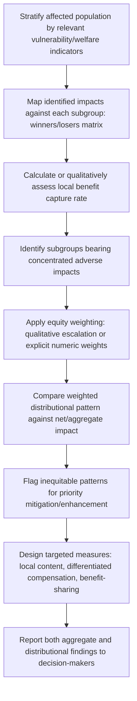

## Distributional and Equity-Weighted Assessment

### Overview

Distributional and equity-weighted assessment is the analytical approach that explicitly evaluates *who* bears the costs and *who* captures the benefits of a project, and applies deliberate analytical weighting to reflect the principle that an identical unit of impact does not carry equal ethical or practical weight across all recipients. It extends beyond the receptor-sensitivity concept used in significance rating by systematically mapping impact distribution across the full affected population and, in its explicit form, applying numeric or structured weights favoring impacts on lower-income, marginalized, or otherwise disadvantaged groups.

**Key Points**

- Distributional assessment answers "who gains and who loses," while equity weighting goes further by deliberately valuing impacts on disadvantaged groups more heavily than the same impact on advantaged groups in an aggregate assessment.
- This approach directly counters a key limitation of standard cost-benefit and net-impact analysis: an efficient (net-positive) outcome can still be deeply inequitable if gains and losses are concentrated in different populations.
- Equity weighting is a documented but contested methodological choice; it requires transparent disclosure of the weighting rationale and typically factors into decision-support alongside, not instead of, standard significance ratings.

---

### Conceptual Framework

#### Distributional Analysis

Distributional analysis disaggregates impacts across defined social/economic strata to reveal patterns invisible in aggregate reporting:

$$Impact_{total} = \sum_{k} Impact_k$$

Where $k$ indexes population subgroups (by income quintile, gender, ethnicity, land tenure status, etc.). Standard distributional analysis reports both $Impact_{total}$ and the disaggregated $Impact_k$ values, since a positive $Impact_{total}$ can mask a negative $Impact_k$ for a specific subgroup.

#### Equity Weighting

Equity weighting formalizes the ethical judgment that a given magnitude of impact matters more when it affects a household with fewer resources to absorb it. A generic equity-weighted impact score is expressed as:

$$Impact_{weighted} = \sum_{k} w_k \times Impact_k$$

Where $w_k$ is an equity weight, typically inversely related to the subgroup's baseline welfare/income level (i.e., $w_k$ is higher for lower-income or more vulnerable groups). This concept parallels equity weighting approaches used in welfare economics and some public cost-benefit analysis guidance (e.g., diminishing marginal utility of income arguments), adapted to the SIA context of describing significance and impact distribution rather than purely monetized cost-benefit accounting. [Inference: the appropriateness and specific parameterization of equity weights is a normative choice debated in the literature; SIA practice generally uses equity weighting to structure qualitative/semi-quantitative comparison rather than to produce a single monetized decision metric.]

---

### Standard Methods

#### 1. Impact Distribution Mapping (Winners/Losers Matrix)

The foundational technique: cross-tabulating identified impacts against defined population subgroups to visualize who experiences beneficial versus adverse effects.

**Example**

| Impact | Skilled In-Migrant Workers | Local Landowners | Subsistence Farmers | Landless Laborers |
| --- | --- | --- | --- | --- |
| New employment | Beneficial (major) | Beneficial (minor) | Negligible | Beneficial (moderate) |
| Land acquisition | N/A | Beneficial (compensation) | Adverse (major) | Negligible |
| Housing price inflation | Adverse (minor) | Beneficial (asset value) | Adverse (moderate) | Adverse (major) |
| Local service strain | Adverse (minor) | Adverse (minor) | Adverse (moderate) | Adverse (major) |

This matrix format immediately reveals a distributional pattern: landless laborers experience predominantly adverse effects with limited access to the primary beneficial pathway (employment may require skills/assets they lack), while local landowners capture benefits from multiple pathways (compensation, asset appreciation, employment access) — a pattern with direct implications for equity-focused mitigation design.

#### 2. Baseline Vulnerability Stratification

Before weighting, subgroups must be stratified by relevant vulnerability/welfare indicators, typically drawn from baseline socioeconomic data:

- Income/wealth quintile or poverty status
- Land tenure security (titled vs. customary/informal)
- Gender and household headship
- Ethnicity/indigenous status (particularly where subject to distinct legal protections, e.g., FPIC requirements)
- Disability status
- Age (dependency ratio considerations)

Stratification variables should be selected based on locally relevant axes of disadvantage, verified through baseline data collection, rather than assumed from generic international vulnerability categories.

#### 3. Qualitative Equity Weighting (Structured Judgment)

Given the practical and ethical difficulty of assigning precise numeric equity weights in most SIA contexts, a common applied approach uses structured qualitative weighting rather than a strict formula:

| Vulnerability Tier | Qualitative Weight Applied to Adverse Impact Significance |
| --- | --- |
| Low vulnerability (diversified assets, secure tenure, adequate income) | Standard significance rating applies unmodified |
| Medium vulnerability (limited diversification, some tenure insecurity) | Significance rating escalated by one level |
| High vulnerability (highly resource-dependent, insecure tenure, limited alternatives) | Significance rating escalated by one or two levels; may trigger mandatory enhanced mitigation |

This directly extends the receptor-sensitivity concept from significance criteria into a structured, documented escalation rule specifically framed around equity/distributional concern, rather than leaving sensitivity as an informal judgment factor.

#### 4. Benefit Capture and Leakage Analysis

Assesses whether project benefits (employment, procurement, revenue-sharing) are actually captured by the local/affected population or "leak" to outside labor, suppliers, or investors — a key distributional question distinct from simply measuring gross benefit magnitude.

$$LocalCaptureRate = \frac{Benefit_{local}}{Benefit_{total}}$$

**Example**

A project generates $10 million in annual procurement spending, but baseline capacity assessment finds local suppliers can realistically capture only an estimated 12% of this value without targeted local content development measures, with the remainder flowing to regional or national suppliers. This capture rate becomes a key distributional finding informing local economic development and local procurement enhancement measures, distinct from the gross $10 million figure alone.

---

### Process Flow

---

### Relationship to Broader Frameworks

| Framework/Concept | Relevance to Distributional Assessment |
| --- | --- |
| IFC Performance Standards | Require differentiated impact and benefit analysis for vulnerable groups |
| Free, Prior, and Informed Consent (FPIC) | Distributional analysis often required to demonstrate Indigenous Peoples are not disproportionately burdened |
| Benefit-sharing agreements | Directly informed by identified distributional gaps (e.g., revenue-sharing mechanisms targeting under-benefiting groups) |
| Just Transition principles | Applied particularly in extractive/energy sector projects to ensure equitable distribution of transition costs and benefits |
| Human rights-based approaches | Frame equity weighting as consistent with non-discrimination and special protection obligations toward marginalized groups |

---

### Common Pitfalls

- **Relying on aggregate net-benefit conclusions**: Presenting only a positive net economic/social impact figure without distributional breakdown can obscure a genuinely inequitable outcome.
- **Using generic rather than locally verified vulnerability stratification**: Applying standard international vulnerability categories without confirming their local relevance and salience.
- **Numeric weighting without disclosed rationale**: Applying specific numeric equity weights without transparent justification undermines defensibility and invites accusations of results manipulation.
- **Ignoring benefit leakage**: Assuming gross project benefit figures translate directly into local/affected population welfare gains, without assessing actual capture rates.
- **Static distributional analysis**: Failing to update distributional patterns as project phases change (e.g., construction-phase versus operational-phase employment often favor different skill/demographic profiles).
- **Treating equity weighting as a substitute for standard significance rating**: Equity-weighted findings should supplement, not replace, standard magnitude/likelihood/reversibility-based significance ratings, since decision-makers typically need both perspectives.

---

### Illustrative Distributional Pattern (svg_diagram)

<svg xmlns="http://www.w3.org/2000/svg" viewBox="0 0 760 320">
<rect x="0" y="0" width="760" height="320" fill="#ffffff" />
<text x="380" y="24" font-size="15" font-weight="bold" text-anchor="middle" fill="#1a1a1a">Distributional Impact Pattern Across Groups (svg_diagram)</text>
<line x1="80" y1="270" x2="720" y2="270" stroke="#333" stroke-width="1.5" />
<line x1="80" y1="270" x2="80" y2="50" stroke="#333" stroke-width="1.5" />
<line x1="80" y1="160" x2="720" y2="160" stroke="#999" stroke-width="1" stroke-dasharray="4,3" />
<text x="720" y="155" font-size="10" text-anchor="end" fill="#999">Net Zero Line</text>
<rect x="130" y="80" width="70" height="80" fill="#3f8f5f" />
<text x="165" y="290" font-size="11" text-anchor="middle" fill="#1a1a1a">In-Migrant</text>
<text x="165" y="303" font-size="11" text-anchor="middle" fill="#1a1a1a">Workers</text>
<rect x="260" y="110" width="70" height="50" fill="#3f8f5f" />
<text x="295" y="290" font-size="11" text-anchor="middle" fill="#1a1a1a">Landowners</text>
<rect x="390" y="160" width="70" height="70" fill="#c14545" />
<text x="425" y="290" font-size="11" text-anchor="middle" fill="#1a1a1a">Subsistence</text>
<text x="425" y="303" font-size="11" text-anchor="middle" fill="#1a1a1a">Farmers</text>
<rect x="520" y="160" width="70" height="95" fill="#c14545" />
<text x="555" y="290" font-size="11" text-anchor="middle" fill="#1a1a1a">Landless</text>
<text x="555" y="303" font-size="11" text-anchor="middle" fill="#1a1a1a">Laborers</text>

<text x="30" y="165" font-size="11" text-anchor="middle" fill="`#1a1a1a`" transform="rotate(-90 30 165)">Net Impact</text>

</svg>

---

### Related Topics

- Criteria for determining significance (receptor sensitivity linkage)
- Benefit-sharing mechanism design and local content development
- Just Transition principles in extractive and energy projects
- Free, Prior, and Informed Consent and Indigenous Peoples' rights frameworks
- Gender-differentiated impact analysis (a specific distributional axis)
- Cumulative impact assessment across multiple affected subgroups
- Welfare economics and equity weighting theory
- Grievance mechanisms as feedback channels for distributional monitoring