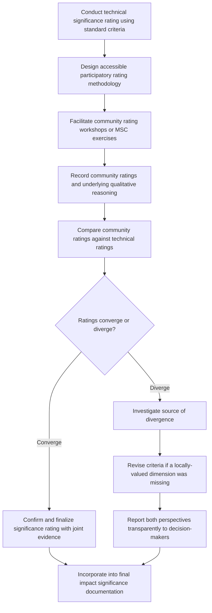

## Stakeholder Input into Significance Ratings

### Overview

Stakeholder input into significance ratings is the methodological practice of incorporating affected communities' and other stakeholders' own perceptions, values, and priorities directly into the process of determining how significant a predicted impact is — rather than relying solely on technical/expert-derived ratings. This addresses a core critique of purely technical significance frameworks: that they can produce internally consistent but socially disconnected ratings if the values embedded in the criteria and weighting do not reflect what affected people themselves consider important.

**Key Points**

- Stakeholder input can enter significance rating at multiple points: defining criteria/thresholds, providing evidence for sensitivity/vulnerability ratings, and directly co-rating or validating final significance levels.
- Technical and stakeholder-derived ratings do not always converge; divergence itself is analytically important information, not a problem to be resolved by simply picking one source over the other.
- Meaningful stakeholder input requires deliberate methodological design (timing, format, representativeness) — passive consultation or generic public meetings are widely recognized as insufficient for this purpose.

---

### Conceptual Framework

#### Why Technical Ratings Alone Are Insufficient

Purely technical significance frameworks (magnitude × sensitivity matrices, weighted scoring) embed value judgments even when they appear objective:

- Which criteria are included (e.g., is "loss of spiritual connection to land" a recognized criterion at all?)
- How thresholds are set (e.g., what income loss percentage counts as "major")
- How receptor sensitivity is defined (e.g., is a community's own stated attachment to a resource weighted, or only its measurable economic dependency?)

Stakeholder input functions as a validity check and enrichment mechanism against these embedded assumptions, surfacing locally-held values that technical criteria alone may not capture.

#### Points of Integration

Stakeholder input can be incorporated at several distinct stages, each serving a different function:

| Integration Point | Function |
| --- | --- |
| Criteria co-design | Communities help define what dimensions of impact matter (beyond default magnitude/duration/extent) |
| Evidence for sensitivity rating | Communities provide first-hand information on dependency, vulnerability, adaptive capacity |
| Direct significance co-rating | Communities participate in rating exercises alongside or parallel to technical assessors |
| Validation/review of draft ratings | Communities review and respond to draft technical ratings before finalization |

---

### Standard Methods

#### 1. Participatory Rating Workshops

Structured sessions where community representatives directly rate identified impacts using simplified versions of the technical significance scales (severity, likelihood, reversibility), facilitated to ensure accessible, non-technical language.

**Example process**

- Impacts are presented using plain-language descriptions (not technical jargon) with visual aids where literacy is a barrier
- Participants individually or in small groups rate each impact on a simplified scale (e.g., a 3-point "not a big concern / concerning / very concerning" scale, or visual tools like sorting cards)
- Facilitators record both the ratings and the qualitative reasoning behind them
- Results are compared against parallel technical ratings for the same impacts

This method generates a **community significance profile** that can be directly compared against the technical significance profile, revealing convergence or divergence patterns.

#### 2. Most Significant Change (MSC) Technique

A qualitative method where community members are asked to identify and narrate the changes they consider most significant (positive or negative) resulting from the project, without being constrained to a pre-defined impact list. This is particularly valuable for surfacing impacts the technical assessment may have missed entirely, not just for re-rating already-identified impacts.

**Example**

Technical assessment identifies "loss of agricultural land" as the primary livelihood impact. An MSC exercise reveals that community members rank "loss of communal gathering space used for social and ceremonial purposes" — an impact not separately identified in the technical land-use assessment — as equally or more significant, prompting the assessment team to add this as a distinct impact requiring its own significance rating and mitigation consideration.

#### 3. Ranking and Prioritization Exercises

Community-based ranking methods (e.g., pairwise comparison, proportional piling with counters/stones, or simple ordinal ranking) used to establish a community-derived priority order among identified impacts, which can then be compared against the priority order implied by technical significance ratings.

$$Rank_{community} \text{ vs. } Rank_{technical}$$

Significant divergence between these two rankings (e.g., a technically "moderate" impact ranked as top community priority) is a strong signal that the technical criteria may be missing a locally important value dimension.

#### 4. Structured Divergence Reconciliation

When community and technical ratings diverge, standard good practice does not default to either overriding the other, but instead:

- Documents both ratings transparently in the assessment report
- Investigates the source of divergence (missing criteria, different risk perception, differing time horizons, differing baseline assumptions)
- Where divergence reflects a locally-held value not captured in technical criteria, revises the significance framework to incorporate it
- Where divergence reflects differing risk perception rather than a missing criterion, reports both perspectives explicitly to decision-makers rather than resolving it unilaterally

[Inference: appropriate reconciliation approach depends on the specific source of divergence identified through follow-up investigation, and cannot be reduced to a single universal decision rule.]

---

### Process Flow

---

### Design Considerations for Meaningful Input

| Consideration | Why It Matters |
| --- | --- |
| Timing | Input gathered before ratings are finalized carries more influence than post-hoc validation of already-decided ratings |
| Representativeness | Standard public meetings often systematically underrepresent women, youth, and marginalized groups; targeted engagement (as in gender-differentiated consultation design) is needed for representative input |
| Accessibility of format | Technical rating scales (matrices, numeric scores) may not translate meaningfully without careful, non-technical facilitation |
| Power dynamics | Facilitation must actively manage dominant voices (e.g., local elites, male household heads) to avoid input being unrepresentative of the full community |
| Feedback loop | Communities should see how their input influenced (or did not influence, with explanation) final significance ratings, to maintain trust in the process |

---

### Common Pitfalls

- **Treating consultation as a checkbox**: Conducting a single public meeting and citing "stakeholder input obtained" without integrating it analytically into the rating process.
- **Consulting after ratings are already finalized**: Presenting completed technical ratings for token community "validation" rather than genuine co-rating input.
- **Assuming consensus where none exists**: Reporting a single aggregated "community view" when significant internal disagreement or differentiated impact exists across subgroups (linking to the distributional/equity assessment concern).
- **Discounting divergent stakeholder ratings as "uninformed"**: Dismissing community ratings that diverge from technical ratings without genuine investigation, rather than treating divergence as valid information about missing criteria or differing risk perception.
- **Elite capture of participatory processes**: Allowing dominant or already-empowered voices to represent "the community" in rating exercises, reproducing rather than correcting for representativeness gaps.
- **Ignoring differentiated input by subgroup**: Failing to disaggregate stakeholder input by gender, age, or vulnerability status, missing group-specific significance perceptions that a single aggregated community exercise would obscure.

---

### Related Topics

- Free, Prior, and Informed Consent (FPIC) processes
- Gender-responsive consultation design (linked engagement methodology)
- Most Significant Change (MSC) monitoring and evaluation technique
- Grievance redress mechanisms as ongoing feedback channels
- Distributional and equity-weighted assessment (differentiated stakeholder perspectives)
- Community-based participatory research methods
- Social impact management plan co-development
- Transparency and disclosure practices in impact assessment reporting