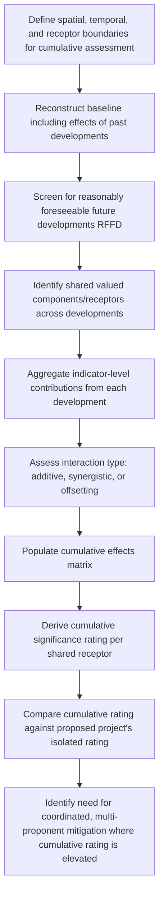

## Cumulative Significance Across Multiple Projects

### Overview

Cumulative significance across multiple projects is the analytical step of evaluating whether the combined effect of a proposed project's impacts, together with impacts from other past, present, and reasonably foreseeable future developments in the same area, produces a significance rating materially different from — typically greater than — what any single project's impact assessment would show in isolation. This addresses a well-documented limitation of project-by-project SIA: individually "acceptable" impacts from multiple developments can aggregate into a significant cumulative effect that no single assessment captures.

**Key Points**

- Cumulative significance assessment requires expanding the analytical boundary beyond a single project's footprint and timeline to include other developments sharing the same receptors, resources, or geographic area.
- The same impact category (e.g., in-migration, land-use change, service demand) from multiple concurrent or sequential projects can interact additively, or in some cases synergistically (producing effects greater than the simple sum), rather than remaining independent.
- Practical execution is constrained by data availability on other projects' impacts and by unclear institutional responsibility for cumulative-level assessment, which exceeds any single proponent's control.

---

### Conceptual Framework

#### Defining the Cumulative Effects Boundary

Cumulative assessment requires explicitly defining three boundaries beyond the single-project scope:

| Boundary Type | Definition |
| --- | --- |
| Spatial boundary | Geographic area encompassing all developments whose impacts could interact with the proposed project's impacts on shared receptors |
| Temporal boundary | Time period covering past developments still affecting current baseline, the proposed project's life, and reasonably foreseeable future developments |
| Receptor/valued component boundary | The specific social/environmental components (e.g., a particular water source, a specific vulnerable community, regional housing market) for which cumulative effects are assessed |

Unlike single-project significance rating, cumulative assessment cannot use the proposed project's own baseline as the sole reference point — it must account for a baseline already partially shaped by other past/existing developments, and project forward accounting for other reasonably foreseeable developments.

#### Types of Cumulative Interaction

$$Effect_{cumulative} \neq \sum_{i} Effect_i \text{ (in general)}$$

Cumulative effects are typically categorized by their aggregation pattern:

- **Additive**: Total effect approximately equals the sum of individual project effects (e.g., total land area converted across multiple developments)
- **Synergistic**: Total effect exceeds the simple sum due to interaction between contributing factors (e.g., combined in-migration from two concurrent projects overwhelming housing capacity in a way that neither alone would, producing disproportionate price inflation)
- **Antagonistic/offsetting**: Combined effect is less than the sum, where one development's mitigation or infrastructure investment partially offsets another's impact (e.g., a second project benefiting from housing/infrastructure capacity built for the first)

---

### Standard Methods

#### 1. Baseline Reconstruction Including Prior Development

Standard practice requires establishing what portion of current baseline conditions already reflects the cumulative effect of past developments, since a "pristine" baseline unaffected by prior projects is often unavailable in areas with development history.

**Example**

A community's current land-use pattern already reflects cumulative land conversion from two prior projects completed in the last 15 years. The proposed project's incremental land-use impact must be assessed both against current (already-altered) baseline and, where data permits, against a longer-term historical baseline to reveal the full cumulative land conversion trajectory, since assessing only incremental change from current baseline could understate the total transformation experienced by the community.

#### 2. Reasonably Foreseeable Future Developments (RFFD) Screening

Identifies other projects that should be included in the cumulative assessment based on defined inclusion criteria:

| Inclusion Criterion | Example Threshold |
| --- | --- |
| Regulatory status | Projects with approved permits, pending applications, or publicly announced intent |
| Geographic proximity | Projects within a defined radius or sharing the same watershed/labor market/administrative boundary |
| Temporal overlap | Projects with construction/operational phases overlapping the proposed project's timeline |
| Shared receptor/resource | Projects affecting the same specific community, resource, or infrastructure system |

A common practical challenge is that RFFD screening depends on information the proponent may not fully control (e.g., undisclosed competitor projects, informal/unregulated developments), which is a recognized limitation of cumulative assessment practice generally, not a flaw specific to any one assessment. [Unverified: the completeness of RFFD identification varies substantially by jurisdiction transparency and data availability and cannot be assumed comprehensive.]

#### 3. Cumulative Indicator Aggregation

Extends the standard indicator-based prediction methods (used for demographic, economic, and service capacity indicators) by summing or modeling combined contributions from multiple developments against shared capacity thresholds.

$$CumulativeGap(t) = \sum_{i} Demand_i(t) - Capacity_{shared}(t)$$

**Example**

Three separate projects in a region each individually project modest in-migration (300–500 workers each), and each individual project's SIA concludes housing impact significance as "Moderate" based on that project's isolated contribution. Cumulative assessment summing all three concurrent projects' in-migration (900–1,500 total workers) against the same regional housing stock reveals a combined housing capacity gap that would independently warrant a "Major" significance rating — a finding invisible in any single project's isolated assessment. This is the canonical illustration of why cumulative assessment is methodologically necessary rather than redundant with individual project assessments.

#### 4. Cumulative Effects Matrix

A structured tool mapping each contributing development against each shared valued component/receptor, similar in structure to the distributional winners/losers matrix but oriented toward multiple projects rather than multiple stakeholder groups:

| Valued Component | Project A Contribution | Project B Contribution | Proposed Project Contribution | Cumulative Rating |
| --- | --- | --- | --- | --- |
| Regional housing capacity | Moderate | Moderate | Moderate | Major (cumulative) |
| Communal grazing land | Minor | Negligible | Moderate | Moderate (cumulative) |
| Local health service capacity | Minor | Minor | Minor | Moderate (cumulative) |

This matrix format makes explicit that the proposed project's own individually-rated contribution (e.g., "Moderate" for housing) can combine with other developments to produce a materially higher cumulative significance rating, which is the key output cumulative assessment is designed to surface.

---

### Process Flow

---

### Management Implications

Because cumulative effects arise from multiple independent proponents, standard single-proponent mitigation planning is often structurally insufficient. Recognized management responses include:

- **Regional/strategic-level planning**: Government-led regional or strategic environmental/social assessment covering all developments in an area, rather than relying solely on project-by-project cumulative sections
- **Coordinated mitigation agreements**: Multiple proponents jointly funding shared infrastructure or service capacity expansion (e.g., pooled contribution to regional housing or health infrastructure)
- **Sequencing and phasing conditions**: Regulatory conditions requiring staggered development timing to avoid concurrent peak-demand periods
- **Cumulative monitoring programs**: Shared, regionally-coordinated monitoring of cumulative indicators (housing, service capacity, social cohesion) rather than each proponent monitoring only its own isolated contribution

[Inference: the feasibility of coordinated multi-proponent mitigation depends heavily on regulatory frameworks mandating or incentivizing such coordination, which vary significantly by jurisdiction.]

---

### Common Pitfalls

- **Scoping cumulative assessment too narrowly**: Including only the proponent's own past projects while excluding other developers' projects sharing the same receptors.
- **Treating cumulative effects as purely additive**: Failing to identify synergistic interactions that produce disproportionately larger combined effects than a simple sum would suggest.
- **Using an already-degraded baseline uncritically**: Assessing only incremental change from current (already cumulatively-affected) baseline without acknowledging the broader historical cumulative trajectory.
- **Inadequate RFFD screening**: Omitting foreseeable future developments due to incomplete information-sharing between proponents or regulatory bodies, understating true cumulative exposure.
- **Assigning full mitigation responsibility to a single proponent**: Expecting one project's mitigation measures to address a cumulative-level problem caused by multiple developments, when coordinated multi-party response is actually required.
- **Static cumulative assessment**: Failing to update cumulative assessments as new developments are proposed or approved after the original assessment was completed.

---

### Related Topics

- Strategic Environmental and Social Assessment (SESA) at regional/policy level
- Induced-growth and boomtown effects (a key cumulative interaction pathway)
- Regional infrastructure and service capacity planning
- Multi-stakeholder coordination and joint mitigation agreements
- Reasonably foreseeable future development (RFFD) screening methodology
- Distributional and equity-weighted assessment (cumulative burden distribution)
- Transboundary and regional impact assessment frameworks
- Adaptive management for evolving cumulative baselines