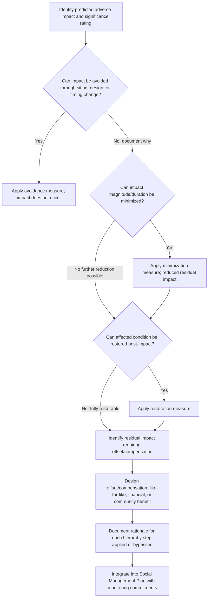

## Mitigation Hierarchy of Avoidance, Minimization, and Offsets

### Overview

The mitigation hierarchy is the sequential, preference-ordered framework used to manage predicted adverse social impacts once significance ratings have identified them as requiring a response. It establishes that impact management should proceed through an ordered set of response types — avoidance first, then minimization, then rehabilitation/restoration, and finally offsets/compensation as a last resort — rather than defaulting immediately to compensation for any adverse impact. This ordering reflects a core impact management principle: preventing harm is preferred over remedying it after the fact.

**Key Points**

- The hierarchy is sequential and preference-ordered, not a menu of equally valid options; each step should only be reached after the preceding step has been genuinely exhausted, not skipped for convenience.
- The hierarchy applies most rigorously to adverse impacts; residual impacts remaining after avoidance and minimization are what offsets/compensation are designed to address, not a substitute for the earlier steps.
- Documentation of *why* avoidance/minimization was not further possible is a standard expectation, particularly for higher-significance impacts, to demonstrate the hierarchy was genuinely applied rather than bypassed.

---

### Conceptual Framework

#### The Four (or Five) Standard Steps

| Step | Definition | Priority Order |
| --- | --- | --- |
| Avoidance | Design or route the project to prevent the impact from occurring at all | 1st (highest preference) |
| Minimization | Reduce the magnitude, extent, or duration of an unavoidable impact | 2nd |
| Rehabilitation/Restoration | Repair or restore affected conditions after impact occurs | 3rd |
| Offset/Compensation | Provide equivalent replacement or compensation for residual impact that cannot be avoided, minimized, or restored | 4th (last resort) |

Some frameworks (e.g., IFC Performance Standard 1) present this as a four-step hierarchy (avoid, minimize, restore, offset); others use a simplified three-step version (avoid, minimize, offset) treating restoration as a form of minimization applied post-impact. Both variants preserve the same core sequential logic.

#### Why Sequential Ordering Matters

$$ResidualImpact = OriginalImpact - Avoidance_{effect} - Minimization_{effect} - Restoration_{effect}$$

Offsets/compensation are designed to address only the *residual* impact remaining after the preceding steps have been applied — not the full original impact. Skipping directly to compensation without genuinely attempting avoidance and minimization results in over-reliance on compensation for impacts that could have been prevented or substantially reduced, a widely recognized weakness in impact management practice when the hierarchy is applied only nominally.

---

### Step 1: Avoidance

#### Definition and Application

Avoidance means altering the project itself — location, design, timing, or scope — so the predicted impact does not occur. This is applied earliest in project planning, ideally during siting/design stages before Impact Identification and Prediction has even finalized significance ratings, since avoidance options narrow considerably once detailed design is locked in.

**Standard avoidance mechanisms**

- Route/site relocation to bypass a sensitive receptor (e.g., realigning a pipeline to avoid a village or sacred site)
- Project scope reduction (e.g., reducing footprint size to avoid encroaching on a specific resource area)
- Timing adjustment (e.g., scheduling construction activities to avoid peak agricultural/fishing seasons for affected communities)
- Alternative technology selection (e.g., choosing a construction method with a smaller physical footprint)

**Example**

Baseline land-use mapping (from Impact Identification and Prediction) identifies a proposed transmission line route bisecting a community's primary grazing land, predicted to cause major livelihood impact for pastoralist households. During design review, an alternative route alignment is identified that follows an existing road corridor, avoiding the grazing land entirely at a modest additional construction cost. This is a genuine avoidance outcome — the predicted impact simply does not occur under the revised design, rather than occurring and then being compensated.

#### When Avoidance Is Not Fully Possible

Many impacts cannot be entirely avoided (e.g., a fixed-location facility with only one technically/economically viable site). In these cases, the hierarchy moves to minimization, but the assessment should document why full avoidance was determined infeasible, supporting the transparency expectation described above.

---

### Step 2: Minimization

#### Definition and Application

Minimization reduces the magnitude, duration, extent, or frequency of an impact that could not be fully avoided, without changing the fundamental project scope or location.

**Standard minimization mechanisms**

- Engineering controls (e.g., noise barriers, dust suppression, buffer zones)
- Phased/staged construction to reduce peak workforce size and associated peak population impacts (directly relevant to the boomtown effects discussed earlier)
- Local hiring preferences to reduce in-migration-driven population influx
- Traffic management and scheduling to reduce community disruption
- Reduced construction footprint within an unavoidable general location

**Example**

A processing facility's location cannot be avoided (only one technically suitable site exists), but the peak construction workforce is reduced from an initially planned 2,200 to 1,400 through revised construction sequencing and increased local hiring targets, directly reducing the predicted peak-population boomtown impact magnitude and associated housing/service strain identified in prediction.

#### Minimization Applied to Timing/Duration

Minimization can target duration as well as magnitude — e.g., accelerating restoration of temporarily disturbed agricultural land to shorten the period of livelihood disruption, even where some land disturbance itself could not be avoided.

---

### Step 3: Rehabilitation/Restoration

#### Definition and Application

Restoration addresses impacts after they occur, returning affected conditions as close to baseline as reasonably achievable. This step is distinct from minimization (which reduces impact before/during occurrence) and from offsets (which compensate for impact that cannot be restored).

**Standard restoration mechanisms**

- Land rehabilitation/reclamation following temporary construction disturbance
- Ecosystem/resource restoration where feasible (e.g., replanting, soil remediation)
- Social infrastructure restoration (e.g., rebuilding community facilities temporarily displaced by construction)
- Livelihood restoration programs (as discussed under livelihood/land-use impact prediction) aiming to return household income/productivity to baseline levels

**Example**

Temporary construction laydown areas on agricultural land are restored through topsoil replacement and soil conditioning after construction completion, aiming to return the land to pre-construction agricultural productivity within a defined monitoring period, rather than treating the land as permanently lost and moving directly to compensation.

---

### Step 4: Offsets and Compensation

#### Definition and Application

Offsets/compensation address residual impacts that remain after avoidance, minimization, and restoration have been genuinely applied and impact still persists — either because full restoration is not achievable (e.g., irreversible impacts) or because some baseline condition cannot be practically returned.

**Standard forms**

- **Like-for-like replacement**: providing equivalent replacement resources (e.g., replacement land of comparable productive capacity, as discussed in livelihood impact prediction)
- **Financial compensation**: monetary payment for residual loss, typically based on replacement cost rather than depreciated market value
- **In-kind community benefit programs**: broader community investment intended to offset impacts not amenable to direct individual compensation (e.g., loss of communal cultural resources)
- **Biodiversity/social offsets at a different location**: compensating for irreversible loss at the impact site through equivalent gains elsewhere (more common in environmental offset practice, applied more cautiously in social contexts given the difficulty of "replacing" social/cultural value at a different location)

**Example**

A sacred site cannot be avoided due to fixed geological constraints on facility siting, and no engineering minimization can reduce the impact of its physical loss. Since this impact is irreversible (as established under reversibility scaling) and restoration is not applicable, the mitigation response moves to compensation: this may include financial compensation, support for relocating associated cultural practices where community-endorsed, and negotiated community benefit agreements — while explicitly acknowledging, in the assessment documentation, that financial compensation does not fully offset the loss of an irreplaceable cultural resource. [Inference: whether any offset can be considered adequate for loss of cultural/spiritual resources is a value judgment properly made through stakeholder engagement, not a determination the assessment methodology alone can resolve.]

---

### Process Flow

---

### Governing Standards

| Standard/Framework | Hierarchy Treatment |
| --- | --- |
| IFC Performance Standard 1 | Explicitly requires mitigation hierarchy application (avoid, minimize, restore/rehabilitate, offset/compensate) |
| World Bank Environmental and Social Framework (ESS1) | Requires the same sequential hierarchy application |
| Equator Principles | Incorporates IFC Performance Standards' hierarchy requirement for project finance |
| IAIA Best Practice Guidance | Frames mitigation hierarchy as fundamental good practice principle in impact assessment |

---

### Common Pitfalls

- **Skipping directly to compensation**: Treating financial compensation as the default response without genuinely exploring avoidance/minimization alternatives, particularly where compensation is administratively simpler than design changes.
- **Applying the hierarchy only nominally**: Documenting avoidance/minimization consideration superficially without evidence of genuine design alternatives having been evaluated.
- **Conflating restoration with offsets**: Treating a restoration commitment as equivalent to addressing residual impact, when restoration and offsets serve different functions (returning to baseline vs. compensating for what cannot return to baseline).
- **Assuming compensation fully addresses impact**: Treating payment of compensation as closing out an impact without acknowledging residual, non-monetizable losses (e.g., cultural, relational, place-based value).
- **Applying the hierarchy too late**: Introducing avoidance considerations only after detailed design is finalized, when the most effective avoidance opportunities exist early in siting and conceptual design.
- **No differentiation by significance level**: Applying the same level of hierarchy rigor to negligible and major impacts; standard practice generally expects more rigorous avoidance/minimization effort in proportion to impact significance.

---

### Related Topics

- Criteria for determining significance (informs which impacts require hierarchy application)
- Livelihood restoration planning and replacement cost valuation
- Resettlement Action Plans and physical/economic displacement management
- Social Management Plan development and structure
- IFC Performance Standards and World Bank ESF compliance requirements
- Community benefit agreements and benefit-sharing mechanisms
- Cultural heritage impact assessment and management
- Free, Prior, and Informed Consent in offset/compensation negotiation