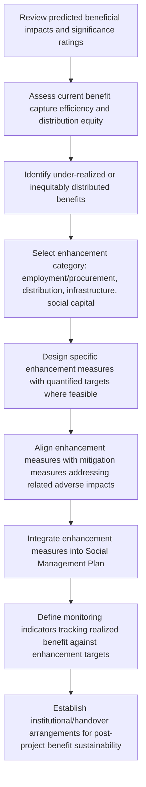

## Designing Enhancement Measures for Positive Impacts

### Overview

Designing enhancement measures for positive impacts is the counterpart process to the mitigation hierarchy, focused on deliberately increasing the magnitude, reach, durability, or equitable distribution of beneficial impacts identified during Impact Identification and Prediction and Evaluating Impact Significance. Rather than simply documenting that a beneficial impact will occur and treating it as requiring no further action, enhancement planning treats positive impacts as a design target in their own right — asking not only "will this be beneficial?" but "how can this benefit be maximized, sustained, and shared more broadly?"

**Key Points**

- Enhancement is not the passive inverse of mitigation; it requires proactive design of specific interventions rather than simply the absence of adverse action.
- Predicted beneficial impacts often underperform their potential without deliberate enhancement measures — e.g., local employment gains can be captured disproportionately by already-advantaged groups absent targeted local capacity-building or hiring design.
- Enhancement measures should be linked back to the same significance and distributional analysis used for adverse impacts, prioritizing effort where benefit is currently under-realized or inequitably distributed.

---

### Conceptual Framework

#### Enhancement as a Distinct Management Category

Where the mitigation hierarchy manages adverse impacts through avoid–minimize–restore–offset, enhancement management for beneficial impacts follows a parallel but distinct logic:

$$Benefit_{realized} = Benefit_{potential} \times CaptureEfficiency \times DistributionEquity$$

Enhancement measures target each factor:

- **Increasing potential benefit magnitude** (e.g., expanding scope of a local procurement program)
- **Improving capture efficiency** (e.g., building local supplier capacity so benefit is not lost to external actors, as in the benefit leakage analysis discussed under distributional assessment)
- **Improving distribution equity** (e.g., ensuring benefit reaches vulnerable subgroups, not just those already best-positioned to access it)

#### Relationship to Broader Frameworks

Some frameworks (e.g., IFC Performance Standards guidance, shared value approaches in corporate sustainability) explicitly require or encourage enhancement planning as a companion obligation to mitigation, reflecting the principle that impact management is not only about "do no harm" but also about optimizing legitimate development benefits a project can generate for affected communities.

---

### Standard Enhancement Categories

#### 1. Local Employment and Procurement Enhancement

Addresses the benefit leakage concern raised under distributional assessment by deliberately building local capacity to capture a larger share of project-generated economic activity.

**Standard mechanisms**

- Local hiring targets/quotas with phased skill-development pathways for entry-level positions
- Local supplier development programs (technical assistance, financing support, quality certification assistance) to enable local businesses to meet project procurement standards
- Unbundling large contracts into smaller packages more accessible to local/small suppliers
- Skills training programs aligned specifically with anticipated project labor demand, timed to precede peak hiring needs

**Example**

Baseline capacity assessment finds local suppliers can realistically capture only 12% of project procurement value without intervention. An enhancement program combining supplier development training, phased contract unbundling, and a dedicated local procurement liaison role targets increasing local capture to 30% over the first three years of operations, with progress tracked against this explicit target rather than left to arise passively from project economic activity. [Inference: achievability of any specific capture-rate target depends on local supplier baseline capacity and market conditions, and the example figures are illustrative rather than a guaranteed outcome.]

#### 2. Benefit Distribution Enhancement

Targets equitable spread of benefits across subgroups identified as under-benefiting in distributional assessment, particularly groups experiencing concentrated adverse impacts elsewhere in the project's impact profile.

**Standard mechanisms**

- Targeted hiring/training quotas for women, youth, or other underrepresented groups in the local labor market
- Revenue-sharing or community development fund structures with governance ensuring equitable allocation across community subgroups, not just influential representatives
- Compensation/benefit-sharing design that reaches non-titled resource users (addressing the land tenure/gender gap identified in livelihood and gender-differentiated analysis), not only registered landholders

**Example**

Distributional analysis found landless laborers experiencing predominantly adverse effects with limited access to employment benefits due to skills mismatches. An enhancement measure establishes a dedicated pre-employment training program specifically targeting landless households, paired with a modified hiring process that credits training completion, directly correcting the identified distributional gap rather than relying on general project employment to reach this group passively.

#### 3. Infrastructure and Service Legacy Enhancement

Designs project-associated infrastructure (roads, water systems, health/education facilities) to provide benefit beyond the immediate project need, extending positive impact duration past project life where feasible.

**Standard mechanisms**

- Designing project infrastructure (e.g., water supply systems, access roads, power connections) with capacity/specifications exceeding minimum project need to allow community co-use
- Formal handover/transition planning for project-built social infrastructure (clinics, schools) to ensure continued operation and maintenance after project involvement ends, avoiding the "white elephant" outcome of unsustained facilities
- Capacity-building for local institutions (health workers, teachers, government service providers) to sustain enhanced service levels independently

**Example**

A project constructs an access road primarily for construction logistics. Enhancement design upgrades the road specification to a standard suitable for long-term community and commercial use (rather than a minimal temporary construction standard), and formalizes a maintenance handover agreement with local government, extending the road's beneficial impact well beyond the construction phase it was originally built to serve.

#### 4. Social Capital and Institutional Enhancement

Targets strengthening of community institutions, cohesion, and governance capacity — directly countering potential cohesion/wellbeing adverse impacts identified elsewhere, while building durable positive social infrastructure.

**Standard mechanisms**

- Support for community-based organizations and governance structures (e.g., resource management committees, community liaison groups) with capacity extending beyond project-specific functions
- Structured platforms for inter-group engagement designed to build bridging social capital between long-term residents and in-migrant populations, directly countering the cohesion erosion pathway identified in social cohesion prediction
- Support for cultural/community events and institutions as a deliberate enhancement measure, not merely incidental community relations activity

---

### Process Flow

---

### Integration with Mitigation Planning

Enhancement measures are most effective when explicitly linked to mitigation measures addressing related adverse impacts, since many project changes carry both dimensions simultaneously (as discussed under distinguishing beneficial and adverse impacts).

| Adverse Impact | Related Beneficial Impact | Integrated Response |
| --- | --- | --- |
| In-migration-driven service strain | New employment and income | Combine service capacity mitigation with local hiring enhancement to maximize net community benefit |
| Land access restriction | Compensation payment | Combine restoration/compensation with livelihood diversification enhancement (skills training) rather than one-time payment alone |
| Cohesion strain from newcomer influx | New economic linkages between groups | Combine grievance mechanisms with structured inter-group engagement platforms |

---

### Common Pitfalls

- **Treating enhancement as automatic**: Assuming beneficial impacts will fully materialize without deliberate design, then finding realized benefit falls well short of predicted potential.
- **Enhancement without distributional targeting**: Designing generic enhancement measures (e.g., general local hiring) without correcting for which subgroups are actually able to access them, reproducing the same distributional gaps identified in prediction.
- **No sustainability/handover planning**: Building enhanced infrastructure or services without a credible plan for their operation and maintenance after project involvement ends, resulting in benefit decay after project closure.
- **Enhancement measures disconnected from identified gaps**: Designing generic community investment programs not linked to the specific benefit-capture or distribution gaps identified in the assessment, reducing their relevance and effectiveness.
- **No monitoring of enhancement effectiveness**: Treating enhancement measures as a one-time design commitment without tracking whether targets (e.g., local procurement capture rate, training program completion/employment outcomes) are actually being achieved.
- **Enhancement as public relations rather than substantive design**: Framing initiatives primarily for external communications value rather than grounding them in the specific benefit-optimization logic described above.

---

### Related Topics

- Distinguishing beneficial and adverse impacts (source of enhancement targets)
- Distributional and equity-weighted assessment (identifying under-benefiting groups)
- Local content development and supplier capacity building
- Benefit-sharing agreements and community development funds
- Social Management Plan structure and integration
- Infrastructure legacy and asset handover planning
- Social capital theory and bridging capital-building interventions
- Monitoring and evaluation of social investment programs