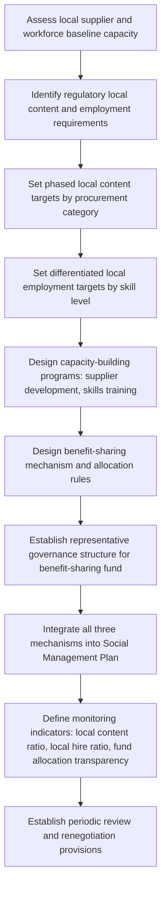

## Local Content, Local Employment, and Benefit-Sharing Agreements

### Overview

Local content, local employment, and benefit-sharing agreements are the primary formal mechanisms through which project-generated economic value is deliberately directed toward host communities and regional economies, operationalizing the enhancement measures discussed previously into binding or semi-binding commitments. These three mechanisms are related but analytically distinct: local content targets procurement and supply chains, local employment targets the workforce, and benefit-sharing agreements provide a governance structure for distributing project revenue or in-kind benefits, often addressing groups that neither local content nor local employment mechanisms directly reach.

**Key Points**

- These mechanisms are frequently required or incentivized by national regulation (particularly in extractive industries), lender safeguard policies, and increasingly by host community expectations, not solely by proponent discretion.
- Effective design requires baseline capacity assessment (of the local workforce and supplier base) to set realistic, phased targets rather than aspirational figures unlikely to be achieved without capacity-building investment.
- Benefit-sharing agreements typically require durable governance structures (management committees, defined allocation rules, grievance mechanisms) to function effectively over a project's multi-year or multi-decade life; poorly governed agreements are a well-documented source of community conflict.

---

### Local Content

#### Definition and Scope

Local content refers to the proportion of project-related goods, services, and labor sourced from within a defined local, regional, or national area, typically measured as a percentage of total project procurement or employment value.

$$LocalContentRatio = \frac{Value_{local}}{Value_{total}}$$

#### Standard Components

| Component | Description |
| --- | --- |
| Goods | Materials, equipment, and supplies sourced from local/national suppliers |
| Services | Contracted services (transport, catering, security, maintenance) provided by local/national firms |
| Capacity building | Technical assistance, financing facilitation, and certification support enabling local firms to meet procurement standards |
| Value addition | Local processing or value-adding activities rather than exporting raw/unprocessed inputs |

#### Design Process

1. **Baseline supplier capacity assessment**: mapping existing local supplier capabilities against anticipated project procurement categories
2. **Gap analysis**: identifying categories where local capacity is insufficient to meet quality, volume, or certification requirements
3. **Phased target-setting**: establishing local content targets that increase over time as capacity-building measures take effect, rather than a single static target from project start
4. **Procurement policy design**: contract unbundling, preferential scoring for local bidders (within applicable procurement law), and payment term adjustments accommodating smaller local suppliers' cash flow constraints

**Example**

A baseline assessment finds local suppliers currently capable of meeting only basic categories (catering, unskilled labor, basic construction materials), representing roughly 12% of total anticipated procurement value. A phased local content plan sets targets of 15% in year 1, 22% by year 3 (following a supplier development program), and 30% by year 5, with specific capacity-building milestones (certification support, financing facilitation) tied to each phase rather than assuming organic growth. [Inference: achievement of phased targets depends on the effectiveness of accompanying capacity-building measures and prevailing market conditions, and specific figures are illustrative rather than a guaranteed trajectory.]

#### Common Regulatory Basis

Many jurisdictions, particularly in oil, gas, and mining sectors, impose statutory local content requirements with specified minimum percentages and reporting obligations; where such regulation exists, local content planning must be designed to at least meet regulatory minimums, with voluntary commitments potentially exceeding them. [Unverified: specific regulatory requirements vary substantially by jurisdiction and sector and must be verified against the applicable national/local legal framework for any specific project.]

---

### Local Employment

#### Definition and Scope

Local employment refers to deliberate hiring policies and workforce development measures directing project employment opportunities toward the local/regional labor force, differentiated by skill level and employment phase (construction vs. operations, as discussed under boomtown effects).

#### Standard Mechanisms

| Mechanism | Function |
| --- | --- |
| Local hiring targets/quotas | Numeric or percentage commitments for local hires by job category |
| Skills gap analysis and training programs | Pre-employment training aligned with anticipated labor demand timing |
| Tiered recruitment policy | Preferential consideration for local candidates meeting minimum qualifications before regional/national recruitment |
| Transparent recruitment processes | Published vacancy announcements, clear criteria, and community-accessible application processes to counter informal/patronage-based hiring |

#### Design Considerations

Local employment targets should be differentiated by skill level and job category, since unskilled/semi-skilled positions typically offer far greater local hiring potential than specialized technical/managerial roles requiring qualifications not locally available without substantial training lead time.

**Example**

A project sets differentiated local hiring targets: 90% local hiring for unskilled/semi-skilled construction labor, 40% for skilled trades (supported by a dedicated trade apprenticeship program launched 18 months before peak construction hiring), and 10% for specialized technical/engineering roles (reflecting genuine local skills availability constraints), rather than a single blanket target across all job categories that would either be unachievable for specialized roles or unambitious for entry-level positions.

#### Linkage to Gender-Differentiated and Distributional Concerns

Local employment design should incorporate the gender-differentiated and distributional considerations discussed earlier — generic local hiring targets without deliberate outreach can reproduce existing labor market exclusion patterns (e.g., underrepresentation of women in construction trades) rather than correcting for them, requiring explicit measures such as targeted outreach, flexible scheduling, and on-site facilities supporting women's participation.

---

### Benefit-Sharing Agreements

#### Definition and Scope

Benefit-sharing agreements are formal or semi-formal arrangements through which a portion of project revenue, resources, or other benefits are directed to affected communities, typically governed by a defined allocation mechanism and community-level governance structure, distinct from individual employment or compensation payments.

#### Standard Forms

| Form | Description |
| --- | --- |
| Revenue-sharing | Fixed percentage or formula-based share of project revenue/royalties directed to a community fund |
| Community development fund | Pooled fund (from fixed contributions, revenue share, or both) allocated to community-prioritized projects |
| Equity participation | Community or community trust holds a minority equity stake in the project, receiving dividend income |
| In-kind infrastructure/service provision | Direct provision of infrastructure or services (schools, clinics, water systems) as an agreed benefit-sharing form |

#### Governance Design

Effective benefit-sharing agreements require durable governance structures addressing:

- **Allocation rules**: transparent, pre-agreed criteria for how funds/benefits are distributed across community priorities and subgroups
- **Representative governance body**: a management committee or trust structure with legitimate, representative community membership (linking to the representativeness concerns raised under stakeholder input into significance ratings)
- **Financial management and audit**: transparent accounting and regular independent audit to maintain community trust in fund management
- **Grievance mechanism**: a defined process for addressing disputes over allocation decisions, distinct from but potentially linked to the project's broader grievance mechanism
- **Review/renegotiation provisions**: defined periodic review points allowing adjustment as project conditions, community priorities, or revenue levels change over the project's life

**Example**

A benefit-sharing agreement establishes a community development fund receiving 1% of gross project revenue annually, governed by a management committee comprising elected community representatives (with defined gender-balanced representation requirements), local government liaison, and an independent technical advisor. Allocation decisions follow a published annual community-priority-setting process, with financial statements published and subject to independent annual audit. [Inference: specific revenue-share percentages and governance structures vary enormously by jurisdiction, sector, and negotiated agreement, and the example figures are illustrative of a governance pattern rather than a standard or recommended percentage.]

---

### Process Flow

---

### Relationship Between the Three Mechanisms

| Mechanism | Primary Beneficiary Pathway | Limitation Addressed by Other Mechanisms |
| --- | --- | --- |
| Local content | Local businesses/suppliers | Does not reach individuals without business ownership/employment |
| Local employment | Individual workers meeting hiring criteria | Does not reach non-working-age residents, those outside labor force, or those lacking required skills |
| Benefit-sharing | Broader community, including groups not captured by employment/content mechanisms | Requires governance capacity that may not exist without deliberate institutional support |

Because each mechanism reaches a different subset of the affected population, comprehensive benefit distribution design typically requires deploying all three in a coordinated manner, informed by the distributional/equity assessment identifying which subgroups each mechanism is likely to miss.

---

### Common Pitfalls

- **Aspirational rather than capacity-based targets**: Setting local content/employment targets without baseline capacity assessment, resulting in unachievable commitments or reputational/regulatory risk from missed targets.
- **Uniform targets across skill levels**: Applying the same local hiring percentage across all job categories regardless of genuine local skills availability.
- **Elite capture of benefit-sharing governance**: Allowing benefit-sharing fund governance to be dominated by already-influential community members, replicating rather than correcting distributional inequities.
- **No monitoring/reporting transparency**: Failing to publicly report local content ratios, employment figures, or fund allocation decisions, undermining community trust and external verification.
- **Static agreements over long project lives**: Fixing benefit-sharing terms without periodic review provisions, creating misalignment as project revenue, community needs, or regulatory context change over time.
- **Treating the three mechanisms as substitutes**: Assuming strong local employment performance eliminates the need for benefit-sharing or local content measures, when each addresses a distinct beneficiary gap.

---

### Related Topics

- Designing enhancement measures for positive impacts (parent framework)
- Distributional and equity-weighted assessment (identifying under-benefiting groups)
- Gender-differentiated impact analysis (linked to employment design)
- Grievance redress mechanism design and governance
- Free, Prior, and Informed Consent in benefit-sharing negotiation
- National local content regulation in extractive industries
- Social Management Plan structure and integration
- Community development fund governance models