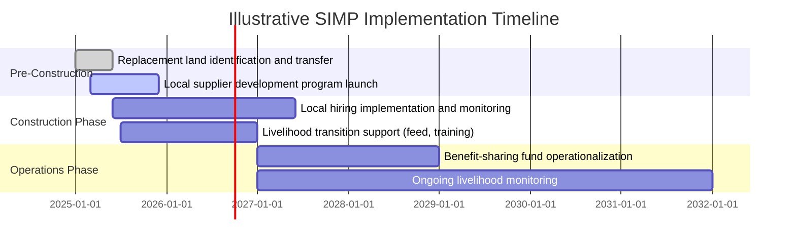
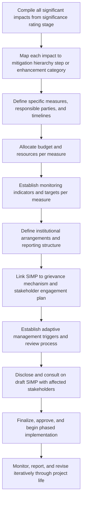

## Developing a Social Impact Management Plan

### Overview

A Social Impact Management Plan (SIMP), sometimes referred to as a Social Management Plan (SMP) or integrated within a broader Environmental and Social Management Plan (ESMP), is the consolidated implementation document that translates all preceding SIA analysis — impact predictions, significance ratings, mitigation hierarchy applications, and enhancement measures — into a structured, actionable, and accountable management framework. It is the primary deliverable through which SIA findings become binding commitments with assigned responsibility, resourcing, timelines, and monitoring obligations.

**Key Points**

- The SIMP is not a summary of the SIA report; it is a forward-looking operational document specifying who does what, by when, with what resources, and how success will be measured for every significant impact identified.
- A defensible SIMP maintains clear traceability back to the specific predicted impact, significance rating, and mitigation hierarchy step each measure addresses, rather than presenting generic commitments disconnected from the analysis.
- The SIMP is a living document expected to be updated through adaptive management as monitoring data reveals divergence between predicted and actual impacts.

---

### Conceptual Framework

#### The SIMP as the Bridge Between Analysis and Action

$$SIMP = \{(Impact_i, Significance_i, MitigationMeasure_i, Responsibility_i, Timeline_i, Indicator_i)\}$$

Each significant impact identified in earlier SIA stages should map to a corresponding management action recorded in the SIMP, forming a structured register rather than a narrative-only document. This traceable structure is what allows external reviewers, regulators, or lenders to verify that identified impacts are actually being managed, not merely acknowledged.

#### Relationship to Other Management Documents

| Document | Relationship to SIMP |
| --- | --- |
| Environmental and Social Management Plan (ESMP) | SIMP is often a component/chapter of a broader ESMP covering both environmental and social measures |
| Resettlement Action Plan (RAP) / Livelihood Restoration Plan (LRP) | Specialized sub-plans addressing displacement-specific impacts, often referenced or incorporated by the SIMP rather than duplicated within it |
| Stakeholder Engagement Plan (SEP) | Governs ongoing consultation processes; SIMP implementation typically depends on SEP-defined engagement channels |
| Grievance Redress Mechanism (GRM) procedure | Operational procedure the SIMP references as the feedback channel for implementation issues |

---

### Standard Structure and Components

#### 1. Impact and Mitigation Register

The core structural element: a systematic table or database linking each significant impact to its management response.

| Field | Description |
| --- | --- |
| Impact description | Concise statement of the predicted impact |
| Significance rating | Rating derived from the significance criteria/matrix methodology |
| Affected receptor(s) | Specific group(s) affected, disaggregated where relevant (gender, vulnerability status) |
| Mitigation hierarchy step | Which step (avoid/minimize/restore/offset) or enhancement category the measure represents |
| Specific measure(s) | Concrete action(s) to be implemented |
| Responsible party | Named organizational role/department accountable for implementation |
| Timeline/phase | Project phase and specific timeframe for implementation |
| Resources/budget | Allocated budget or resource commitment |
| Monitoring indicator | Specific, measurable indicator used to verify implementation and effectiveness |
| Target/threshold | Defined success criterion or trigger threshold for the indicator |

**Example register entry**

- Impact: Loss of access to communal grazing land (Major significance)
- Affected receptor: Pastoralist households (est. 40 households)
- Hierarchy step: Minimization (rerouted to reduce affected area) + Offset (replacement grazing land)
- Measure: Provision of replacement grazing land of equivalent carrying capacity; transitional livestock feed support for 18 months
- Responsible party: Community Relations Manager, in coordination with Land Access team
- Timeline: Replacement land identified and transferred prior to construction start; feed support through first two grazing cycles
- Resources: Budget line item [X]; dedicated livelihood restoration officer (0.5 FTE)
- Monitoring indicator: Livestock body condition score; household income from livestock activities
- Target: Return to within 90% of baseline livestock productivity within 24 months

#### 2. Institutional Arrangements and Responsibility Assignment

Specifies organizational structure for SIMP implementation:

- Roles and responsibilities across project departments (community relations, HR/local employment, procurement/local content, environmental/social compliance)
- Reporting lines and escalation procedures for implementation issues
- External coordination arrangements (government agencies, NGOs, service providers involved in specific measures)
- Capacity and staffing requirements for social performance functions

#### 3. Budget and Resourcing

Explicit budget allocation for each mitigation/enhancement measure, distinguishing capital costs (e.g., replacement infrastructure) from recurring operational costs (e.g., ongoing livelihood support staff, monitoring activities), since undercapitalized SIMPs are a well-documented cause of implementation failure regardless of how well-designed the measures are on paper.

#### 4. Implementation Timeline/Schedule

A phased schedule aligning mitigation/enhancement measure implementation with project construction and operational milestones, recognizing that some measures (e.g., replacement land transfer, avoidance-based design changes) must be completed *before* the associated impact-causing activity begins, not concurrently or after.

Note: this Gantt-style illustration is presented as unrendered structured text per the required diagram format, not as a rendered chart, and represents an illustrative rather than prescriptive timeline structure.

#### 5. Monitoring and Reporting Framework

Specifies how implementation and effectiveness will be tracked and reported:

- Indicator definitions, baseline values, data collection methods, and frequency
- Internal reporting cadence (e.g., quarterly implementation reports)
- External reporting obligations (e.g., annual disclosure to lenders/regulators, community-facing reporting)
- Independent/third-party monitoring or audit provisions where required by lender or regulatory conditions

#### 6. Grievance Mechanism Linkage

Specifies how grievances related to SIMP implementation (e.g., a compensation payment dispute, a local hiring complaint) are captured, routed, and resolved, typically referencing the project's broader Grievance Redress Mechanism rather than establishing a separate parallel process.

#### 7. Adaptive Management Provisions

Defines the process for revising the SIMP itself when monitoring data indicates that predicted impacts, significance ratings, or mitigation effectiveness diverge materially from what was originally assessed:

- Defined triggers for SIMP review (e.g., monitoring indicator breaching a defined threshold)
- Review/amendment approval process and responsible decision-making authority
- Version control and change documentation to maintain an auditable record of plan evolution over the project life

---

### Process Flow

---

### Governing Standards and Expectations

| Standard/Framework | SIMP-Relevant Requirement |
| --- | --- |
| IFC Performance Standards | Requires an Environmental and Social Management System including management plans for identified impacts |
| World Bank ESF | Requires Environmental and Social Commitment Plan (ESCP) with equivalent function |
| Equator Principles | Requires management plans consistent with IFC Performance Standards for project-financed developments |
| ISO 26000 / national SIA regulations | Vary in specific format requirements but generally expect documented, actionable management response to identified social impacts |

[Unverified: specific document naming conventions and required components vary by jurisdiction, lender, and regulatory framework; the structure presented here reflects common cross-framework elements rather than a single universally mandated template.]

---

### Common Pitfalls

- **Disconnection from the impact register**: Presenting generic corporate social responsibility commitments not clearly traceable to specific predicted impacts and significance ratings from the SIA.
- **Vague responsibility assignment**: Naming a department rather than a specific accountable role, diffusing accountability when implementation issues arise.
- **Underbudgeting**: Approving a SIMP with mitigation/enhancement commitments that exceed realistically allocated budget, a common and well-documented cause of implementation shortfall.
- **Static plans without adaptive triggers**: Treating the SIMP as fixed at approval, without defined mechanisms for revising measures as monitoring reveals divergence from predictions.
- **Weak monitoring indicator design**: Using vague or unmeasurable indicators (e.g., "improved community relations") rather than specific, verifiable metrics tied to defined targets.
- **No linkage to grievance mechanism**: Operating SIMP implementation and grievance handling as disconnected processes, missing early warning signals that could trigger timely adaptive management response.

---

### Related Topics

- Mitigation hierarchy of avoidance, minimization, and offsets (source of SIMP measures)
- Designing enhancement measures for positive impacts (source of SIMP measures)
- Local content, local employment, and benefit-sharing agreements (specific SIMP components)
- Resettlement Action Plans and Livelihood Restoration Plans
- Grievance Redress Mechanism design
- Stakeholder Engagement Plan development
- Monitoring and evaluation framework design for SIA
- Adaptive management and significance re-rating during implementation