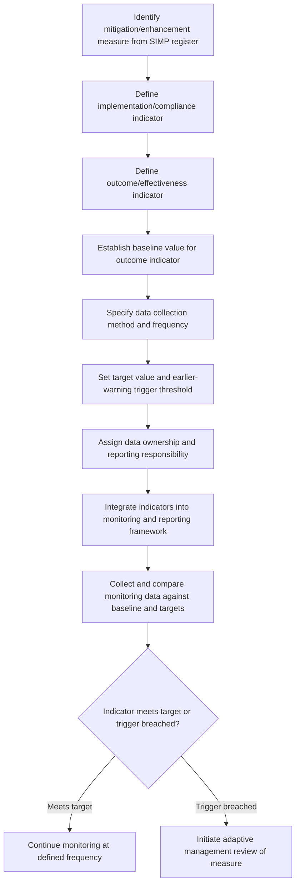

## Linking Mitigation Measures to Monitoring Indicators

### Overview

Linking mitigation measures to monitoring indicators is the methodological discipline of ensuring every commitment recorded in a Social Impact Management Plan has a specific, measurable indicator attached to it — one capable of verifying both whether the measure was implemented (compliance) and whether it achieved its intended effect (effectiveness). Without this explicit linkage, mitigation commitments risk becoming unverifiable statements of intent rather than accountable, auditable management actions.

**Key Points**

- Indicators must be distinguished by what they measure: implementation/compliance indicators (was the measure carried out?) versus outcome/effectiveness indicators (did the measure achieve its intended result?) — a well-designed SIMP tracks both, since implementing a measure does not guarantee it worked.
- Each indicator requires a defined baseline value, data collection method, frequency, and target/threshold to be operationally meaningful, not just a stated intention to "monitor" an impact.
- Indicators should trace directly back to the specific impact and significance rating that justified the mitigation measure in the first place, preserving the analytical chain from prediction through to verification.

---

### Conceptual Framework

#### The Indicator Chain

A complete, defensible linkage traces through four connected elements:

$$Impact \rightarrow MitigationMeasure \rightarrow Indicator \rightarrow Target/Threshold$$

Breaking this chain at any point undermines accountability: a mitigation measure without an indicator cannot be verified as effective; an indicator not tied to a specific measure cannot attribute observed change to management action; a target-less indicator provides data without a basis for judging success or triggering response.

#### Two Indicator Types

| Type | Question Answered | Example |
| --- | --- | --- |
| Implementation/compliance indicator | Was the measure actually carried out as designed? | Number of replacement land parcels transferred; training sessions delivered |
| Outcome/effectiveness indicator | Did the measure achieve its intended social result? | Household income recovery to baseline; reduction in land-related grievances |

A common and consequential design error is tracking only implementation indicators (activity completed) without outcome indicators (impact actually mitigated), which can create false assurance that a mitigation measure is "working" when only its administrative delivery has been confirmed. [Inference: the specific risk of overreliance on implementation-only indicators depends on how directly implementation is expected to translate into outcome, which varies by measure type.]

---

### Standard Indicator Design Process

#### 1. Establish Baseline Value

Every indicator requires a documented baseline value collected before the mitigation measure takes effect, drawn from the same baseline data used in Impact Identification and Prediction wherever possible, to ensure comparability between baseline and monitoring data.

#### 2. Define Data Collection Method and Frequency

Specifies exactly how and how often data will be gathered:

| Method | Typical Use |
| --- | --- |
| Household survey | Income, livelihood, wellbeing indicators (periodic, e.g., annual) |
| Administrative records | Employment numbers, procurement values, training completion (continuous/regular) |
| Direct observation/measurement | Land productivity, service utilization (seasonal or periodic) |
| Grievance mechanism data | Complaint frequency/type by category (continuous) |
| Focus groups/qualitative review | Cohesion, wellbeing, perception-based indicators (periodic, less frequent) |

#### 3. Set Target/Threshold Values

Defines the specific value or range that constitutes successful mitigation, distinguished from a threshold that triggers a management response (which may be set at a less stringent level than the ultimate target, providing early warning before full target failure).

$$Target: Indicator \geq X \quad | \quad Trigger: Indicator < Y \text{ (where } Y > \text{failure threshold, providing lead time)}$$

**Example**

Mitigation measure: replacement grazing land provision for pastoralist households (following the mitigation hierarchy example).

- Implementation indicator: Hectares of replacement land formally transferred (target: 100% of committed area transferred prior to construction start)
- Outcome indicator: Household livestock body condition score and livestock-derived income
- Baseline value: Mean body condition score of 3.2 (5-point scale); mean livestock income of $800/year
- Target: Return to ≥90% of baseline values (score ≥2.9, income ≥$720/year) within 24 months of land transfer
- Trigger threshold: If body condition score falls below 2.5 or income below $500/year at any 6-month monitoring interval, triggers review of supplementary feed support adequacy — set above the ultimate failure point specifically to allow corrective action before the situation deteriorates further

#### 4. Assign Data Ownership and Reporting Responsibility

Specifies which role/function is responsible for collecting, verifying, and reporting each indicator, and the reporting pathway (internal management, external disclosure, regulator/lender reporting) — directly linking to the institutional arrangements defined in the SIMP.

---

### Indicator Design by Impact Category

| Impact/Mitigation Category | Implementation Indicator Example | Outcome Indicator Example |
| --- | --- | --- |
| Livelihood restoration | Replacement land transferred; compensation paid | Household income recovery relative to baseline |
| Local employment | Local hires by category vs. target | Local hire retention rate; wage parity with non-local hires |
| Local content | Local procurement value vs. target | Local supplier business growth/sustainability post-contract |
| Housing/service capacity mitigation | Temporary housing units constructed | Local housing vacancy rate/price index |
| Social cohesion measures | Community liaison meetings held | Cohesion survey indicator trend; grievance frequency related to intergroup tension |
| Benefit-sharing | Fund disbursements made per allocation plan | Community-reported satisfaction with fund governance/allocation |

---

### Process Flow

---

### Attribution Considerations

A recurring technical challenge in linking mitigation to indicators is **attribution**: distinguishing whether observed change in an outcome indicator is actually caused by the mitigation measure, versus other confounding factors (broader economic conditions, other concurrent developments, natural variation). Standard practice addresses this through:

- **Comparison/control group data** where feasible (e.g., comparable non-affected households or communities, cautiously interpreted given imperfect comparability)
- **Multiple corroborating indicators** rather than relying on a single metric, increasing confidence that observed change reflects the mitigation measure rather than a confound
- **Documented causal pathway** connecting the specific measure to the specific outcome indicator (paralleling the pathway analysis used in predicting cohesion/wellbeing impacts), supporting a plausible attribution narrative even without a formal experimental design

[Unverified: the strength of attribution achievable depends heavily on data availability and the feasibility of comparison groups in a given project context, and rigorous causal attribution is often not fully achievable in real-world SIA monitoring settings.]

---

### Common Pitfalls

- **Tracking only implementation indicators**: Reporting that a measure was carried out (e.g., "training sessions delivered") without evidence it produced the intended social outcome.
- **Indicators without baselines**: Beginning monitoring only after a mitigation measure starts, with no pre-measure baseline for comparison, making it impossible to assess actual change.
- **Vague or unmeasurable indicators**: Using indicators like "improved wellbeing" without a specific, operationalized measurement instrument and scale.
- **No trigger threshold, only end-of-project targets**:设定ing only a distant final target without an earlier trigger threshold, missing the opportunity for timely corrective action before failure is confirmed.
- **Single-indicator reliance for complex outcomes**: Using one narrow indicator (e.g., income alone) to represent a multidimensional outcome (e.g., "livelihood restoration"), missing important dimensions the single indicator does not capture.
- **Data collection responsibility left unassigned**: Defining indicators without a named responsible party or funded data collection mechanism, resulting in indicators that exist on paper but are never actually monitored.

---

### Related Topics

- Developing a Social Impact Management Plan (parent framework)
- Severity, likelihood, and reversibility scales (baseline for outcome indicator targets)
- Adaptive management and significance re-rating during implementation
- Grievance redress mechanism data as a monitoring indicator source
- Attribution and counterfactual analysis in social monitoring
- Independent/third-party monitoring and verification practices
- Baseline data collection methodology
- Stakeholder input into significance ratings (community-validated indicator design)