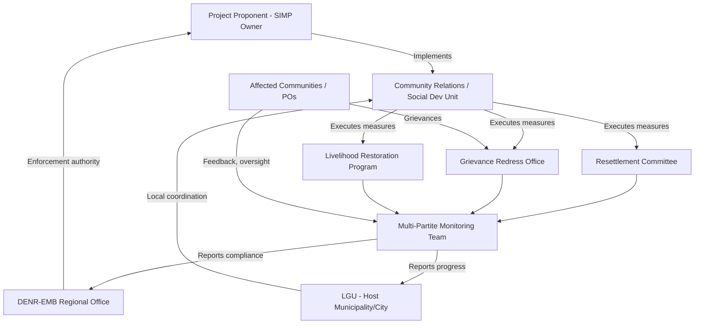

## Institutional Roles and Responsibility for Implementation

### Overview

Institutional roles and responsibilities define *who* is accountable for executing the Social Impact Management Plan (SIMP), *what* authority and resources they hold, and *how* their mandates interlock across the project lifecycle. In Social Impact Assessment (SIA) practice, a technically sound mitigation and enhancement plan fails without a clear institutional architecture — vague accountability is one of the most commonly cited causes of SIMP implementation failure in post-approval audits.

This topic sits at the intersection of organizational design, legal mandate, and project governance, and must answer four questions for every mitigation/enhancement measure identified earlier in the plan:

1. Who is responsible for implementation?
2. Who funds it?
3. Who monitors and verifies it?
4. Who has authority to enforce corrective action if it fails?

---

### Core Institutional Categories

**1. Project Proponent / Developer**

- Bears primary legal and financial responsibility for implementing mitigation, compensation, and enhancement measures committed to in the SIA/EIA.
- Typically establishes an internal unit — often called the Community Relations Office, Social Development Unit, or Environmental and Social Management Department — to operationalize the SIMP.
- Accountable for budgeting, staffing, and reporting against the Social Management Plan (SMP) commitments.

**2. Government Regulatory/Approving Agency**

- Issues the environmental compliance certificate or equivalent approval instrument, embedding SIMP commitments as legally binding conditions.
- Conducts compliance monitoring, audits, and has enforcement power (fines, suspension, revocation of permits) if the proponent fails to deliver.
- In the Philippine context, this is typically the DENR-EMB (Environmental Management Bureau) for the Environmental Compliance Certificate (ECC), with LGU concurrence often required under the Local Government Code.

**3. Local Government Units (LGUs)**

- Host LGUs (province, city/municipality, barangay) have statutory roles in local development planning, land use, and social services that intersect with project mitigation measures.
- Often co-implement or oversee measures such as resettlement, livelihood restoration, and local infrastructure enhancement.
- May chair or co-chair multi-stakeholder monitoring bodies (e.g., Multi-Partite Monitoring Teams in the Philippine EIA system).

**4. Affected Communities and Peoples' Organizations**

- Not passive recipients — SIA good practice assigns communities an active oversight and co-management role, particularly for livelihood, cultural heritage, and grievance mechanisms.
- Community-based organizations (COs), Indigenous Peoples' Organizations (IPOs), or Free and Prior Informed Consent (FPIC) bodies (e.g., NCIP-recognized structures in the Philippines) may hold formal seats in monitoring committees.

**5. Independent/Third-Party Monitors**

- Multi-Partite Monitoring Teams (MMTs), independent environmental/social auditors, or NGOs contracted to verify implementation without conflict of interest.
- Critical for measures where the proponent's self-reporting alone would create an accountability gap (e.g., resettlement outcomes, compensation disbursement).

**6. Financing Institutions (where applicable)**

- For internationally financed projects, lenders (e.g., ADB, World Bank, IFC) impose their own safeguard compliance requirements and may deploy independent supervision consultants.
- Their leverage — continued disbursement — often becomes a de facto enforcement mechanism stronger than domestic regulatory penalties.

---

### Responsibility Assignment Matrix (RACI Approach)

A standard tool for institutionalizing SIMP accountability is a RACI matrix (Responsible, Accountable, Consulted, Informed) applied per mitigation/enhancement measure.

| Mitigation/Enhancement Measure | Responsible | Accountable | Consulted | Informed |
| --- | --- | --- | --- | --- |
| Resettlement Action Plan execution | Proponent's Resettlement Unit | Project Director | Affected households, LGU Housing Office | DENR-EMB, NCIP |
| Livelihood restoration program | Community Relations Office | Proponent CEO/Country Head | Peoples' Organizations, DTI/DOLE | MMT |
| Grievance redress mechanism | Grievance Officer | Community Relations Manager | Barangay Council | All stakeholders |
| Cultural heritage protocol | Heritage Consultant + Proponent | Project Director | NCIP, IP Council of Elders | NHCP |
| Health impact mitigation (e.g., dust, noise) | EHS Department | Project Director | DOH-affiliated Rural Health Unit | LGU, MMT |

**Key Points**

- "Responsible" is the doer; "Accountable" is the single person who answers if it fails — these should never be conflated into an ambiguous "the company" designation.
- Every row must map to a line item in the implementation budget; unfunded responsibility is nominal, not real.

---

### Institutional Structures Commonly Established

**Social Management Committee / SIMP Steering Committee**

- Multi-stakeholder body (proponent, LGU, community reps, regulator observer) that meets periodically to review SIMP progress against indicators.
- Distinguishing feature from a monitoring team: it has *decision authority* to approve budget reallocations or corrective action plans, not just observational reporting.

**Multi-Partite Monitoring Team (MMT)**

- Philippine-specific institutional mechanism under DENR Administrative Order 2003-30, composed of proponent, EMB, LGU, and community/NGO representatives.
- Conducts joint field monitoring, reviews Self-Monitoring Reports (SMR), and can recommend suspension of ECC for non-compliance.

**Grievance Redress Mechanism (GRM) Office**

- A standing institutional function (not a one-time event) staffed with a designated Grievance Officer, documented intake-to-resolution procedure, and defined escalation tiers (site level → project level → regulatory level).

**Resettlement/Livelihood Restoration Committee**

- Often time-bound (active during resettlement implementation phase, then sunset or transition to community-led sustainability committee).

---

### Institutional Capacity Assessment

Before assigning roles, SIA practice requires an institutional capacity gap analysis, since a nominal mandate without capacity produces the same failure mode as no mandate at all.

**Key Points**

- Assess technical capacity (do assigned staff have social safeguards training?)
- Assess financial capacity (is the budget commensurate with the mandate, or is the unit under-resourced relative to its stated scope?)
- Assess authority/positioning (does the Community Relations Officer report high enough in the org chart to influence engineering/procurement decisions, or is the function marginalized?)
- Assess continuity risk (institutional roles anchored to a single named individual rather than a defined position are a common point of failure during staff turnover)

Where gaps are identified, the SIMP should specify capacity-building measures: training programs, staffing plans, TORs (Terms of Reference) for new positions, or technical assistance arrangements with LGUs/NGOs.

---

### Institutional Coordination Flow

---

### Legal and Policy Basis for Institutional Roles

- **Philippine EIS System (PD 1586, DAO 2003-30):** Establishes MMT composition and proponent obligations for Environmental Guarantee/Monitoring Fund management.
- **Local Government Code (RA 7160):** Assigns LGUs planning and regulatory concurrence roles, including the Sanggunian's power to enact ordinances affecting project operations.
- **Indigenous Peoples' Rights Act (RA 8371):** Establishes NCIP and community-level FPIC bodies as mandatory institutional actors where ancestral domains are affected.
- **Republic Act 10121 (Disaster Risk Reduction and Management Act):** Where SIMP measures intersect with hazard mitigation, LGU Disaster Risk Reduction and Management Councils (DRRMCs) become co-responsible institutions.

[Unverified] Specific administrative order numbers and institutional mandates should be cross-checked against the current regulatory text applicable to the project's jurisdiction, as implementing rules are periodically revised.

---

### Common Institutional Failure Modes

**Example**

A mining project's SIMP assigns "the company" as responsible for livelihood restoration with no named unit, no budget line, and no reporting deadline. Two years post-approval, an audit finds the measure was never operationalized because no individual or department was ever accountable — the commitment existed only as a sentence in the SIA document, not as an institutional function.

- **Diffusion of responsibility:** Measures assigned to "the proponent" broadly rather than a specific unit/position.
- **Authority-capacity mismatch:** A Community Relations Officer is nominally responsible for grievance resolution but lacks authority to halt operations pending resolution, undermining the mechanism's credibility.
- **Monitoring-implementation conflict of interest:** The same unit implementing a measure also self-certifies its success, with no independent verification layer.
- **Institutional discontinuity:** Roles tied to specific personnel rather than defined positions, collapsing when staff turn over.
- **Coordination vacuum between proponent and LGU:** Overlapping but uncoordinated mandates (e.g., both claiming responsibility for resettlement site selection) leading to delays and community confusion.

---

### Institutional Sustainability Beyond Project Life

For long-term measures (e.g., community trust funds, environmental user fees, livelihood cooperatives), the SIMP should specify an institutional transition plan:

- Which functions are proponent-led during construction/operation vs. community-led post-closure?
- Is there a legal vehicle (foundation, cooperative, trust) established to hold and manage funds beyond the proponent's operational presence?
- Who inherits monitoring responsibility after project decommissioning?

---

**Next Steps**

- Grievance redress mechanism (GRM) design and institutional placement
- Monitoring and evaluation (M&E) indicator frameworks for SIMP tracking
- Multi-Partite Monitoring Team composition and operating procedures
- Resettlement Action Plan (RAP) institutional arrangements
- Social Development and Management Program (SDMP) budgeting and fund flow mechanisms
- Capacity-building and training program design for social safeguards staff
- Legal instruments for embedding SIMP commitments into permit conditions