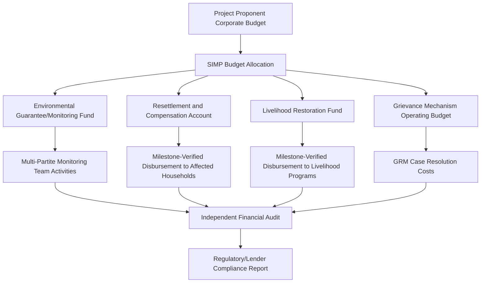

## Budgeting and Resourcing Mitigation Commitments

### Overview

Budgeting and resourcing is the mechanism that converts a Social Impact Management Plan (SIMP) from a document into an enforceable, deliverable program. Every mitigation, compensation, and enhancement measure identified in the SIA must be costed, funded, and resourced with defined disbursement mechanisms — otherwise the measure exists only as a narrative commitment with no operational reality. Regulatory audits and lender safeguard reviews consistently treat "budget line traceable to the specific measure" as the litmus test separating genuine commitments from aspirational language.

This topic covers cost estimation methods, funding source structures, disbursement and fund-holding mechanisms, staffing/resourcing beyond money, and the governance controls that keep budgets aligned to actual implementation needs over the project lifecycle.

---

### Why Budgeting Is Treated as a Distinct SIA Deliverable

- A mitigation measure without a budget line is not verifiable as a commitment — during compliance monitoring, the first question asked of any measure is "show the cost estimate and the funding source."
- Budgets create the link between the **Social Management Plan** and the project's overall **capital and operating expenditure (CAPEX/OPEX)** structure, ensuring social costs are not treated as a residual or discretionary spend.
- Underfunding is a leading cause of SIMP failure identified in post-implementation reviews — measures are frequently designed adequately but resourced at a fraction of actual requirement.

---

### Cost Estimation Methods

**1. Unit Cost / Quantity-Based Estimation**

- Standard approach for measures with quantifiable units: number of households to be resettled × unit resettlement cost; number of hectares of livelihood land to be restored × per-hectare cost.
- Requires a verified baseline (census/inventory of affected persons, assets, or land) to avoid systematic under-costing.

**2. Comparable Project Benchmarking**

- Draws unit costs from comparable projects in similar geography/sector, adjusted for inflation, currency, and local market conditions.
- [Inference] Benchmarked figures typically require a contingency uplift of 15–30% to account for site-specific negotiation dynamics and inflation between SIA preparation and actual implementation, though this range varies by project type and is not a fixed regulatory standard.

**3. Market/Vendor Quotation**

- Direct quotations from contractors, NGOs, or service providers for defined scopes (e.g., livelihood training program delivery, construction of replacement infrastructure).
- Most defensible method for high-value, discrete deliverables.

**4. Expert/Specialist Estimation**

- Used for less standardized measures (cultural heritage protocols, biodiversity offset management, health program design) where specialist consultants provide costed scopes of work.

**Key Points**

- Cost estimates should always be presented with their basis (unit cost source, quantity source, year of estimate) rather than as bare figures, to support later audit and cost escalation review.
- Estimates prepared during SIA (often years before construction) must include an inflation/escalation mechanism, not be treated as fixed nominal figures.

---

### Budget Structure and Categorization

A SIMP budget is typically structured across the following categories:

| Category | Description | Example Line Items |
| --- | --- | --- |
| Direct Compensation | Payments to affected persons for lost assets/income | Land compensation, crop compensation, structure replacement cost |
| Resettlement Implementation | Physical and economic resettlement delivery | Site development, housing construction, transitional allowances |
| Livelihood Restoration | Programs to restore/improve income | Training, seed capital, cooperative development, market linkage support |
| Institutional Strengthening | Capacity of implementing units | Staffing, training for Community Relations Office, systems/tools |
| Monitoring and Evaluation | Verification of implementation | MMT operating costs, third-party audits, baseline/follow-up surveys |
| Grievance Mechanism | GRM operation | Grievance officer staffing, case management systems, mediation costs |
| Community Development/Enhancement | Voluntary enhancement measures | Local infrastructure, scholarship programs, health outreach |
| Contingency | Unforeseen/escalation costs | Typically 10–20% of total SIMP budget [Inference — proportion varies by project risk profile and regulatory guidance] |

---

### Funding Source Architecture

**1. Proponent Capital/Operating Budget**

- The default and most common source; mitigation costs embedded as line items within overall project CAPEX (for construction-phase measures) or OPEX (for ongoing measures like GRM staffing).
- Risk: social budget lines are more vulnerable to cost-cutting during project financial stress than engineering line items, unless protected by regulatory or contractual ring-fencing.

**2. Environmental Guarantee Fund / Monitoring Fund**

- In the Philippine EIA system, proponents are required to establish an Environmental Guarantee Fund (EGF) and Environmental Monitoring Fund (EMF) under DENR Administrative Order 2003-30, providing a ring-fenced financial mechanism separate from general operating funds.
- EMF specifically covers monitoring costs, often jointly managed with the Multi-Partite Monitoring Team.

**3. Escrow or Trust Fund Mechanisms**

- Used for long-duration or post-closure commitments (e.g., community development trust funds, mine rehabilitation funds) where funds must remain available beyond the proponent's active operational period.
- Typically governed by a trust deed specifying trustee, disbursement conditions, and beneficiary oversight role.

**4. Lender-Conditioned Financing**

- For internationally financed projects, disbursement tranches may be explicitly conditioned on evidence of SIMP budget allocation and expenditure, functioning as an external enforcement lever.

**5. Government Co-Financing**

- Where mitigation overlaps with public infrastructure/services (e.g., relocated public roads, replacement health facilities), LGU or national government co-funding may be negotiated, particularly where the measure has broader public benefit beyond the affected community.

---

### Disbursement and Fund Flow Governance

**Key Points**

- Disbursement schedules should be milestone-linked (e.g., released upon verified completion of resettlement site infrastructure) rather than released as a lump sum, to maintain implementation leverage.
- A documented **Financial Management Manual** or equivalent should specify approval authority, signatories, and audit trail requirements for social budget disbursement.
- Community-facing disbursements (compensation payments, livelihood seed capital) require receipt/acknowledgment documentation meeting both internal audit and regulatory evidentiary standards.

---

### Resourcing Beyond Financial Budget

Budgeting is not solely monetary — resourcing includes:

- **Staffing:** Approved headcount and job descriptions for social safeguards roles (Community Relations Officer, Grievance Officer, Resettlement Specialist), with clear reporting lines established under institutional roles planning.
- **Technical Systems:** Grievance case management software/registers, GIS-based asset inventory systems for compensation tracking, monitoring databases.
- **External Capacity:** Retainer arrangements with NGOs, specialist consultants (cultural heritage, gender), or academic institutions for measures requiring expertise the proponent does not hold in-house.
- **Time:** Realistic implementation timelines aligned to the construction/operation schedule — a common resourcing failure is underestimating the lead time required for community consultation and consent processes relative to the engineering schedule.

---

### Budget Adequacy Review and Cost Escalation Management

**Example**

A SIMP prepared during feasibility study estimates resettlement housing construction at a fixed per-unit cost. By the time physical implementation begins three years later, construction material costs have risen 35%. Without an escalation clause in the budget methodology, the proponent faces a funding shortfall mid-implementation, risking incomplete or delayed resettlement delivery — a compliance and reputational risk.

**Mitigating mechanisms:**

- Index budget line items to relevant cost indices (construction cost index, consumer price index) rather than fixing nominal amounts at SIA approval stage.
- Require periodic (e.g., annual) budget adequacy reviews as part of the monitoring cycle, with formal variance reporting to the Social Management Committee.
- Maintain a contingency reserve specifically for cost escalation, distinct from the general risk contingency.

---

### Budget Transparency and Community Oversight

- Leading practice includes disclosing aggregate (not necessarily individual-transaction) SIMP budget figures to affected communities and monitoring bodies, supporting accountability and reducing grievance risk related to perceived under-compensation.
- Where trust funds or community development funds are established, community representation in fund governance/expenditure decisions is increasingly expected under contemporary SIA good practice, though [Unverified] the specific extent of mandated community co-governance varies significantly by jurisdiction and sector and should be checked against applicable local regulation.

---

### Common Budgeting Failure Modes

- **Underestimation from stale baseline data:** Costing based on outdated household/asset inventories, missing new occupants or asset changes between SIA preparation and implementation.
- **No ring-fencing:** Social budget lines absorbed into general contingency and diverted during cost overruns elsewhere in the project.
- **Lump-sum disbursement without milestones:** Removing implementation leverage and increasing misappropriation risk.
- **Omission of institutional/staffing costs:** Budgeting only for direct compensation while under-resourcing the implementing unit itself, undermining execution capacity discussed under institutional roles.
- **No post-closure funding mechanism:** Long-term commitments (trust funds, ongoing monitoring) left unfunded once active project operations cease.

---

**Next Steps**

- Institutional roles and responsibility for implementation (funding governance linkage)
- Resettlement Action Plan (RAP) cost estimation and compensation frameworks
- Environmental Guarantee Fund and Environmental Monitoring Fund mechanics
- Monitoring and evaluation (M&E) budget planning
- Grievance redress mechanism resourcing and case management systems
- Cost escalation and contingency planning methodologies
- Community development trust fund governance structures