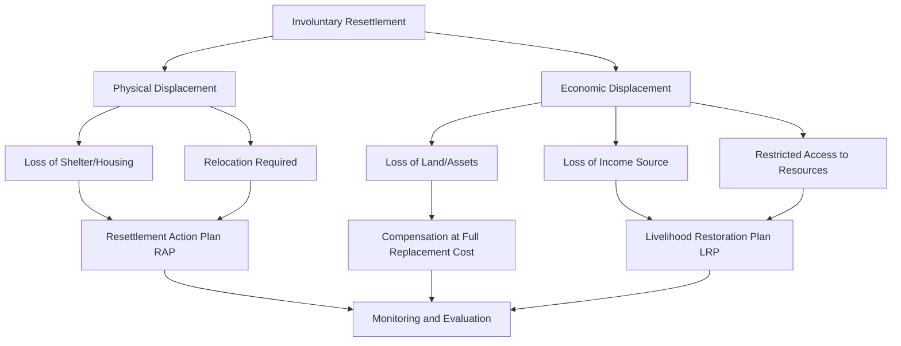

## Principles of Involuntary Resettlement

### Overview

Involuntary resettlement occurs when a development project requires the physical displacement (relocation, loss of shelter) and/or economic displacement (loss of assets, access to assets, income sources, or livelihoods) of people, regardless of whether they hold formal legal title to the land or assets affected. The term "involuntary" signals that affected persons do not have the right to refuse relocation if the project proceeds under lawful authority (e.g., eminent domain, expropriation) — which is precisely why resettlement is governed by the most stringent set of safeguard principles in the social impact assessment field. Poorly managed resettlement is consistently identified as the leading cause of project-related community conflict, cost overrun, and reputational damage across infrastructure, extractive, and energy sectors.

This topic establishes the foundational principles that govern all subsequent resettlement planning instruments (Resettlement Action Plans, Livelihood Restoration Plans, entitlement frameworks) covered later in this chapter.

---

### Foundational Definitions

- **Physical Displacement:** Loss of shelter and assets resulting from land/asset acquisition requiring the affected person(s) to relocate.
- **Economic Displacement:** Loss of income sources or means of livelihood as a result of project-related land acquisition, restriction of access, or change in land use — occurs with or without physical relocation.
- **Involuntary Resettlement:** Encompasses both physical and economic displacement, and applies to *all* affected persons regardless of legal, customary, or informal tenure status.
- **Project-Affected Persons (PAPs) / Displaced Persons (DPs):** The standard terminology for individuals, households, or communities affected by involuntary resettlement.
- **Host Community:** Population residing at or near a resettlement site who are themselves affected by the in-migration of resettled persons — often overlooked but explicitly required to be considered under leading standards.

---

### Core Governing Principles

**1. Avoidance and Minimization First**

- Resettlement is treated as a last resort in the mitigation hierarchy: project design must first explore all technically and financially feasible alternatives to avoid or minimize displacement (alternative alignments, reduced footprint, phased land take) before compensation/resettlement planning begins.
- Where avoidance is not feasible, minimization of the scale and severity of displacement is required, not merely mitigation after the fact.

**2. No Net Loss / Improvement of Livelihoods**

- The overarching standard (articulated in IFC Performance Standard 5, World Bank ESS5, and reflected in most national resettlement policy frameworks) is that displaced persons should be assisted in their efforts to improve, or at minimum restore, their livelihoods and standards of living to pre-displacement levels — in real terms, measured against the pre-project baseline.
- This is a materially higher bar than "compensation for lost assets" — it requires restoration of income-generating *capacity*, not just one-time payment for physical loss.

**3. Eligibility Regardless of Legal Title**

- Compensation and resettlement assistance eligibility is not restricted to persons holding formal legal title. Persons with customary rights, informal occupancy, or no recognizable legal right to the land they occupy are still entitled to assistance, though the *form* of assistance (compensation vs. resettlement assistance only) may differ by eligibility category.
- This principle directly addresses a common failure mode where informal settlers or customary land users are excluded from compensation frameworks, generating acute impoverishment and grievance.

**4. Full Replacement Cost Compensation**

- Compensation for lost assets must be calculated at full replacement cost — the cost to replace the asset at current market value without deduction for depreciation and inclusive of transaction costs (transfer taxes, registration fees) — rather than at assessed/book value, which is frequently far below actual replacement value.
- Applies to land, structures, crops, trees, and other fixed assets.

**5. Meaningful Consultation and Participation**

- Affected persons must be meaningfully consulted throughout planning, implementation, and monitoring — not merely informed after decisions are finalized.
- Consultation must reach differentiated groups within the affected population (women, elderly, youth, indigenous peoples, persons with disabilities), as aggregate "community consultation" often systematically underrepresents vulnerable subgroups.

**6. Special Provisions for Vulnerable Groups**

- Vulnerable groups (defined contextually but commonly including: female-headed households, indigenous peoples, the elderly, persons with disabilities, and the extreme poor) require differentiated identification and tailored assistance, as standard entitlement packages frequently fail to restore their livelihoods to the same degree as the general affected population.

**7. Grievance Redress Access**

- Affected persons must have access to a functioning, accessible grievance mechanism throughout the resettlement process, without cost or retaliation risk, and without the mechanism precluding access to formal legal recourse.

**8. Timing and Sequencing Discipline**

- Displacement must not occur before: (a) compensation has been paid at full replacement cost, and (b) resettlement sites with adequate infrastructure and services are available to affected persons.
- This principle — sometimes called the "compensation-before-displacement" rule — is among the most frequently violated in practice due to project schedule pressure, and among the most consequential when violated, as it leaves displaced persons without assets or replacement housing during the transition period.

**9. Community Cohesion Consideration**

- Where possible, resettlement should preserve existing social networks, kinship structures, and community organization rather than dispersing affected populations individually, as social network disruption is itself a significant, often underweighted, impact.

**10. Host Community Consideration**

- Resettlement site selection and planning must account for impacts on host communities (competition for resources, services, land), with host communities themselves subject to consultation and, where materially affected, entitlement to assistance.

---

### Governing Standards Framework

| Standard | Issuing Body | Core Requirement |
| --- | --- | --- |
| IFC Performance Standard 5 | International Finance Corporation | Land Acquisition and Involuntary Resettlement |
| World Bank ESS5 | World Bank (Environmental and Social Framework) | Land Acquisition, Restrictions on Land Use and Involuntary Resettlement |
| ADB Safeguard Policy Statement (SPS) | Asian Development Bank | Involuntary Resettlement Safeguards |
| National Resettlement Policy/Law | Host country government | Varies by jurisdiction — e.g., Philippine RA 8974 (Right-of-Way Act), LGU resettlement ordinances |

**Key Points**

- Where a project is financed by an international lender, the applicable standard is typically the *more stringent* of the lender's safeguard policy and national law — a common point of confusion in resettlement planning.
- [Unverified] Specific procedural requirements (timelines, documentation standards, compensation formulas) differ meaningfully between these frameworks and must be verified against the current version applicable to the specific project's financing structure and jurisdiction.

---

### Resettlement Impact Categories

---

### Distinguishing Resettlement Planning Instruments

- **Resettlement Action Plan (RAP):** Prepared when the number of affected persons and impact severity exceed defined thresholds (often 200 persons, though thresholds vary by standard/jurisdiction); comprehensive planning document covering compensation, relocation, and restoration measures.
- **Abbreviated Resettlement Plan (ARAP):** Used for lower-impact displacement below the RAP threshold, with proportionally reduced documentation requirements while retaining core principles.
- **Livelihood Restoration Plan (LRP):** May be prepared as a standalone instrument or integrated into the RAP, focused specifically on economic displacement and income restoration — covered in depth in a later item in this chapter.
- **Resettlement Policy Framework (RPF):** Used for programs/projects where specific resettlement impacts cannot yet be determined at approval stage (e.g., multi-site programs), establishing principles and procedures to guide site-specific RAPs prepared later.

---

### Common Violations and Failure Modes

**Example**

A road-widening project compensates only registered landowners at government-assessed (below-market) land value, excludes long-term informal occupants entirely, and begins demolition before relocation sites are ready. The result: informal occupants are left both uncompensated and unhoused, registered landowners are under-compensated relative to replacement cost, and the sequencing violation leaves affected families without shelter during the transition — triggering grievances, work stoppages, and reputational damage that ultimately cost more than adequate upfront planning would have.

- **Title-only eligibility:** Excluding customary or informal occupants from any compensation entitlement.
- **Book-value compensation:** Using government-assessed or depreciated value instead of full replacement cost.
- **Compensation after displacement:** Violating the sequencing principle under schedule pressure.
- **Aggregate consultation:** Treating "the community was consulted" as satisfied without differentiated outreach to vulnerable subgroups.
- **No host community consideration:** Selecting resettlement sites without assessing capacity/impact on the receiving population.
- **Cash-only compensation without livelihood restoration:** Satisfying the letter of compensation while leaving income-generating capacity permanently diminished.

---

**Next Steps**

- Resettlement Action Plan (RAP) preparation and structure
- Entitlement matrix design and eligibility cut-off dates
- Livelihood restoration planning and income restoration strategies
- Resettlement site selection and planning standards
- Vulnerable group identification and differentiated assistance
- Resettlement grievance redress mechanism design
- Resettlement monitoring, completion audit, and livelihood restoration verification