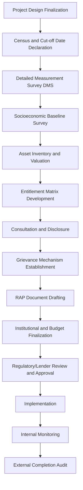

## Resettlement Action Plan Development

### Overview

A Resettlement Action Plan (RAP) is the core implementation instrument that operationalizes the principles of involuntary resettlement into a site-specific, costed, time-bound program of compensation, relocation, and restoration measures. Where the previous item established *why* and *under what principles* resettlement must be managed, the RAP is *how* — it translates entitlement policy into an executable plan with defined beneficiaries, budgets, timelines, and institutional responsibility. A RAP is typically a formal regulatory submission and, for internationally financed projects, a condition precedent to loan disbursement for resettlement-related activities.

This topic covers RAP triggers and scoping, the standard structural components, the data collection process underpinning it, and the review/approval workflow.

---

### When a RAP Is Required

- Triggered whenever a project results in physical and/or economic displacement, regardless of the number of persons affected — the *type* of instrument (full RAP vs. Abbreviated RAP) scales with impact severity, not whether a plan is needed at all.
- **Full RAP:** Typically required above a defined threshold of affected persons/households (commonly 200 persons, though this varies by governing standard) or where impacts are severe (e.g., >10% of productive assets lost, or physical relocation required).
- **Abbreviated RAP (ARAP):** Used for lower-impact, lower-population displacement, retaining the same principles with proportionally reduced documentation.
- A RAP is prepared *after* the impact assessment/inventory stage confirms displacement is unavoidable, and is distinct from — but must be internally consistent with — the broader Social Impact Management Plan.

---

### RAP Development Process Flow

---

### Standard RAP Structural Components

**1. Project Description and Scope of Land Acquisition**

- Defines the project components triggering displacement, the geographic extent of land take, and linkage to the overall project schedule.

**2. Socioeconomic Baseline / Census Survey**

- A full headcount census of affected persons conducted at a defined **cut-off date** — the date after which any new occupants, structures, or land uses are not eligible for compensation, established specifically to prevent opportunistic in-migration seeking compensation.
- Captures demographic composition, income sources, asset holdings, vulnerability indicators, and land tenure status for every affected household.

**3. Detailed Measurement Survey (DMS)**

- A parcel-by-parcel, structure-by-structure physical survey quantifying exactly what is lost: land area, structure dimensions and materials, trees/crops by type and count, and other fixed assets.
- Forms the quantitative basis for individual compensation calculations and must be conducted with the affected person present and given opportunity to verify/sign the measurement record.

**4. Legal and Policy Framework**

- Summarizes the applicable national law, LGU ordinances, and lender/international safeguard standards governing the RAP, and reconciles any gaps between them (typically by adopting whichever standard is more stringent, per the "gap-filling" approach common in international RAP practice).

**5. Eligibility and Entitlement Framework**

- Defines eligibility categories (titled landowners, customary rights holders, informal occupants, renters, business operators) and the specific entitlements attached to each — this is formalized in the **Entitlement Matrix**, covered as its own item later in this chapter.

**6. Valuation and Compensation Methodology**

- Documents the methodology for establishing full replacement cost (market surveys, licensed appraiser valuation, comparable transaction analysis) and how it will be applied consistently across affected persons.

**7. Resettlement Site Selection and Development (where physical relocation applies)**

- Site selection criteria (proximity to livelihood opportunities, access to services, host community capacity), infrastructure development plan, and housing design/construction standards.

**8. Livelihood Restoration Strategy**

- Program design for restoring/improving income-generating capacity, cross-referenced to the Livelihood Restoration Plan item later in this chapter.

**9. Consultation, Participation, and Disclosure Record**

- Documentation of consultation activities conducted during RAP preparation, including differentiated engagement with vulnerable groups, and the RAP disclosure process (public availability of the plan in accessible language/format prior to displacement).

**10. Grievance Redress Mechanism**

- RAP-specific grievance procedures, which may operate as a subset of the broader project GRM but must have documented awareness among affected persons specifically.

**11. Institutional Arrangements**

- Assigns implementation responsibility (per the institutional roles framework established earlier), including a dedicated Resettlement Unit/Officer and coordination with LGU and monitoring bodies.

**12. Implementation Schedule**

- Sequenced timeline linking compensation payment, relocation, and livelihood restoration activities to the overall project construction schedule, explicitly enforcing the "compensation and resettlement site readiness before displacement" sequencing principle.

**13. Costs and Budget**

- Itemized RAP budget consistent with the budgeting and resourcing framework covered earlier in this chapter, including contingency for valuation disputes and grievance resolution costs.

**14. Monitoring and Evaluation Framework**

- Internal monitoring indicators (disbursement rates, grievance case status) and external/independent monitoring and completion audit requirements, including livelihood restoration outcome indicators tracked post-resettlement.

---

### Data Collection Instruments

| Instrument | Purpose | Key Output |
| --- | --- | --- |
| Census/Socioeconomic Survey | Establish who is affected and their baseline conditions | Household roster, income baseline, vulnerability flags |
| Detailed Measurement Survey (DMS) | Quantify physical assets lost | Parcel/structure/asset inventory with verified measurements |
| Asset Valuation Survey | Establish compensation values | Replacement cost schedule by asset type |
| Consultation Records | Document participation and feedback incorporation | Meeting minutes, attendance (disaggregated), issues raised and response |

**Key Points**

- The census and DMS should ideally be conducted concurrently or in close sequence to minimize the window during which speculative changes to land use or occupancy could occur.
- All survey instruments should be designed to disaggregate data by sex and vulnerability status at collection stage, not retrofitted later — retrofitting disaggregation is a common and costly rework trigger during RAP review.

---

### Cut-off Date Governance

**Example**

A RAP declares a cut-off date via public notice and barangay posting on the date the Detailed Measurement Survey begins. Structures built or occupants arriving after this date are excluded from compensation eligibility, while all households present up to and including the cut-off date retain full entitlement regardless of survey timing delays. This prevents both under-compensation of legitimate long-term residents and over-compensation incentivizing speculative occupation.

- Must be formally declared, publicly disclosed, and dated before the DMS/census begins — not retroactively assigned.
- Requires a defensible notification method appropriate to the local context (public posting, barangay assembly announcement, local media) with documented evidence of disclosure.
- Common dispute point: household composition changes (e.g., marriage, new dependents) occurring after the cut-off date for pre-existing eligible households are typically still accommodated, distinguishing "new occupants" from "changes within an already-eligible household."

---

### Review and Approval Workflow

1. **Internal Proponent Review:** Technical and legal review against internal social safeguards standards.
2. **Regulatory Submission:** Submission to the relevant government approving authority (e.g., DENR-EMB in the Philippine context, alongside LGU concurrence where land use changes are involved).
3. **Lender Review (if applicable):** For internationally financed projects, review against the specific lender's resettlement safeguard policy, often involving an independent panel or specialist reviewer.
4. **Public Disclosure:** RAP made available to affected persons and the public in accessible language and format prior to displacement, satisfying the disclosure principle.
5. **Approval and Implementation Authorization:** Formal sign-off enabling disbursement and physical implementation to commence.

[Unverified] Specific review timelines, required signatories, and disclosure format requirements vary by jurisdiction and financing structure and should be confirmed against the applicable regulatory framework and lender safeguard policy for the specific project.

---

### Common RAP Development Failure Modes

- **Incomplete census coverage:** Missing renters, secondary occupants, or business operators who are not the primary titled landowner but hold independent entitlement.
- **Valuation using outdated or non-market benchmarks:** Undermining the full replacement cost principle established in resettlement principles.
- **RAP prepared in isolation from engineering design:** Land take boundaries finalized after RAP data collection, forcing costly re-surveys.
- **Weak cut-off date enforcement:** Ambiguous or poorly disclosed cut-off dates generating disputes and perceived unfairness.
- **RAP treated as a compliance document rather than a living implementation plan:** No mechanism to update the RAP as field conditions (costs, household circumstances) evolve during multi-year implementation.

---

**Next Steps**

- Entitlement matrix design and eligibility categories
- Livelihood restoration planning and income restoration strategies
- Resettlement site selection and development standards
- Resettlement grievance redress mechanism design
- RAP monitoring, internal reporting, and external completion audit
- Valuation methodology and replacement cost determination
- Vulnerable group identification within RAP census data