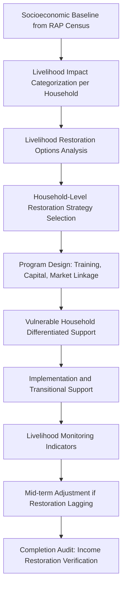

## Livelihood Restoration Planning

### Overview

Livelihood restoration planning addresses the economic displacement dimension of involuntary resettlement — the loss of income sources, productive assets, or means of subsistence resulting from project-related land acquisition or access restriction. Where compensation payments address the *one-time* loss of an asset, a Livelihood Restoration Plan (LRP) addresses the *ongoing* loss of income-generating capacity, targeting restoration to at least pre-displacement levels in real terms, with an aspiration toward improvement. This distinction matters because cash compensation alone — even at full replacement cost — routinely fails to restore livelihoods, as displaced persons frequently lack the skills, market access, or asset-management experience to convert a lump sum into a sustainable replacement income stream.

An LRP may be developed as a standalone instrument or as an integrated component of the Resettlement Action Plan, and its design is one of the most technically demanding aspects of resettlement practice because success is measured years after project construction, not at disbursement.

---

### Why Livelihood Restoration Is Distinct from Compensation

**Key Points**

- Compensation is a *transaction* (payment for a lost asset); livelihood restoration is a *process* (rebuilding income-generating capacity over time).
- Displaced persons dependent on land-based livelihoods (farming, fishing, forest resource use) face a structurally different restoration challenge than those with wage employment or portable business assets — land-based livelihoods cannot simply be "repurchased" with cash in the way a house can be rebuilt.
- International experience consistently shows that cash-only compensation for productive land, without an accompanying livelihood program, correlates with post-resettlement impoverishment even when compensation amounts satisfied the full replacement cost standard.

---

### Livelihood Impact Categorization

| Impact Type | Description | Example |
| --- | --- | --- |
| Loss of Land-Based Livelihood | Agricultural, fishing, or forest-dependent income lost due to land acquisition | Farmer loses cultivated rice land to project footprint |
| Loss of Business/Enterprise | Commercial structure or trading location lost or access disrupted | Sari-sari store operator displaced from roadside location |
| Loss of Wage Employment | Employment tied to a displaced enterprise or location | Farm laborer employed on acquired agricultural land |
| Restricted Access to Common Resources | Reduced or eliminated access without physical displacement | Restricted access to communal grazing land or fishing grounds |
| Loss of Rental/Lease Income | Income from assets leased to others | Landowner losing tenant-occupied structure |

---

### Livelihood Restoration Planning Process

---

### Core Restoration Strategy Options

**1. Land-for-Land Replacement**

- Where feasible, providing replacement agricultural land of equivalent productive capacity is the preferred option for land-dependent households, as it most directly preserves the pre-existing livelihood model.
- Constrained by availability of suitable replacement land, and requires assessment of soil quality, water access, and market proximity comparable to the land lost — not merely equivalent area.

**2. Livelihood Diversification and Skills Training**

- Vocational or enterprise training enabling transition to a different income source, typically paired with start-up capital or equipment support.
- Requires labor market assessment to ensure trained skills correspond to actual local demand, avoiding a common failure mode of training programs producing skills with no absorbing market.

**3. Employment Preference Schemes**

- Priority hiring of affected persons for project-related construction or operational jobs, where skill match and project labor needs allow.
- Should be treated as a supplementary measure, not a primary restoration strategy, since project employment is typically time-bound (especially construction-phase jobs) and does not constitute durable livelihood restoration on its own.

**4. Enterprise/Micro-business Development Support**

- Seed capital, business planning assistance, and market linkage support for affected persons pursuing small enterprise development.
- Frequently paired with cooperative or association formation to improve collective bargaining power and access to markets/credit.

**5. Cash-Based Transitional Support**

- Time-bound subsistence or transitional allowances covering the gap between displacement and the point at which a restored livelihood generates adequate income — not a substitute for a restoration strategy, but a bridging measure within one.

**6. Access-Restoration Measures**

- For restricted-access impacts (e.g., communal resource areas), negotiated access agreements, compensatory resource areas, or resource-use modification arrangements.

---

### Vulnerable Group Differentiation in Livelihood Programs

**Key Points**

- Standard livelihood packages designed for the "average" affected household frequently under-serve specific groups, requiring explicit differentiated design:
  - **Female-headed households:** May face time/mobility constraints not addressed by standard training schedules, and may have differential land/asset rights affecting eligibility under the entitlement matrix.
  - **Elderly-headed households:** Skills retraining may not be a viable restoration path; strategies may need to emphasize asset-based or pension/support-based restoration instead.
  - **Indigenous Peoples:** Livelihood strategies tied to customary land use and traditional knowledge systems may not translate to conventional wage-employment or market-enterprise models, requiring culturally appropriate restoration approaches developed in consultation with the affected community.
  - **Landless agricultural laborers:** Often excluded from land-based compensation entirely (having no land rights to lose) yet lose their livelihood entirely when the land they worked is acquired — requiring explicit inclusion in the LRP's eligibility scope, not just the RAP's asset-based entitlement matrix.

---

### Livelihood Restoration Monitoring Indicators

| Indicator Category | Example Metrics |
| --- | --- |
| Income Level | Household income compared to pre-displacement baseline, adjusted for inflation |
| Employment/Occupation Status | Proportion of working-age household members with restored income-generating activity |
| Asset Ownership | Productive asset holdings post-resettlement vs. baseline |
| Food Security | Household food security indicators (e.g., dietary diversity, food expenditure share) |
| Program Uptake | Participation and completion rates in training/enterprise programs |
| Debt Levels | Household indebtedness trends, a leading indicator of livelihood distress |

**Example**

A resettlement program monitors household income at 6, 12, 24, and 36 months post-relocation against the pre-displacement baseline established during the RAP census. At the 12-month review, a subset of households show incomes still below 70% of baseline, concentrated among elderly-headed households enrolled in a vocational training track. The finding triggers a program adjustment — shifting those households to an asset-based support model (e.g., small livestock, rental income assets) more suited to their circumstances — rather than continuing an underperforming strategy to completion.

---

### Timeline and Sequencing Considerations

- Livelihood restoration is inherently a multi-year process, extending well beyond the RAP's compensation disbursement and physical relocation activities — LRP budgets and institutional arrangements must be structured for this longer horizon, not treated as complete once physical resettlement concludes.
- Transitional support (cash allowances, temporary access to alternative resources) should bridge the gap between displacement and the point restoration strategies generate adequate income, preventing an income gap period that can trigger irreversible coping responses (asset sale, debt, out-migration).
- [Inference] Restoration timelines of 3–5 years post-displacement are commonly used as monitoring horizons in leading practice before a "livelihood restored" determination is made, though the appropriate duration is context-dependent and not a fixed universal standard.

---

### Institutional and Budget Linkages

- Implementation responsibility follows the institutional roles framework established earlier in this course — typically a dedicated Livelihood Restoration Unit or the Community Relations Office, often supported by NGO or technical partners for specialized training delivery.
- Budget lines for livelihood restoration must be distinct from direct compensation budget lines (per the budgeting and resourcing framework), reflecting their different disbursement profile: compensation is largely front-loaded, while livelihood support is disbursed progressively over the restoration period.

---

### Common Livelihood Restoration Failure Modes

- **Treating cash compensation as sufficient:** Omitting a structured restoration program entirely on the assumption that full replacement cost payment discharges the obligation.
- **Generic, undifferentiated program design:** A single training/support package applied uniformly regardless of household circumstance, livelihood type, or vulnerability status.
- **Skills-market mismatch:** Training delivered without a corresponding labor market assessment, producing qualifications with no local demand.
- **Premature program closure:** Ending monitoring and support at physical resettlement completion rather than at verified income restoration.
- **Excluding non-titled livelihood-dependents:** Landless laborers, tenants, and others without land rights but with livelihood dependency left outside program scope.
- **No mid-course correction mechanism:** Programs continuing on a fixed design despite monitoring data showing restoration is lagging for identifiable subgroups.

---

**Next Steps**

- Entitlement matrix design and eligibility categories
- Resettlement site selection and development standards
- Vulnerable group identification and differentiated assistance frameworks
- Resettlement and livelihood monitoring, and completion audit design
- Indigenous Peoples-specific resettlement and livelihood considerations
- Grievance redress mechanism design for resettlement-related disputes
- Host community impact assessment and mitigation