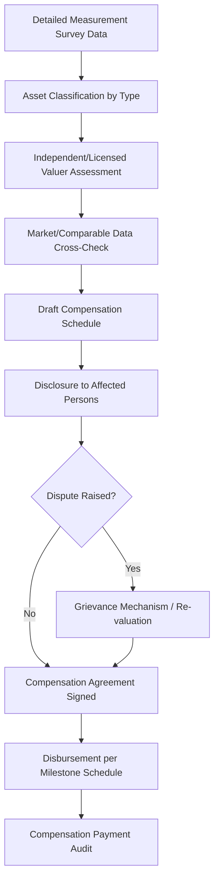

## Compensation Frameworks and Asset Valuation

### Overview

Compensation frameworks and asset valuation constitute the technical and methodological backbone of any Resettlement Action Plan — they determine *how much* affected persons receive for lost land, structures, crops, and other assets, and by what defensible, replicable methodology that figure is derived. Where the entitlement matrix (covered separately) defines *who* is eligible for *what category* of compensation, valuation methodology defines *how the monetary or in-kind value is calculated*. Weak or inconsistent valuation is one of the most common triggers of resettlement grievances and project delays, because affected persons — correctly — treat compensation adequacy as the single most consequential outcome of the entire resettlement process.

This topic covers the full replacement cost standard, valuation methodologies by asset class, the compensation modality decision (cash vs. in-kind vs. combined), and the governance mechanisms needed to keep valuation defensible and consistent.

---

### The Full Replacement Cost Standard

**Key Points**

- Full replacement cost is defined as the amount required to replace an asset at current market value, without deduction for depreciation, and inclusive of associated transaction costs (transfer taxes, registration fees, relocation/transportation costs, and — for land — the cost of preparing replacement land to a level of productive use comparable to the land lost).
- This standard is deliberately more generous than typical government expropriation valuation (which often applies zonal/assessed values or depreciated book value), because the objective is not merely "fair market payment" but restoration of the displaced person's pre-project position — a distinction that frequently creates tension between international lender safeguard requirements and domestic expropriation law.
- Replacement cost is asset-specific and must be calculated using current, local data — not historical assessed values, and not values fixed at an early feasibility stage without escalation.

---

### Valuation Methodology by Asset Class

**1. Land**

- **Market/Comparable Sales Approach:** Preferred method where an active local land market exists — uses recent, verified comparable transactions adjusted for location, access, and land use classification.
- **Replacement Cost Approach:** Used where no active market exists (common in rural/customary tenure areas) — estimates the cost of acquiring or developing equivalent productive land.
- **Income Capitalization Approach:** For agricultural or income-generating land where market data is unreliable, values land based on capitalized future income-generating potential.
- [Inference] In practice, a blended approach using multiple methods cross-checked against each other is generally considered more defensible than reliance on a single valuation method, particularly in thin or distorted local land markets, though the specific methodology mix should be determined by a qualified valuer given local market conditions.

**2. Structures (Residential, Commercial, Agricultural)**

- Valued using current construction cost for a structure of equivalent size, materials, and standard — a "replacement in kind" standard, not the depreciated value of the existing structure.
- Requires a detailed measurement survey (structure dimensions, materials inventory, condition of fixtures) as the quantitative input, typically conducted jointly with the RAP's Detailed Measurement Survey.
- Informal or non-permitted structures are still valued at full replacement cost under the eligibility-regardless-of-title principle, though the compensation *category* (structure replacement vs. structure replacement plus land compensation) depends on the occupant's land tenure status.

**3. Standing Crops and Trees**

- Valued based on crop type, growth/maturity stage, expected yield, and remaining productive life (for perennial trees/crops) or a single growing cycle (for annual crops).
- Typically uses locally verified agricultural extension data or market price surveys for crop-specific valuation tables, updated periodically to reflect current prices rather than fixed at RAP preparation.
- Perennial tree valuation often requires species-specific formulas accounting for years to maturity and expected productive lifespan, since a young fruit tree and a mature one represent very different lost income streams.

**4. Business/Commercial Assets and Income Loss**

- Beyond physical structure/inventory loss, compensation frameworks must address lost business income during the transition period, typically calculated from verified business records (where available) or, in the informal sector, from income surveys and local benchmarking.
- May include relocation assistance for re-establishing customer base/market access at a new location, recognizing that even a physically identical relocated structure does not guarantee equivalent commercial viability.

**5. Common Property Resources and Access Restrictions**

- Where communal or common-use resources are lost or access is restricted (grazing land, forest products, fishing grounds), valuation is more complex, often requiring estimation of aggregate community-level economic value and negotiated compensation mechanisms (community fund, resource replacement) rather than individual cash payment.

---

### Compensation Modality: Cash, In-Kind, or Combined

| Modality | When Appropriate | Key Risk |
| --- | --- | --- |
| Cash Compensation | Functioning markets exist to replace lost assets; affected person has capacity to manage lump-sum funds | Risk of non-restorative use of funds without accompanying livelihood support |
| In-Kind (Land-for-Land) | Land-dependent livelihoods; land markets are thin/unavailable | Replacement land quality/location may not match lost asset |
| In-Kind (Structure-for-Structure) | Physical relocation with proponent-developed resettlement sites | Housing design/standard must meet or exceed original |
| Combined/Hybrid | Most common in practice — partial in-kind (housing, land) plus cash for movable assets and transitional support | Requires careful entitlement matrix design to avoid gaps or double-counting |

**Key Points**

- Affected persons should generally be offered a choice between cash and in-kind compensation where both are feasible, as forced modality assignment (particularly forcing cash on land-dependent households with no replacement land option) undermines the livelihood restoration objective.
- Cash compensation is frequently paired with financial literacy or fund-management support, recognizing that a lump-sum payment — however adequately calculated — does not by itself guarantee restorative use.

---

### Valuation Governance and Defensibility

**Key Points**

- Valuation should be conducted or reviewed by an independent, qualified valuer/appraiser — not solely by the proponent's internal team — to maintain credibility and reduce dispute risk.
- A transparent, disclosed valuation schedule (rates by asset type/category, publicly available) allows affected persons to verify their individual compensation calculation against a known standard, rather than receiving an unexplained lump figure.
- Valuation disputes should route through the RAP's grievance redress mechanism with a defined re-assessment procedure, distinct from and without precluding access to formal legal appeal.

---

### Valuation Timing and Escalation

**Example**

A RAP establishes land and structure replacement costs during feasibility-stage valuation. Physical implementation is delayed 30 months due to permitting and financing timelines. Without a valuation update mechanism, compensation offered at implementation reflects prices that are more than two years stale, generating disputes and perceived under-compensation even though the original valuation was methodologically sound at the time it was conducted.

- Valuation should be current at the time of actual compensation payment, not fixed at RAP approval stage — requiring either a valuation update/refresh close to disbursement, or an indexation mechanism (construction cost index, land price index) applied to the base valuation.
- This links directly to the cost escalation management practices covered under budgeting and resourcing — valuation currency is a budget adequacy issue as much as a fairness issue.

---

### Distinguishing Compensation from Broader Livelihood Restoration

- Asset valuation and compensation address the *one-time* loss of a specific, quantifiable asset. It is necessary but not sufficient for the livelihood restoration objective established earlier in this chapter — a household can receive full, correctly calculated replacement cost compensation and still experience impoverishment if no accompanying livelihood restoration strategy exists.
- Compensation schedules and the Livelihood Restoration Plan should be designed as complementary, sequenced components of the same RAP, not as substitutes for one another.

---

### Common Valuation Failure Modes

- **Using government-assessed/zonal value instead of market-based replacement cost:** Systematically under-compensating relative to the required standard.
- **Static valuation with no escalation mechanism:** Compensation calculated years before actual payment, eroded by inflation/market movement.
- **Depreciated valuation of structures:** Applying age-based depreciation contrary to the full replacement cost (no-depreciation) standard.
- **Excluding transaction costs from the compensation figure:** Omitting transfer taxes, registration fees, or relocation costs that are properly part of "full" replacement cost.
- **Single-source valuation without independent cross-check:** Relying solely on proponent-internal figures without external valuer review, weakening defensibility in disputes.
- **Undervaluing common property resources:** Treating communal/customary resource loss as having no compensable value due to absence of individual title.

---

**Next Steps**

- Entitlement matrix design and eligibility categories
- Resettlement Action Plan development and Detailed Measurement Survey methodology
- Livelihood restoration planning and income restoration strategies
- Resettlement grievance redress mechanism design
- Resettlement site selection and development standards
- Land tenure and customary rights assessment methodology
- Resettlement monitoring and completion audit design