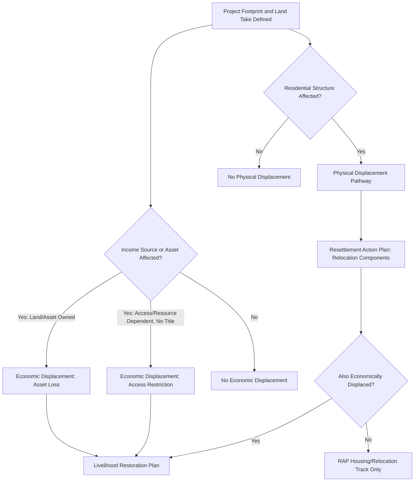

## Physical Versus Economic Displacement

### Overview

The distinction between physical and economic displacement is one of the foundational analytical categories in involuntary resettlement practice, and it shapes nearly every downstream planning decision — impact identification, entitlement design, compensation modality, and monitoring indicators. The two impact types frequently co-occur but are governed by partially distinct logic: physical displacement is fundamentally about loss of *shelter and place*, while economic displacement is about loss of *income-generating capacity*. A common and consequential planning error is treating them as a single undifferentiated impact, which leads to entitlement frameworks that adequately address one dimension while leaving the other under-planned.

This topic builds directly on the principles of involuntary resettlement established earlier in this chapter, disaggregating the "involuntary resettlement" umbrella into its two constituent impact pathways and examining how each drives different planning instruments.

---

### Core Definitions

**Physical Displacement**

- Loss of shelter or residential structure, requiring the affected person(s) to relocate to a different physical location.
- Always involves a **spatial dislocation** — the household must move.
- May occur with or without accompanying economic displacement (e.g., a household relocated but able to retain the same job/income source at the new location).

**Economic Displacement**

- Loss of income sources, productive assets, or access to resources needed to sustain livelihood, as a result of project-related land acquisition, land-use restriction, or access restriction.
- Does **not** necessarily involve relocation — a household can experience economic displacement while remaining in place (e.g., a farmer losing agricultural land to project footprint while the family home remains untouched).
- Encompasses both loss of the productive asset itself and loss of *access* to resources needed for livelihood, even without loss of the underlying asset's ownership.

**Key Points**

- Every physically displaced household should be assessed for economic displacement, but not every economically displaced household is physically displaced — the two categories are not symmetric, and impact identification protocols must screen for both independently rather than assuming physical relocation captures the full impact picture.
- A single household may experience both simultaneously (loss of home *and* loss of the agricultural land surrounding it), requiring an integrated but analytically distinct treatment of each impact stream within the RAP.

---

### Comparative Impact Matrix

| Dimension | Physical Displacement | Economic Displacement |
| --- | --- | --- |
| Core Loss | Shelter/residential structure | Income source, productive asset, or resource access |
| Requires Relocation | Yes, by definition | Not necessarily |
| Primary Planning Instrument | Resettlement Action Plan (housing/relocation components) | Livelihood Restoration Plan (may be integrated into RAP) |
| Compensation Focus | Structure replacement cost, relocation assistance, transitional shelter support | Asset/income replacement, livelihood restoration programming |
| Typical Timeline to "Restoration" | Shorter — housing can be reconstructed within a defined construction period | Longer — income restoration is a multi-year process |
| Common Affected Groups | Titled and non-titled residential occupants | Farmers, fishers, forest-resource users, informal traders, wage laborers tied to displaced enterprises |
| Sequencing Principle | Compensation and site readiness before physical relocation | Restoration measures must begin before or concurrent with loss of access |

---

### Sub-Categories of Economic Displacement

**1. Loss of Land-Based Livelihood**

- Agricultural, aquacultural, or forest-dependent income lost through acquisition of the productive land itself.

**2. Loss of Business Premises or Commercial Assets**

- Displacement of a trading location, market stall, or commercial structure, distinct from residential displacement even when the business and residence are the same physical structure (a common scenario for home-based enterprises).

**3. Loss of Wage Employment**

- Employment tied to an enterprise or agricultural operation that itself experiences displacement — e.g., farm laborers employed on land acquired for the project, who hold no land rights themselves but lose their livelihood entirely.

**4. Restriction of Access Without Loss of Ownership**

- Physical or regulatory restriction on access to a resource the affected person does not own but depends upon — communal grazing land, fishing grounds, forest products — often the most under-identified form of economic displacement because no transaction or title transfer marks the impact.

---

### Impact Identification and Screening Logic

**Key Points**

- Screening must be conducted per-household and per-impact-type, not at an aggregate project level — a household census that only asks "will you need to move" will systematically miss economic-displacement-only households.
- Access restriction impacts require particular screening attention because they are the most likely to be missed in a standard asset-inventory-based Detailed Measurement Survey, which is typically structured around owned/titled assets rather than dependency relationships.

---

### Why the Distinction Drives Different Planning Instruments

- **Physical displacement** planning centers on the Resettlement Action Plan's relocation components: site selection, housing construction standards, resettlement site infrastructure, and the sequencing rule that displacement cannot occur before replacement housing is ready and compensation is paid.
- **Economic displacement** planning centers on the Livelihood Restoration Plan: income restoration strategy selection, skills/market assessment, and multi-year monitoring against income-based (not shelter-based) indicators.
- A household experiencing both requires an integrated implementation schedule where the *shorter-duration* physical relocation process (structure construction, typically months) does not proceed on a timeline that outpaces the *longer-duration* economic displacement process (livelihood restoration, typically years) — mismatched sequencing here is a common source of post-relocation impoverishment even where the housing component is well executed.

---

### Case Illustration

**Example**

A road expansion project acquires a strip of land along its alignment. Household A loses its home, which sits directly on the acquired strip — pure physical (and, since the household also loses its home-based sari-sari store, combined) displacement. Household B, two properties back, loses none of its residential structure but loses the rice paddy behind its house that was its primary income source — pure economic displacement with no relocation required. Household C is a landless laborer who worked Household B's rice paddy and loses employment entirely, despite having no ownership stake in the land itself and no residential impact — economic displacement via loss of access/employment. A RAP that only inventories physically displaced households (Household A) while treating Households B and C as "unaffected" because they are not relocating would leave two of three genuinely affected households outside the compensation and livelihood restoration framework entirely.

---

### Monitoring Implications

| Displacement Type | Primary Monitoring Indicators |
| --- | --- |
| Physical | Housing completion status, occupancy verification, resettlement site infrastructure functionality, transitional shelter adequacy |
| Economic | Household income vs. baseline, livelihood program participation/completion, food security indicators, asset ownership trends |

**Key Points**

- Physical displacement monitoring can often reach a definitive "completion" milestone (household occupies adequate replacement housing) within a bounded timeframe.
- Economic displacement monitoring, consistent with the livelihood restoration planning framework covered earlier, requires longer-horizon tracking since income restoration is a trend to be verified over time, not a single deliverable to be checked off.

---

### Common Failure Modes from Conflating the Two Categories

- **Relocation-only screening:** Impact identification limited to "who needs to move," missing economic-displacement-only households entirely.
- **Treating housing completion as full resettlement completion:** Closing out resettlement programs once physical relocation is done while livelihood restoration remains unverified or unaddressed for the same or other households.
- **Uniform compensation timelines:** Applying the physical displacement sequencing rule (compensation before displacement) without recognizing that economic displacement restoration is a longer process requiring sustained institutional and budget commitment beyond the physical relocation milestone.
- **Under-identifying access-restriction impacts:** Asset-inventory-based surveys missing non-titled resource-dependent households and laborers.

---

**Next Steps**

- Resettlement Action Plan development and Detailed Measurement Survey scope
- Livelihood restoration planning and income restoration strategies
- Compensation frameworks and asset valuation methodology
- Entitlement matrix design covering both physical and economic displacement categories
- Vulnerable group identification within combined displacement scenarios
- Resettlement monitoring and completion audit design across both impact tracks